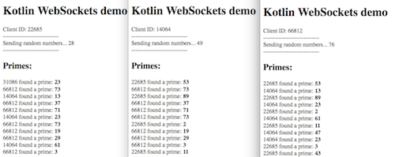

In preparation of writing a blog post on GraphQL subscriptions with Kotlin, I first wanted to take a look at how to create a basic WebSockets example with Kotlin.

Handling WebSockets, in the past, was a bit awkward in Java and many times people used node.js instead, as it felt a lot more natural there. In this post we will make another try at this with some more recent tech in the space: Kotlin and Spring Boot 2.0 (Spring 5).

Because WebFlux worked out well in a [previous post](https://zupzup.org/kotlin-webflux-example/), it will also be used in this example. Functional Reactive programming should work well for WebSockets, as they are basically a bi-directional, push-based stream of data.

In this post's example, our clients (static `index.html`) will open a WebSocket connection, create a random clientId and start guessing numbers (`Math.random() * 100`). The client will send each of these guessed numbers and the clientId to the server.

The server will receive the guessed numbers, check if they are prime numbers and, if they are, broadcast them to all subscribed clients.

On the client, we will listen for these prime numbers and show all broadcasted numbers except the ones from our own clientId.

This is how it will look like on the client:

<center>
    <a href="images/client_websockets.png" target="_blank"></a>
</center>

The example is small enough for a short post such as this, but contains both real-time sending and receiving of data, as well as transformation and multiplexing, so it should be interesting nonetheless.

Let's get started.

## Example

We'll start with the client code. First, we want to create a random `clientId`, then open a `WebSocket`:

```javascript
var clientId = parseInt(Math.random()*100000);
document.querySelector('#clientid').innerHTML += clientId;

var ws = new WebSocket("ws://localhost:8080/ws/primes");
ws.onopen = function() { console.log('connection established') };
ws.onclose = function() { console.log('connection closed') };
ws.onerror = function(err) { console.log('error: ', err)};
```

Then, we start guessing numbers and send them to the client in the format `clientId:number`:

```javascript
window.setInterval(function() {
    var rand = parseInt(Math.random()*100);
    document.getElementById('rand').innerHTML = rand;
    ws.send(clientId + ":" + rand);
}, 500);
```

And finally we register an `onmessage` handler, so we can display the data the server broadcasts to us:

```javascript
ws.onmessage = function(message) {
    var sender = message.data.split(":")[0];
    var value = message.data.split(":")[1];
    if (sender !== clientId.toString()) {
        document.getElementById('primes').innerHTML += '<div>' + sender + " found a prime: <b>" + value + '</b></div>';
    }
};
```

That's it for the client. This will work with any html which has fields with the above used ids. 

Now on the server, we use a generated template from the [Spring Initializr](https://start.spring.io/) for Kotlin and Spring Boot using Reactive Web.

First, we define a data model for an Event.

```java
data class Event(val sender: Int, val value: Int)
```

Then we move on to define the `WebSocketHandler`. Our goal is, to `receive` data from the client, parse it into an `Event`, filter out non-prime numbers and send the primes to all clients.

I'm certain there are several (and likely more elegant) ways of achieving this, but in this example I opted to use a shared [TopicProcessor](https://projectreactor.io/docs/core/snapshot/api/reactor/core/publisher/TopicProcessor.html), which enables us to pass messages asynchronously from multiple threads. 

```java
@Component
class PrimeNumbersHandler : WebSocketHandler {
    private val processor = TopicProcessor.share<Event>("shared", 1024)
```

If a client connects, we `handle` it as follows:

```java
override fun handle(session: WebSocketSession): Mono<Void> {
    return session.send(
            processor
                    .map { ev -> session.textMessage("${ev.sender}:${ev.value}") }
    )
```

The snippet above means that, whenever there is a new value in the shared `processor`, we send it down to the client, mapped to a string of the format `clientId:number`.

We also need to define a handler for receiving data from the client:

```java
.and(
    session.receive()
            .map { ev ->
                val parts = ev.payloadAsText.split(":")
                Event(sender = parts[0].toInt(), value = parts[1].toInt())
            }
            .filter { ev -> isPrime(ev.value) }
            .doOnNext { ev -> processor.onNext(ev) }
)
```

We take the data, map it to an `Event`, filter out non-primes and then send the value into the shared `processor`. 

I used the `isPrime` function from [this post](https://stackoverflow.com/questions/20798391/java-isprime-function/20798440#20798440), but it's not particularly relevant for the example.

The only thing left to do is wiring the handler up to our Webflux application. For this, we create a `WebSocketHandlerAdapter` and a `handlerMapping` with the `/ws/primes` route pointing to our `PrimeNumbersHandler`:

```java
@Configuration
@EnableWebFlux
@ComponentScan(value = ["org.zupzup.kotlinwebfluxdemo"])
class WebSocketConfig(
        val primeNumbersHandler: PrimeNumbersHandler
) {
    @Bean
    fun websocketHandlerAdapter() = WebSocketHandlerAdapter()

    @Bean
    fun handlerMapping() : HandlerMapping {
        val handlerMapping = SimpleUrlHandlerMapping()
        handlerMapping.urlMap = mapOf(
                "/ws/primes" to primeNumbersHandler
        )
        handlerMapping.order = 1
        return handlerMapping
    }
}
```

That's it!

If you run this and open the `index.html` file in multiple Browser tabs, you will see that all correctly guessed prime-numbers are broadcasted to each client.

You can find the full example code [here](https://github.com/zupzup/kotlin-example-websockets).

## Conclusion

The Spring 5 way of handling WebSockets is very terse and intuitive, I had no troubles getting it up and running at all.

Regarding Webflux, or rather `reactor`, I had some more problems, as I only did a bit of FRP in the past using RxJS and the terminology of reactor is still a bit alien to me.

Also, I had a hard time finding an idiomatic way of passing the incoming values to the flux of outgoing values. While the reactor documentation is good, I didn't find many examples for it, especially compared to the great examples for the Rx family.

I hope this situation will improve to lower the entry-barrier a bit. Overall though, I like how quick and concise I was able to solve this example, even without a lot of previous knowledge. 

So stay tuned for some more Kotlin Webflux action in the future. :)


#### Resources

* [Full Code on Github](https://github.com/zupzup/kotlin-example-websockets)
* [kotlin](http://kotlinlang.org/)
* [spring boot](https://projects.spring.io/spring-boot/)
* [webflux](https://docs.spring.io/spring-framework/docs/5.0.5.BUILD-SNAPSHOT/spring-framework-reference/web-reactive.html#spring-webflux)
* [reactor](https://projectreactor.io/)
