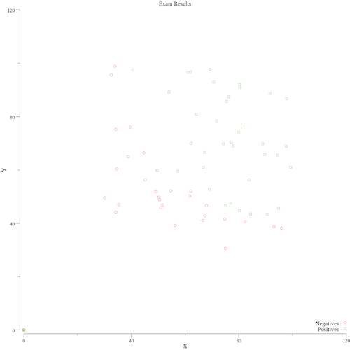

Machine Learning is getting and has been getting lots of attention over the last couple of years. I spent some time on ML topics when I wrote my thesis and also on- and off after graduating.

However, getting from being interested and fascinated to actual working code, which solves some kind of problem, can be quite daunting. How much previous knowledge does one need to get started? Do you need to fully grasp all those formulas and models? How should I preprocess my data? It's hard to reliably answer those questions, because it really depends on what one wants to achieve and how much energy and time one wants to exert in the process.

In this post, I will try to ignore most of these questions and instead show some code which aims to showcase how a very simple Machine Learning application could look like using Go. This post won't cover any kind of ground regarding the theoretical background of the Machine Learning technique which is used. If you are interested in learning more about Machine Learning (which I would definitely recommend), you should check out the online courses at [Coursera](https://www.coursera.org) on the topic.

So, with all of that out of the way, it's time to get going. We will use **Logistic Regression** to create a very basic model which can help us with a **Classification Problem**.

Ok, so first of all, a **Classification Problem** is simply a problem in which we try to find out, based on existing observations (data), in which category a new observation will (most likely) fall. You can think, for example, of a mole or birthmark which we want to classify as either malignant or benign. We could use images of moles we've seen in the past and where we know whether they were malignant or benign to train a model and try to predict whether a new birthmark might be cancerous or not.

**Logistic Regression** is the algorithm we will use to create this model. [Here](https://en.wikipedia.org/wiki/Logistic_regression) is the wikipedia link and I'm sure there are many other very good resources on this widely used algorithm. Suffice to say, that it is an algorithm which is very well suited for classification problems. We will get into a few aspects of the algorithm later in the code example, because we need to provide some parameters for the algorithm to work properly, but for now it should be enough for us to know that this suits our problem and that the library we are going to use implements it correctly.

The goal here is not, as stated above, to fully understand how **Logistic Regression** works, but rather to get a feeling of which general steps are involved when trying to solve a problem using Machine Learning. We also won't deal with *Big Data* in any way, but rather work with a very small data set of about 100 entries, so there will be little value in interpreting the exact results we get for our little contrived example. But, as you can imagine, the code and techniques shown in this example will also work on other, larger data sets.

We will use Go for our example, but Go is by no means a go-to language for Machine Learning problems. In this area `R`, `Matlab`, `python` and a few others really shine. However, Go is often used in conjunction with these languages to pre- and post-process data as well as to scale these models, which is something Go excels at.

There are a few Machine Learning libraries available in Go, but they are of course nowhere near the maturity of e.g.: [scikit-learn](http://scikit-learn.org/). But for our simple purposes, they will more than do. For this example, I used [goml](https://github.com/cdipaolo/goml). I also took a look at [golearn](https://github.com/sjwhitworth/golearn/), which looks promising as well.

`goml`'s API is pretty straightforward and its [documentation](https://godoc.org/github.com/cdipaolo/goml) is OK as well. 

Alright, let's get started! (You'll find the full code of the example incl. data set [here](https://github.com/zupzup/ml-in-go-examples))

## The Data

First of all, we need some data. In this example, we use a very simple, csv-based data set which looks like this:

```
exam1Score;exam2Score;accepted
45.3;38.2;1
99.1;88.1;0
...
```

This data set is supposed to represent some students' test scores on two exams and whether they were accepted at the institution where they took the exams. The meaning of the data is not relevant in this small example, but in real-world applications understanding the data and processing it accordingly can often be one of the most important steps.

Now, if we just test our model on the same data we trained it on, it will likely work pretty well, but that won't tell us much about how well it will perform in the real world. For this reason, we separate the data into a training set (~70%) and a test set (~30%). We will use the training set to train our model and then evaluate its performance using the test set.

In a real-world example, we would randomize our data and try different splits, but with our meager 100 entry data set it doesn't matter much, so we just manually separate the entries between two files and load them as follows:

```go
xTrain, yTrain, err := base.LoadDataFromCSV("./data/studentsTrain.csv")
if err != nil {
    return err
}
xTest, yTest, err := base.LoadDataFromCSV("./data/studentsTest.csv")
if err != nil {
    return err
}
```

Also, in a real world scenario we would further process the data to, for example, remove outliers or normalize the data, but in our simple case, the data is already normalized and we can just go on.

We can also create a scatter plot of the data to get a feel for it using [gonum's plot](https://github.com/gonum/plot)

```go
func plotData(xTest [][]float64, yTest []float64) error {
    p, err := plot.New()
    if err != nil {
        return err
    }
    p.Title.Text = "Exam Results"
    p.X.Label.Text = "X"
    p.Y.Label.Text = "Y"
    p.X.Max = 120
    p.Y.Max = 120

    positives := make(plotter.XYs, len(yTest))
    negatives := make(plotter.XYs, len(yTest))
    for i := range xTest {
        if yTest[i] == 1.0 {
            positives[i].X = xTest[i][0]
                positives[i].Y = xTest[i][1]
        }
        if yTest[i] == 0.0 {
            negatives[i].X = xTest[i][0]
                negatives[i].Y = xTest[i][1]
        }
    }

    err = plotutil.AddScatters(p, "Negatives", negatives, "Positives", positives)
    if err != nil {
        return err
    }
    if err := p.Save(10*vg.Inch, 10*vg.Inch, "exams.png"); err != nil {
        return err
    }
    return nil
}
```

We just take our `x` values to plot the different points and give them a color depending on their corresponding `y` value. This way we have a nice view where the positive and negative outcomes are and how they are distributed.

This shows us the following picture (click to enlarge):

<center>
    <a href="images/exams.png" target="_blank"></a>
</center>

## The Model

Learning the model is pretty simple using `goml`. We just call `linear.NewLogistic`, which takes the following parameters:

* Optimization Method (`base.BatchGA`)
  * `goml` has two optimization algorithms for Logistic Regression called **Stochastic Gradient Ascent** and **Batched Gradient Ascent** which are basically [Gradient Descent](https://en.wikipedia.org/wiki/Gradient_descent), just inverted. The goal of these optimization algorithms is to fit the model as closely to our training data as possible by minimizing the error ("distance"). 
* Learning Rate & Maximum Iterations (`0.00001` & `1000`)
  * These two parameters are needed for Gradient Descent, they specify how big the steps the algorithm will take towards the minimum should be (Learning Rate) and the maximum amount of iterations it should use to get there, if the algorithm doesn't converge on its own (Maximum Iterations). If we set the Learning Rate too high, it can happen, that we never get near any minimum, so taking a very small number here is the safe approach (although there is a performance penalty, because we'll need more steps).
* Regularization (`0`)
  * This is a parameter we can use to prevent Overfitting (fitting the model too closely to our training data), but we will ignore it in this example.
* Input Values (`xTrain` - the exam scores)
* Classification Attribute (`yTrain` - the 0 and 1 values for admittance)

Once we have a way to evaluate the model later on, we can start experimenting with these parameters to improve on our model, but for now we just train our model as follows:

```go
model := linear.NewLogistic(base.BatchGA, 0.00001, 0, 1000, xTrain, yTrain)
err := model.Learn()
if err != nil {
    return nil, nil, err
}
```

Alright, now we have our trained model - easy, right? We can now use this model to predict the classification of new data using `model.Predict(input []float)`. For example, if we trained a model to classify pictures depending on whether there is a cat in them or not, the `Predict` method could, for a new image, tell us whether our model thinks there is a cat in it (probability).

We can also use this `Predict` method to evaluate the performance of our trained model on the test set. For this purpose, we will create a so-called Confusion Matrix with the following data structure:

```go
// ConfusionMatrix describes a confusion matrix
type ConfusionMatrix struct {
    positive      int
    negative      int
    truePositive  int
    trueNegative  int
    falsePositive int
    falseNegative int
    accuracy      float64
}
```

A [Confusion Matrix](https://en.wikipedia.org/wiki/Confusion_matrix) is an error matrix - a table which can be used to evaluate the performance of a classification algorithm. In order to do this, we record some values during evaluation:

* `positive` - the number of positive examples
* `negative` - the number of negative examples
* `truePositive` - the number of positive examples we predicted correctly
* `trueNegative` - the number of negative examples we predicted correctly
* `falsePositive` - the number of examples we wrongly predicted to be positive
* `falseNegative` - the number of examples we wrongly predicted to be negative
* `accuracy` - measure for the accuracy of the model, defined as (`truePositive` + `trueNegative`) / (`positive` + `negative`)

There are other measures, like the `F1 score`, which are also often used to evaluate the performance of a model, but in our case, we will use only `accuracy`.

In order to implement this, we start by collecting all the positive and negative values of our testSet:

```go
cm := ConfusionMatrix{}
for _, y := range yTest {
    if y == 1.0 {
        cm.positive++
    }
    if y == 0.0 {
        cm.negative++
    }
}
```

Then, we iterate over the testSet, predicting the outcome for each data point and record where in our confusion matrix the prediction lands. With these records, we can calculate the accuracy of our model:

(Note on the `decisionBoundary`: Our model's `Predict()` method produces probabilities between 0 and 1 and we need to specify at which point (over which value) an example should be classified as `positive`. We could start by simply choosing 50% for example and improve on that later, once we can evaluate the model).

```go
// Evaluate the Model on the Test data
for i := range xTest {
    prediction, err := model.Predict(xTest[i])
    if err != nil {
        return nil, nil, err
    }
    y := int(yTest[i])
    positive := prediction[0] >= decisionBoundary

   if y == 1 && positive {
       cm.truePositive++
   }
   if y == 1 && !positive {
       cm.falseNegative++
   }
   if y == 0 && positive {
       cm.falsePositive++
   }
   if y == 0 && !positive {
       cm.trueNegative++
   }
}

// Calculate Evaluation Metrics
cm.accuracy = (float64(cm.truePositive) + float64(cm.trueNegative)) /
    (float64(cm.positive) + float64(cm.negative))
```

Now that we are able to evaluate our model on the test data, we could actually try to tinker with the values to increase our accuracy even further. In practice, we would do this automated of course, testing different ranges of values for each relevant parameter, until we found the best ones. This step could also be parallelized quite easily.

A very naive implementation without parallelization which tries different values for the decision boundary could look like this: 

```go
var maxAccuracy float64
var maxAccuracyCM *ConfusionMatrix
var maxAccuracyDb float64
var maxAccuracyModel *linear.Logistic

//Try different parameters to get the best model
for db := 0.05; db < 1.0; db += 0.01 {
    // Learn Model and Calculate ConfusionMatrix for given values
    cm, model, err := tryValues(0.0001, 0.0, 1000, db, xTrain, xTest, yTrain, yTest)
    if err != nil {
        return err
    }
    if cm.accuracy > maxAccuracy {
        maxAccuracy = cm.accuracy
        maxAccuracyCM = cm
        maxAccuracyDb = db
        maxAccuracyModel = model
    }
}

fmt.Printf("Maximum accuracy: %.2f\n\n", maxAccuracy)
fmt.Printf("with Model: %s\n\n", maxAccuracyModel)
fmt.Printf("with Confusion Matrix:\n%s\n\n", maxAccuracyCM)
fmt.Printf("with Decision Boundary: %.2f\n", maxAccuracyDb)
fmt.Printf("with Num Iterations: %d\n", maxAccuracyIter)
```

We could to this for all values which are relevant to the model until we find a model we're satisfied with. There are, of course, less brute-forceish methods of improving your models in the world of Machine Learning theory as well.

That's it! A sample output of this simple program could look like this:

```
Running Logistic Regression...
Maximum accuracy: 0.91

with Model: h(θ,x) = 1 / (1 + exp(-θx))
θx = -1.286 + 0.04981(x[1]) + 0.01461(x[2])

with Confusion Matrix:
Positives: 24
Negatives: 11
True Positives: 23
True Negatives: 9
False Positives: 2
False Negatives: 1

Recall: 0.96
Precision: 0.92
Accuracy: 0.91


with Decision Boundary: 0.91
with Num Iterations: 2600
```

## Conclusion 

In this post we only scratched the surface of Machine Learning in Go, but it was, in my opinion, a fun little example where one can tinker around and see how the results change with different input variables. You can also use this code-example as a template and plug in other freely available data sets. 

Machine Learning will most likely only become even more important as time goes on, so learning it or at least having a deeper look at the fundamentals behind it is probably not a bad investment. Apart from that, I just very much enjoy tinkering on Machine Learning problems, so there's that as well. :) 

As mentioned in the introduction, Go is not a traditional language for Machine Learning (yet?). Whether Go will be used more for model training / evaluation in the future remains to be seen, but it's certainly not impossible.

#### Resources

* [Full Sample Code on Github](https://github.com/zupzup/ml-in-go-examples/blob/master/logisticregression/logisticregression.go)
* [goml](https://github.com/cdipaolo/goml)
* [golearn](https://github.com/sjwhitworth/golearn/)
* [gonum's plot](https://github.com/gonum/plot)
* [scikit-learn](http://scikit-learn.org/)
- [Coursera ML Course](https://www.coursera.org/learn/machine-learning/home)
* [Confusion Matrix](https://en.wikipedia.org/wiki/Confusion_matrix)
* [Logistic Regression](https://en.wikipedia.org/wiki/Logistic_regression)
* [Gradient Descent](https://en.wikipedia.org/wiki/Gradient_descent)
