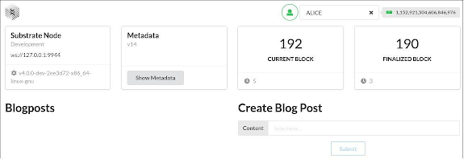
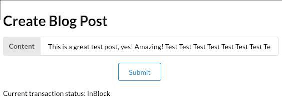
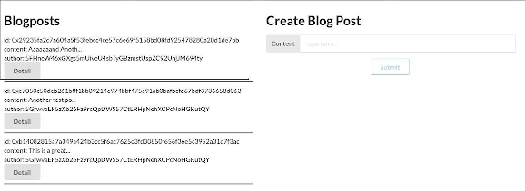
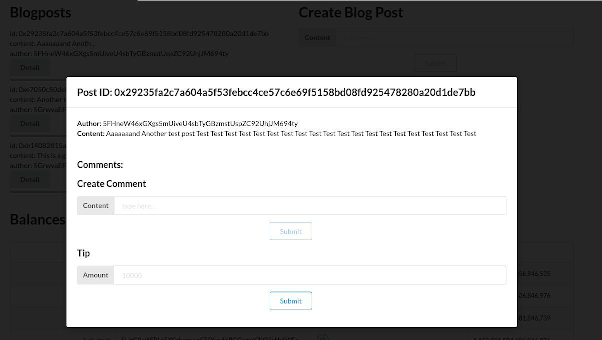
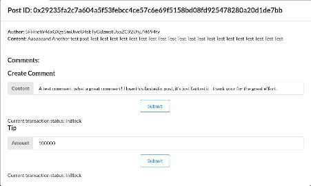
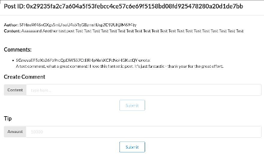

*This post was originally posted on the [LogRocket](https://blog.logrocket.com/substrate-blockchain-application-custom-react-frontend/) blog on 31.05.2022 and was cross-posted here by the author.*

We covered how to [build a custom Blockchain implementation using the Substrate framework](https://blog.logrocket.com/custom-blockchain-implementation-rust-substrate/) [in Rust](https://blog.logrocket.com/custom-blockchain-implementation-rust-substrate/). However, in this article, we looked only at the backend part of the application, using the default [Substrate frontend template](https://docs.substrate.io) to interact with the blockchain, calling functions and inspecting the blockchain state manually.

In this article, we’ll implement a custom frontend for the `Blogchain` blockchain built in the backend-based article.

While there are many ways to build a frontend for a Substrate based blockchain, both native and using the web, in this example, we’ll continue with the web. But, even within the web, there are plenty of ways one could go about building a client for a blockchain.

You can find the full code for this example on [GitHub](https://github.com/zupzup/blogchain-frontend-example-substrate). Let’s get started!

## Blockchains built with Substrate

By default, Blockchains built using Substrate provide an API for clients to connect to do RPC calls, for example, using WebSockets. The officially recommended way to interact with any Substrate-based chain is to use [Polkadot-JS](https://polkadot.js.org/docs/). 

However, there are also [libraries for other languages](https://docs.substrate.io/v3/integration/client-libraries/), as well as the option to use [Substrate Connect](https://docs.substrate.io/v3/integration/substrate-connect/), which uses Polkadot-JS internally and is focused on providing a basis for light clients for a Substrate blockchain.

You can [check out the Polkadot-JS docs](https://polkadot.js.org/docs/) to see what it can do and how this looks. Essentially, you have full RPC access to a Substrate blockchain. If you want to dive deeper, the docs are quite good and there are also examples you can check out.

We’ll save ourselves some time and use the [Substrate Frontend Template](https://github.com/substrate-developer-hub/substrate-front-end-template). However, we won’t just use the default template to interact with our blockchain, but we’ll fork it and customize it, extending the template with some `Blogchain` specific UI elements for interacting with our custom blockchain. 

We’ll save some time in terms of setup and boilerplate, while still using the actual libraries and functionality that we would use with any other application. The frontend template is based on React and also includes Polkadot-JS.

A nice side effect of this approach is that inside the template, a lot of the useful blockchain-related functionality is already bundled up and made usable in a higher level.  Also, by extending an existing project, we can look at the code that is being used within the template to learn how to build working components in an idiomatic way.

Finally, let’s jump into setting up the project and get coding!

## Setting up Substrate 

First, we’ll fork the [Substrate Frontend Template](https://github.com/substrate-developer-hub/substrate-front-end-template) repository. Then, we can clone our fork:

```bash
    git clone url-of-your-fork
```

Once that’s done and we have our fork locally available, we can navigate inside of the directory and execute:

```bash
    yarn install
```

The command above will install all the necessary dependencies and start the template on `http://localhost:8000`. Of course, this will only work well if you have the `Blogchain` project locally running. To do so, simply follow the steps outlined in the [README of this repository](https://github.com/zupzup/blogchain-example-substrate) after cloning it locally. Note that you’ll need Rust and Cargo to run a Substrate blockchain locally.

Now, we can check out the folder structure within the Substrate frontend template, which is essentially just a modern React application. The entry point is in `src/index.js`, which includes the `src/App.js` file.

Looking through `src/App.js`, we can see that the template uses [Semantic UI React](https://react.semantic-ui.com/), a React version of the [Semantic UI](https://semantic-ui.com/) framework, meaning we can use the existing pre-styled components of Semantic UI.

Within the render function, we can also see all the components that are actually visible in the browser,like `<NodeInfo />`, `<Balances />`, etc. The cool thing is that all of these components are actually implemented within the project, so we can just look at, for example, `Transfer.js`, to see how we could build a component for sending funds from one account to another.

Another important aspect is the `substrate-lib/` folder, which bundles and abstracts over much of the blockchain-related RPC logic we’ll need to interact with our chain, as well as some pre-built components for this purpose.

If you want to dive deeper into building web clients for Substrate blockchains, exploring and understanding the frontend template project is a fantastic way to start. With the setup out of the way, let’s get coding!

## Basic components

We’ll build several custom components. On the highest level, we want to show the existing blog posts and have a form to create blog posts. Then, we want to be able to check out a post’s details, including the comments on the post. Finally, we want to have the ability to tip the blog post author and to add new comments.

We’ll create the following components:

* `Blogchain`: The top-level component, which will include the rest and which we’ll integrate into the Frontend Template
* `blogchain/ListBlogPost`: Component for listing blog posts and their details
* `blogchain/CreateBlogPost`: Form for adding a new blog post
* `blogchain/CreateComment`: Form for adding a new comment
* `blogchain/Tip`: Form for tipping a blog post author

Since this is just an example and not a production app, we won’t deal with error handling and input validation, but if you’re familiar with React, whatever you’ve done or seen in other projects should work just as well here. 

Let’s start with the high-level `Blogchain` component:

```javascript
    import { Grid, Container } from 'semantic-ui-react'
    
    function Blogchain() {
      return (
        <Grid.Column width={16}>
          <Container>
            <Grid stackable columns="equal">
              <ListBlogPosts />
              <CreateBlogPost />
            </Grid>
          </Container>
        </Grid.Column>
      )
    }
    export default Blogchain
```

As mentioned above, we use Semantic UI components to build the UI. Essentially, we just create a grid column since our component will be integrated in an existing grid of the template application. This column has the size `16`, meaning it will span the whole width of the page.

Within the `Blogchain` component, we create a new container with a grid inside where we can lay out our own components right next to each other, each taking up 50 percent of the space.

Next, let’s look at the `CreateBlogPost` component, which will be sonewhat more interesting:

```javascript
    import { Grid, Form, Input } from 'semantic-ui-react'
    import { useState } from 'react'
    import { TxButton } from '../substrate-lib/components'
    
    function CreateBlogPost() {
      const [status, setStatus] = useState(null)
      const [formState, setFormState] = useState({ content: '' })
    
      const onChange = (_, data) =>
        setFormState(prev => ({ ...prev, [data.state]: data.value }))
    
      const { content } = formState
    
      return (
          <Grid.Column width={8}>
            <h1>Create Blog Post</h1>
            <Form>
              <Form.Field>
                <Input label="Content" type="text" placeholder="type here..." state="content" onChange={onChange} value={content} />
              </Form.Field>
              <Form.Field style={{ textAlign: 'center' }}>
                <TxButton
                  label="Submit"
                  type="SIGNED-TX"
                  setStatus={setStatus}
                  attrs={{
                    palletRpc: 'blogchain',
                    callable: 'createBlogPost',
                    inputParams: [content],
                    paramFields: [true],
                  }}
                />
              </Form.Field>
            <div style={{ overflowWrap: 'break-word' }}>{status}</div>
            </Form>
          </Grid.Column>
      )
    }
    export default CreateBlogPost
```

Let’s go through our code line-by-line. We’ll also reuse this model of a form-based component for the `CreateComment` and `Tip` components later on, so it’s important to get a good understanding of what’s happening here.

First, we define a local state called `status` with `useState`, initializing it to `null`. The idea of a status in this case means the lifecycle of the transaction. In a typical web-based request-response system, there’s not much relevant state. We send the request and expect the response, handling errors, that’s it.

To persist state in a blockchain system, instead of putting it into some database, we add it to a block, which has to be agreed on by the network. But, due this nature, a transaction can have several states.

First, when we send it, it might not be accepted by the blockchain, for example, because we sent invalid data. If it’s a valid request, we still have to wait until it is mined into a block. So, this `status` state essentially reflects this state to the user in a simplistic way.

Then, we define the `formState`, which is an object containing our form fields. The `onChange` function can be used to update this `formState` if an input field is changed.

All of this logic is basically copied from the existing `Transfer.js` component, to be as idiomatic as possible. This is all just form-handling logic. Let’s look at the components we use for building the actual form.

### Form-building components 

Semantic UI has built-in `Form` components that we can use and wire up automatically with our `formState` and `onChange` functions by setting the `state` prop.

Then, we add a `TxButton` component, which is a pre-existing component from the `substrate-lib` bundle of functionality for interacting with the blockchain. This is a button, which also takes care of executing a transaction. In this case, we want to make a signed transaction, which is why we use the type `SIGNED-TX`.

This is also where we see our `status` state, setting the `setStatus` property to our function, meaning that the `TxButton` functionality, which keeps track of the lifecycle of the triggered transaction, updates this status.

Next, we can set `attrs`. These attributes define what we actually want to achieve with this transaction. In our case, we say that we want to call the `blogchain::createBlogPost` extrinsic with the content from our form in the `inputParams`.

Below the form, we display our `status` state, which will be updated during the execution of the transaction.

The `TxButton` component is actually implemented inside the `substrate-lib/components` folder, so if you’re interested in everything that’s going on behind the scenes, it might be worth it to check it out.

Now, let’s move on to listing our blog posts.

## Fetching data and listing blog posts

To list our blog posts, we need to fetch both the blog posts and their comments, then render them:

```javascript
    import { useSubstrateState } from '../substrate-lib'
    import { Grid, Button, Modal } from 'semantic-ui-react'
    import { useEffect, useState } from 'react'
    
    function ListBlogPosts() {
      const { api } = useSubstrateState()
      const [ blogPosts, setBlogPosts ] = useState([])
      const [ blogPostComments, setBlogPostComments ] = useState({})
    
      useEffect(() => {
        api.query.blogchain.blogPosts.entries().then((posts) => {
          const p = posts.map(post => {
            return {
              id: post[0].toHuman(),
              content: post[1].toHuman().content,
              author: post[1].toHuman().author,
            }
          })
          setBlogPosts(p)
        })
    
      }, [api])
    
      useEffect(() => {
        api.query.blogchain.blogPostComments.entries().then((commentsMap) => {
          const c = commentsMap.reduce((acc, commentsEntry) => {
            return {
              ...acc,
              [commentsEntry[0].toHuman()]: commentsEntry[1].toHuman(),
            }
          }, {})
          setBlogPostComments(c)
        })
    
      }, [api])
    
      return (
          <Grid.Column width={8}>
            <h1>Blogposts</h1>
            {blogPosts.map((post) => {
              return <BlogPost key={post.id} post={post} comments={blogPostComments[post.id]}/>
            })}
          </Grid.Column>
      )
    }
    export default ListBlogPosts
```

We start off by using the `useSubstrateState` method to get the `api`. This is a built-in library function from `substrate-lib`. The `api` is basically an abstraction for making RPC calls to the blockchain.

We use `useState` to create component state for `blogPosts` and `blogPostComments`. Then, we actually define two effects using `useEffect`, the React lifecycle function. 

In this case, we’re basically just making requests when the components are loaded. However, Polkadot-JS is quite powerful when it comes to real-time data, and we could also create WebSocket-based subscriptions. 

For example, if we had a storage item, which changes every time a blog post is added, we could subscribe to that value and re-fetch the data every time it changes, updating our UI accordingly.

So moving from a request-response model to a full real-time model is fully supported by the tech we’re already using here.

Anyway, we use the `api` abstraction to first query `blogchain.blogPosts.entries()`, which returns the actual `StorageMap`, a map from blog post ID hash to the actual blog posts.

We get this in the form on an array, where each element is essentially a tuple of the ID and the blog post. We use the `.toHuman()` function to get a human-readable representation of the blog post ID and the blog post data, setting it in our `blogPosts` state.

We do basically the same for the blog post comments, however, the difference is that we don’t just map over it to create a list of blog posts, but we `reduce` down the map of blog post IDs to blog post comments for each ID. We also set this data in our `blogPostComments` state.

Then, we simply render another grid column and map the `blogPosts` to `BlogPost` components, passing down the `post`  and `comments` to the detail component.

The `BlogPost` component, which we used for displaying the blog posts in the list is very simple:

```javascript
    function BlogPost(props) {
      const { post, comments } = props
    
      return (
        <div>
          id: {post.id} <br />
          content: {post.content.substring(0, 15) + '...'} <br />
          author: {post.author}<br />
          <BlogPostModal post={post} comments={comments} />
          <hr/>
        </div>
      )
    }
```

We just display the ID, the first 15 characters of the content, and the author of the `post` passed down using props. More interestingly, below the data, we show the `BlogPostModal`, which will be the `Detail` component that pops up when people click on the `Detail` button of a blog post:

```javascript
    function BlogPostModal(props) {
      const [open, setOpen] = useState(false)
      const { post, comments } = props
    
      return (
        <Modal
          onClose={() => setOpen(false)}
          onOpen={() => setOpen(true)}
          open={open}
          trigger={
            <Button>Detail</Button>
          }
        >
          <Modal.Header>Post ID: {post.id}</Modal.Header>
          <Modal.Content>
            <b>Author:</b> {post.author} <br />
            <b>Content:</b> {post.content}
          </Modal.Content>
          <Modal.Content>
            <h3>Comments:</h3>
            <ul>
              {comments && comments.map((comment) => {
                return <li key={comment.content}>{comment.author} wrote: <br />{comment.content}</li>
              })}
            </ul>
    
            <CreateComment postId={post.id} />
            <Tip postId={post.id} />
          </Modal.Content>
        </Modal>
    
      )
    }
```

Semantic UI has a built-in `Modal` component. The idea is that we can define state-functions for opening and closing the modal, and more interestingly, a `trigger` property.

This `trigger` is in our case simply a button, that, when clicked, will trigger `onOpen`. When it’s clicked while open, it triggers `onClose`. In a more complex application, we can see how these hooks could be used to implement more interesting functionality concerning opening and closing the Modal.

Inside the `Modal` component, we can implement our logic and user interface for the detail view. In our case, we start off with the post ID as a header, followed by the full content and author of the post.

Below that, we display the comments that we passed down into the `BlogPost` and `Modal` component, as well as our `CreateComment` and `Tip` components, which we’ll look at next.

Besides that, not much is happening here. We just use the powerful `Modal` from Semantic UI to do the heavy lifting for us. As mentioned above, the `CreateComment` and `Tip` components are similar to `CreateBlogPost` with minor changes:

```javascript
    import { Grid, Form, Input } from 'semantic-ui-react'
    import { useState } from 'react'
    import { TxButton } from '../substrate-lib/components'
    
    function CreateComment(props) {
      const [status, setStatus] = useState(null)
      const [formState, setFormState] = useState({ content: '' })
      const { postId } = props;
    
      const onChange = (_, data) =>
        setFormState(prev => ({ ...prev, [data.state]: data.value }))
    
      const { content } = formState
    
      return (
          <Grid.Column width={8}>
            <h3>Create Comment</h3>
            <Form>
              <Form.Field>
                <Input label="Content" type="text" placeholder="type here..." state="content" onChange={onChange} value={content} />
              </Form.Field>
              <Form.Field style={{ textAlign: 'center' }}>
                <TxButton
                  label="Submit"
                  type="SIGNED-TX"
                  setStatus={setStatus}
                  attrs={{
                    palletRpc: 'blogchain',
                    callable: 'createBlogPostComment',
                    inputParams: [content, postId.toString()],
                    paramFields: [true, true],
                  }}
                />
              </Form.Field>
            <div style={{ overflowWrap: 'break-word' }}>{status}</div>
            </Form>
          </Grid.Column>
      )
    }
    export default CreateComment
```

Here, we create a form again and use the `postId`, passed in using the props from the outside.

One interesting difference to the blog post creation form we can see here is that within the `TxButton`, when defining the `inputParams`, we set `[content, postId.toString()]`.

The `createBlogPostComment` extrinsic takes two parameters, the `content` String and a `Hash` of the blog post we want to comment on. We already know this hash because it’s just our `postId`, we can simply set it to `postId.toString()`. The `content` field is passed in the same way as when creating a blog post.

The rest of the form logic is indeed very much the same as in the previous form. The same goes for our last component, the `Tip` form:

```javascript
    import { Grid, Form, Input } from 'semantic-ui-react'
    import { useState } from 'react'
    import { TxButton } from '../substrate-lib/components'
    
    function Tip(props) {
      const [status, setStatus] = useState(null)
      const [formState, setFormState] = useState({ amount: 0 })
      const { postId } = props;
    
      const onChange = (_, data) =>
        setFormState(prev => ({ ...prev, [data.state]: data.value }))
    
      const { amount } = formState
    
      return (
          <Grid.Column width={8}>
            <h3>Tip</h3>
            <Form>
              <Form.Field>
                <Input label="Amount" type="text"  state="amount" onChange={onChange} amount={amount} placeholder="10000" />
              </Form.Field>
              <Form.Field style={{ textAlign: 'center' }}>
                <TxButton
                  label="Submit"
                  type="SIGNED-TX"
                  setStatus={setStatus}
                  attrs={{
                    palletRpc: 'blogchain',
                    callable: 'tipBlogPost',
                    inputParams: [postId.toString(), amount],
                    paramFields: [true, true],
                  }}
                />
              </Form.Field>
            <div style={{ overflowWrap: 'break-word' }}>{status}</div>
            </Form>
          </Grid.Column>
      )
    }
    export default Tip
```

Again, since the `tipBlogPost` extrinsic expects two arguments, a `Hash` of the post and an `amount` of funds, we can do the same as in the previous component by pre-setting the `Hash` in the `inputParams` of the `TxButton` component to the `postId`.

Now, within these components, in a “real” application, you could imagine us checking, whether we’re the author of a post, or a comment and showing those differently. Or that we might disable the `Tip` component, if it’s our own blog post. At the end of the day, this is very similar to any other API-based web application, where we make requests for data using Polkadot-JS and update the state in our frontend.

That’s all of our components done. The only thing left is to wire them up with the frontend template by extending `App.js`:

```javascript
    import Blogchain from './Blogchain'
    
    ...
              <Grid.Row stretched>
                <NodeInfo />
                <Metadata />
                <BlockNumber />
                <BlockNumber finalized />
              </Grid.Row>
              
              <Grid.Row>
                <Blogchain />
              </Grid.Row>
              
              <Grid.Row stretched>
                <Balances />
              </Grid.Row>
    ...
```
    
## Testing

Let’s see if what we built actually works.

Check the Setup section above for instructions on checking if the `Blogchain` blockchain is running. We then execute `yarn start`, and our application will open in a browser pointing to `http://localhost:8000`.

There, we can see the basic frontend template user interface. Right below the basic blockchain info, where we added our `<Blogchain />` component, we can see our blog post list and blog post creation components:

<center>
    <a href="images/img1.png" target="_blank"></a>
</center>

Now, let’s try to create a blog post:

<center>
    <a href="images/img2.png" target="_blank"></a>
</center>

Once we click on `Submit`, we can see the `status` below change. Once it’s `InBlock`, everything is persisted. Now, by refreshing the page and adding some more blog posts, we can see our list of blog posts:

<center>
    <a href="images/img3.png" target="_blank"></a>
</center>

Great, now let’s click on the `Detail` button of a post to see our `Modal` for interacting with the post:

<center>
    <a href="images/img4.png" target="_blank"></a>
</center>

Here, we can see the details of the post and our form for adding comments and tipping the blog post author. Let’s do both:

<center>
    <a href="images/img5.png" target="_blank"></a>
</center>

Upon adding a comment and tipping, we can check the `balance` and see that the money has actually changed hands. Also, refreshing and opening the `Detail` again, we can see our new comment the detail page:

<center>
    <a href="images/img6.png" target="_blank"></a>
</center>

It works, fantastic!

## Conclusion

Similar to the [backend-oriented example](https://blog.logrocket.com/custom-blockchain-implementation-rust-substrate/) with Substrate, being able to use a pre-existing template project with great documentation made getting into Polkadot-JS and interacting with the blockchain a rather smooth experience.

I believe, especially with the novelty and high complexity of blockchain technology and Web3 in general, Substrate’s approach of helping people hit the ground running from reading the docs to their first example seems really powerful.

From this example, which was based on the existing Substrate Frontend Template, it’s not much of a stretch to a React-based client application just only using a minimal set of libraries and Polkadot-JS and to use the whole Substrate ecosystem to build a working Web3 application.

