*This post was originally posted on the [LogRocket](https://blog.logrocket.com/custom-blockchain-implementation-rust-substrate/) blog on 14.02.2022 and was cross-posted here by the author.*

In a previous article, we explored the core concepts behind the [Substrate](http://substrate.dev/) blockchain framework. In this tutorial, we’ll actually get our hands dirty and implement a very basic custom blockchain application in Rust using Substrate. 

It’s not strictly necessary to have read the introductory article, but if some of the terminology seems alien or confusing to you, it might make sense to skim over “[Substrate blockchain development: Core concepts](https://blog.logrocket.com/substrate-blockchain-framework-core-concepts/)” before moving on with this tutorial.

We will build the backend of a simple blockchain-based blogging application in which users can submit blog posts, comment on users’ blog posts, and send other blog post authors a tip if they like their content. 

All of these actions cost the users a small amount of currency based on the execution time of the operations. To learn more about this concept, you can check out the [Substrate docs](https://docs.substrate.io/v3/runtime/weights-and-fees/).

The basis of this application will be the [Substrate Node Template](https://github.com/substrate-developer-hub/substrate-node-template), a fully set up substrate node ready for customization.

In this tutorial, we will only concern ourselves with the backend part of the application and rely on the [Substrate Front End Template](https://github.com/substrate-developer-hub/substrate-front-end-template) to interact with the blockchain and our custom functionality. In a future post, we might extend this example and build a custom frontend application for it based on this template.

## Setup

To setup our node template, we will use [Kickstart](https://github.com/Keats/kickstart), which you can install by executing the following:

```bash
    cargo install kickstart
```

Kickstart is simply a CLI tool for setting up projects based on premade templates. Fortunately, there is a [S](https://github.com/sacha-l/kickstart-substrate)[ubstrate](https://github.com/sacha-l/kickstart-substrate) [](https://github.com/sacha-l/kickstart-substrate)[template for Kickstart](https://github.com/sacha-l/kickstart-substrate).

Now you can run this command in the root of your workspace:

```bash
    kickstart https://github.com/sacha-l/kickstart-substrate
```

This will prompt you for a name. In both cases, simply put `blogchain`, then it will download and set up a local Substrate node template with a fully wired-up pallet by the name you gave.

Let’s look at the file structure in the `blogchain` project:

<center>
    <a href="images/img1.png" target="_blank">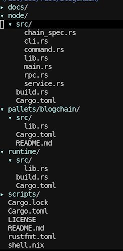</a>
</center>

As you can see, we have quite a few files and folders here. Most importantly, we have our `pallets/blockchain` area, where we will do most of our customizations and implement all of our business logic.

`node` contains all the code we need to run the underlying node template. In `runtime`, all internal and external pallets are wired together, so they can run inside the node.

We will only make changes to the `pallets/blogchain/lib.rs` and `runtime/src/lib.rs` files.

if you get lost at some point, or things don’t work, you can reference [this repository](https://github.com/zupzup/blogchain-example-substrate) and look at the commit history, which roughly coincides with the path we’ll take in this tutorial.

First, in `runtime/src/lib,rs`, change the following line:

```rust
    TemplateModule: pallet_blogchain,
```

To:

```rust
    Blogchain: pallet_blogchain,
```

This is important to ensure that our pallet has the correct name displayed in the frontend later on.

Also, for setup reasons, we’ll add the `Currency` trait to our pallet because we’ll want to transfer some currency from one user to another later on.

In `pallets/blogchain/lib.rs`, change the following:

```rust
    use frame_support::pallet_prelude::*;
```

To:

```rust
    use frame_support::{pallet_prelude::*, traits::Currency};
```

Within:

```rust
    #[pallet::config]
    pub trait Config: frame_system::Config {
        type Event: From<Event<Self>> + IsType<<Self as frame_system::Config>::Event>;
        type Currency: Currency<Self::AccountId>; // <-- new
    }
```

This adds the `Currency` trait to our pallet. We also need to add this to `runtime/lib.rs`:

```rust
    pub use frame_support::{
    ...
            traits::{Currency, KeyOwnerProofSystem, Randomness, StorageInfo},
    ...
    };
    
    impl pallet_blogchain::Config for Runtime {
            type Event = Event;
            type Currency = Balances; // <-- new
    }
```

Alright, that’s it for the setup. Make sure everything compiles and let’s move on to some data structures and state definitions.

## Data structures and storage

In this section, we’ll implement a simple blogging system with comments and a tipping function.

Let’s first add some data structures for blog posts and comments in `/pallets/blogchain/lib.rs`:

```rust
    use frame_support::{
    ...
    inherent::Vec,
    ...
    };
    
    
    #[derive(Clone, Encode, Decode, PartialEq, RuntimeDebug, TypeInfo)]
    #[scale_info(skip_type_params(T))]
    pub struct BlogPost<T: Config> {
            pub content: Vec<u8>,
            pub author: <T as frame_system::Config>::AccountId,
    }
    
    #[derive(Clone, Encode, Decode, PartialEq, RuntimeDebug, TypeInfo)]
    #[scale_info(skip_type_params(T))]
    pub struct BlogPostComment<T: Config> {
            pub content: Vec<u8>,
            pub blog_post_id: T::Hash,
            pub author: <T as frame_system::Config>::AccountId,
    }
```

That looks a bit complex, so let’s unpack it.

Let’s first look at the macros above the structs. We derive a couple of well-known helper traits, such as `Clone`, `PartialEq`, etc., but we also derive the `scale_info::TypeInfo` trait and use the `scale_info` macro. These are used for serialization and deserialization inside of Substrate, as well as for [retrieving compile-time info](https://docs.substrate.io/rustdocs/latest/scale_info/index.html) [about](https://docs.substrate.io/rustdocs/latest/scale_info/index.html) [the types at runtime](https://docs.substrate.io/rustdocs/latest/scale_info/index.html).

The structs themselves are rather simple. The post simply has a content vector of bytes and the author is basically just an `AccountId` from within the system. The `frame_system::Config` is essentially the underlying pallet configuration. The `frame_system` module provides functionality and data types for everything underlying the pallets. That’s also why the structs are generic for a `T: Config`, because they’ll always be used within the context of a pallet configuration.

The `BlogPostComment` has a content and an author, but it also holds the `blog_post_id`, which is a `T::Hash`. This is the output of the configured hashing function. We will use Substrate defaults for everything, but you could imagine this being useful if you wanted to use this pallet with different blockchain systems, which rely on different configurations, such as different hashing algorithms. This way, it’ll work without any necessary changes.

The next step is to define the state we want to keep on the blockchain. For this purpose, we’ll create two `StorageMap` instances holding the posts and comments:

```rust
    /// Storage Map for BlogPosts by BlogPostId (Hash) to a BlogPost
    #[pallet::storage]
    #[pallet::getter(fn blog_posts)]
    pub(super) type BlogPosts<T: Config> = StorageMap<_, Twox64Concat, T::Hash, BlogPost<T>>;
    
    /// Storage Map from BlogPostId (Hash) to a list of BlogPostComments for this BlogPost
    #[pallet::storage]
    #[pallet::getter(fn blog_post_comments)]
    pub(super) type BlogPostComments<T: Config> =
            StorageMap<_, Twox64Concat, T::Hash, Vec<BlogPostComment<T>>>;
```

With the `pallet::storage` macro we tell the system that this is a piece of persistent storage and the `pallet::getter` macro makes it so we can query this later on under the given function name.

For the blog posts, we use a `StorageMap`, which is essentially a hash map, mapping from `T::Hash` to a `BlogPost`, so from a blog post id to a blog post.

For the blog post comments, we want to map from a blog post ID to a list of comments, so we can query the comments for a given blog post.

This is all the state we want to keep in this example, but you can imagine how there might be other useful data points and views on the data. We might want to persist for our clients to query later on.

In Substrate, there is the concept of `Events`, which can be used for informing clients and users that something happened — think of using WebSockets to inform you that a post has been commented on, for example.

For this purpose, we’ll need to add an event for each of our actions:

```rust
    #[pallet::event]
    #[pallet::generate_deposit(pub(super) fn deposit_event)]
    pub enum Event<T: Config> {
            BlogPostCreated(Vec<u8>, T::AccountId, T::Hash),
            BlogPostCommentCreated(Vec<u8>, T::AccountId, T::Hash),
            Tipped(T::AccountId, T::Hash),
    }
```

We add events for when a blog post was created with the content, author, and ID of the blog post, and the same for a comment. When a user tips for a blog post, we send the tipper’s account ID and the ID of the blog post whose author has been tipped.

Before moving on to implementing the actual logic for creating blog posts, comments, and tipping, we need a few more types for our error handling. We’d like to limit the size of blog posts and comments. Blog posts should be between 64 and 4,096 bytes in length and comments between 64 and 1,024. This is mostly to show off some error handling later on, but it’s a good idea to do this either way.

First, we add some constants for this in our pallet config:

```rust
    #[pallet::config]
    pub trait Config: frame_system::Config {
            type Event: From<Event<Self>> + IsType<<Self as frame_system::Config>::Event>;
    
            type Currency: Currency<Self::AccountId>;
    
            #[pallet::constant]
            type BlogPostMinBytes: Get<u32>;// <-- new
    
            #[pallet::constant]
            type BlogPostMaxBytes: Get<u32>;// <-- new
    
            #[pallet::constant]
            type BlogPostCommentMinBytes: Get<u32>;// <-- new
    
            #[pallet::constant]
            type BlogPostCommentMaxBytes: Get<u32>; // <-- new
    }
```

And some error types:

```rust
    // Errors inform users that something went wrong.
    #[pallet::error]
    pub enum Error<T> {
            /// Error names should be descriptive.
            NoneValue,
            /// Errors should have helpful documentation associated with them.
            StorageOverflow,
            BlogPostNotEnoughBytes, // <-- new
            BlogPostTooManyBytes, // <-- new
            BlogPostCommentNotEnoughBytes,// <-- new
            BlogPostCommentTooManyBytes,// <-- new
            BlogPostNotFound,// <-- new
            TipperIsAuthor,// <-- new
    }
```

Great! Now we need to define values for our constants in the runtime at `runtime/lib.rs`:

```rust
    parameter_types! {
            pub const Version: RuntimeVersion = VERSION;
            pub const BlockHashCount: BlockNumber = 2400;
            /// We allow for 2 seconds of compute with a 6 second average block time.
            pub BlockWeights: frame_system::limits::BlockWeights = frame_system::limits::BlockWeights
                    ::with_sensible_defaults(2 * WEIGHT_PER_SECOND, NORMAL_DISPATCH_RATIO);
            pub BlockLength: frame_system::limits::BlockLength = frame_system::limits::BlockLength
                    ::max_with_normal_ratio(5 * 1024 * 1024, NORMAL_DISPATCH_RATIO);
            pub const SS58Prefix: u8 = 42;
            pub const BlogPostMinBytes: u32 = 64; // <-- new
            pub const BlogPostMaxBytes: u32 = 4096;// <-- new
            pub const BlogPostCommentMinBytes: u32 = 64;// <-- new
            pub const BlogPostCommentMaxBytes: u32 = 1024;// <-- new
    }
    
    ...
    ...
    
    /// Configure the pallet-blogchain in pallets/blogchain.
    impl pallet_blogchain::Config for Runtime {
            type Event = Event;
            type Currency = Balances;
            type BlogPostMinBytes = BlogPostMinBytes; // <-- new
            type BlogPostMaxBytes = BlogPostMaxBytes; // <-- new
            type BlogPostCommentMinBytes = BlogPostCommentMinBytes; // <-- new
            type BlogPostCommentMaxBytes = BlogPostCommentMaxBytes; // <-- new
    }
```

That’s it for types and storage. Next, we’ll implement our functionality.

## Functions and extrinsics

Let’s start with an extrinsic function for creating a blog post.

```rust
    #[pallet::weight(10000)]
    #[transactional]
    pub fn create_blog_post(origin: OriginFor<T>, content: Vec<u8>) -> DispatchResult {
            let author = ensure_signed(origin)?;
    
            ensure!(
                    (content.len() as u32) > T::BlogPostMinBytes::get(),
                    <Error<T>>::BlogPostNotEnoughBytes
            );
    
            ensure!(
                    (content.len() as u32) < T::BlogPostMaxBytes::get(),
                    <Error<T>>::BlogPostTooManyBytes
            );
    
            let blog_post = BlogPost { content: content.clone(), author: author.clone() };
    
            let blog_post_id = T::Hashing::hash_of(&blog_post);
    
            <BlogPosts<T>>::insert(blog_post_id, blog_post);
    
            let comments_vec: Vec<BlogPostComment<T>> = Vec::new();
            <BlogPostComments<T>>::insert(blog_post_id, comments_vec);
    
            Self::deposit_event(Event::BlogPostCreated(content, author, blog_post_id));
    
            Ok(())
    }
```

Let’s start from the top. With `pallet::weight`, we define the computational weight of this extrinsic. In this case, we hardcode it because this is just a simple example. This value should have a relation to the amount of processing resources that are needed for this operation to happen and the fee for executing this operation will include this weight, so the higher the weight, the higher the transaction fees for executing an extrinsic.

The `transactional` macro makes it so that any state changes within this extrinsic are only made if it returns no error. This is similar to transactional behavior with relational databases, where you only want to persist a change if all changes go through. We need this here because we add both a new blog post and an empty list of comments.

The first thing we do is validate the transaction and the author of the transaction. This gives us the account ID of the user who triggered the extrinsic. We also define an incoming `content` vector, which we also expect to be given by the caller here.

Then, we use the `ensure!` macro, which is similar to an assertion, to validate that the blog post is inside of our length barriers, triggering an error if it isn’t.

Once validation has passed, we create a blog post struct with our content and author and the `blog_post_id`, which is hash over this struct.

This struct is then added to the `BlogPosts` StorageMap and we initialize an empty list of comments and persist it in the `BlogPostComments` StorageMap. This means that this function actually changes the state on the blockchain.

Once everything is done, we trigger the `BlogPostCreated` event, which clients can listen to to see if anything has changed.

It’s actually pretty simple, right? This is similar to how you’d [implement a handler in a web application](https://blog.logrocket.com/a-guide-to-react-onclick-event-handlers-d411943b14dd/). That’s all there is to adding a simple extrinsic that enables users to interact and manipulate the shared state of our application. No magic required.

The implementation of adding comments and tipping are equally straightforward. Let’s look at those next.

```rust
    #[pallet::weight(5000)]
    pub fn create_blog_post_comment(
            origin: OriginFor<T>,
            content: Vec<u8>,
            blog_post_id: T::Hash,
    ) -> DispatchResult {
            let comment_author = ensure_signed(origin)?;
    
            ensure!(
                    (content.len() as u32) > T::BlogPostMinBytes::get(),
                    <Error<T>>::BlogPostCommentNotEnoughBytes
            );
    
            ensure!(
                    (content.len() as u32) < T::BlogPostMaxBytes::get(),
                    <Error<T>>::BlogPostCommentTooManyBytes
            );
    
            let blog_post_comment = BlogPostComment {
                    author: comment_author.clone(),
                    content: content.clone(),
                    blog_post_id: blog_post_id.clone(),
            };
    
            <BlogPostComments<T>>::mutate(blog_post_id, |comments| match comments {
                    None => Err(()),
                    Some(vec) => {
                            vec.push(blog_post_comment);
                            Ok(())
                    },
            })
            .map_err(|_| <Error<T>>::BlogPostNotFound)?;
    
            Self::deposit_event(Event::BlogPostCommentCreated(
                    content,
                    comment_author,
                    blog_post_id,
            ));
    
            Ok(())
    }
```

As you can see, the weight here is a bit less; there’s less to do and we’d want to make commenting a bit cheaper than posting to encourage discussion.

The process is similar: we check the author, validate the content, and create a struct for the comment.

However, this time, instead of simply adding a value to an existing map, we need to manipulate an existing entry. For this purpose, we use the `mutate` method on the StorageMap. If we don’t find a value, we trigger a `BlogPostNotFound` error. This happens if the user sends an invalid blog post ID.

If a blog post is found, we simply push the blog post comment onto the vector of comments and trigger the event for notifying clients of this change — easy.

For our tipping feature, we want users to provide a blog post ID and an amount they’d like to send to the author. Let’s look at how that works.

```rust
    #[pallet::weight(500)]
    pub fn tip_blog_post(
            origin: OriginFor<T>,
            blog_post_id: T::Hash,
            amount: <<T as Config>::Currency as Currency<<T as frame_system::Config>::AccountId>>::Balance,
    ) -> DispatchResult {
            let tipper = ensure_signed(origin)?;
    
            let blog_post = Self::blog_posts(&blog_post_id).ok_or(<Error<T>>::BlogPostNotFound)?;
            let blog_post_author = blog_post.author;
    
            ensure!(tipper != blog_post_author, <Error<T>>::TipperIsAuthor);
    
            T::Currency::transfer(
                    &tipper,
                    &blog_post_author,
                    amount,
                    ExistenceRequirement::KeepAlive,
            )?;
    
            Self::deposit_event(Event::Tipped(tipper, blog_post_id));
    
            Ok(())
    }
```

As you can see, we expect the `blog_post_id`, a `T::Hash`, and the `amount`, which is a `Balance` of the configured `Currency` in our pallet.

We validate the `tipper` and check whether the given blog post ID actually leads to an existing blog post, returning an error if not.

If we find a blog post, we need to retrieve its author from the struct and make sure the tipper is not the same as the author. This wouldn’t be the end of the world, but it also doesn’t make sense to pay fees to send yourself money.

Then, if everything is OK, we use the `T::Currency::transfer` function on our pallet’s `C``urrency`  — remember, this is why we added the `Currency` handler in the beginning of the tutorial to our pallet — to send the `amount` of funds from the `tipper` to the `blog_post_author`. We won’t worry about the `ExistenceRequirement` flag in this post, but if you’re interested, you can read up about it in the [Substrate docs](https://docs.substrate.io/rustdocs/latest/frame_support/traits/tokens/enum.ExistenceRequirement.html).

That’s all the functionality we’ll implement for now. You can imagine implementing many more interesting features here, such as the ability for authors to delete their blog posts, which could refund a part of the tips. Or you could implement a moderation feature, where users could flag posts as inappropriate. You could even implement a financial incentive system that rewards users who provide and confirm/deny flagging reports.

Once you start thinking in terms of this system of incentives and game theory, being able to easily implement and tune these systems is quite cool. There’s lots of room to experiment and come up with new ideas to run collaborative systems.

Let’s test our system to see if it works!

## Testing

Now, to test our simple app, let’s build it for release first:

```bash
    cargo build --release
```

Next, we’ll start a local node in development mode with a fresh state every time we start it:

```bash
    ./target/release/node-blogchain --tmp --dev
```

To interact with our application, we have two options:

- The [Substrate Front End Template](https://github.com/substrate-developer-hub/substrate-front-end-template)
- The [Polkadot-JS App UI](https://polkadot.js.org/apps/#/explorer)

Here, we’ll use the Substrate Front End Template, but feel free to play around with the Polkadot-JS app, setting it to `Development → Local Node`.

To download, set up, and start the frontend template, simply execute:

```bash
    git clone https://github.com/substrate-developer-hub/substrate-front-end-template.git
    cd substrate-front-end-template
    yarn install
    yarn start
```

This will start a frontend application at http://localhost:8000/substrate-front-end-template.

There, you can already see your blockchain application state. At the top-right, you can see the selected account and switch between existing accounts.

<center>
    <a href="images/img2.png" target="_blank">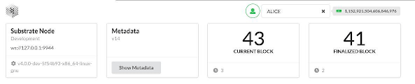</a>
</center>

Below, you can see the currency balance for each account:

<center>
    <a href="images/img3.png" target="_blank">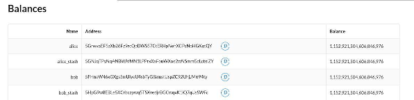</a>
</center>

Now, let’s create our first blog post by using the `Pallet Interactor` on the bottom left. We select the `blogchain` pallet and the `createBlogPost` extrinsic. Then, write some text (at least 64 bytes, at most 4096 bytes) in the content field and click **Signed**.

<center>
    <a href="images/img4.png" target="_blank">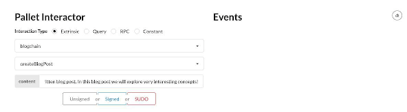</a>
</center>

<center>
    <a href="images/img5.png" target="_blank">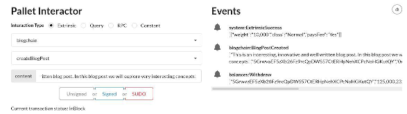</a>
</center>

Great! The blog post creation worked, as we can see on the right in the **Events** feed.

Let’s query for our blog post by selecting the **Query** radio button. Then, select the `blogchain` pallet again and the `blogPosts` storage (this is our actual StorageMap, which we defined above).
Then, from the **Events** feed, copy the blog post’s ID, paste it into the form, and click **Query**.

<center>
    <a href="images/img6.png" target="_blank">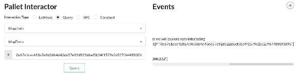</a>
</center>

<center>
    <a href="images/img7.png" target="_blank">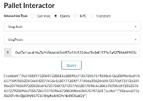</a>
</center>

If we use a valid blog post ID, we will get the persisted data on the chain for this entry in the following form:


```json
    {"content":"0x5468697320697320616e20696e746572657374696e672c20696e6e6f76617469766520616e642077656c6c207772697474656e20626c6f6720706f73742e20496e207468697320626c6f6720706f73742077652077696c6c206578706c6f7265207665727920696e746572657374696e6720636f6e636570747321","author":"5GrwvaEF5zXb26Fz9rcQpDWS57CtERHpNehXCPcNoHGKutQY"}
```

The content is the hex-encoded string. You can use a [free online tool](https://codebeautify.org/hex-string-converter) to convert it to a string:

<center>
    <a href="images/img8.png" target="_blank"></a>
</center>

You can also find the `author` field in the JSON, which corresponds to the account ID you can find in the `Balances` table.

Next, let’s create a comment. Switch to `Bob`’s account in the top right and use the **Pallet** **I****nteractor** to find `blogchain → createBlogPostComment`.

<center>
    <a href="images/img9.png" target="_blank">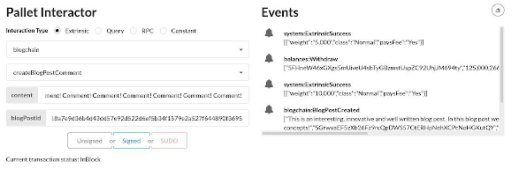</a>
</center>

Enter the blog post ID again and a comment (64–1024 bytes in length). Upon clicking **Signed**, we can see the **Event** feed again, which indicates that the fee was withdrawn from Bob’s account and the extrinsic worked.

Now we can query for the comment as well:

<center>
    <a href="images/img10.png" target="_blank">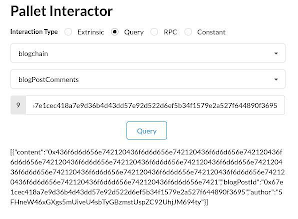</a>
</center>

<center>
    <a href="images/img11.png" target="_blank">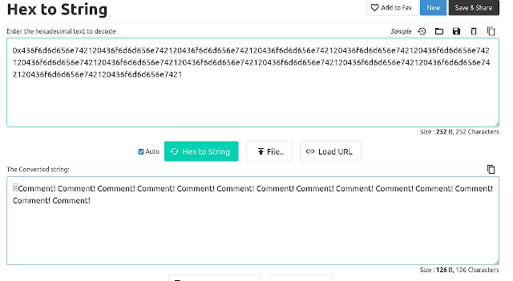</a>
</center>

Finally, let’s send a tip to the author of this blog post:

<center>
    <a href="images/img12.png" target="_blank">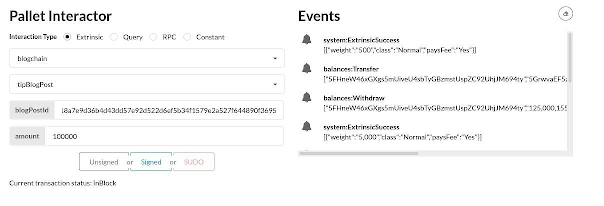</a>
</center>

And we can see how the balances changed:

<center>
    <a href="images/img13.png" target="_blank">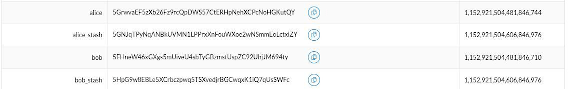</a>
</center>

<center>
    <a href="images/img14.png" target="_blank">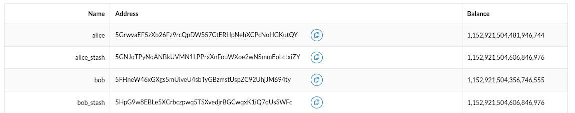</a>
</center>

That’s it - it works! Very cool stuff.

Feel free to play around some more with the application through the frontend template. For example, you can see what happens in error cases (e.g., a blog post that’s too short) in the event feed. Happy exploring!

## Conclusion

Based on [Substrate Node Template](https://github.com/substrate-developer-hub/substrate-node-template) and using the official docs, we were able to build a very simple custom blockchain application using Substrate.

Of course this post only scratches the surface of blockchain development with Substrate, but as you can see in this example, extending the Substrate template to build custom logic on top is rather straightforward.

In terms of development experience, one area that certainly needs improvement is compile times. The cycle of making changes and testing these changes takes quite a bit of time, even on strong hardware, which can be frustrating when you’re learning and testing things out.

That said, Substrate as a framework, despite it and the whole blockchain development ecosystem being very young, has proven quite robust with fantastic docs, examples, and tutorials to draw from already, as well as a vibrant and helpful community behind it.

