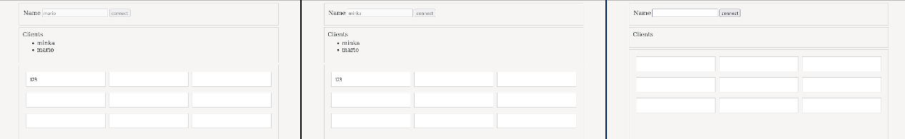
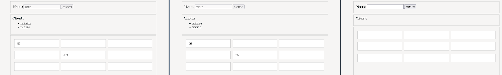
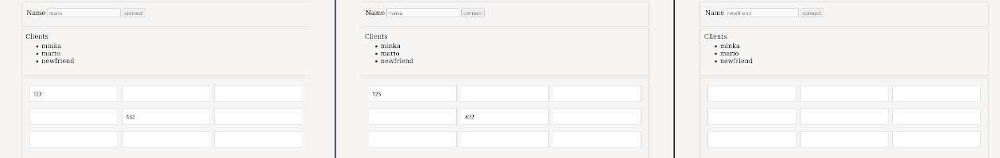
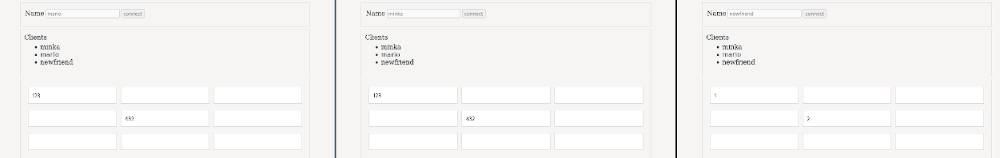
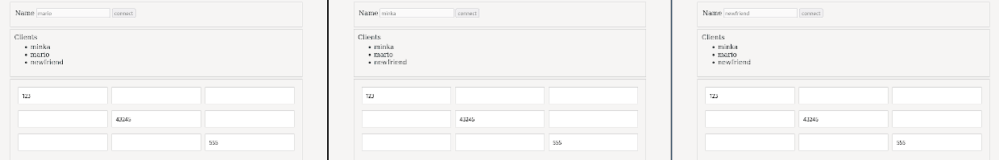

*This post was originally posted on the [LogRocket](https://blog.logrocket.com/using-crdts-build-collaborative-rust-web-applications/) blog on 23.02.2024 and was cross-posted here by the author.*


CRDTs, or [conflict-free replicated data types](https://en.wikipedia.org/wiki/Conflict-free_replicated_data_type), is a concept that underlies applications facing the issue of data replication across a network. These applications involve multiple actors writing and reading the data, potentially at the same time.

The goal of CRDTs is to make sure that the state of all peers in a system stays consistent at all times, even when they exchange data concurrently. If you are interested in the background and mechanics of CRDTs, I recommend [Jake Lazaroff's](https://jakelazaroff.com/words/an-interactive-intro-to-crdts/).

In this tutorial, we'll build a very simple last write wins CRDT, which we'll leverage to handle communication between multiple clients on a network without conflicts, keeping all peers in a consistent state at all times. Last write wins (LWW) means that for each field in the grid, all peers will keep the value of the peer who last wrote to the field, and if two peers write at the same time, we randomize between them for fairness.

We'll create a simple full-stack web application in Rust, featuring a frontend where clients use an ID to connect to a WebSocket server and input data into a 3x3 grid, with all communication via the WebSocket server. 

While it's feasible to develop fully distributed, local-first apps using CRDTs, this example opts for a simpler centralized data-relay mechanism to maintain simplicity. Note that for brevity, error handling and safety checks have been omitted, but in a production setting, data validation and error management would be critical.

With that out of the way, let's start coding!

## Setting up our Rust app

To follow along, all you need is a recent Rust installation (the latest version at the time of writing is 1.75.0). 

```bash
    mkdir rust-crdt-example
    cd rust-crdt-example
```

Because we're going to build both a frontend and a backend in this tutorial, we'll need three Rust projects. First, let's start with the `server` project:

```bash
    cargo new server
    cd server
```

Next, edit the `Cargo.toml` file and add the dependencies you'll need:

```toml
    [dependencies]
    tokio = { version = "1", features = ["full"] }
    tokio-tungstenite = "0.20"
    serde_json = "1.0"
    futures-util = "0.3"
    env_logger = "0.10"
    log = "0.4"
    common = { version = "0.1.0", path = "../common" }
```

We depend on our `common` package, which we'll define shortly, in conjunction with `tokio` and `tokio-tungstenite`, along with `futures-util` to build a WebSocket server. Additionally, we'll use utilities for logging and `serde` for serialization as we build a simple WebSocket-based relay server.

Next, we'll create a shared `common` project:

```bash
    cargo new --lib common
    cd common
```

Again, add the dependencies we need. In this package, as it exclusively contains data types, `serde` is the only requirement:

```toml
    [dependencies]
    serde = {version = "1.0", features = ["derive"] }
    serde_json = "1.0"
```

Finally, we'll create the `client` project for our frontend:

```bash
    cargo new client
    cd client
```

And we also add dependencies and some settings to `Cargo.toml`:

```toml
    [lib]
    crate-type = ["cdylib", "rlib"]
    
    [profile.release]
    codegen-units = 1
    lto = true
    
    [dependencies]
    leptos = { version = "0.5.4", features = ["csr"] }
    serde_json = "1.0"
    leptos-use = "0.8.2"
    common = { version = "0.1.0", path = "../common" }
    rand = "0.8.5"
```

We use the fantastic [Leptos framework](https://leptos.dev/) for building the frontend. Besides that, we use the `leptos-use` utilities for connecting to the WebSocket server, `serde` for serialization, and `rand` for generating random numbers.

We add the `csr` flag to Leptos because we'll only be building a client-side application, without server-side-rendering, which Leptos would also support.

To build our Leptos application using WASM and run it on a local server, we'll also need to install `trunk` and the WASM compilation target:

```bash
    cargo install trunk
    rustup target add wasm32-unknown-unknown
```

Now that we have our project set up, we can start implementing our application!

## Shared data types

Let's start with our shared `common` package, which holds the fundamental data types used both in the `client` and `server` implementation.

The two foundational data types are `Client` and `Event`:

```rust
    #[derive(Debug, Clone, Serialize, Deserialize)]
    pub struct Client {
        pub name: String,
    }
    
    #[derive(Debug, Clone, Deserialize, Serialize)]
    pub struct Event {
        pub t: String,
        pub data: Value,
    }
```

A `Client` is simply any peer and we send `Event`s between the different peers. `Event`s have a type `t` and some arbitrary `data`.

The next relevant type is what makes up our data grid, the `Row` and `Column` types:

```rust
    #[derive(Debug, Clone, Deserialize, Serialize)]
    pub struct Row {
        pub idx: usize,
        pub columns: Vec<Column>,
    }
    
    #[derive(Debug, Clone, Deserialize, Serialize)]
    pub struct Column {
        pub peer: String,
        pub timestamp: usize,
        pub idx: usize,
        pub value: String,
    }
```

`Row` consists of an index and a list of `Column` objects. `Column` is a CRDT containing an index, the value in the grid at that index, the name of the `peer` who last wrote to this field, and a `timestamp` indicating when the modification occurred. We'll look at the implementation of the CRDT later when it becomes clear why we need these fields.

Finally, we have our concrete events, which make up the arbitrary data within `Event`, which was mentioned above:

```rust
    pub const INIT: &str = "INIT";
    pub const GRID: &str = "GRID";
    pub const CLIENT_LIST: &str = "CLIENT_LIST";
    
    #[derive(Debug, Clone, Deserialize, Serialize)]
    pub struct InitEvent {
        pub name: String,
    }
    
    #[derive(Debug, Clone, Deserialize, Serialize)]
    pub struct ClientListEvent {
        pub clients: Vec<Client>,
    }
    
    #[derive(Debug, Clone, Deserialize, Serialize)]
    pub struct GridEvent {
        pub data: Vec<Row>,
        pub sender: String,
    }
```

`InitEvent` is the event any client sends to the server the first time to register. `ClientListEvent` is the event the server sends to all clients, so that when a new client is registered, or a client disconnects, everyone has an updated list of clients.

Finally, `GridEvent` is the data event in this whole mix. If a client changes their data, they send a `GridEvent` to the server. This event contains their local data grid, as well as their own ID in the `sender` field, so the server knows who the event is from and doesn't send it back to them. The server then replicates this event and sends it to all other peers.

That's it for the basic data types. Now let's implement the WebSocket relay server.

## Implementing the WebSocket server

Again, we start with data types:

```rust
    type Clients = Arc<RwLock<HashMap<String, WsClient>>>;
    
    #[derive(Debug, Clone)]
    pub struct WsClient {
        pub name: String,
        pub sender: UnboundedSender<String>,
    }
```

In this case, `Clients` represents the list of connected clients. We need to pack this up into an `Arc` and `RwLock`, because we'll access this map of peer names to clients from multiple connections concurrently.

`WsClient` serves as an abstraction for each connected client, equipped with an `UnboundedSender` to facilitate message sending to the client.

In the `main` function, we implement the basic setup for a WebSocket server using `tokio-tungstenite`:

```rust
    #[tokio::main]
    async fn main() -> Result<(), Error> {
        let clients: Clients = Arc::new(RwLock::new(HashMap::new()));
        let _ = env_logger::try_init();
    
        let listener = TcpListener::bind("127.0.0.1:3000")
            .await
            .expect("ws socket works");
        info!("WS Listening on: 127.0.0.1:3000");
    
        while let Ok((stream, _)) = listener.accept().await {
            tokio::spawn(accept_connection(stream, clients.clone()));
        }
    
        Ok(())
    }
```

We first initialize the `Clients` list, initialize logging, and then start a new WebSockets server on `localhost:3000`.

Then, for each incoming connection, we spawn a new `tokio` task, within which we call the `accept_connection` function, which takes the connection stream and our list of clients.

Let's look at that one next, as it contains the meat of the server logic:

```rust
    async fn accept_connection(stream: TcpStream, clients: Clients) {
        let addr = stream
            .peer_addr()
            .expect("connected streams should have a peer address");
        let ws_stream = tokio_tungstenite::accept_async(stream)
            .await
            .expect("Error during the websocket handshake occurred");
    
        info!("new ws connection: {addr}");
    
        let (mut sender, mut receiver) = ws_stream.split();
        let (tx, mut rx) = unbounded_channel::<String>();
        let client_id: Arc<RwLock<Option<String>>> = Arc::new(RwLock::new(None));
    
        loop {
            tokio::select! {
                msg = receiver.next() => {
                    match msg {
                        Some(msg) => {
                            let msg = msg.expect("msg is there");
                            if msg.is_text() {
                                if let Ok(evt) = serde_json::from_str::<Event>(msg.to_text().expect("msg is text")) {
                                    match evt.t.as_str() {
                                        INIT => {
                                            if let Ok(event) = serde_json::from_value::<InitEvent>(evt.data) {
                                                handle_init(&event, clients.clone(), tx.clone(), client_id.clone()).await;
                                            }
                                        },
                                        GRID => {
                                            if let Ok(event) = serde_json::from_value::<GridEvent>(evt.data) {
                                                handle_change(&event, clients.clone()).await;
                                            }
                                        }
                                        event_type => {
                                            warn!("unknown event: {event_type}");
                                        }
                                    }
                                }
                            } else if msg.is_close() {
                                handle_close(clients.clone(), client_id.clone(), addr).await;
                                break;
                            }
                        }
                        None => break,
                    }
                },
                Some(ev) = rx.recv() => {
                    sender.send(Message::Text(ev.to_owned())).await.expect("msg was sent");
                },
            }
        }
    }
```

OK that's a lot, so let's go through it step by step. First, we cache the incoming address and accept the incoming connection. As previously mentioned, this process does not include error handling.

Then we split up the WebSockets stream into a `sender` and `receiver` piece, and create a new `UnboundedChannel` so we can pass messages from functions that handle incoming messages to the sender part of the stream.

Finally, we cache `client_id` so we know, within each connection, which peer the connection is for. Again, we have to use `Arc` and `RwLock` here, as we access this concurrently.

Then we enter an infinite loop, where we use the `tokio::select!` macro to handle values from two different futures: `receiver` and `rx`. The `receiver` future is the stream of incoming WebSocket events and the `rx` future is the receiving end of the `UnboundedChannel` we created above, which we use to pass messages.

Whenever a new message on `rx` comes along, we simply wrap it into a WebSocket `Message` and send it via the WebSocket stream's `sender` end.

If, however, we receive a value on the `receiver` stream, it indicates that an event has come from our client. In that case, we need to handle the different event types we defined earlier. We can achieve this by parsing the event to an `Event`, making sure it's a text event using `msg.is_text()`. If the event type is `INIT` and the event's data parses to an `InitEvent`, we call the `handle_init` function:

```rust
    async fn handle_init(
        ev: &InitEvent,
        clients: Clients,
        sender: UnboundedSender<String>,
        client_id: Arc<RwLock<Option<String>>>,
    ) {
        let name = ev.name.to_owned();
        *client_id.write().await = Some(name.clone()); // remember the client's ID
    
        // add to the client list
        clients.as_ref().write().await.insert(
            name.clone(),
            WsClient {
                name: ev.name.to_owned(),
                sender: sender.clone(),
            },
        );
    
        // send updated list to all clients
        let serialized = serde_json::to_string(&Event {
            t: CLIENT_LIST.to_string(),
            data: serde_json::to_value(ClientListEvent {
                clients: clients
                    .read()
                    .await
                    .clone()
                    .into_values()
                    .map(|c| Client { name: c.name })
                    .collect(),
            })
            .expect("can serialize clients list"),
        })
        .expect("can serialize client list event");
    
        clients.read().await.iter().for_each(|client| {
            let _ = client.1.sender.send(serialized.clone());
        });
    }
```

This function saves the value of `name` in the incoming event to the `client_id` we're caching and then updates the client list to include the newly registered peer.

To ensure that every client always has an up-to-date list of clients, we distribute the refreshed client list to all peers. This is done by serializing a new `ClientListEvent` within an `Event`, containing the updated list, and then dispatching it through the `sender` component of the `UnboundedChannel`. As previously mentioned, each `WsClient` retains this `sender` for communication purposes.

If the incoming event is of type `GRID`, we call the `handle_change` function:

```rust
    async fn handle_change(ev: &GridEvent, clients: Clients) {
        // send updated grid to all clients, except the sender
        let d = ev.data.clone();
        let client_msg_event = Event {
            t: GRID.to_string(),
            data: serde_json::to_value(GridEvent {
                data: d.clone(),
                sender: ev.sender.clone(),
            })
            .expect("can serialize GRID event"),
        };
    
        let serialized =
            serde_json::to_string(&client_msg_event).expect("can serialize client GRID event");
    
        clients.read().await.iter().for_each(|client| {
            if client.0 != &ev.sender {
                let _ = client.1.sender.send(serialized.clone());
            }
        })
    }
```

This function simply takes the incoming event and multiplexes it to all connected clients except for the event's `sender`. This is the mechanism by which changes in the data grid get propagated between peers.

If the event isn't of a known type, we ignore it and log a warning. If the event is a `close` event, we call the `handle_close` function:

```rust
    async fn handle_close(
        clients: Clients,
        client_id: Arc<RwLock<Option<String>>>,
        addr: std::net::SocketAddr,
    ) {
        if let Some(ref ci) = *client_id.read().await {
            clients.as_ref().write().await.remove(ci); // remove client from list
    
            // send new list to all clients
            let serialized = serde_json::to_string(&Event {
                t: CLIENT_LIST.to_string(),
                data: serde_json::to_value(ClientListEvent {
                    clients: clients
                        .read()
                        .await
                        .clone()
                        .into_values()
                        .map(|c| Client { name: c.name })
                        .collect(),
                })
                .expect("can serialize clients list"),
            })
            .expect("can serialize client list event");
    
            clients.read().await.iter().for_each(|client| {
                let _ = client.1.sender.send(serialized.clone());
            });
            info!("disconnected: {:?} at {addr}", ci);
        }
    }
```

Similar to `handle_init`, this function just updates the client list, removing the disconnected client and sending the updated list to all connected clients.

That's it for the server part of this application. Now that we have a better understanding of the various events that occur and their outcomes, let's examine the implementation on the client side.

## Leptos client with CRDT logic

We're going to use [Leptos to build the client side of this application](https://blog.logrocket.com/using-rust-leptos-build-beautiful-declarative-uis/).

For additional setup, in `main.rs`, we need to mount the application:

```rust
    #![allow(non_snake_case)]
    use leptos::*;
    use rust_crdt_example::App;
    
    fn main() {
        mount_to_body(|| view! { <App />})
    }
```

The actual implementation of the client logic is found in `lib.rs`. We also need an `index.html` file, which, in our case, consists of a basic HTML skeleton and some styles, which you can check out in the [GitHub repository](https://github.com/zupzup/rust-crdt-example/blob/main/client/index.html).

Again, we start with a type for our client implementation:

```rust
    #[derive(Debug, Clone)]
    pub struct ChangeEvent {
        pub row: usize,
        pub column: usize,
        pub value: String,
    }
```

This is a simple helper type we'll use for communicating a change that was made in the UI to our Leptos effect, which will update our local data and send an event to the other clients via the WebSocket server.

In the `App` component, let's first set up the signals we'll use, as well as the WebSocket connection using the `use_websocket` helper from `leptos-use`:

```rust
    #[component]
    pub fn App() -> impl IntoView {
        let UseWebsocketReturn { message, send, .. } = use_websocket("ws://localhost:3000/");
    
        let (clients, set_clients) = create_signal(vec![]);
        let (data_change, set_data_change) = create_signal::<Option<ChangeEvent>>(None);
        let (data, set_data) = create_signal(init_data());
        let (name, set_name) = create_signal(String::default());
    ...
```

The `init_data` helper simply creates an empty, default, 3x3 grid of `Row` and `Column`. The `clients` list is where we'll store the client list that we get sent by the server, and `data_change` is the signal we'll use to communicate from our data grid to the Leptos effect, which will update the data. The `name` signal is simply the peer's name, which we'll set once the peer connects to the server.

Our UI consists of three components:


- `Connect`: For connecting to the server, setting our peer ID
- `Clients`: For displaying the client list
- `Grid`: For displaying and interacting with the data grid

This makes the view of our `App` component quite simple:

```rust
        view! {
            <div class="app">
                <div class="container">
                    <span class="hidden">{move || data_change.get().is_some()}</span>
                    <Connect send={send} set_name={set_name}/>
                    <Clients clients={clients}/>
                    <Grid data={data} set_data_change={set_data_change}/>
                </div>
            </div>
        }
    }
```

The `send` function that's passed to `Connect` is from the `use_websocket` helper above and is the utility function we use for sending WebSocket events to the server.

Let's look at `Connect` first:

```rust
    #[component]
    pub fn Connect<F>(send: F, set_name: WriteSignal<String>) -> impl IntoView
    where
        F: Fn(&str) + Clone + 'static,
    {
        let (connected, set_connected) = create_signal(false);
        let name_input: NodeRef<Input> = create_node_ref();
    
        let submit_handler = move |ev: SubmitEvent| {
            ev.prevent_default();
    
            let name = name_input.get().expect("input exists").value();
            send(&format!(
                r#"{{"t": "INIT","data": {{ "name": "{}" }} }}"#,
                name,
            ));
            set_connected.update(|c| *c = true);
            set_name.update(|n| *n = name);
        };
    
        view! {
            <div class="connect">
                <div class="connect-name">
                    <form on:submit=submit_handler>
                        <span>Name</span>
                        <span><input type="text" name="name" node_ref=name_input disabled=move|| connected.get()/></span>
                        <span><input type="submit" disabled=move || connected.get() value="connect"/></span>
                    </form>
                </div>
            </div>
        }
    }
```

The `Connect` component holds some internal state in the form of the `connected` signal, which makes it so that once connected, we cannot submit the form again. Then, we define a `submit_handler`, which creates the `INIT` event using string concatenation, sets `connected`, and sends the event to the WebSocket server.

The UI simply consists of a little form, which is disabled if the peer is connected.

Next, let's look at the `Clients` component:

```rust
    #[component]
    pub fn Clients(clients: ReadSignal<Vec<String>>) -> impl IntoView {
        view! {
            <div class="clients">
                <span>Clients</span>
                <ul class="clients-list">
                    <For
                        each=move || clients.get()
                        key=|state| state.clone()
                        children=|child| view! { <li>{child}</li>}
                    />
                </ul>
            </div>
        }
    }
```

This component simply gets the `clients` passed to it and displays them in an unordered list. We'll see later on how and when `clients` is updated. This happens within an effect higher up.

Finally, let's check out the `Grid` component:

```rust
    #[component]
    fn Grid(
        data: ReadSignal<Vec<Row>>,
        set_data_change: WriteSignal<Option<ChangeEvent>>,
    ) -> impl IntoView {
        view! {
            <div class="grid-container">
                <div class="grid">
                    <For each=move || data.get()
                     key=|r| r.idx
                     children=move |row| view! {
                         <div class="row">
                             <For each=move || row.columns.clone()
                                  key=move |c| format!("{}{}", row.idx, c.idx)
                                  children=move |col| view! {
                                      <input type="text" on:input=move |ev| {
                                          set_data_change.update(|dc| *dc = Some(ChangeEvent { row: row.idx, column: col.idx, value: event_target_value(&ev) }));
                                      }
                                      prop:value=move || data.get()[row.idx].columns[col.idx].value.clone()/>
                                  }/>
                         </div>
                    }/>
                </div>
            </div>
        }
    }
```

In this component, we render a nested list of `Row` and `Column` from the `data` signal. We make sure we have unique `keys`, so Leptos knows to change only the minimal set of DOM nodes for each change.

Within each `Column`, there is an `input` field that holds the current value of the `Column`. Its `on:input` event handler updates `data_change` with a `ChangeEvent` containing the row, column, and new value. This event is then passed to the mechanism responsible for altering our data and transmitting it to the server, which we will explore next.

The main logic of WebSocket event handling and updating data with the aforementioned CRDT logic happens in two effects within the `App` component. The first effect listens for changes in `data_change` and updates the local `data` based on it, sending a WebSocket event to the server with the updated data:

```rust
        let cloned_send = send.clone();
        create_effect(move |_| {
            if let Some(change) = data_change.get() {
                set_data_change.update(|dc| *dc = None);
                set_data.update(|d| {
                    let old = &d[change.row].columns[change.column];
                    let new = Column {
                        idx: old.idx,
                        peer: name.get(),
                        value: change.value,
                        timestamp: old.timestamp + 1,
                    };
                    d[change.row].columns[change.column] = new;
                });
                let d = data.get();
    
                let data_event = serde_json::to_value(GridEvent {
                    data: d,
                    sender: name.get(),
                })
                .expect("can serialize change event");
                let serialized = serde_json::to_string(&Event {
                    t: GRID.to_owned(),
                    data: data_event,
                })
                .expect("can be serialized");
                cloned_send(&serialized);
            }
        });
```

We need to clone `send`, because we use it further down in the `Connect` component and otherwise it would be captured by the `move` closure.

Within the effect, we check if `data_change` is set and if so, immediately set it back to `None`, so we avoid unintended changes to immediately bounce out our changes again. Then, we update our local `data` using the `ChangeEvent` sent from within `Grid`. 

Now, here's the first part of the CRDT logic. We set `peer` to ourselves, change the value, and increment the `timestamp`.

This `timestamp` value is simply a `usize`, which counts up. For example, this means that if several peers share a value at `Row`: 0, `Column`: 1 with a `timestamp` of 3 and we update it locally to 4, any client with a lower `timestamp`  will recognize it as a new value and can safely override it. We will delve into this further in the merging logic upon receiving an incoming event shortly.

Once we update our local `data`, we serialize it into a `GridEvent` and send it to the WebSocket server so it can be propagated to all the other connected peers.

In the second effect, we implement the logic needed for handling incoming WebSocket events:

```rust
        create_effect(move |_| {
            let m = message.get();
            if let Some(msg) = m.clone() {
                if let Ok(evt) = serde_json::from_str::<Event>(&msg) {
                    if evt.t == CLIENT_LIST {
                        if let Ok(cl) = serde_json::from_value::<ClientListEvent>(evt.data) {
                            set_clients.update(|c| {
                                *c = cl
                                    .clients
                                    .into_iter()
                                    .map(|c| c.name)
                                    .collect::<Vec<String>>()
                            });
                        }
                    } else if evt.t == GRID {
                        if let Ok(m) = serde_json::from_value::<GridEvent>(evt.data) {
                            // simple last-write-wins CRDT merge logic
                            set_data.update(|d| {
                                for i in 0..d.len() {
                                    for j in 0..d[0].columns.len() {
                                        let local = &d[i].columns[j];
                                        let remote = &m.data[i].columns[j];
    
                                        if local.timestamp > remote.timestamp {
                                            continue; // local version is newer - nothing to update
                                        }
    
                                        if local.timestamp == remote.timestamp && random() {
                                            continue; // timestamps are the same, use one at random
                                        }
    
                                        // overwrite local with remote
                                        d[i].columns[j] = m.data[i].columns[j].clone();
                                    }
                                }
                            });
                        }
                    }
                }
            }
            m
        });
```

We use the `message` signal from the `use_websocket` helper, which changes any time we get a new message on the open WebSocket connection.

Following a similar approach to the server implementation, we parse the message into an `Event`. Depending on the event type, we attempt to parse it to either a `CLIENT_LIST` or `GRID` event.

In the `CLIENT_LIST` case, we parse the event's data to a `ClientListEvent` and set our local `clients` signal to the incoming value. This is the mechanism to update the local client list that was mentioned above.

If the incoming event is of type `GRID`, we parse to a `GridEvent` and implement the CRDT merge logic for incoming messages.

For each field in the data grid, we check if the local `timestamp` value is greater than the remote one and if so, we don't need to update the field, as our local copy is more current than the remote one.

If the `timestamp` for both local and remote peers is the same, which can happen if both send a change and because of a network delay, they both had an old state and updated to the same `timestamp`. In this case, we use `random()` to randomize between the two values. With a 50% probability, we do nothing, and with the remaining 50% chance, we update the local value to match the remote value.

In any other case, such as if the remote `timestamp` is greater than the local one, we update the local field value in our data grid. And because this logic is implemented in the same way on all clients, all clients should converge to the same state without any conflicts, which is what this CRDT gives us.

That's it for the client implementation. Next, let's see if it works.

## Testing

We can run the server using `cargo run` and the client using `trunk serve` `--``open`, which will open a browser window with `http://127.0.0.1:8080`. We can open two more browser windows with that address, so we can simulate three different clients.

First, we connect with two clients. With the first client, we set a value at position 0:0, and observe that the second client immediately receives this value:

<center>
    <a href="images/crdt1.png" target="_blank"></a>
</center>

Then, we set a value with the second client in 1:1, observing that the first client also gets the value:

<center>
    <a href="images/crdt2.png" target="_blank"></a>
</center>

Then, we connect to the third client and we see that the client list is updated:

<center>
    <a href="images/crdt3.png" target="_blank"></a>
</center>

If the third client writes one character in 0:0 and one character in 1:1, nothing happens for the other clients because the local timestamp of the third client is lower than the timestamps of the first and second clients. 

Also, because the first and second clients haven't sent their data to the third client yet, because no change has been made by them, the third client doesn't have their data yet:

<center>
    <a href="images/crdt4.png" target="_blank"></a>
</center>

However, if the second client now adds values in 1:1, these changes are propagated to both the first and third client, as well as the change in 0:0 to the third client, because the timestamp of this value in the second client's data is higher than in the third client's:

<center>
    <a href="images/crdt5.png" target="_blank"></a>
</center>

However, if the third client writes in 2:2, where the first and second clients don't have a value, and hence no timestamp yet, the data is propagated to both of them and all three clients have a consistent state:

<center>
    <a href="images/crdt6.png" target="_blank"></a>
</center>

It works very nicely! [Find the full code on GitHub](https://github.com/zupzup/rust-crdt-example).

## Conclusion

This was a fun little example application to build, which showed how easy it has become to build a full-stack web application in Rust with the mature libraries, which are available now.

Also, we looked at how to hand-roll a simple CRDT, which can be used to make sure data replicated between several peers stays consistent.

If you plan to build production-grade CRDT-based software and don't want to build every piece of it by hand, I recommend [Automerge](https://automerge.org/) as a library for handling all your CRDT needs, but it's always good to look under the hood to build intuition and understanding for the underlying concepts.


