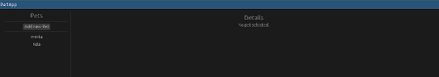
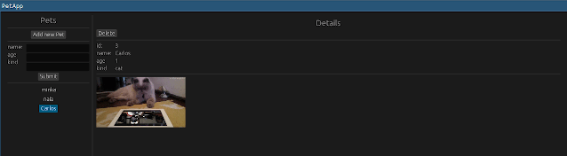

*This post was originally posted on the [LogRocket](https://blog.logrocket.com/building-cross-platform-gui-apps-rust-using-egui/) blog on 21.08.2024 and was cross-posted here by the author.*

Ever since the rise of Electron, which lead to a bit of a renaissance of cross-platform desktop applications using web-technology, the limitations of this approach became apparent. Slow start-up times, very high resource usage, and simply the limits of web-technology to build high-fidelity GUI applications continue to plague users of the many Electron-based applications to this day.

Electron made building cross-platform desktop apps a lot more approachable than approaches before it, but it certainly wasn’t the answer to everything. The problem of building rich, highly performant, robust cross-platform applications is still an unsolved one, and the promise of “build once, run anywhere” still hasn’t been manifested in any piece of technology currently available.

However, with the new gained interest in cross-platform desktop apps and improvements on the web platform along the lines of WebGL/WebGPU, as well as WebAssembly, many interesting projects spawned, which attempt to take the next steps in the quest of building a foundation for cross-platform GUI applications.

One of these projects, which is built using Rust, is [egui](https://www.egui.rs). In this article, we’ll see how we can build a simple, cross-platform GUI application with it.

We’re going to build a very simple pet management app, which will enable us to add and delete pets and which shows us a list and a detail view.

To make the whole thing a bite more interesting, we’ll use an `sqlite` database for data storage, and we’ll fetch a random image of a cat or dog whenever a pet detail page is opened.

But first, let’s learn a bit more about egui and why it’s interesting.

## egui / eframe

Egui is a Rust-based, immediate mode [GUI library/framework](https://blog.logrocket.com/state-rust-gui-libraries/) focused on ease of use, responsiveness, and portability.

But wait, what does “immediate mode” mean? Well, within the world of graphical user interfaces, there are two general ways to build applications — retained mode and immediate mode, with retained mode covering most of what you probably know when it comes to GUI frameworks (e.g. QT, or the DOM).

Immediate mode, which I found first mentioned in [this video](https://www.youtube.com/watch?v=Z1qyvQsjK5Y) by Casey Muratori in 2005, takes a different approach to retained mode UI, by simplifying the approach for interaction. 

Instead of adding callback handlers to elements, such as buttons, with the element being “retained” in the GUI application and only changed on-demand, in immediate-mode, every element on the screen is rendered on each frame, so any interaction is immediate.

This difference brings some trade-offs. For example, complex layouting is a lot harder in immediate-mode GUIs because you don’t have as much information on each frame. There are workarounds for this, but it’s easier in retained-mode GUI.

Generally, building and reasoning about immediate-mode GUIs is much simpler because interaction is more synchronous, which removes the problem of application state and what’s rendered on the screen being out of sync. This is a central problem in retained mode GUIs.

The most well known immediate mode GUI framework, which egui is also inspired by, is [Dear imgui](https://github.com/ocornut/imgui). The egui repository also has a [section on the trade offs](https://github.com/emilk/egui?tab=readme-ov-file#why-immediate-mode) when it comes to immediate mode GUIs, which I would definitely recommend you check out.

### Customization and Accessibility

An interesting aspect of `egui` is that `egui` is actually just a library for building a GUI, not a framework. But there is also a framework called `eframe`, which adds the surroundings to build an actual app. 

The library, `egui` can be integrated into different frameworks, such as game engines, which makes for nice reusability and modularity.

An important aspect of any GUI library or framework is the possibility of customization, and `egui` has got you covered there.

You can see on their fantastic [demo page](https://www.egui.rs/#Demo), which not only shows all the available widgets and some great demo apps, but also debugging tools and customization options applied on-the-fly, so feel free to play around with it before diving in deeper.

Egui also has [great docs](https://docs.rs/egui/latest/egui/index.html) and many, many examples, which are built to educate and show the capabilities of the library:

<center>
    <a href="images/img1.png" target="_blank"></a>
</center>

Another interesting aspect of egui is that it integrates [AccessKit](https://accesskit.dev/), a cross-platform framework for accessibility. 

Even though AccessKit, at the time of writing, doesn’t have a fully functioning implementation for the web, it looks like a very promising project to make implementing accessibility features for each platform a lot easier.

**[H3] Cross-platform and the** **w****eb**
As mentioned in the beginning, the goal of `egui` is to be a cross-platform GUI application library. Using [eframe_template](https://github.com/emilk/eframe_template), one is able to build applications for Linux, Mac, Windows, Android and the web using WebGL/WebGPU and WASM.

Support for the different platforms is still in a maturing phase, but for desktop it works stably already. Due to the approach when it comes to the web, there are some [limitations](https://github.com/emilk/egui/tree/master/crates/eframe#limitations-when-running-egui-on-the-web), so egui is certainly not a replacement for building any and all web applications, but it also doesn’t try to be or advertise itself as such.

However, when you look at the demo applications on the demo page, it’s quite impressive what’s already possible using egui even in its most limited environment.

In the example in this article, we’ll build a desktop-first app, which we won’t be able to compile to WASM because we use sqlite as a data storage.

However, with a few platform-dependent changes and `eframe_template`, we could use a different data storage when building for WASM, and we could make it work for the web as well, but this is out of the scope of this post.

Let’s start building our app!

## Setup

To follow along, all you need is a reasonably recent Rust installation, with 1.79 being the latest one at the time of this writing. 

First, create a new Rust project:

```bash
cargo new rust-egui-example
cd rust-egui-example
```

Next, edit the Cargo.toml file and add the dependencies you'll need:

```toml
[dependencies]
sqlite = "0.36.0"
anyhow = "1.0.82"
eframe = { version = "0.28.0", features = ["wgpu"] }
env_logger = "0.11.3"
log = "0.4.21"
ehttp = { version = "0.5.0", features = ["json"] }
serde = { version = "1.0.203", features = ["derive"] }
egui_extras = { version = "0.28.0", features = ["all_loaders"] }
image = { version = "0.25", features = ["jpeg", "png"] }
```

We add the `egui` and `eframe` dependencies, as well as `egui_extras`, which allow us to use image-loading functionality together with the `image` crate.

We also add `ehttp` for fetching the random animal images and `serde` for serialization and deserialization. Additionally, we need `sqlite` for our data storage, and we add `anyhow` for easier error handling and `env_logger` and `log` for logging capabilities.

And with that, we can start building our app!

## Data model

First, we’ll define our underlying data model. We’re building a pet management app, so we need a `Pet` type. We also decided to use `sqlite` for data storage, so we’ll need a setup for working with our data model using SQL:

```rust
#[derive(Debug, PartialEq, Clone)]
struct PetKind(String);

#[derive(Debug, PartialEq, Clone)]
struct Pet {
    id: i64,
    name: String,
    age: i64,
    kind: PetKind,
}
```

The `Pet` type is quite simple and consists of an `id`, `name`, `age` and `kind`. Of course, we could add many more interesting attributes, but we’ll keep it simple.

The next step is to create the table in our `sqlite` database:

```sql
CREATE TABLE IF NOT EXISTS pets (
    id INTEGER PRIMARY KEY,
    name TEXT NOT NULL,
    age INTEGER NOT NULL,
    kind TEXT NOT NULL
);

INSERT INTO pets (name, age, kind) VALUES ('minka', 9, 'cat');
INSERT INTO pets (name, age, kind) VALUES ('nala', 7, 'dog');
```

This is simply a mirror of our `Pet` type. We can also define the queries we’ll use for the operations we’ll need.

- Fetch a pet from the database by its id
- Fetch all pets from the database
- Insert a pet into the database
- Delete a pet from the database

```rust
const GET_PET_BY_ID: &str = "SELECT id, name, age, kind FROM pets where id = ?";
const DELETE_PET_BY_ID: &str = "DELETE FROM pets where id = ?";
const INSERT_PET: &str =
    "INSERT INTO pets (name, age, kind) VALUES (?, ?, ?) RETURNING id, name, age, kind";
const GET_PETS: &str = "SELECT id, name, age, kind FROM pets";
```

Now, all we have to do is to set up a connection to an `sqlite` database in our application and run the query within our initialization script above on startup.

In this case, we’ll use an `in-memory` version of `sqlite`, which makes testing easier. This means that the database will be reset every time the application is started, which is fine for testing, but would of course have to be changed if we were to build a production version of this app:

```rust
fn load_init_sql() -> std::io::Result<String> {
    fs::read_to_string("./init.sql")
}

fn main() -> Result<()> {
    env_logger::init();
    ...
    let init_query = load_init_sql().expect("can load init query");
    let db_con = sqlite::open(":memory:").expect("can create sqlite db");
    db_con
        .execute(init_query)
        .expect("can initialize sqlite db");
    ...
}
```

We load the database initialization script, open a connection to the in-memory `sqlite` database, and execute the script, initializing our database.

Next, let’s define helper functions for the above-mentioned data fetching and storage operations. Each of them will take the `db_con` but wrapped inside an `Arc<Mutex<>>`. The reason for that is that the `sqlite::Connection` on it’s own can’t be safely shared across threads, so we have to lock it and make sure all references to it are accounted for.

Why would we even want to share it across threads, though? Couldn’t we just use the connection and synchronously execute the queries whenever we need to on the main thread?

We could, but since this is supposed to be a highly interactive GUI application, blocking the main thread is not a great idea. If the user clicked a button, the UI would become unresponsive until all queries triggered by the button press finished.

This is not the behavior we’re aiming for, and so we’re going to build a simple event-passing system, which lets the main thread send events to a background thread, which will then do data fetching work asynchronously and notify the main thread when the data is available.

Let’s look at the data operations helpers. We’ll start with inserting new pets into the database:

```rust
fn insert_pet_to_db(db_con: Arc<Mutex<sqlite::Connection>>, pet: Pet) -> Result<Pet> {
    let con = db_con
        .lock()
        .map_err(|_| anyhow!("error while locking db connection"))?;
    let mut stmt = con.prepare(INSERT_PET)?;
    stmt.bind((1, pet.name.as_str()))?;
    stmt.bind((2, pet.age))?;
    stmt.bind((3, pet.kind.0.as_str()))?;

    if stmt.next()? == sqlite::State::Row {
        let id = stmt.read::<i64, _>(0)?;
        let name = stmt.read::<String, _>(1)?;
        let age = stmt.read::<i64, _>(2)?;
        let kind = stmt.read::<String, _>(3)?;

        return Ok(Pet {
            id,
            name,
            age,
            kind: PetKind(kind),
        });
    }

    Err(anyhow!("error while inserting pet"))
}
```

First, we need to acquire a lock to our shared database connection, so we’re sure that we’re the only ones using it. Then, we create a prepared statement with the above defined query and bind the incoming values to their respective counterparts in the query.

Then, we execute the query and create a new `Pet` from the returned row. If the operation fails, we propagate the error.

Let’s look at deleting a pet next:

```rust
fn delete_pet_from_db(db_con: Arc<Mutex<sqlite::Connection>>, pet_id: i64) -> Result<()> {
    let con = db_con
        .lock()
        .map_err(|_| anyhow!("error while locking db connection"))?;
    let mut stmt = con.prepare(DELETE_PET_BY_ID)?;
    stmt.bind((1, pet_id))?;

    if stmt.next()? == sqlite::State::Done {
        Ok(())
    } else {
        Err(anyhow!("error while deleting pet with id {}", pet_id))
    }
}
```

Deleting a pet is quite simple. We acquire a lock to our database connection and simply execute the deletion query, handling any occurring errors:

```rust
fn get_pet_from_db(db_con: Arc<Mutex<sqlite::Connection>>, pet_id: i64) -> Result<Option<Pet>> {
    let con = db_con
        .lock()
        .map_err(|_| anyhow!("error while locking db connection"))?;
    let mut stmt = con.prepare(GET_PET_BY_ID)?;
    stmt.bind((1, pet_id))?;

    if stmt.next()? == sqlite::State::Row {
        let id = stmt.read::<i64, _>(0)?;
        let name = stmt.read::<String, _>(1)?;
        let age = stmt.read::<i64, _>(2)?;
        let kind = stmt.read::<String, _>(3)?;

        return Ok(Some(Pet {
            id,
            name,
            age,
            kind: PetKind(kind),
        }));
    }
    Ok(None)
}


fn get_pets_from_db(db_con: Arc<Mutex<sqlite::Connection>>) -> Result<Vec<Pet>> {
    let con = db_con
        .lock()
        .map_err(|_| anyhow!("error while locking db connection"))?;
    let mut pets: Vec<Pet> = vec![];
    let mut stmt = con.prepare(GET_PETS)?;

    for row in stmt.iter() {
        let row = row?;
        let id = row.read::<i64, _>(0);
        let name = row.read::<&str, _>(1);
        let age = row.read::<i64, _>(2);
        let kind = row.read::<&str, _>(3);

        pets.push(Pet {
            id,
            name: name.to_owned(),
            age,
            kind: PetKind(kind.to_owned()),
        });
    }
    Ok(pets)
}
```

Fetching a single pet from the database and fetching all pets are quite similar. In both cases, we again acquire a lock to the database connection, prepare the statement using the query, execute the query, and build our output data from the data in the returned rows.

That’s it for our data model and data access!

We mentioned above that we want to fetch random images for cats and dogs to make the application feel a bit more alive, so let’s implement that part next.

## Fetching random images for cats and dogs

For fetching dog images, we’ll use https://dog.ceo/api/breeds/image/random and for cats we’ll use https://api.thecatapi.com/v1/images/search.

Both of these APIs let us do quite a few queries free of charge, which is nice for testing. If we do a couple test requests, we can see how the returned data looks like, and we can create a data model for the JSON responses of both APIs:

```rust
#[derive(Debug, Deserialize)]
struct CatJSON {
    #[serde(alias = "0")]
    item: CatJSONInner,
}

#[derive(Debug, Deserialize)]
struct CatJSONInner {
    url: String,
}

#[derive(Debug, Deserialize)]
struct DogJSON {
    message: String,
}
```

We use `serde::Deserialize` to be able to deserialize the returned JSON to our types. The next step is to use the `ehttp` crate to create an HTTP request to the respective APIs, parse the response, and handle the URLs we get:

```rust
fn fetch_pet_image(ctx: egui::Context, pet_kind: PetKind, sender: Sender<Event>) {
    let url = if pet_kind.0 == "dog" {
        "https://dog.ceo/api/breeds/image/random"
    } else {
        "https://api.thecatapi.com/v1/images/search"
    };
    ehttp::fetch(
        ehttp::Request::get(url),
        move |result: ehttp::Result<ehttp::Response>| {
            if let Ok(result) = result {
                let image_url = if pet_kind.0 == "dog" {
                    if let Ok(json) = result.json::<DogJSON>() {
                        Some(json.message)
                    } else {
                        None
                    }
                } else if let Ok(json) = result.json::<CatJSON>() {
                    Some(json.item.url)
                } else {
                    None
                };
                let _ = sender.send(Event::SetPetImage(image_url));
                ctx.request_repaint();
            }
        },
    );
}
```

If we look at the function signature, we see `egui::Context`, `PetKind`, and `Sender<Event>`. What are these, and what do we need them for?

We need `egui::Context` to request a repaint of the GUI, once we finish fetching our data. This is equivalent to letting the rendering thread know that we have new data, and it needs to re-render to display that data. Otherwise, if no interaction happened, it could be that the UI stays static to preserve battery life and doesn’t show the new data.

The `PetKind` is simply for checking, whether we are fetching an image for a cat or a dog, and the `Sender<Event>` is the sending part of a `std::sync::mpsc` channel, which enables us to send back data to the main rendering thread, which can then be received and handled from there.

We’ll take a look at how this event handling mechanism works in the next section.

## Event handling

As mentioned above, we need a way to asynchronously fetch data without blocking the main rendering thread. However, we also need a way to communicate between this background thread and the main thread. For this purpose, we’ll use two `std::sync::mpsc` channels — one for sending events to the background thread and for receiving them there, and one for sending back data to the main thread and receiving the data there:

```rust
fn main() -> Result<()> {
    ...
    let (background_event_sender, background_event_receiver) = channel::<Event>();
    let (event_sender, event_receiver) = channel::<Event>();
    ...
    std::thread::spawn(move || {
        while let Ok(event) = background_event_receiver.recv() {
            let sender = event_sender.clone();
            handle_events(event, sender);
        }
    });
    ...
}
```

In the `main` function, we create the two channels, each with their `Sender` and `Receiver` ends. 

Then, we spawn a new thread — our background thread — and within that, we wait for events on the `background_event_receiver` and for each event, handle the event, and send the data back to the main thread using `event_sender`, the `Sender` part of the main thread channel.

Next, we define the `Event` type, which is an enum that contains all the different event types we’re going to need within the application:

```rust
enum Event {
    SetPets(Vec<Pet>),
    GetPetImage(egui::Context, PetKind),
    SetPetImage(Option<String>),
    GetPetFromDB(egui::Context, Arc<Mutex<sqlite::Connection>>, i64),
    SetSelectedPet(Option<Pet>),
    InsertPetToDB(egui::Context, Arc<Mutex<sqlite::Connection>>, Pet),
    DeletePetFromDB(egui::Context, Arc<Mutex<sqlite::Connection>>, i64),
}
```

- SetPets — sets a new list of fetched pets in the AppState of the application
- GetPetImage — fetches a new random image for a given kind of pet
- SetPetImage — sets the fetched pet image in the AppState
- GetPetFromDB — fetches a pet with the given id (i64) from the database
- SetSelectedPet — sets the selected pet in the AppState of the application
- InsertPetToDB — adds a new pet to the database
- DeletePetFromDB — deletes a pet from the database

Then, we implement the `handle_events` function, which is called inside the background thread:

```rust
fn handle_events(event: Event, sender: Sender<Event>) {
    match event {
        Event::GetPetImage(ctx, pet_kind) => {
            fetch_pet_image(ctx, pet_kind, sender);
        }
        Event::GetPetFromDB(ctx, db_con, pet_id) => {
            if let Ok(Some(pet)) = get_pet_from_db(db_con, pet_id) {
                let _ = sender.send(Event::SetSelectedPet(Some(pet)));
                ctx.request_repaint();
            }
        }
        Event::DeletePetFromDB(ctx, db_con, pet_id) => {
            if delete_pet_from_db(db_con.clone(), pet_id).is_ok() {
                if let Ok(pets) = get_pets_from_db(db_con) {
                    let _ = sender.send(Event::SetPets(pets));
                    ctx.request_repaint();
                }
            }
        }
        Event::InsertPetToDB(ctx, db_con, pet) => {
            if let Ok(new_pet) = insert_pet_to_db(db_con.clone(), pet) {
                if let Ok(pets) = get_pets_from_db(db_con) {
                    let _ = sender.send(Event::SetPets(pets));
                    let _ = sender.send(Event::SetSelectedPet(Some(new_pet)));
                    ctx.request_repaint();
                }
            }
        }
        _ => (),
    }
}
```

We match on the incoming event, fetch the data, send the data back using the `Sender<Event>`, and call `ctx.request_repaint()` to trigger a new update on the rendering thread.

In the case of deleting a pet, we fetch a new list of pets from the database, so the change is reflected in the displayed list. For inserting a new pet, we do the same and also set the `selected_pet` in the AppState to the newly created pet, hence navigating to it on creation.

This is one half of the event handling logic, the one in the background thread. But there needs to be a counterpart in the rendering thread, which checks the channel for data sent from the background thread, which then gets applied to the AppState, which in turn leads to the GUI being updated.

This part is implemented in `handle_gui_events` within the `PetApp` type, which we’ll get to know in the next and final section:

```rust
    fn handle_gui_events(&mut self) {
        while let Ok(event) = self.event_receiver.try_recv() {
            match event {
                Event::SetPetImage(pet_image) => {
                    self.app_state.pet_image = pet_image;
                }
                Event::SetSelectedPet(pet) => self.app_state.selected_pet = pet,
                Event::SetPets(pets) => {
                    if let Some(ref selected_pet) = self.app_state.selected_pet {
                        if !pets.iter().any(|p| p.id == selected_pet.id) {
                            self.app_state.selected_pet = None;
                        }
                    }
                    self.app_state.pets = pets;
                }
                _ => (),
            };
        }
    }
```

Again, we iterate over all incoming events and match on them. For each event, we update the AppState. The most interesting implementation is in `SetPets`, where, if the previously selected pet is not part of the updated list anymore, we reset the selected pet. This is relevant since if we deleted a pet and did not do this, the detail view would still show the deleted pet.

OK, now we have the data model, the image fetching logic, and the event handling mechanism, and we can finally wire everything up and build our GUI.

## Building the GUI

The structure of the user interface is such that there is a list-panel on the left, which also holds the button to add a new pet, as well as a form to add new pets. Upon clicking on a pet in the list, the details of that pet and a random image for the pet are shown in the detail-panel on the right side of the UI.

In the end, it should look roughly like this:

<center>
    <a href="images/img2.png" target="_blank"></a>
</center>

Let’s start with the data types we need:

```rust
struct PetApp {
    app_state: AppState,
    background_event_sender: Sender<Event>,
    event_receiver: Receiver<Event>,
    db_con: Arc<Mutex<sqlite::Connection>>,
}

#[derive(Debug, Clone)]
struct AppState {
    selected_pet: Option<Pet>,
    pets: Vec<Pet>,
    pet_image: Option<String>,
    add_form: AddForm,
}

#[derive(Debug, Clone)]
struct AddForm {
    show: bool,
    name: String,
    age: String,
    kind: String,
}
```

We define the `PetApp`, which is the struct holding all the data for the application. It holds the `AppState`, which is a representation of the current application state, for example, which pets are listed, which one is selected etc., as well as the `AddForm` state, which represents the current state of the form for adding a new pet.

`PetApp` also contains the shared database connection, the sender end for the background thread, as well as the receiver end for the event channel for the rendering thread, so we can run the event handling mechanism we implemented above.

Next, we implement the `PetApp::new` method, so we can initialize our application:

```rust
impl PetApp {
    fn new(
        background_event_sender: Sender<Event>,
        event_receiver: Receiver<Event>,
        db_con: sqlite::Connection,
    ) -> Result<Box<Self>> {
        let db_con = Arc::new(Mutex::new(db_con));
        let pets = get_pets_from_db(db_con.clone())?;
        Ok(Box::new(Self {
            app_state: AppState {
                selected_pet: None,
                pets,
                pet_image: None,
                add_form: AddForm {
                    show: false,
                    name: String::default(),
                    age: String::default(),
                    kind: String::default(),
                },
            },
            background_event_sender,
            event_receiver,
            db_con,
        }))
    }
}
```

We wrap the incoming `sqlite::Connection` inside an `Arc<Mutex<>>` so we can safely share it across threads and fetch the initial list of pets, setting it in the AppState. The rest of the state is simply initialized to a safe default.

We return a `Result<Box<PetApp>>` since that is what `eframe` expects when creating a new native app, which we’ll look at next within `main`:

```rust
fn main() -> Result<()> {
    ...
    let options = eframe::NativeOptions {
        viewport: egui::ViewportBuilder::default()
            .with_always_on_top()
            .with_inner_size([640.0, 480.0]),
        ..Default::default()
    };
    ...
    eframe::run_native(
        "PetApp",
        options,
        Box::new(|context| {
            egui_extras::install_image_loaders(&context.egui_ctx);
            Ok(PetApp::new(
                background_event_sender,
                event_receiver,
                db_con,
            )?)
        }),
    )
    .map_err(|e| anyhow!("eframe error: {}", e))
}
```

We define some application options, such as the window size, and then use `eframe::run_native` to initialize our GUI application.

One thing to mention here are the [egui_extras loaders](https://docs.rs/egui_extras/latest/egui_extras/fn.install_image_loaders.html), which we install during application creation. These are helpers which make it easy to dynamically load images either from disk or from a URL within `egui`. This functionality can be customized, but the default is quite useful, showing a loading indicator while fetching the image and then displaying it.

Since we can only use types that implement the `eframe::App` trait within `eframe::run_native`, we’ll have to implement this trait.

The implementation consists only of the `update` function, which has the following signature:

```rust
fn update(&mut self, ctx: &eframe::egui::Context, _frame: &mut eframe::Frame)`
```

It takes a `Context` and a `Frame`, which we won’t need. But you probably can remember the `Context`, since that’s what we used earlier to trigger a repaint in the rendering thread. So anytime we call `context.request_repaint()`, this `update` function is called again:

```rust
impl eframe::App for PetApp {
    fn update(&mut self, ctx: &eframe::egui::Context, _frame: &mut eframe::Frame) {
        self.handle_gui_events();

        egui::CentralPanel::default().show(ctx, |ui| {
            egui::SidePanel::left("left panel")
                .resizable(false)
                .default_width(200.0)
                .show_inside(ui, |ui| {
```

We start the implementation of `update` by calling our `handle_gui_events` method, which we implemented above. This checks the receiving part of the channel for events and applies them, which ensures that we’ll have an up-to-date AppState going into our rendering phase.

As mentioned above, with egui being an immediate mode GUI framework, anything we define here gets rendered on every frame. So if we make a change here in the AppState due to an event being sent, it immediately gets displayed in the UI without us having to juggle and update any components.

Then, we define the overall `CentralPanel` and inside it start by rendering our left list-panel, which we’ll set to width `200.0` and not resizeable.

Within this panel, we’ll show the `Pets` heading, a separator, the `Add new Pet` button and, if the button was pressed, the form to add a new pet. Below it, another separator and the list of pets:

```rust
    ui.vertical_centered(|ui| {
        ui.heading("Pets");
        ui.separator();
        if ui.button("Add new Pet").clicked() {
            self.app_state.add_form.show = !self.app_state.add_form.show;
        }
        if self.app_state.add_form.show {
            ui.separator();

            ui.vertical_centered(|ui| {
                ui.horizontal(|ui| {
                    ui.vertical(|ui| {
                        ui.label("name:");
                        ui.label("age");
                        ui.label("kind");
                    });
                    ui.end_row();
                    ui.vertical(|ui| {
                        ui.text_edit_singleline(&mut self.app_state.add_form.name);
                        ui.text_edit_singleline(&mut self.app_state.add_form.age);
                        ui.text_edit_singleline(&mut self.app_state.add_form.kind);
                    });
                });

                if ui.button("Submit").clicked() {
                    let add_form = &mut self.app_state.add_form;
                    let age = add_form.age.parse::<i64>().unwrap_or(0);
                    let kind = match add_form.kind.as_str() {
                        "cat" => PetKind(String::from("cat")),
                        _ => PetKind(String::from("dog")),
                    };
                    let name = add_form.name.to_owned();
                    if !name.is_empty() && age > 0 {
                        let _ = self.background_event_sender.send(
                            Event::InsertPetToDB(
                                ctx.clone(),
                                self.db_con.clone(),
                                Pet {
                                    id: -1,
                                    name,
                                    age,
                                    kind: kind.clone(),
                                },
                            ),
                        );
                        let _ = self
                            .background_event_sender
                            .send(Event::GetPetImage(ctx.clone(), kind));
                        add_form.name = String::default();
                        add_form.age = String::default();
                        add_form.kind = String::default();
                    }
                }
            });
        }

        ui.separator();
        self.app_state.pets.iter().for_each(|pet| {
            if ui
                .selectable_value(
                    &mut self.app_state.selected_pet,
                    Some(pet.to_owned()),
                    pet.name.clone(),
                )
                .changed()
            {
                let _ = self.background_event_sender.send(Event::GetPetFromDB(
                    ctx.clone(),
                    self.db_con.clone(),
                    pet.id,
                ));
                let _ = self
                    .background_event_sender
                    .send(Event::GetPetImage(ctx.clone(), pet.kind.clone()));
            }
        });
    });
});
```

The way we handle interactions in immediate-mode GUIs is that elements, such as buttons, return their state. For example, if the button was clicked in a frame, the `clicked()` method returns true. This is very different from retained mode GUIs, where we’d attach an event-listener, which is then asynchronously called.

For state-based changes, we can simply use ifs, such as showing the form for adding pets only if the AppState flag for showing it is true and not even rendering it otherwise.

The form-rendering is rather simple, and upon clicking `Submit`, we do some very basic validation. If the data is fine, we trigger an event to inform the background thread to add a new pet to the database.

In a real implementation, we would of course add some error handling here, showing the user a nicely formatted error message if they insert an invalid value for the age, for example.

Below that, we simply iterate over the list of pets and render a select field for it. The handling if one of the pets is clicked is handled via the `changed()` method on `selectable_value`, which gives us the information that the value has changed and enables us to trigger an event to the background thread to fetch the data, update our AppState, and fetch a new image.

Composing the UI is also very intuitive within `egui`. We can next the different structuring elements arbitrarily, adding horizontal and vertical elements as needed. `egui` features a wide variety of different widgets, which you can check out in their [demos](https://www.egui.rs/#Demo). But as mentioned above, it’s also possible to build entirely custom widgets using their rendering API.

With our list panel in place, we can now implement our `details` panel. This part is a bit simpler because it’s not that interactive.

```rust
            egui::CentralPanel::default().show_inside(ui, |ui| {
                ui.vertical_centered(|ui| {
                    ui.heading("Details");
                    if let Some(pet) = &self.app_state.selected_pet {
                        ui.vertical(|ui| {
                            ui.horizontal(|ui| {
                                if ui.button("Delete").clicked() {
                                    let _ =
                                        self.background_event_sender.send(Event::DeletePetFromDB(
                                            ctx.clone(),
                                            self.db_con.clone(),
                                            pet.id,
                                        ));
                                }
                            });
                            ui.separator();
                            ui.vertical(|ui| {
                                ui.horizontal(|ui| {
                                    ui.vertical(|ui| {
                                        ui.label("id:");
                                        ui.label("name:");
                                        ui.label("age");
                                        ui.label("kind");
                                    });
                                    ui.end_row();
                                    ui.vertical(|ui| {
                                        ui.label(pet.id.to_string());
                                        ui.label(&pet.name);
                                        ui.label(pet.age.to_string());
                                        ui.label(&pet.kind.0);
                                    });
                                });
                                ui.separator();
                                if let Some(ref pet_image) = self.app_state.pet_image {
                                    ui.add(egui::Image::from_uri(pet_image).max_width(200.0));
                                }
                            });
                        });
                    } else {
                        ui.label("No pet selected.");
                    }
                });
            });
        });
    }
}
```

We render the `Details` heading and the `delete` button. If the button is clicked, we send the deletion event to the background thread. Then we simply render the details of the pet and finally use `egui::image::from_uri`, which uses the above mentioned `egui_extras` to fetch the image from the given URL, showing a loading indicator in the meantime.

If no pet is selected, we simply show a label indicating this.

That’s it for building the UI. Pretty simple, right? 

One can imagine building a complex, nested application with these primitives, structuring different parts in different modules and putting it together at the edges of interactivity in the user flow.

This way of rendering makes `egui` a breeze to work with and to get started with.

Let’s see if what we implemented actually works.

## Testing

We can run the app using `RUST_LOG=info cargo run`, which will open a GUI that looks like this:

<center>
    <a href="images/img3.png" target="_blank"></a>
</center>

We can select one of the pets in the initial state, and its details will be shown on the right. You will also see a short loading indicator where a random image of a cat will appear after a short while. This is the default behavior of the above mentioned image loading functionality within `egui_extras`:

<center>
    <a href="images/img4.png" target="_blank"></a>
</center>


The same works for the dog in the initial state where we fetch a random dog image from a different site:

<center>
    <a href="images/img5.png" target="_blank"></a>
</center>

Next, we can try to add a new pet to the list using the button, and the form it shows on click in the navigation panel on the left:

<center>
    <a href="images/img6.png" target="_blank"></a>
</center>

And once we hit `Submit`, the form is reset, and a new pet is added to the list and navigated to:

<center>
    <a href="images/img7.png" target="_blank"></a>
</center>

Nice, it works! 

We could use `Context::set_style` as mentioned in the beginning to fully customize the application in terms of fonts, colors, and the like, but in my opinion, even the default style looks quite nice, especially when we’re just aiming to build an example app.

You can find the full code for this example on [GitHub](https://github.com/zupzup/rust-egui-example).

## Conclusion

In this article, we took a look at how to build efficient cross-platform immediate-mode GUI applications using egui and eframe in Rust.

Even though egui is a comparatively new library for building GUIs, the ecosystem around it is great and it’s maturing very quickly. Getting started is a breeze because of the good docs and the ample demo applications, each of which you can check out the source code and learn from.

At this point, if I were to build a GUI application using Rust, egui would be my first choice to do so.
