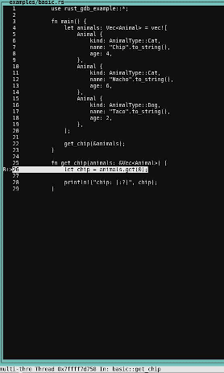
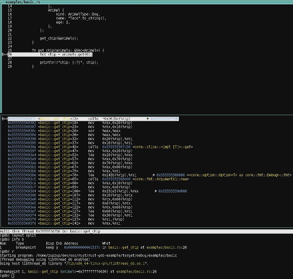

*This post was originally posted on the [LogRocket](https://blog.logrocket.com/debugging-rust-apps-with-gdb/) blog on 09.02.2021 and was cross-posted here by the author.*

Depending on your previous exposure to programming languages and ecosystems, debugging can either be something you never do or an absolute fixture of your development process.

For example, in the [Java](https://www.java.com/en/) ([Kotlin](https://kotlinlang.org/) and other JVM-based tech) ecosystem, due to it’s long history of sophisticated tooling, many people (including myself) rely on a debugger in their normal development cycle. In many dynamically typed languages, this workflow isn’t widely adopted.

These are generalizations, of course. Just about every programming language has some debugging mechanism, but whether or not developers use debuggers seems to depend on the quality and usability of the tooling, as well as on the tasks they’re working on.

In any case, having a good story for debugging is a crucial part of the development process. In this Rust GDB tutorial, we ‘ll show you how to debug Rust applications using one of the best Rust debugging tools available: the [GNU Project Debugger (GDB)](https://www.gnu.org/software/gdb/).

## What is GDB?

The GNU Project Debugger (GDB) is a very old program written by [Richard Stallman](https://stallman.org/), the self-proclaimed “Chief GNUisance of the GNU Project,” in 1986. GDB has support for several languages, such as C/C++, but also modern languages such as [Go and Rust](https://blog.logrocket.com/when-to-use-rust-and-when-to-use-golang/).

GDB is a command-line application, but there are many GUI frontends and IDE integrations available for it. One modern, browser-based implementation is [gdbgui](https://www.gdbgui.com/), for example. In this tutorial, we’ll stick to the command-line interface because it runs everywhere, doesn’t need external dependencies, and is simple enough to use for what we’re trying to accomplish.

GDB runs on Linux, MacOS, and Windows and comes preinstalled on most common Linux distros. You can check out the [GDB](https://www.gnu.org/software/gdb/documentation/) [documentation](https://www.gnu.org/software/gdb/documentation/) for your platform’s installation instructions.

GDB is wildly complex and powerful, so we won’t go into the nitty-gritty of GDB in this tutorial. We’ll stick to basic functionality, such as setting breakpoints, running a program, stepping through it, printing variables, etc.

## Setting up GDB in Rust

To follow along, all you’ll need a reasonably recent Rust installation (1.39+) and a recent installation of GDB (8.x+). A tool to send TCP packets such as `netcat` might be useful as well.

Also, make sure there is a `rust-gdb` executable in the same folder as your `rustc` executable. If you install and update Rust using [Rustup](https://rustup.rs/), this should be the case by default.

First, create a new Rust project:

```bash
    cargo new rust-gdb-example
    cd rust-gdb-example
```

Next, edit the `Cargo.toml` file and add the dependencies you'll need.

```toml
    [dependencies]
    tokio = { version = "1.1", features=["full"] }
```

In this case, we only add Tokio as a dependency, since we’ll build a very basic asynchronous TCP example to show that we can debug async functions the same way as “normal” ones.

Add the following code to `src/lib.rs`:

```rust
    #[derive(Clone, Debug)]
    pub enum AnimalType {
        Cat,
        Dog,
    }
    
    #[derive(Clone, Debug)]
    pub struct Animal {
        pub kind: AnimalType,
        pub name: String,
        pub age: usize,
    }
    
    #[derive(Clone, Debug)]
    pub struct Person {
        pub name: String,
        pub pets: Vec<Animal>,
        pub age: usize,
    }
```

These are just some base types we’ll use in our example programs for debugging.

## What is `rust-gdb`?

[rust-gdb](https://github.com/rust-lang/rust/blob/master/src/etc/rust-gdb) is a prebuilt binary that comes with the Rust installation (using Rustup, for example) and is installed automatically.

Basically, `rust-gdb` is a wrapper that loads external Python pretty-printing scripts into GDB. This is useful (and somewhat necessary) when debugging more complex Rust programs because it significantly improves the display of Rust data types.

For example, a `Vec<Animal>` looks like this with pretty-printing:

```bash
    Vec(size=3) = {rust_gdb_example::Animal {kind: rust_gdb_example::AnimalType::Cat, name: "Chip", age: 4}, rust_gdb_example::Animal {kind: rust_gdb_example::AnimalType::Cat, name: "Nacho", age: 6}, rust_gdb_example::Animal {kind: rust_gdb_example::AnimalType::Dog, name: "Taco", age: 2}}
```

It looks like this without:

```bash
    alloc::vec::Vec<rust_gdb_example::Animal> {buf: alloc::raw_vec::RawVec<rust_gdb_example::Animal, alloc::alloc::Global> {ptr: core::ptr::unique::Unique<rust_gdb_example::Animal> {pointer: 0x5555555a1480, _marker: core::marker::PhantomData<rust_gdb_example::Animal>}, cap: 3, alloc: alloc::alloc::Global}, len: 3}
```

The pretty-printing scripts provide formatting for most widely used Rust constructs, such as `Vec`, `Option`, `Result`, etc., hiding their internals and showing the actual Rust types — which is what we’ll be interested in most of the time.

This is also one of the clear limitations of debugging approaches when it comes to Rust at this time. If you have complex, nested data types, you’l need some knowledge of their internals, or some kind of dark magic to properly inspect values. This situation will improve over time, but as it currently stands, you’ll run into issues if you debug complex, real-world software with this approach.

With the setup out of the way, let’s start with an example program and fire up `rust-gdb` with it.

## `rust-gdb` example

Let’s start with a basic example of how to use GDB with Rust. 

Create an `examples` folder in your project and add a `basic.rs` file with the following content:

```rust
    use rust_gdb_example::*;
    
    fn main() {
        let animals: Vec<Animal> = vec![
            Animal {
                kind: AnimalType::Cat,
                name: "Chip".to_string(),
                age: 4,
            },
            Animal {
                kind: AnimalType::Cat,
                name: "Nacho".to_string(),
                age: 6,
            },
            Animal {
                kind: AnimalType::Dog,
                name: "Taco".to_string(),
                age: 2,
            },
        ];
    
        get_chip(&animals);
    }
    
    fn get_chip(animals: &Vec<Animal>) {
        let chip = animals.get(0);
    
        println!("chip: {:?}", chip);
    }
```

This very simple program initializes a list of animals and calls a function at the end to print the first animal in the list.

To debug this, we need to build it and then run `rust-gdb` with the binary. Make sure you build this with debug mode and NOT in release mode.

```bash
    cargo build --example basic
    Finished dev [unoptimized + debuginfo] target(s) in 0.28s
    
    rust-gdb target/debug/examples/basic
```

If we’re not building examples but a binary instead, the binary will be in `target/debug`.

Upon running `rust-gdb`, we’re greeted by GDB with a few lines of welcome message and an input prompt `(gdb)`.

If you never worked with GDB before, this [GDB cheat sheet](https://darkdust.net/files/GDB%20Cheat%20Sheet.pdf) might be helpful.

Let’s set a breakpoint, which we can do by using the `break` command or simply using `b`:

```bash
    (gdb) b get_chip
    Breakpoint 1 at 0x13e3c: file examples/basic.rs, line 26.
    (gdb) info b
    Num     Type           Disp Enb Address            What
    1       breakpoint     keep y   0x0000000000013e3c in basic::get_chip at examples/basic.rs:26
```

We can set breakpoints at lines (e.g., `basic.rs:17`), or by providing a function to break at. We can look at the breakpoints using `info b`, which shows us where the breakpoint is located, its number (in case we want to delete, disable, or enable it), and whether it’s enabled (`Enb`).

The `info` command can be used with other flags, such as `info locals`, which shows local variables, `info args`, which displays incoming function arguments, and many more options.

Now that we set up our breakpoint, we can run the program by executing `run`, or simply `r`:

```bash
    (gdb) r
    Starting program: /home/zupzup/dev/oss/rust/rust-gdb-example/target/debug/examples/basic
    [Thread debugging using libthread_db enabled]
    Using host libthread_db library "/lib/x86_64-linux-gnu/libthread_db.so.1".
    
    Breakpoint 1, basic::get_chip (animals=0x7fffffffd760) at examples/basic.rs:26
    26            let chip = animals.get(0);
```

This starts the program. We stop at the defined breakpoint, at the first line of the `get_chip` function. Here, we can look at the arguments to the function and try to print them:

```bash
    (gdb) info args
    animals = 0x7fffffffd760
    (gdb) p animals
    $1 = (*mut alloc::vec::Vec<rust_gdb_example::Animal>) 0x7fffffffd760
    (gdb) p *animals
    $2 = Vec(size=3) = {rust_gdb_example::Animal {kind: rust_gdb_example::AnimalType::Cat, name: "Chip", age: 4}, rust_gdb_example::Animal {kind: rust_gdb_example::AnimalType::Cat, name: "Nacho", age: 6}, rust_gdb_example::Animal {kind: rust_gdb_example::AnimalType::Dog, name: "Taco", age: 2}}
```

The `info args` command provides an overview of the incoming arguments. When we print animals using `p` (`print` also works), GDB tells us that we’re dealing with a pointer to a `Vec<Animal>`, but doesn’t show us any relevant info on the contents of said `Vec` since it’s just a pointer. 

You can also use `display` to print a variable, and there are formatting options (such as string, pointer, integer etc.) as well. The difference between `print` and `display` is that, with `display`, the value is printed after every stepping instruction again. This is useful for monitoring changes on a value.

We need to dereference the pointer using `*animals`. If we print that, we get a full, readable listing of our animal list. Basic pointer juggling and type casts are some of the things you’ll need here and there with references to structs.

OK, where were we? Let’s execute `f`, or `frame` to see where we’re at:

```bash
    (gdb) f
    #0  basic::get_chip (animals=0x7fffffffd760) at examples/basic.rs:26
    26            let chip = animals.get(0);
```

Right, at our first breakpoint. If only there were a way to graphically see where we are in our source code…

## Layouts and inspecting state

`layouts` in GDB help you see where you are in your Rust source code. Using the `layout src` command opens a command-line interface:

<center>
    <a href="images/img1.png" target="_blank"></a>
</center>

Our command prompt stays right below it. This way, we’ll never be confused about where we are. There are also other layouts, such as `layout split`, which shows the source and the corresponding assembly:

<center>
    <a href="images/img2.png" target="_blank"></a>
</center>

Neat. If you want to get rid of the layout, you can use `CTRL+X a`. If the rendering gets messed up, `CTRL+L` will refresh it (this happens sometimes).

As with other debuggers, we can step through the code using `n` or `next`, or step into functions on the line we’re at using `s`, or `step`. If you want to repeat this, you can simply press enter and the previous command will be repeated.

Let’s step one line further and see what’s inside our `chip` variable after calling `.get` on the animals `Vec`:

```bash
    (gdb) n
    28            println!("chip: {:?}", chip);
    (gdb) p chip
    $3 = core::option::Option<&rust_gdb_example::Animal>::Some(0x5555555a1480)
    (gdb) print *(0x5555555a1480 as &rust_gdb_example::Animal)
    $4 = rust_gdb_example::Animal {kind: rust_gdb_example::AnimalType::Cat, name: "Chip", age: 4}
```

We execute `n` and we’re on the next line (28). Here, we try to print `chip`, and we see it’s an `Option` with a reference to an `Animal` inside. Unfortunately, GDB only shows us the address again; we need to cast the address to an `&rust_gdb_example::Animal` to see the actual values of the animal.

One nice thing is that most of these things autocomplete. So if you start typing `rust_gd`, pressing `TAB` will autocomplete it. Same with the `AnimalType` and other types, functions, and variables in scope.

We can also print function definitions:

```bash
    (gdb) p get_chip
    $11 = {fn (*mut alloc::vec::Vec<rust_gdb_example::Animal>)} 0x555555569370 <basic::get_chip>
```

If we want to get to the end of this function and one step upward to the calling site, we can use `finish`. And if we’re done with our current break point, we can use `continue` or `c` to continue execution of the program — which, in this case, will simply run the program to its end:

```bash
    (gdb) finish
    Run till exit from #0  basic::get_chip (animals=0x7fffffffd760) at examples/basic.rs:28
    chip: Some(Animal { kind: Cat, name: "Chip", age: 4 })
    0x0000555555567d87 in basic::main () at examples/basic.rs:22
    22            get_chip(&animals);
    (gdb) c
    Continuing.
    [Inferior 1 (process 61203) exited normally]
```

Very nice. These are the essentials you need to debug Rust programs. Let’s look at another example and explore some more advanced techniques.

## Manipulating state and watchpoints

First, let’s create another example within the `examples` folder within the `nested.rs` file:

```rust
    use rust_gdb_example::*;
    
    fn main() {
        let animals: Vec<Animal> = vec![
            Animal {
                kind: AnimalType::Cat,
                name: "Chip".to_string(),
                age: 4,
            },
            Animal {
                kind: AnimalType::Cat,
                name: "Nacho".to_string(),
                age: 6,
            },
            Animal {
                kind: AnimalType::Dog,
                name: "Taco".to_string(),
                age: 2,
            },
        ];
    
        let mut some_person = Person {
            name: "Some".to_string(),
            pets: animals,
            age: 24,
        };
        println!("person: {:?}", some_person);
        some_person.age = 100;
        some_person.name = some_func(&some_person.name);
    }
    
    fn some_func(name: &str) -> String {
        name.chars().rev().collect()
    }
```

Again, we’re creating an animal list. But this time, we also create a `Person` and set the animals as their pets. Also, we print the person, set their age to `100` and reverse their name (that’s what some_func does).

Before we can debug this program, we need to build it again and start `rust-gdb` with the binary:

```bash
    cargo build --example nested
    rust-gdb target/debug/examples/nested
```

Great. Let’s set breakpoints at line 22 and line 27 and run the program:

```bash
    (gdb) b nested.rs:22
    Breakpoint 1 at 0x17abf: file examples/nested.rs, line 22.
    (gdb) b nested.rs:27
    Breakpoint 2 at 0x17b13: file examples/nested.rs, line 27.
    (gdb) info b
    Num     Type           Disp Enb Address            What
    1       breakpoint     keep y   0x0000000000017abf in nested::main at examples/nested.rs:22
    2       breakpoint     keep y   0x0000000000017b13 in nested::main at examples/nested.rs:27
    (gdb) r
    Starting program: /home/zupzup/dev/oss/rust/rust-gdb-example/target/debug/examples/nested
    [Thread debugging using libthread_db enabled]
    Using host libthread_db library "/lib/x86_64-linux-gnu/libthread_db.so.1".
    
    Breakpoint 1, nested::main () at examples/nested.rs:22
    22            let mut some_person = Person {
```

We’re at the first breakpoint, where the person is created. Let’s continue to the print statement. Then, we’ll set a so called watchpoint on `some_person.age`. This watchpoint will notify us every time `some_person.age` changes:

```bash
    (gdb) c
    (gdb) watch some_person.age
    Hardware watchpoint 3: some_person.age
    (gdb) n
    person: Person { name: "Some", pets: [Animal { kind: Cat, name: "Chip", age: 4 }, Animal { kind: Cat, name: "Nacho", age: 6 }, Animal { kind: Dog, name: "Taco", age: 2 }], age: 24 }
    28            some_person.age = 100;
    (gdb) n
    
    Hardware watchpoint 3: some_person.age
    
    Old value = 24
    New value = 100
    0x000055555556bba8 in nested::main () at examples/nested.rs:28
    28            some_person.age = 100;
```

GDB shows us which watchpoint was triggered as well as the old and new value.

Let’s rerun the program by calling `run` again and confirming we want to rerun. This time, when we’re at the second breakpoint, let’s change the value manually using `set`:

```bash
    (gdb) set some_person.age = 22
    (gdb) p some_person
    $1 = rust_gdb_example::Person {name: "Some", pets: Vec(size=3) = {rust_gdb_example::Animal {kind: rust_gdb_example::AnimalType::Cat, name: "Chip", age: 4}, rust_gdb_example::Animal {kind: rust_gdb_example::AnimalType::Cat, name: "Nacho", age: 6},
        rust_gdb_example::Animal {kind: rust_gdb_example::AnimalType::Dog, name: "Taco", age: 2}}, age: 22}
```

As you can see, we can use `set ..args` to manipulate the state of our variables. This works very well with primitives but gets more tricky with complex values, such as [Rust standard library](https://doc.rust-lang.org/std/), or external crates types. This is another drawback, but it will hopefully improve in the future.

Another nice feature we can try is to execute functions and see what they return:

```bash
    (gdb) p some_func("Hello")
    $3 = "olleH"
    (gdb) p some_func("Debug")
    $4 = "gubeD"
    (gdb) p some_func(some_person.name)
    $5 = "emoS"
    (gdb) set some_person.name = some_func(some_person.name)
    (gdb) p some_person
    $6 = rust_gdb_example::Person {name: "emoS", pets: Vec(size=3) = {rust_gdb_example::Animal {kind: rust_gdb_example::AnimalType::Cat, name: "Chip", age: 4}, rust_gdb_example::Animal {kind: rust_gdb_example::AnimalType::Cat, name: "Nacho", age: 6},
        rust_gdb_example::Animal {kind: rust_gdb_example::AnimalType::Dog, name: "Taco", age: 2}}, age: 22}
```

We can call the `some_func` function, which is in scope, with a literal string. We can also call it with our `some_person.name` and we can use `set` to set the person’s name to the reversed value.

This is quite powerful and lets you inspect the result of expressions and functions at debug time, which can be helpful to find issues. This, again, will work nicely for simple cases, but if you’re, for example, trying to execute a function that does I/O or other, more complex things, you might run into barriers. But for 99 percent of cases, the existing functionality here works fine.

Speaking I/O, let’s look at one final example: how to debug an [async network application in Rust](https://blog.logrocket.com/asynchronous-i-o-and-async-await-packages-in-rust/) using GDB.

## Debugging an async network application

Last, but not least, we will attempt to debug an asynchronous network application, running on the Tokio async runtime.

Let’s create `tokio.rs` in the `examples` folder:

```rust
    use std::io;
    use tokio::io::AsyncWriteExt;
    use tokio::net::{TcpListener, TcpStream};
    
    #[tokio::main]
    async fn main() -> io::Result<()> {
        let listener = TcpListener::bind("127.0.0.1:8080").await?;
        println!("Accepting TCP on port 8080");
    
        loop {
            let (socket, _) = listener.accept().await?;
            tokio::spawn(async move { process(socket).await });
        }
    }
    
    async fn process(mut socket: TcpStream) {
        socket
            .write_all(b"Hello")
            .await
            .expect("can write to socket");
    }
```

This very simple program starts a TCP listener on local port `8080` and, for each incoming connection, asynchronously calls the `process` function, which handles the request.

The `process` function simply writes back `Hello`, which makes this the most simple “network application” possible.

However, complexity is not what we’re looking for here. Rather, we’re trying to determine whether the workflow of using GDB changes when we debug async programs, such as a web server.

Let’s compile the example and fire up `rust-gdb` with the resulting binary:

```bash
    cargo build --example tokio
    rust-gdb target/debug/examples/tokio
```

So far, so good.

Let’s set a breakpoint at the beginning of the `process` function at line 17:

```bash
    (gdb) b tokio.rs:17
    (gdb) info b
    Num     Type           Disp Enb Address            What
    1       breakpoint     keep y   <MULTIPLE>
    1.1                         y   0x000000000009aa87 in tokio::process::{{closure}} at examples/tokio.rs:17
    1.2                         y   0x00000000000a57fa in tokio::process at examples/tokio.rs:17
```

Interesting, the breakpoint is split up into `1.1` and `1.2`. These are called locations in GDB. This can happen due to optimizations, such as inlining, for example, where GDB will add a breakpoint at every point where the function is inlined or templated. I assume this is due to the `tokio::main` macro, which wraps all the code within the Tokio runtime.

We can disable either location if we want, but it doesn’t matter in this case. Let’s run the program:

```bash
    (gdb) r
    Starting program: /home/zupzup/dev/oss/rust/rust-gdb-example/target/debug/examples/tokio
    [Thread debugging using libthread_db enabled]
    Using host libthread_db library "/lib/x86_64-linux-gnu/libthread_db.so.1".
    [New Thread 0x7ffff7c1e700 (LWP 55035)]
    [New Thread 0x7ffff7a1d700 (LWP 55036)]
    [New Thread 0x7ffff781c700 (LWP 55037)]
    [New Thread 0x7ffff761b700 (LWP 55038)]
    [New Thread 0x7ffff741a700 (LWP 55039)]
    [New Thread 0x7ffff7219700 (LWP 55040)]
    [New Thread 0x7ffff7018700 (LWP 55041)]
    [New Thread 0x7ffff6e17700 (LWP 55042)]
    Accepting TCP on port 8080
```

Our listener is up and running and we can even see the threads the Tokio runtime spawned in the background.

Let’s send some data to the endpoint from another terminal session using `netcat`:

```bash
    nc 127.0.0.1 8080
```

This triggers our breakpoint in `process`:

```bash
    [Switching to Thread 0x7ffff6e17700 (LWP 55041)]
    
    Thread 9 "tokio-runtime-w" hit Breakpoint 1, tokio::process::{{closure}} () at examples/tokio.rs:18
    18            socket
    
    (gdb) p socket
    $4 = tokio::net::tcp::stream::TcpStream {io: tokio::io::poll_evented::PollEvented<mio::net::tcp::stream::TcpStream> {io: core::option::Option<mio::net::tcp::stream::TcpStream>::Some(mio::net::tcp::stream::TcpStream {inner: mio::io_source::IoSource<std::net::tcp::TcpStream> {state: mio::sys::unix::IoSourceState, inner: std::net::tcp::TcpStream (std::sys_common::net::TcpStream {inner: std::sys::unix::net::Socket (std::sys::unix::fd::FileDesc {fd: 11})}), selector_id: mio::io_source::SelectorId {id: core::sync::atomic::AtomicUsize {v: core::cell::UnsafeCell<usize> {value: 1}}}}}), registration: tokio::io::driver::registration::Registration {handle: tokio::io::driver::Handle {inner: alloc::sync::Weak<tokio::io::driver::Inner> {ptr: core::ptr::non_null::NonNull<alloc::sync::ArcInner<tokio::io::driver::Inner>> {pointer: 0x55555573a560}}}, shared: tokio::util::slab::Ref<tokio::io::driver::scheduled_io::ScheduledIo> {value: 0x55555573ec20}}}}
    
    (gdb) c
```

When the breakpoint is triggered, GDB notifies us that this happened in one of the runtime’s spawned threads and that we have the `socket` variable, which we can inspect.

The `socket` is a Tokio TCPStream, but we can’t really say much just from printing it. There is a file descriptor with the number `11` in there, which is the open network connection, but the rest seems to be Tokio and mio internals.

In any case, it worked — we successfully set a breakpoint in an async handler running in one of many threads. That means the same approach will work just as well if we have, for example, an Actix or warp web server running, setting a breakpoint in one of the handler functions, to inspect the incoming HTTP request data.

Here is the `Hello` response in our second terminal after we use `c` to continue execution:

```bash
    nc 127.0.0.1 8080
    Hello
```

That concludes our journey into debugging Rust applications using GDB.

You can find the full example code on [GitHub](https://github.com/zupzup/rust-gdb-example).

## Conclusion

In this Rust debugging tutorial, we demonstrated how to debug a Rust application with GDB. For the most part, it works very well, especially with the `rust-gdb` pretty-printing extensions, if all you’re doing is stepping through a program with breakpoints and inspecting the program’s state.

When it comes to more complex functionality you might be used to from sophisticated GUI debuggers in other languages, this is an area of active development and I fully expect the debugging ecosystem in Rust to improve. How long this will take and how good the overall debugging experience will get, compared to the best-in-class debuggers in the Java and C/C++ world, is difficult to say and will depend on the demand for such tooling within Rust.

The goal of this tutorial was to give you the tools to perform basic debugging of your Rust programs with minimal extra tooling or knowledge necessary. This background should cover the majority of cases you’ll run into, especially when getting into Rust.

