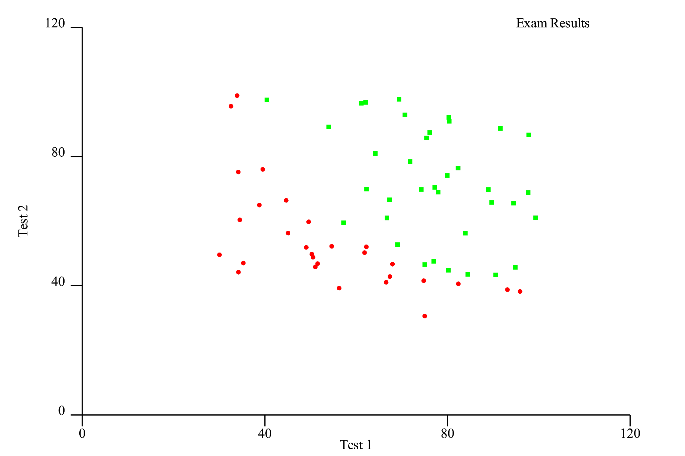

*This post was originally posted on the [LogRocket](https://blog.logrocket.com/machine-learning-in-rust-using-linfa/) blog on 30.04.2021 and was cross-posted here by the author.*

Machine learning is such an interesting topic. When it comes to machine learning in Rust, I’ve dipped my toes in before and the topic continues to fascinate me.

Whenever I’m learning a new programming language, after a while, I’ll ask myself, “Can I do machine learning with this?” Of course, you can “do machine learning” with any programming language. So the question is, rather, how well does it work?

In this tutorial, we’ll show you how to create a basic machine learning application in Rust using Linfa.

## Is Rust good for machine learning?

In the machine learning space, languages such as Python, R, and, recently, Julia, reign supreme because they have really good libraries, tools and frameworks that do much of the heavy lifting associated with data science. The performance-critical part is usually handled by low-level BLAS/Lapack libraries anyway, so the overhead of a dynamic language isn’t as painful in this area as it might be in, say, [game programming](https://blog.logrocket.com/first-game-in-webassembly/).

What’s the status quo regarding machine learning in Rust? You can check out [Are we learning yet?](https://www.arewelearningyet.com/) for a continuous progress update on the Rust machine learning ecosystem. At the time of writing, the community is active and progressing quickly. However, if you plan to do more than experiment with machine learning in Rust, you should expect to have to build some things yourself given the immaturity of the ecosystem.

That said, there are already some great low-level libraries and toolkits available, including the [Linfa](https://rust-ml.github.io/linfa/) [t](https://rust-ml.github.io/linfa/)[oolkit](https://rust-ml.github.io/linfa/).

## What is Linfa?

Linfa is a higher-level meta-crate that includes common helpers for data processing and [algorithms for many areas of machine learning](https://github.com/rust-ml/linfa#current-state), including:

* Linear regression
* Data clustering
* Kernel methods
* Logistic regression
* Bayes
* SVMs

From what I can tell, the toolkit is well-documented and has an intuitive API. The ambitious goal of the project is to get close to scikit’s breadth of functionality. If they continue as they have in the last year, I can see that happening.

In a [previous experiment](https://zupzup.org/ml-in-go-logreg/), I attempted to build a small classifier in Go that used logistic regression to classify students’ exam results and their chances of being accepted into school. For this tutorial, we’ll attempt to build something similar using Rust and Linfa.

We’ll start by loading and plotting the data to get a feel for it. Then, we’ll train logistic regression models with various parameters and select the one that executes best on the test set.

## What is logistic regression?

Because our focus is on how to approach machine learning problems using Rust, we won’t get too deep in the weeds on exactly how logistic regression works. However, we should establish at least a basic understanding of what it means. 

Logistic regression is a statistical model for measuring the probability of an outcome, such as true/false, accepted/denied, etc., that can be extended to multiple such classes as well.

Inside, the model uses a logistic function (S-curve). Logistic regression is the process of finding the parameters that fit a given dataset in the best way. Put simply, it models the probability of the random variable we’re interested in (0 or 1) in our data.

In machine learning, finding the optimal model is often done using [gradient descent](https://en.wikipedia.org/wiki/Gradient_descent), an optimization for finding local minima. The goal is usually to calculate an error and then minimize that error.

There are plenty of very good resources out there to learn more about logistic regression and machine learning algorithms in general. If you’re interested in diving deeper, [Awesome Machine Learning](https://github.com/josephmisiti/awesome-machine-learning) is a great starting point for learning resources, frameworks, libraries, and more.

## Building a simple machine learning app in Rust

The goal of this tutorial is to demonstrate one of many ways to build a simple machine learning application in Rust. Since we’re not aiming to get any insights out of real data, we’ll use a very small dataset containing only 100 records.

We’ll also skip the preparation of data for doing machine learning, which might include pre-processing steps such as outlier elimination, normalization, data cleanup etc. This is a very important part of data science, but it’s simply not in scope for this tutorial.

The actual data we’ll use in our example looks like this:

```bash
    32.72283304060323,43.30717306430063,0
    64.0393204150601,78.03168802018232,1
```

In the first column, we have a student’s score on the first exam and, in the second, the result of a second exam. These are our `features`. The third column, our so-called `target`, denotes whether the student was accepted into the school with these results. A `1` means accepted and a `0` means they were denied.

Our objective is to train a model that can reliably predict based on two test scores whether a student will be accepted into school. The data set is split into 65 lines of training data, which we’ll use to train the model, and 35 lines of test data, which we’ll then use to validate the trained model. Finally, we’ll determine whether our model performs well on data it hasn’t seen yet.

You can access the training and test data files as CSV on [GitHub](https://github.com/zupzup/rust-ml-example/tree/main/data).

## Setup

To follow along, all you need is a [recent Rust installation](https://blog.rust-lang.org/2021/03/25/Rust-1.51.0.html) (1.51 at the time of writing).

First, create a new Rust project:

```bash
    cargo new rust-ml-example
    cd rust-ml-example
```

Next, edit the `Cargo.toml` file and add the dependencies you'll need:

```toml
    [dependencies]
    linfa = { version = "0.3.1", features = ["openblas-system"] }
    linfa-logistic = "0.3.1"
    ndarray = { version = "0.13", default-features = false }
    ndarray-csv = "0.4"
    csv = "1.1"
    plotlib = "0.5.1"
```

We’ll use `linfa` and the `linfa-logistic` crates, which provide the basic Linfa toolkit and the logistic regression algorithm.

We’ll also use the `openblas-system` feature, which means we’ll rely on `libopenblas` for the low-level calculations. There are some other options for the [BLAS/Lapack backend](https://github.com/rust-ml/linfa#blaslapack-backend) (low-level, highly optimized linear algebra libraries) that Linfa can use.

Besides Linfa, we’ll also use the fantastic [ndarray](https://docs.rs/ndarray/0.15.1/ndarray/) crate, which is the de facto standard in Rust for n-dimensional vectors. To get the datasets loaded into the application and converted to an `ndarray`, we’ll use the [csv](https://docs.rs/csv/1.1.6/csv/) and [ndarray-csv](https://docs.rs/ndarray-csv/0.5.1/ndarray_csv/) crates, which are also used internally in Linfa to load data sets in the examples.

Finally, we’ll use [plotlib](https://docs.rs/plotlib/0.5.1/plotlib/) to create an initial SVG scatter plot of the data to get a feel for how the data points are distributed.

## Loading the data

To start, load the data from the CSV files in `./data/test.csv` and `./data/train.csv`, convert it to an `ndarray`, and create a Linfa `Dataset` from it:

```rust
    fn load_data(path: &str) -> Dataset<f64, &'static str> {
        let mut reader = ReaderBuilder::new()
            .has_headers(false)
            .delimiter(b',')
            .from_path(path)
            .expect("can create reader");
    
        let array: Array2<f64> = reader
            .deserialize_array2_dynamic()
            .expect("can deserialize array");
    
        let (data, targets) = (
            array.slice(s![.., 0..2]).to_owned(),
            array.column(2).to_owned(),
        );
    
        let feature_names = vec!["test 1", "test 2"];
    
        Dataset::new(data, targets)
            .map_targets(|x| {
                if *x as usize == 1 {
                    "accepted"
                } else {
                    "denied"
                }
            })
            .with_feature_names(feature_names)
    }
```

In the `csv::ReaderBuilder`, we set `has_headers` to `false` since we don’t have a header line, set the delimiter and path, and reaceived a reader back from it.

The `ndarray-csv` library has a utility method to create an `ndarray::Array2`, a two-dimensional array, from this reader, which we further split up using the `ndarray::s!` slice argument constructor macro. This macro takes ranges as an input to output arguments for the `array.slice` method to slice the raw data into the parts we need.

The Rust docs offer an [in-depth explanation of slicing in](https://docs.rs/ndarray/0.15.1/ndarray/struct.ArrayBase.html#slicing) `[ndarray](https://docs.rs/ndarray/0.15.1/ndarray/struct.ArrayBase.html#slicing)` if you want to dive deeper. The idea is to essentially slice off the first two columns into our `data` array and the third column into the `targets` array because that’s what `linfa::Dataset` expects to create a new data set.

Our two features are labeled `test 1` and `test 2`, respectively, returning the finished data set to the caller.

We can call this in `main` for our training and test data:

```rust
    fn main() {
        let train = load_data("data/train.csv");
        let test = load_data("data/test.csv");
        ...
    }
```

Next, we’ll see how to create a scatter plot using `plotlib`.

## Plotting the data

To create a scatter plot, we’ll use [plotlib](https://github.com/milliams/plotlib), a lightweight and easy-to-use library for plotting in Rust.

```rust
    fn plot_data(
        train: &DatasetBase<
            ArrayBase<OwnedRepr<f64>, Dim<[usize; 2]>>,
            ArrayBase<OwnedRepr<&'static str>, Dim<[usize; 2]>>,
        >,
    ) {
        let mut positive = vec![];
        let mut negative = vec![];
    
        let records = train.records().clone().into_raw_vec();
        let features: Vec<&[f64]> = records.chunks(2).collect();
        let targets = train.targets().clone().into_raw_vec();
        for i in 0..features.len() {
            let feature = features.get(i).expect("feature exists");
            if let Some(&"accepted") = targets.get(i) {
                positive.push((feature[0], feature[1]));
            } else {
                negative.push((feature[0], feature[1]));
            }
        }
    
        let plot_positive = Plot::new(positive)
            .point_style(
                PointStyle::new()
                    .size(2.0)
                    .marker(PointMarker::Square)
                    .colour("#00ff00"),
            )
            .legend("Exam Results".to_string());
    
        let plot_negative = Plot::new(negative).point_style(
            PointStyle::new()
                .size(2.0)
                .marker(PointMarker::Circle)
                .colour("#ff0000"),
        );
    
        let grid = Grid::new(0, 0);
    
        let mut image = ContinuousView::new()
            .add(plot_positive)
            .add(plot_negative)
            .x_range(0.0, 120.0)
            .y_range(0.0, 120.0)
            .x_label("Test 1")
            .y_label("Test 2");
    
        image.add_grid(grid);
    
        Page::single(&image)
            .save("plot.svg")
            .expect("can generate svg for plot");
    }
```

The first step is to get our data into the correct format. To create a scatter plot, we need to create two plots: one for the positive (accepted) and one for the negative (denied) data points.

`p``lotlib` expects data in the form of a `Vec<(f64, f64)>`, so we need to first massage our `n``darray`-backed Linfa dataset back into this shape by iterating the records (features) and targets and collecting them into vectors. Then, we must iterate these vectors and add the positive data points to a `positive` vec and the negative ones to a `negative` vector.

At this point, we can finally create out actual plots. We’ll set different point styles so as to differentiate between positives and negatives and put them inside a `ContinuousView`, where we set label values and maximum axis ranges.

Simply save the plot as an SVG file. The result should look like this:

<center>
    <a href="images/img1.png" target="_blank"></a>
</center>

As you can see, the data is quite nicely visually separate, so we would expect to get a good result fitting a model to this data.

We can call the `plot_data` function with some initial printing of metadata about our data, like this in `main`:

```rust
    ...
        let features = train.nfeatures();
        let targets = train.ntargets();
    
        println!(
            "training with {} samples, testing with {} samples, {} features and {} target",
            train.nsamples(),
            test.nsamples(),
            features,
            targets
        );
    
        println!("plotting data...");
        plot_data(&train);
    ...
```

## Training and validating the model

The final step is to train and validate the model. To achieve this, we’ll have to complete the following steps:


1. Create the logistic regression model with the training data and train it
2. Test the created model with the test data
3. Create a confusion matrix and check how accurate the model was on the test data

A [confusion matrix](https://en.wikipedia.org/wiki/Confusion_matrix) is essentially a table that shows true positives, false positives, true negatives, and false negatives and enables you to calculate metrics such as the accuracy or precision of a model.

We’ll complete the above steps several times. There are two parameters on the model that we will try to optimize: the amount of iterations and the decision threshold.

First, create a helper method to do one model iteration, calculating and returning a confusion matrix:

```rust
    fn iterate_with_values(
        train: &DatasetBase<
            ArrayBase<OwnedRepr<f64>, Dim<[usize; 2]>>,
            ArrayBase<OwnedRepr<&'static str>, Dim<[usize; 2]>>,
        >,
        test: &DatasetBase<
            ArrayBase<OwnedRepr<f64>, Dim<[usize; 2]>>,
            ArrayBase<OwnedRepr<&'static str>, Dim<[usize; 2]>>,
        >,
        threshold: f64,
        max_iterations: u64,
    ) -> ConfusionMatrix<&'static str> {
        let model = LogisticRegression::default()
            .max_iterations(max_iterations)
            .gradient_tolerance(0.0001)
            .fit(train)
            .expect("can train model");
    
        let validation = model.set_threshold(threshold).predict(test);
    
        let confusion_matrix = validation
            .confusion_matrix(test)
            .expect("can create confusion matrix");
    
        confusion_matrix
    }
```

The next step is to pass in the test and train data. Ignore the long types — this is a side effect of the Linfa and `n``darray` wrapping. In a larger project, we would simply create type aliases here, as well as the values for the decision threshold and the maximum iterations.

Next, create the `LogisticRegression` model with the given `max_iterations`. The `gradient_tolerance` is set to `0.0001`, which is the default value, just to show that it can be set as well. This is the learning rate for gradient descent. Manipulating this value might speed up or slow down your calculation at the potential price of getting stuck in a local minimum at higher values.

Call `.fit(train)` on the model to train it on our training data. After that, create a `validation` model by setting the decision threshold and calling `.predict(test)` on the test data.

This will test our trained model on the test data. We can subsequently produce a confusion matrix from the result.

To change the parameters and find the optimal model, we’ll create a nested loop in `main` in which t call the `iterate_with_values` helper:

```rust
        println!("training and testing model...");
        let mut max_accuracy_confusion_matrix = iterate_with_values(&train, &test, 0.01, 100);
        let mut best_threshold = 0.0;
        let mut best_max_iterations = 0;
        let mut threshold = 0.02;
    
        for max_iterations in (1000..5000).step_by(500) {
            while threshold < 1.0 {
                let confusion_matrix = iterate_with_values(&train, &test, threshold, max_iterations);
    
                if confusion_matrix.accuracy() > max_accuracy_confusion_matrix.accuracy() {
                    max_accuracy_confusion_matrix = confusion_matrix;
                    best_threshold = threshold;
                    best_max_iterations = max_iterations;
                }
                threshold += 0.01;
            }
            threshold = 0.02;
        }
    
        println!(
            "most accurate confusion matrix: {:?}",
            max_accuracy_confusion_matrix
        );
        println!(
            "with max_iterations: {}, threshold: {}",
            best_max_iterations, best_threshold
        );
        println!("accuracy {}", max_accuracy_confusion_matrix.accuracy(),);
        println!("precision {}", max_accuracy_confusion_matrix.precision(),);
        println!("recall {}", max_accuracy_confusion_matrix.recall(),);
```

This is certainly not the most efficient way to approach this. Keep in mind, this could be parallelized on the same machine or on a cluster in a real scenario.

The next step is to calculate an initial optimal confusion matrix and set ranges for the `max_iterations` and `threshold` parameters, iterate through them, and calculate our model for each.

Once we have a result, compare the accuracy of the model to the previous best model and save the parameters if there is a better model.

The final step is to print the parameters and performance metrics for our optimal model. Running this whole application with `cargo run` outputs this:

```bash
    training with 65 samples, testing with 35 samples, 2 features and 1 target
    plotting data...
    training and testing model...
    most accurate confusion matrix:
    classes    | denied     | accepted
    denied     | 11         | 0
    accepted   | 2          | 22
    
    with max_iterations: 1000, threshold: 0.37000000000000016
    accuracy 0.94285715
    precision 0.84615386
    recall 1
```

It works! As you can see, only two data points were wrongly classified, giving us an accuracy of ~94 percent. Not bad!

You should take the results of this experiment with a giant boulder of salt; data science on a dataset of 100 entries is not really data science at all, just data noise. However, you can see that our approach worked. You can also play around with the parameters and printing them within the loop to see the performance at different stages of the process

You can find the full example code on [GitHub](https://github.com/zupzup/rust-ml-example).

## The future of machine learning in Rust

Rust’s machine learning ecosystem has made big steps forward since I first checked it out, and it doesn’t seem like the community plans to slow down anytime soon.

I’m excited to see where this goes and if Rust can be a serious contender to the established languages and platforms in this space. Looking at Rust’s strengths, being a very fast, safe, low-level systems language, it could be a great fit for building scalable machine learning applications in the future — that is, if it becomes ergonomic enough to be used with existing platforms and tools.

