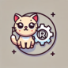
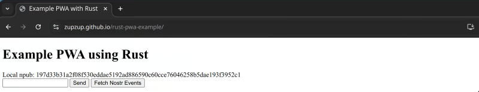
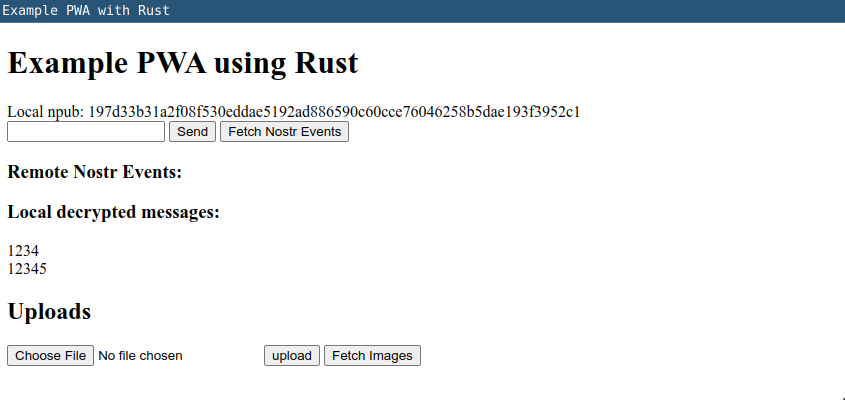

*This post was originally posted on the [LogRocket](https://blog.logrocket.com/building-progressive-web-apps-rust/) blog on 11.04.2025 and was cross-posted here by the author.*

Progressive web apps (PWAs) combine the advantages of web applications with the comfort of native apps, which can run locally and offline. Over the last few years, support for PWAs, in terms of available features, has increased. PWAs have become an attractive alternative to investing the effort to build both web and native versions of an application.

In this article, we will leverage Rust to build the business logic for a rich PWA, which can then be combined with a JavaScript/TypeScript frontend. Of course, it’s also possible to build the frontend with Rust, such as by using [Leptos](https://blog.logrocket.com/using-rust-leptos-build-beautiful-declarative-uis/). But the point of this article is to show that complex business logic, including storage, networking, and security implications, can be built using Rust leveraging WASM because performance safety and robustness are especially relevant in those areas.

But first, let’s talk a bit about progressive web apps and why they’re an interesting approach.

## Progressive web apps

PWAs combine the strengths of both mobile apps and web apps but only require a single code base, allowing us to leverage the whole range of the rich web ecosystem.

Besides that, since the advent of WASM, we can now also leverage the ecosystems of other languages that compile to WASM, such as Rust, which gives us another level of power over what we can do in the browser.

Compared to traditional web apps, PWAs offer native-like features such as push notifications and service workers for caching and offline access. This not only boosts performance but also provides a more native feel.

Another great benefit of PWAs is that we can, with the same code base, offer a traditional web application in addition to the PWA, which serves as a replacement for a native mobile or desktop application.

Update management and independence from app stores are additional benefits, and we can use all the security features of browsers and build on top of them.

As you can see, PWAs offer a range of powerful concepts we can take advantage of.

In this tutorial, we will build a contrived simple application that has a storage layer using [SurrealDB](https://surrealdb.com/), a multi-modal database, which works with a file in the cloud or in the browser using IndexedDB, using the same API.

We’ll also use a [Nostr](https://nostr.com/)-based networking layer. If you’ve never heard of Nostr, think early Twitter, but semi-decentralized via relays and focused on a simple, open protocol on which any social can be built. Technologically, it uses WebSockets, transported via relay servers to communicate between users. We won’t explore Nostr in too much detail — we’ll just use it to show that complex networking can easily be achieved using Rust and Wasm in the browser and that this can be used in a PWA.

Besides these layers, we’ll also implement [ECIES](https://ecies.org/)-based encryption and decryption for messages and images that we upload.

On startup of the application, we will generate keys for Nostr and ECIES and store them. If the keys exist on startup, we just use them and don’t generate them anew.

Then, it will be possible to send messages to the Nostr network and to fetch these published messages from the network. We will also encrypt and store every message we send locally and will be able to fetch them.

Additionally, we will implement a file upload for images, where we’ll encrypt and store the image bytes in IndexedDB via SurrealDB and, when fetched, decrypt and show them in the browser.

Of course, this doesn’t constitute a “real” application, but the goal is to show that based on the layers we build here, we will be able to build a complex, rich application.

Because of the scope of this article, we won’t be able to build fully coherent features, and we’ll also skip a bit on error handling and automated tests. Instead, we’ll implement some use cases in a basic way to showcase that it’s possible to build just about anything you want for a PWA on this basis.

Let’s start building!

## Setting up our Rust project

To follow along, all you need is a reasonably recent Rust installation. 1.85 being the latest one at the time of this writing.

First, create a new Rust project:

```bash
cargo new rust-pwa-example
cd rust-pwa-example
```

Next, edit the `Cargo.toml` file and add the dependencies you'll need:

```toml
[dependencies]

[lib]
crate-type = ["cdylib"]

[dependencies]
serde = "1.0"
serde-wasm-bindgen = "0.6"
ecies = { version = "0.2", default-features = false, features = ["pure"] }
hex = "0.4"
surrealdb = { version = "2.2", features = ["kv-indxdb"] }
getrandom = { version = "0.3", features = ["wasm_js"] }
wasm-bindgen = "0.2"
wasm-bindgen-futures = "0.4"
nostr-sdk = "0.39"
console_error_panic_hook = "0.1"
console_log = { version = "1.0", features = ["color"] }
log = "0.4"
```

We use `serde` and `serde-wasm-bindgen` for serialization between Rust and JavaScript/TypeScript. As mentioned above, we’re going to encrypt messages and images, and we’ll use the `ecies` and `hex` crates to do so.

For storage, we’ll use `surrealdb`. Since we’re building a WASM-based application, we also add `wasm-bindgen` and `wasm-bindgen-futures`, so we can create bindings for JS/TS into our Rust code and can run asynchronous functions on the Rust side as well.

For our network layer via Nostr, we’ll use `nostr-sdk` and finally, we add the `log` and `console_log` crate, so our Rust logs show up in the browser and `console_error_panic_hook` so panics are logged in the browser as well.

Since we’re not only building a WASM-based Rust project but will embed this within a progressive web app, we also need to create some files for that purpose.

We’ll start with a basic `index.html` file:

```html
<!DOCTYPE html>
<html lang="en">
<head>
    <meta charset="UTF-8">
    <meta name="viewport" content="width=device-width, initial-scale=1.0">
    <meta name="theme-color" content="#000000">
    <link rel="manifest" href="/manifest.json">
    <title>Example PWA with Rust</title>
</head>
<body>
    <h1>Example PWA using Rust</h1>
    <script type="module" src="/main.js"></script>
</body>
</html>
```

This references a basic `main.js`, which can stay empty for now, and a `manifest.json`, which we’ll create next:

```json
{
    "short_name": "RustExamplePWA",
    "name": "Rust Example Progressive Web App",
    "icons": [
        {
            "src": "img/logo_192x192.png",
            "sizes": "192x192",
            "type": "image/png"
        },
        {
            "src": "img/logo_512x512.png",
            "sizes": "512x512",
            "type": "image/png"
        }
    ],
    "start_url": "/",
    "background_color": "#000000",
    "theme_color": "#dddddd",
    "display": "standalone"
}
```

Here, we define the name, short name, icons, and some other settings for the progressive web app. This is relevant for the case where the app is installed locally on a phone.

And the following `service-worker.js`:

```javascript
self.addEventListener("install", (event) => {
    event.waitUntil(
        caches.open("pwa-cache").then((cache) => {
            return cache.addAll(["/", "/index.html", "/main.js", "/img/logo_192x192.png", "/img/logo_512x512.png", "/pkg/index.js", "/pkg/index_bg.wasm"]);
        })
    );
});

self.addEventListener("fetch", (event) => {
    event.respondWith(
        caches.match(event.request).then((response) => {
            return response || fetch(event.request);
        })
    );
});
```

The only thing we add here is that if the app is installed, all relevant files are cached, so the app works fully offline. The files include the manually created files and the generated Wasm files.

Finally, we’ll create some cute icons using gen AI and add them to the `img` folder. ☺️ 

<center>
    <a href="images/ai-generated-logo.png" target="_blank"></a>
</center>

That’s it for the initial setup. Let’s get to the Wasm build pipeline next so we can fully build our project.

## Wasm build pipeline

To build a Wasm binary that can be used in the browser from our Rust code, we use the [wasm-pack](https://rustwasm.github.io/wasm-pack/) tool, and we have to compile to the `wasm32-unknown-unknown` target, which can be added to your local Rust installation like this:
 
```bash
rustup target add wasm32-unknown-unknown
```

Also, in `.cargo/config.toml`, we need to add some additional flags:

```toml
[build]
target = "wasm32-unknown-unknown"
rustflags = ["--cfg", "getrandom_backend=\"wasm_js\""]
```

This configures what `cargo`, when run inside of this project, uses by default.

The `target` setting is to make sure our cargo commands, like `check` and `clippy`, as well as our editor, use the `wasm32` target by default.

The `rustflags` setting is something we need in this case for the given versions of `SurrealDB` and `getrandom`, which configures the `getrandom` crate to use the `wasm_js` backend. This means that random number generation doesn’t use an OS-specific backend but a JavaScript-based one, [as documented here](https://docs.rs/getrandom/latest/getrandom/#webassembly-support).

Using the `getrandom` crate won’t be necessary for every Wasm-based project, but it’s good to be aware of it since some dependencies can have specifics regarding being able to be compiled for Wasm.

Now, we can build the project and thus start to implement our app.

## Storage layer

When building our app, we’ll start with the SurrealDB-based storage layer. The first thing we need to do is to initialize a database connection (underneath, in the browser, SurrealDB uses IndexedDB) that we can use from any further function call into our API.

For this purpose, we’ll use a `thread_local` variable to keep the database connection around. To be able to initialize it and re-use it, we use a `RefCell` with an `Option` to the database connection inside:

```rust
use surrealdb::{engine::any::Any, Surreal};
use std::cell::RefCell;

thread_local! {
    static SURREAL_DB: RefCell<Option<Surreal<Any>>> = const { RefCell::new(None) };
}
```

Using this, we can now initialize the database and create a `get_db()` function, with which we can get a handle to it in any other API function:

```rust
async fn init_surreal_db() {
    let db = surrealdb::engine::any::connect("indxdb://default")
        .await
        .unwrap();
    db.use_ns("").use_db("default").await.unwrap();
    SURREAL_DB.with(|surreal_db| {
        let mut db_ref = surreal_db.borrow_mut();
        if db_ref.is_none() {
            *db_ref = Some(db);
        }
    });
}

fn get_db() -> Surreal<Any> {
    SURREAL_DB
        .with(|db| db.borrow().clone())
        .expect("is initialized")
}
```

Above, we initialized a connection to IndexedDB. Then we also initialize logging so we can log from Rust to the browser:

```rust
fn init_logging() {
    std::panic::set_hook(Box::new(console_error_panic_hook::hook));
    console_log::init_with_level(log::Level::Info).unwrap();
}
```

We also call our init functions within an `initialize()` function, which we expose to JS/TS via `wasm_bindgen`:

```rust
#[wasm_bindgen]
pub async fn initialize() {
    init_logging();
    init_surreal_db().await;
}
```

Once we build this app, in the `main.js` file we generated before, we can import the `initialize` function and call it:

```rust
import init, {
    initialize,
} from '../pkg/index.js';

async function run() {
    await init();
    await initialize();
}

if ("serviceWorker" in navigator) {
    navigator.serviceWorker
        .register("/service-worker.js")
        .then(() => console.log("registered service worker"))
        .catch((err) => console.error("registration of service worker failed", err));
}

await run();
```

Above, we initialized the `serviceWorker` that we defined before, initializing `wasm` using the `init()` function, and initializing our API using our exported `initialized()` function.

This should serve well as a basis for our API layer. Let’s implement encryption next:

```rust
use ecies::utils::generate_keypair;
use serde::{Deserialize, Serialize};

#[derive(Serialize, Deserialize, Clone)]
pub struct Keys {
    pub sk: String,
    pub pk: String,
}

pub fn generate_encryption_keys() -> Keys {
    let (sk, pk) = generate_keypair();
    Keys {
        sk: hex::encode(sk.serialize()),
        pk: hex::encode(pk.serialize()),
    }
}
```

We define a `Keys` struct for storing and retrieving keys and a function to create a new ECIES key pair.

Then, we implement the persistence logic so we can both fetch these keys from the database and also store a key pair there:

```rust
async fn get_encryption_keys_from_db() -> Option<Keys> {
    let db = get_db();
    let res: Option<Keys> = db.select(("keys", "encryption")).await.unwrap();
    res
}

async fn save_encryption_keys_to_db(keys: &Keys) {
    let db = get_db();
    let _: Option<Keys> = db
        .create(("keys", "encryption"))
        .content(keys.clone())
        .await
        .unwrap();
}
```

We use the above-defined `get_db()` function to get our stored DB connection and use the SQL-like SurrealDB SDK API to save keys to and fetch from the `keys` table.

In `lib.rs/initialize`, we generate the keys on startup and save them in the database:

```rust
...
save_encryption_keys_to_db(&generate_encryption_keys()).await;
...
```

Now that our basic key management is implemented (of course, in a real, production application, we wouldn’t just save the private key as plaintext in the database, but rather use an API such as the [Web Crypto API](https://www.w3.org/TR/WebCryptoAPI/#concepts-key-storage)).

Next, let’s implement utility functions for encrypting and decrypting bytes:

```rust
fn encrypt(input: &[u8], key: &str) -> Vec<u8> {
    let decoded_key = hex::decode(key).unwrap();
    ecies::encrypt(&decoded_key, input).unwrap()
}

fn decrypt(input: &[u8], key: &str) -> Vec<u8> {
    let decoded_key = hex::decode(key).unwrap();
    let decoded_msg = input;
    ecies::decrypt(&decoded_key, &decoded_msg).unwrap()
}
```

We simply use the `ecies` crate API, with the public and private key passed in as hex-encoded strings to implement encryption and decryption.

Now that we have the basics of storage and encryption in place, let’s get to encrypting and storing messages and files!

First, let’s define some basic data types:

```rust
#[derive(Serialize, Deserialize, Clone)]
pub struct Message {
    pub msg: String,
}

#[derive(Serialize, Deserialize, Clone)]
pub struct File {
    pub name: String,
    pub bytes: Vec<u8>,
}
```

Then, we start by implementing a function to fetch all local messages from a `msg` table and a function that we expose, which gets the encryption keys, fetches the messages, decrypts them, and serializes them so they can be used from JavaScript/TypeScript. Let’s take a look:

```rust
use wasm_bindgen::prelude::*;

async fn fetch_messages() -> Vec<Message> {
    let db = get_db();
    let msgs: Vec<Message> = db.select("msg").await.unwrap();
    msgs
}

#[wasm_bindgen]
pub async fn fetch_and_decrypt_local_messages() -> JsValue {
    let encryption_keys = get_encryption_keys_from_db().await.unwrap();
    let msgs = fetch_messages().await;
    let decrypted: Vec<String> = msgs
        .into_iter()
        .map(|msg| {
            std::str::from_utf8(&decrypt(
                &hex::decode(msg.msg.as_bytes()).unwrap(),
                &encryption_keys.sk,
            ))
            .unwrap()
            .to_owned()
        })
        .collect();
    serde_wasm_bindgen::to_value(&decrypted).unwrap()
}
```

The database fetching is the same as with the keys — nothing too interesting here. But when we check out the `fetch_and_decrypt_local_messages` function, which is annotated using `wasm_bindgen` again, thus being exposed to JS/TS, it has a `JsValue` as a return value.

We can’t just pass Rust values to and from JS/TS. For some values, such as strings and numbers, this works fine, but for more complex data types, there are some limits, and we have to serialize them in some way.

One way to do this is to just serialize it to a JSON string and then parse it in JS/TS. In this case, we use the `serde_wasm_bindgen` crate, which lets us serialize to `wasm_bindgen::JsValue` and deserialize from the same type, which makes it possible to serialize to arbitrary JavaScript values.

So, after fetching the keys and messages, we iterate the result and decrypt the messages by converting them to bytes, decrypting, and converting them to a UTF-8 string again.

Finally, we use `serde_wasm_bindgen` to serialize the `Vec<String>` to be used in JS/TS.

Cool! We’ll implement saving messages later when we implement our network layer. Now, though, we still have our images to take care of. We can just re-use the logic we used before to implement encrypting and storing and retrieving and decrypting images to and from the storage:

```rust
#[wasm_bindgen]
pub async fn save_image(file_name: &str, file_bytes: Vec<u8>) {
    let encryption_keys = get_encryption_keys_from_db().await.unwrap();
    let db = get_db();
    let f = File {
        name: file_name.to_owned(),
        bytes: encrypt(&file_bytes, &encryption_keys.pk),
    };
    let _: Option<File> = db.create("img").content(f).await.unwrap();
}

#[wasm_bindgen]
pub async fn fetch_images() -> JsValue {
    let encryption_keys = get_encryption_keys_from_db().await.unwrap();
    let db = get_db();
    let files: Vec<File> = db.select("img").await.unwrap();
    let decrypted: Vec<File> = files
        .into_iter()
        .map(|f| File {
            name: f.name,
            bytes: decrypt(&f.bytes, &encryption_keys.sk),
        })
        .collect();
    serde_wasm_bindgen::to_value(&decrypted).unwrap()
}
```

We fetch the encryption keys, get our DB connection, and create a `File`, with the bytes being the encrypted bytes of the incoming image.

For fetching images, we do the same as above in the `fetch_and_decrypt_messages` function.

That’s it for the storage layer. Let’s implement the network layer next.

## Network layer

For our Nostr-based networking layer, we start the same way as with storage, by initializing a Nostr client that we can use from API functions using `thread_local` and `RefCell`:

```rust
thread_local! {
    static NOSTR_CLIENT: RefCell<Option<nostr_sdk::Client>> = const { RefCell::new(None) };
   ...
}
```

Then, we implement an `init_nostr_client` function, which takes a Nostr private key as a parameter:

```rust
async fn init_nostr_client(private_key: &str) {
    let keys = nostr_sdk::Keys::parse(private_key).unwrap();
    let client = nostr_sdk::Client::builder().signer(keys.clone()).build();
    client.add_relay("wss://relay.damus.io").await.unwrap();

    client.connect().await;
    let meta = nostr_sdk::Metadata::new()
        .name("wasmTestUser")
        .display_name("wasmTestUser");
    client.set_metadata(&meta).await.unwrap();

    NOSTR_CLIENT.with(|cl| {
        let mut client_ref = cl.borrow_mut();
        if client_ref.is_none() {
            *client_ref = Some(client);
        }
    });
}

fn get_nostr_client() -> nostr_sdk::Client {
    NOSTR_CLIENT
        .with(|client| client.borrow().clone())
        .expect("is initialized")
}
```

We transform the given key to a Nostr `Keys` and create a new `Client`. We add a relay — in this case, just the default [damus.io](https://damus.io/) (one of the Nostr social network clients) relay and connect to it.
Then, we add some dummy metadata for our user and set the client to our `thread_local` variable.

Now, with the `get_nostr_client` function, we can adapt our `initialize` function to check if we already have keys in the storage or generate new ones and initialize our database and networking layer:

```rust
#[wasm_bindgen]
pub async fn initialize() -> String {
    init_logging();
    init_surreal_db().await;
    if let Some(nostr_keys) = get_nostr_keys_from_db().await {
        init_nostr_client(&nostr_keys.sk).await;
        nostr_keys.pk
    } else {
        let nostr_keys = generate_nostr_keys();
        save_nostr_keys_to_db(&nostr_keys).await;
        save_encryption_keys_to_db(&generate_encryption_keys()).await;
        nostr_keys.pk
    }
}
```

We initialize logging and storage and, if we don’t have keys yet, generate and store them. Once we have the keys, we initialize the Nostr client.

Next, let’s define the `Event` data structure that we’ll use to fetch Nostr messages from the network:

```rust
#[derive(Serialize, Deserialize, Clone)]
pub struct Event {
    pub id: String,
    pub pk: String,
    pub content: String,
    pub ts: u64,
}
```

We also define the function to generate initial Nostr keys:

```rust
pub fn generate_nostr_keys() -> Keys {
    let keys = nostr_sdk::Keys::generate();
    Keys {
        sk: keys.secret_key().to_secret_hex(),
        pk: keys.public_key().to_hex(),
    }
}
```

Now we can get to sending messages to the Nostr network:

```rust
use wasm_bindgen_futures::spawn_local;
use log::info;

#[wasm_bindgen]
pub async fn send_nostr_msg(msg: &str) {
    let msg = msg.to_owned();
    let msg_clone = msg.clone();
    spawn_local(async move {
        let event_builder = nostr_sdk::EventBuilder::text_note(msg_clone);
        let event_id = get_nostr_client()
            .send_event_builder(event_builder)
            .await
            .unwrap();
        info!("sent event, event id: {}", event_id.id());
    });
    let encryption_keys = get_encryption_keys_from_db().await.unwrap();
    let encrypted = hex::encode(encrypt(msg.as_bytes(), &encryption_keys.pk));
    save_encrypted_msg(&encrypted).await;
}
```

In this function, we showcase how we can actually run something asynchronously in Rust using `wasm_bindgen_futures::spawn_local`, even if it’s called from JS/TS. This way, we can run entire background processes on the event loop in WASM.

We have to clone the message so we can pass it to the async function. Then, we use the Nostr `EventBuilder` to create a text note and send the event using the Nostr client we created and stored above.

Finally, we encrypt the message and store it in IndexedDB with the following function:

```rust
async fn save_encrypted_msg(encrypted: &str) {
    let db = get_db();
    let _: Option<Message> = db
        .create("msg")
        .content(Message {
            msg: encrypted.to_owned(),
        })
        .await
        .unwrap();
}
```

Nothing too surprising here; we simply save the given encrypted message into the `msg` table.

With event sending in place, we can now implement fetching events from the Nostr network:

```rust
#[wasm_bindgen]
pub async fn fetch_nostr_events(from: &str) -> Result<JsValue, JsValue> {
    let filter = nostr_sdk::Filter::new()
        .author(nostr_sdk::PublicKey::parse(from).unwrap())
        .kind(nostr_sdk::Kind::TextNote);
    let events = get_nostr_client()
        .fetch_events(filter, std::time::Duration::from_secs(10))
        .await
        .unwrap();
    Ok(serde_wasm_bindgen::to_value(
        &events
            .into_iter()
            .map(|e| Event {
                id: e.id.to_hex(),
                pk: e.pubkey.to_hex(),
                content: e.content,
                ts: e.created_at.as_u64(),
            })
            .collect::<Vec<Event>>(),
    )
    .unwrap())
}
```

We first create a Nostr `Filter`, which we configure to just filter for `TextNote` events from ourselves (`author`). Here, we could also define other filters to get other kinds of messages from the network, such as only fetching events that have been published in the last X days or hours.

Then, we use our Nostr client to fetch events based on this filter with a timeout of 10 seconds. The events we get from Nostr, transformed into our `Event` struct, are then serialized to `JsValue`s using `serde_wasm_bindgen`.

That’s it for our simple networking layer. Of course, we could have also used a crate such as [reqwest](https://crates.io/crates/reqwest) to make arbitrary HTTP requests as well.

## Building a simple GUI

Finally, let’s build a very simple GUI to interact with the API we built in Rust for Wasm:

```html
<!DOCTYPE html>
<html lang="en">
<head>
    <meta charset="UTF-8">
    <meta name="viewport" content="width=device-width, initial-scale=1.0">
    <meta name="theme-color" content="#000000">
    <link rel="manifest" href="/manifest.json">
    <title>Example PWA with Rust</title>
</head>
<body>
    <h1>Example PWA using Rust</h1>
    <div>Local npub: <span id="npub"></span></div>
    <input type="text" id="inp"/>
    <button id="sb">Send</button>
    <button id="fetch">Fetch Nostr Events</button>
    <h3>Remote Nostr Events:</h3>
    <div id="remote_events"></div>
    <h3>Local decrypted messages:</h3>
    <div id="local_messages"></div>
    <div>
        <h2>Uploads</h2>
        <div>
            <input type="file" id="file_input" />
            <button type="button" id="upload">upload</button>
            <button type="button" id="fetch_images">Fetch Images</button>
        </div>
        <div id="files">
        </div>
    </div>
    <script type="module" src="/main.js"></script>
</body>
</html>
```

We add a few things to `index.html`. First, we create a div to display our `npub`, which is the public key and, at the same time, the identifier on the Nostr network.

Then, we add a text field with a submit button to send events and a button to trigger fetching events from the Nostr networks.

Then, we add containers for both the remote events and the local messages.

Finally, we add a file input and two buttons — one to upload and one to fetch and display all stored images — as well as a container for displaying the files.

Of course, in a real application, we could also use frameworks such as Svelte, Vue, or React to build a GUI and integrate it with our generated Wasm code.

In this case, we will just use vanilla JavaScript to import and use our API functions:

```javascript
import init, {
    save_image,
    fetch_images,
    initialize,
    send_nostr_msg,
    fetch_nostr_events,
    fetch_and_decrypt_local_messages
} from '../pkg/index.js';

let npub;
async function run() {
    await init();
    npub = await initialize();
    document.getElementById("npub").textContent = npub;
    await refresh_local_messages();
}

await run();
```

We simply import the exported functions from the generated `pkg/index.js` in the same way we did before with the `initialize` function.

Then, we store the `npub` returned from the new `initialize` function, set it to the container for the npub, and call a function to refresh the local messages, so on startup, we display all locally stored messages:

```javascript
async function refresh_local_messages() {
    let local_messages = await fetch_and_decrypt_local_messages();
    let container = document.getElementById("local_messages");
    container.innerHTML = "";
    local_messages.forEach(str => {
        let div = document.createElement("div");
        div.textContent = str;
        container.appendChild(div);
    });
}
```

Here, we just call the `fetch_and_decrypt_local_messages` Wasm function, iterate the results, and add a dir for each of them into the local messages container.

Next, let’s implement the event handlers for sending messages and fetching remote messages from Nostr:

```javascript
document.getElementById("sb").addEventListener("click", async () => {
    let input = document.getElementById("inp").value;
    await send_nostr_msg(input);
    await refresh_local_messages();
});

document.getElementById("fetch").addEventListener("click", async () => {
    await refresh_remote_messages();
});
```

When clicking the `Send` button, we send the text from the `inp` text input to the Nostr network using the `send_nostr_msg` Wasm function and call `refresh_local_messages`, so the new message is immediately shown.

Similarly, on clicking the `Fetch` button, we re-fetch and refresh the remote messages as well with the following function:

```javascript
async function refresh_remote_messages() {
    let events = await fetch_nostr_events(npub);
    let container = document.getElementById("remote_events");
    container.innerHTML = "";
    events.forEach(event => {
        let div = document.createElement("div");
        div.textContent = event.content + " at " + event.ts + " (" + event.id + ")";
        container.appendChild(div);
    });
}
```

We fetch the Nostr events using the Wasm function `fetch_nostr_events` and put a div with the content, timestamp, and ID of the events into the message container.

Finally, let’s implement the file upload and fetching logic in our very basic GUI:

```javascript
document.getElementById("upload").addEventListener("click", async () => {
    const file = document.getElementById("file_input").files[0];
    if (!file) return;

    const name = file.name;
    const bytes = await file.arrayBuffer();
    const data = new Uint8Array(bytes);

    await save_image(name, data);
    console.log("upload successful");
});

document.getElementById("fetch_images").addEventListener("click", async () => {
    let files = await fetch_images();
    let container = document.getElementById("files");
    container.innerHTML = "";
    files.forEach(file => {
        let arr = new Uint8Array(file.bytes);
        let blob = new Blob([arr]);
        let url = URL.createObjectURL(blob);

        console.log("file", file, url, blob);
        let img = document.createElement("img");
        img.src = url;
        container.appendChild(img);
    });
});
```

For uploading, we take the file from the file input and transform the bytes of the file to a `Uint8Array`, so we can pass it to the Rust-based Wasm API as a `Vec<u8>`. We also send the file name and call the Wasm function `save_image` to encrypt and store the image in [IndexedDB](https://blog.logrocket.com/using-indexeddb-complete-guide/).

When clicking on the `Fetch Images` button, we call the Wasm API function `fetch_images` and show the fetched and decrypted images in the files container.

That’s it for our very basic GUI. Now, let’s see if all of this works!

## Testing the progressive web app

As mentioned above, we use `wasm-pack` to build our Wasm binary:

```bash
wasm-pack build --dev --target web --out-name index
```

If we run this and check the `pkg` folder, we’ll see the following files:

- `index.js`: The JavaScript entry point
- `index.d.ts`: TypeScript bindings
- `index_bg.wasm`: The WASM binary
- `index_bg.wasm.d.ts`: TypeScript bindings for the WASM binary
- `package.json`: Generated for the package, to publish it to npm, or import it as a dependency, for example

Then, we can use a local [http-server](https://www.npmjs.com/package/http-server) (but really, any http server that can serve `.wasm` files will do) to serve the files, in this case, to http://localhost:8080/.

First, we can observe that Chrome shows us a button to install the app as a PWA (on the right):

<center>
    <a href="images/basline-app-chrome-buttons-install-pwa.png" target="_blank"></a>
</center>

If we do this, the app will be available on the Chrome apps, and we can also create desktop or mobile icons to immediately start the app from our local systems. And since all files are cached, we could also use the app without a network connection.

Of course, to really implement offline-first functionality properly, we would always need to think about conflict resolution and what happens if someone wants to interact with the network but it is offline, which is out of scope for this article but an important part of PWAs:

<center>
    <a href="images/chrome-view-locally-installed-apps.png" target="_blank"></a>
</center>

Finally, let’s check out our application. We can see that a Nostr npub is created and that already sent messages are fetched locally at startup:

<center>
    <a href="images/basline-app.png" target="_blank"></a>
</center>

We can send new messages, fetch remote messages, and even upload and fetch images! Everything seems to work — nice!

Everything we set out to do works. We’re able to leverage our Rust-based Wasm API to fully interact with browser storage and browser networking and even implement local encryption and decryption.

Besides manual testing, we can, of course, leverage normal unit tests and also tests that are executed either in `node` or the browser using `wasm-pack test`.

Also, it’s possible to debug the Wasm code in Chrome by creating a [source map](https://github.com/mtolmacs/wasm2map) and serving it together with the Wasm code. 

You can find the [full code for this tutorial on GitHub](https://github.com/zupzup/rust-pwa-example). You can also play around with this simple [example PWA here](https://zupzup.github.io/rust-pwa-example/).

## Conclusion

In this article, we built a very simple progressive web app leveraging Rust via WebAssembly. The Rust ecosystem around Wasm is getting more and more mature, especially compared to a few years ago.

However, some areas are still under construction, and while many things can be achieved, it isn’t always straightforward. For example, it’s possible to leverage multithreading support in web-workers via Wasm from Rust, as described [here](https://www.tweag.io/blog/2022-11-24-wasm-threads-and-messages/), or using crates such as [wasm-bindgen-rayon](https://github.com/RReverser/wasm-bindgen-rayon), but getting it to work includes additional steps, like rebuilding the Wasm target with additional flags.

Still, we were able to build an app with powerful storage and networking integration, encryption support, and a convenient API for consuming this via a JavaScript or TypeScript frontend. The TypeScript bindings generated by `wasm-bindgen` are already pretty good, but I also had good experiences using additional tools such as [Tsify](https://github.com/madonoharu/tsify) to expose the Rust API to any frontend.

Also, packages built using `wasm-pack` for the web can be rather seamlessly integrated into existing projects, even if they use complex build tools such as Vite or webpack, as documented [here](https://rustwasm.github.io/wasm-pack/book/tutorials/index.html).

Overall, both PWAs and especially WebAssembly are making big strides, and we’re slowly moving into a direction where it’s possible to build near-native performance, secure, sandboxed, but fully featured and rich apps, which run anywhere. I, for one, am looking forward to that future. :)

