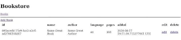

*This post was originally posted on the [LogRocket](https://blog.logrocket.com/template-rendering-in-rust/) blog on 25.08.2020 and was cross-posted here by the author.*

In this tutorial, we’ll examine the old-school way of writing web applications using templates with all the rendering happening on the server side.

The Rust ecosystem for template engines is surprisingly robust, so we have a choice between several viablew options. For this tutorial, I chose to use [Askama](https://github.com/djc/askama/), since it seems like one of the most mature engines. Other options include [Yarte](https://github.com/botika/yarte), [Tera](https://github.com/Keats/tera) and [SailFish](https://github.com/Kogia-sima/sailfish), among others.

Askama is based on the widely used [Jinja](https://palletsprojects.com/p/jinja/) project, so if you’ve worked with that before, the syntax will be somewhat familiar.

Additionally, Askama creates actual Rust code from your templates, which means the templates are checked at compile time and rendering is lightning fast. This comes at the price of being able to dynamically change and reload the templates at runtime. I’m sure someone will implement some nifty workaround eventually, but as of this writing, it doesn’t work.

Askama’s API is straightforward and, being based on Jinja, quite powerful.

To see this templating exercise in action, we’ll create a simple bookstore application with CRUD functionality using a warp web server and purely serverside-rendered templates.

## Setup

To follow along, you’ll need a reasonably recent Rust installation (1.39+) and a web browser.

First, create a new Rust project.

```bash
cargo new rust-templating-example
cd rust-templating-example
```

Next, edit the `Cargo.toml` file and add the dependencies you’ll need.

```toml
tokio = { version = "0.2", features = ["macros", "rt-threaded"] }
warp = "0.2"
thiserror = "1.0"
askama = "0.8"
serde = {version = "1.0", features = ["derive"] }
chrono = { version = "0.4", features = ["serde"] }
uuid = { version = "0.8", features = ["serde", "v4"] }
```

We need warp and tokio for the web server and Serde for deserializing the incoming request payload. As mentioned above, we’ll use Askama for templating and we’ll also add uuid, chrono, and thiserror for handling unique IDs, dates, and errors, respectively.

## Data storage

To implement any CRUD-like functionality, we’ll need some form of data storage. In this simple example, we’ll opt for a shared `Vec` of books in the form of:

```rust
type DB = Arc<RwLock<Vec<Book>>>;
```

Simply save the books in a shared `Vec`, which is protected by a read/write lock, and put into an `Arc` smart-pointer so you can pass it between threads. We’ll see later on how we can access and mutate this nonpersistent data storage of ours.

```rust
let db = DB::default();
```

Create a simple warp filter to pass it to the handlers.

```rust
fn with_db(db: DB) -> impl Filter<Extract = (DB,), Error = Infallible> + Clone {
    warp::any().map(move || db.clone())
}
```

Next, we’ll look at what a Book is.

```rust
#[derive(Clone, Debug)]
pub struct Book {
    pub id: String,
    pub name: String,
    pub author: String,
    pub language: String,
    pub pages: i32,
    pub added_at: DateTime<Utc>,
}
```

We’ll also define a useful `WebResult` type for our warp handlers to type less.

```rust
type WebResult<T> = std::result::Result<T, Rejection>;
```

With the basic setup out of the way, let’s define a welcome handler to greet visitors.

This brings us to creating our first template.

```rust
let welcome_route = warp::path::end().and_then(handler::welcome_handler);
```

## Creating the first template

In the `handler` module, create a data structure for what you want to show the user on the welcome page.

```rust
use askama::Template;

#[derive(Template)]
#[template(path = "welcome.html")]
struct WelcomeTemplate<'a> {
    title: &'a str,
    body: &'a str,
}
```

In this case, we’ll limit ourselves to two hard-coded strings for the title and body of the page.

Next, let’s look at the welcome.html file, which resides, by default, in the `./templates/` folder.

```html

<div class="entry">
    <h1>{{title}}</h1>
    <div class="body">
        {{body}}
    </div>
</div>

```

Since you don’t want to copy/paste the same top and bottom part of the page into every template, include the `header.html` and `footer.html` files.

```html
<html>
    <head>
        <title>Bookstore</title>
        
    </head>
    <body>
    <div>
        <h1>Bookstore</h1>
    </div>
    
    <hr />
```

The header includes some CSS and a hardcoded menu as well.

```html
<style>
    td, th {
        padding: 8px;
    }
    th {
        text-align: left;
    }
</style>


<div class="menu">
    <span class="menuitem">
        <a href = "/books/list">Books</a>
    </span>
</div>
```

Finally, the footer:


```html
    </body>
</html>
```

As you can see, if we put the content of `welcome.html` inside the snippets, we get a full HTML page.

So how can we actually create this beautiful piece of HTML goodness? Let’s look at the `welcome_handler` function in the `handler` module.

```rust
pub async fn welcome_handler() -> WebResult<impl Reply> {
    let template = WelcomeTemplate {
        title: "Welcome",
        body: "To The Bookstore!",
    };
    let res = template
        .render()
        .map_err(|e| reject::custom(TemplateError(e)))?;
    Ok(html(res))
}
```

To recap, first we created an instance of the `WelcomeTemplate` struct and called `render()` on it, which returned a `Result`. We then handled the error and simply returned the result, rendered with warp’s `reply::html` function, to the client.

That was easy!

We also want to implement full CRUD functionality, so let’s look at how to do some more advanced stuff next.

## Other handlers

Let’s define all the handlers for our warp server at once so we can have an overview of what we’ll need to implement.

```rust
let books_routes = books
    .and(new)
    .and(warp::get())
    .and_then(handler::new_book_handler)
    .or(books
        .and(new)
        .and(warp::post())
        .and(warp::body::form())
        .and(with_db(db.clone()))
        .and_then(handler::create_book_handler))
    .or(books
        .and(edit)
        .and(warp::get())
        .and(warp::path::param())
        .and(with_db(db.clone()))
        .and_then(handler::edit_book_handler))
    .or(books
        .and(edit)
        .and(warp::post())
        .and(warp::path::param())
        .and(warp::body::form())
        .and(with_db(db.clone()))
        .and_then(handler::do_edit_book_handler))
    .or(books
        .and(delete)
        .and(warp::get())
        .and(warp::path::param())
        .and(with_db(db.clone()))
        .and_then(handler::delete_book_handler))
    .or(books
        .and(list)
        .and(warp::get())
        .and(with_db(db.clone()))
        .and_then(handler::books_list_handler));
```

That’s quite a few handlers, but keep in mind that for interactive actions such as creating and editing a book, we need two endpoints: one for showing the form and one for processing it.

That’s where `new_book_handler`, which is just a GET endpoint, and `create_book_handler`, which receives a `form` body and is a POST endpoint, come in.

Pass the above-defined data memory-based data storage to each of the handlers. The handlers need to access data and define `path::param` for the edit and delete endpoints since they’ll receive the ID of the book to manipulate.

Let’s start with the simplest endpoint: listing books.

```rust
#[derive(Template)]
#[template(path = "book/list.html")]
struct BooklistTemplate<'a> {
    books: &'a Vec<Book>,
}

pub async fn books_list_handler(db: DB) -> WebResult<impl Reply> {
    match db.read() {
        Ok(books) => {
            let template = BooklistTemplate {
                books: &books,
            };
            let res = template
                .render()
                .map_err(|e| reject::custom(TemplateError(e)))?;
            Ok(html(res))
        }
        Err(_) => Err(reject::custom(DBAccessError)),
    }
}
```

As you can see, we used `book/list.html` as the template, so we can structure the templates using folders.

Then, we acquire a read-lock on our shared data storage and, if that works, simply pass a reference to the books vector to the template.

If an error happens, we convert it to one of our custom errors, which we’ll look at later on, and return it.

The template looks like this:

```html

<a href="/books/new">Add Book</a>
<table>
    <tr>
        <th>id</th>
        <th>name</th>
        <th>author</th>
        <th>language</th>
        <th>pages</th>
        <th>added</th>
        <th>edit</th>
        <th>delete</th>
    </tr>

    <tr>
        <td>{{ book.id }}</td>
        <td>{{ book.name }}</td>
        <td>{{ book.author }}</td>
        <td>{{ book.language }}</td>
        <td>{{ book.pages }}</td>
        <td>{{ book.added_at }}</td>
        <td><a href="{{"/books/edit/{}"|format(book.id)}}">edit</a></td>
        <td><a href="{{"/books/delete/{}"|format(book.id)}}">delete</a></td>
    <?tr>

</table>

```

Again, we included header and footer, created a button for adding a new book, and created a table — yes, an old-school HTML table — to display the books.

After the table headers, we iterated over the `book` in the given `BooklistTemplate` struct and simply showed the values.

For the edit and delete links, we used the `format` function to get the book ID into the format string using the pipe syntax.

Now that we can read books, why don’t we create one? We’ll look at `new_book_handler` next.

```rust
#[derive(Template)]
#[template(path = "book/new.html")]
struct NewBookTemplate {}

pub async fn new_book_handler() -> WebResult<impl Reply> {
    let template = NewBookTemplate {};
    let res = template
        .render()
        .map_err(|e| reject::custom(TemplateError(e)))?;
    Ok(html(res))
}
```

This is new - a template struct without any content. In this case, we simply use it to define which template to use. Then, it’s instantiated and rendered.

The template is simply a form with the `action` pointing to `POST /books/new`:

```html

<h2>Add New Book</h2>
<table>
    <form action="/books/new" method="post">
        <tr>
            <td>Name:</td>
            <td><input type="text" name="name" /></td>
        <tr/>
        <tr>
            <td>Author:</td>
            <td><input type="text" name="author" /></td>
        <tr/>
        <tr>
            <td>Language:</td>
            <td><input type="text" name="language" value="de" /></td>
        <tr/>
        <tr>
            <td>Pages:</td>
            <td><input type="text" name="pages" value="300" /></td>
        <tr/>
        <tr>
            <td colspan="2"><button type="submit">Send</button></td>
        <tr/>
    </form>
</table>

```

Once the form is filled out and sent, it will trigger the `create_book_handler`, which we’ll look at next:

```rust
pub async fn create_book_handler(body: BookRequest, db: DB) -> WebResult<impl Reply> {
    let new_book = Book {
        id: Uuid::new_v4().to_string(),
        name: body.name,
        author: body.author,
        language: body.language,
        pages: body.pages,
        added_at: Utc::now(),
    };
    match db.write() {
        Ok(mut books) => {
            books.push(new_book);
        }
        Err(_) => return Err(reject::custom(DBAccessError)),
    };
    books_list_handler(db).await
}
```

This handler doesn’t have a template, since we’ll simply send the user back to the book list if the operation is successful.

Since we defined a `warp::body::form` before, we get a readily deserialized `BookRequest` object passed to the handler.

```rust
#[derive(Serialize, Deserialize, Debug)]
pub struct BookRequest {
    pub name: String,
    pub author: String,
    pub language: String,
    pub pages: i32,
}
```

Based on this payload, we can trivially create a new `Book`, which generates a unique ID using `uuid` and the current UTC date using `chrono`.

Then we acquire a write-lock on our “database” and add the book to the list of books.

We’re halfway there. Let’s press on with editing and deleting books.

## Edit and delete

Once we have some books, we might want to change them. After all, errors happen and a misspelled author name would be quite embarrassing. since errors happen to anyone and a wrongly spelled author can be quite embarrassing.

To do that, we’ll need to implement the two `edit` handlers:

```rust
#[derive(Template)]
#[template(path = "book/edit.html")]
struct EditBookTemplate<'a> {
    book: &'a Book,
}

pub async fn edit_book_handler(id: String, db: DB) -> WebResult<impl Reply> {
    let book = match db.read() {
        Ok(books) => match books.iter().find(|b| b.id == id) {
            Some(book) => book.clone(),
            None => return Err(reject::custom(BookNotFoundError)),
        },
        Err(_) => return Err(reject::custom(DBAccessError)),
    };

    let template = EditBookTemplate { book: &book };
    let res = template
        .render()
        .map_err(|e| reject::custom(TemplateError(e)))?;
    Ok(html(res))
}
```

In this case, we need a new template: the `EditBookTemplate`. In practice, it’s often possible to create one template for creating and editing and simply set the values, if they’re there. But this adds more complexity in the templates — which, in my opinion, is not really the place to get fancy, even if they are checked at compile time.

For the `edit` form, we need to find the book with the given ID in our “database” or return an error. If the book is found, a reference to it is added to the `EditBookTemplate` and it’s rendered for the user

The template for editing looks like this:

```html

<h2>Edit Book</h2>
<table>
    <form action="{{"/books/edit/{}"|format(book.id)}}" method="post">
        <tr>
            <td>Name:</td>
            <td><input type="text" name="name" value="{{ book.name }}"/></td>
        <tr/>
        <tr>
            <td>Author:</td>
            <td><input type="text" name="author" value="{{ book.author }}"/></td>
        <tr/>
        <tr>
            <td>Language:</td>
            <td><input type="text" name="language" value="{{ book.language }}"/></td>
        <tr/>
        <tr>
            <td>Pages:</td>
            <td><input type="text" name="pages" value="{{ book.pages }}" /></td>
        <tr/>
        <tr>
            <td colspan="2"><button type="submit">Send</button></td>
        <tr/>
    </form>
</table>

```

It’s quite similar to the form for creating new books, the difference being that we set the `value` of each input field and set the form action to `POST /books/edit/$bookId`.

Once the form is sent, we’re transported to the `do_edit_book_handler`, which has a `BookRequest`, similar to the `create_book_handler`, and an ID.

```rust
pub async fn do_edit_book_handler(id: String, body: BookRequest, db: DB) -> WebResult<impl Reply> {
    match db.write() {
        Ok(mut books) => match books.iter_mut().find(|b| b.id == id) {
            Some(ref mut book) => {
                book.name = body.name;
                book.language = body.language;
                book.author = body.author;
                book.pages = body.pages;
            }
            None => return Err(reject::custom(BookNotFoundError)),
        },
        Err(_) => return Err(reject::custom(DBAccessError)),
    };
    books_list_handler(db).await
}
```

Since we’re manipulating the data, we need to get a write-lock again and search for the book with the given ID. If it doesn’t exist, we return an error. Otherwise, we simply mutate the book in place using the data from the body.

The last operation we need to implement is `delete`, which is relatively simple compared to `edit`.

```rust
pub async fn delete_book_handler(id: String, db: DB) -> WebResult<impl Reply> {
    match db.write() {
        Ok(mut books) => {
            let mut delete_idx = None;
            for (i, b) in books.iter().enumerate() {
                if b.id == id {
                    delete_idx = Some(i);
                }
            }
            match delete_idx {
                Some(i) => {
                    books.remove(i);
                }
                None => return Err(reject::custom(BookNotFoundError)),
            }
        }
        Err(_) => return Err(reject::custom(DBAccessError)),
    };
    books_list_handler(db).await
}
```

We don’t need a template again since we’re just executing the operation and redirecting the user back to the book list. Besides that, it’s the same spiel as before: acquiring a write-lock and looking for the book and removing it or returning an error if it isn’t found.

## Basic error handling

Since this isn’t a JSON API where we can just return a JSON object with an error message and a status code, we need to create a template for showing errors to our users.

```html

<div class="error">
    <h1>Error</h1>
    <div class="body">
        An Error Occurred: <br /><br />
        {{ message }}
    </div>
</div>

```

This might not be particularly helpful in this very basic case, but at least the user can navigate back and gain some idea of what went wrong.

Let’s wrap up by wiring everything together into a warp web server.

```rust
    let routes = welcome_route
        .or(books_routes)
        .recover(error::handle_rejection);

    println!("Started on port 8080");
    warp::serve(routes).run(([0, 0, 0, 0], 8080)).await;
```

The `handle_rejection` function in the `error` module looks like this:

```rust
#[derive(Error, Debug)]
pub enum Error {
    #[error("error accessing the database")]
    DBAccessError,
    #[error("book not found")]
    BookNotFoundError,
    #[error("templating error: {0}")]
    TemplateError(#[from] askama::Error),
}

#[derive(Template)]
#[template(path = "error.html")]
struct ErrorTemplate {
    message: &'static str,
}

impl warp::reject::Reject for Error {}

pub async fn handle_rejection(err: Rejection) -> std::result::Result<impl Reply, Infallible> {
    let code;
    let message;

    if err.is_not_found() {
        code = StatusCode::NOT_FOUND;
        message = "Not Found";
    } else if let Some(_) = err.find::<warp::filters::body::BodyDeserializeError>() {
        code = StatusCode::BAD_REQUEST;
        message = "Invalid Body";
    } else if let Some(e) = err.find::<Error>() {
        match e {
            Error::DBAccessError => {
                code = StatusCode::BAD_REQUEST;
                message = "there was an error accessing the database";
            }
            _ => {
                eprintln!("unhandled application error: {:?}", err);
                code = StatusCode::INTERNAL_SERVER_ERROR;
                message = "Internal Server Error";
            }
        }
    } else {
        eprintln!("unhandled error: {:?}", err);
        code = StatusCode::INTERNAL_SERVER_ERROR;
        message = "Internal Server Error";
    }

    let template = ErrorTemplate { message };

    match template.render() {
        Ok(v) => Ok(reply::with_status(html(v), code)),
        Err(_) => Ok(reply::with_status(
            html(String::from(message)),
            StatusCode::INTERNAL_SERVER_ERROR,
        )),
    }
}
```

First, we defined a custom `Error` enum, which implements warp’s `Reject` trait, which enabled us to return it from handlers. We have error cases for accessing the “database,” not finding a book and for errors while rendering templates.

We also defined the `ErrorTemplate` with the above-defined `error.html` template and an error message.

Below that, we checked for the different error cases, set some useful error messages and response codes, and, finally, rendered the `ErrorTemplate`. If rendering fails here, we can only send the user an `INTERNAL_SERVER_ERROR` with the message and without a template.

That’s it! If you start this application with cargo run and navigate to `http://localhost:8080`, you’ll see a wonderfully designed, fully server-rendered UI you can interact with.


<center>
    <a href="images/img.png" target="_blank"></a>
</center>

You can find the full code for this example on [GitHub](https://github.com/zupzup/rust-templating-example).

## Conclusion

In this tutorial, we walked through how to do safe, performant template rendering in Rust using the example of a server-side rendered web application.

Template engines can be used for a wide range of use cases. The ecosystem of libraries in Rust is quite impressive and already provides many different options for individual use cases and trade-offs.

