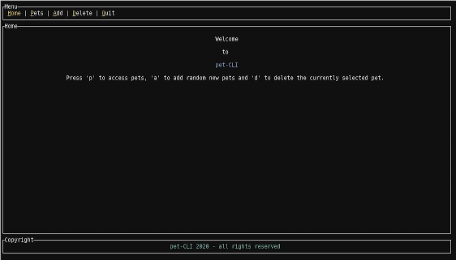
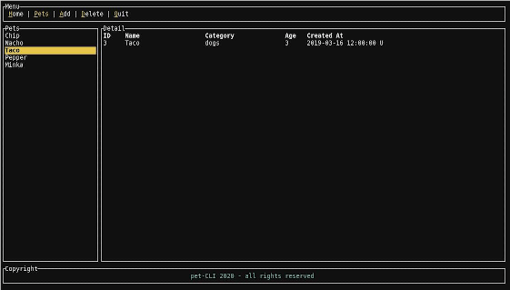

*This post was originally posted on the [LogRocket](https://blog.logrocket.com/rust-and-tui-building-a-command-line-interface-in-rust/) blog on 28.01.2021 and was cross-posted here by the author.*

Rust is a low-level systems programming language with good cross-compilation support, which makes it a prime candidate for writing command-line applications. Prominent examples range from reimplementations of widely used tools such as [ripgrep](https://github.com/BurntSushi/ripgrep), [exa](https://github.com/ogham/exa), and [bat](https://github.com/sharkdp/bat) to full-blown terminal UI tools such as [GitUI](https://github.com/extrawurst/gitui), [Spotify TUI](https://github.com/Rigellute/spotify-tui), [Bandwhich](https://github.com/imsnif/bandwhich), [KMon](https://github.com/orhun/kmon), and [Diskonaut](https://github.com/imsnif/diskonaut).

With [Alacritty](https://github.com/alacritty/alacritty) and [Nushell](https://github.com/nushell/nushell), there are even popular shell implementations available. Some reasons for this plethora of tools, which keeps growing steadily, include the [Rewrite it in Rust meme](https://transitiontech.ca/random/RIIR) and the fantastic ecosystem for writing command-line applications Rust.

When talking about Rust’s library ecosystem for CLIs, I would like to mention [Clap](https://github.com/clap-rs/clap) and [TUI](https://github.com/fdehau/tui-rs) in particular, which are both staples and are used in many of the aforementioned tools. Clap is a command-line parser with a fantastic API and a huge set of available features, many of which can be disabled for faster compilation times if they’re not needed.

## What is TUI?

TUI is basically a framework for building terminal user interfaces. It supports several “backends” for drawing to the terminal. These backends take over the actual logic for interacting with the terminal, such as setting the correct characters, clearing the screen etc., whereas TUI is a higher-level interface that provides widgets and other helpers for composing a user interface.

In this tutorial, we’ll take a look at how to implement a simple terminal application using TUI with [Crossterm](https://github.com/crossterm-rs/crossterm) as the backend. We won’t directly interact with Crossterm beyond the initial setup of the rendering and event handling pipeline, so the example should work with minimal changes for the other TUI backends as well.

To demonstrate how TUI works, we’ll build a simple app for managing your pets using a local JSON file for data storage. The finished product will look like this:

<center>
    <a href="images/img1.png" target="_blank"></a>
</center>

<center>
    <a href="images/img2.png" target="_blank"></a>
</center>

The first image shows the welcome screen with the menu. The highlighted characters in the menu show the hotkeys the user needs to hit to execute the actions. Upon selecting `p`, the user is sent to the second screen (Pets), where they can manage their pets. The user can navigate through the list, add random new pets using `a`, and delete the currently selected pet using `d`. Pressing `q` closes the app.

The app is rather simple, but it’s enough to show how TUI works and how to build the basic blocks of such an application. Using the [Rust command-line example](https://github.com/zupzup/rust-commandline-example) [code](https://github.com/zupzup/rust-commandline-example) I wrote for this tutorial, you could extend this with editing, add a form for adding new pets, etc.

When using TUI, the application can be resized and it will change responsively, keeping the configured ratios of the different UI elements in place. This is one of the many things TUI does when you use the existing widgets.

Without further ado, let’s dive in!

## Setting up our Rust app

To follow along, all you need is a recent Rust installation (1.45+; the most recent version at the time of writing is [Rust 1.49.0](https://blog.rust-lang.org/2020/12/31/Rust-1.49.0.html)).

First, create a new Rust project:

```bash
    cargo new rust-cli-example
    cd rust-cli-example
```

Next, edit the `Cargo.toml` file and add the dependencies you'll need:

```toml
    [dependencies]
    crossterm = { version = "0.19", features = [ "serde" ] }
    serde = {version = "1.0", features = ["derive"] }
    serde_json = "1.0"
    chrono = { version = "0.4", features = ["serde"] }
    rand = { version = "0.7.3", default-features = false, features = ["std"] }
    tui = { version = "0.14", default-features = false, features = ['crossterm', 'serde'] }
    thiserror = "1.0"
```

In addition to using the TUI library with Crossterm as its backend. We’ll also use [Serde](https://blog.logrocket.com/json-and-rust-why-serde_json-is-the-top-choice/) for dealing with JSON, [Chrono](https://blog.logrocket.com/timezone-handling-in-rust-with-chrono-tz/) for handling the creation date of our pets, and [Rand](https://blog.logrocket.com/rust-cryptography-libraries-a-comprehensive-list/#rngs) to create new random data.

As you can see in the above configuration, we select the `crossterm` and `serde` features in TUI.

Let’s start by defining some basic data structures and constants.

## Defining data structures

First, let’s define a constant for our local “database” JSON file and a struct for what a pet should look like:

```rust
    const DB_PATH: &str = "./data/db.json";
    
    #[derive(Serialize, Deserialize, Clone)]
    struct Pet {
        id: usize,
        name: String,
        category: String,
        age: usize,
        created_at: DateTime<Utc>,
    }
```

When dealing with the database file, we might run into I/O errors. Although implementing full error handling within the UI for all possible errors would be out of scope, we’d still like to have some internal error types:

```rust
    #[derive(Error, Debug)]
    pub enum Error {
        #[error("error reading the DB file: {0}")]
        ReadDBError(#[from] io::Error),
        #[error("error parsing the DB file: {0}")]
        ParseDBError(#[from] serde_json::Error),
    }
```

The `db.json` file is simply a JSON representation of a list of `Pet` structs:

```json
    [
        {
            "id": 1,
            "name": "Chip",
            "category": "cats",
            "age": 4,
            "created_at": "2020-09-01T12:00:00Z"
        },
        ...
    ]
```

We’ll also need a data structure for input events. We’ll use the same approach we used in the Crossterm examples within the [TUI examples](https://github.com/fdehau/tui-rs/tree/master/examples) repository.

```rust
    enum Event<I> {
        Input(I),
        Tick,
    }
```

An event is either an input from the user or simply a `tick`. We’ll define a tick rate (e.g., 200 milliseconds) and if within that tick rate no input event happens, we’ll emit a `Tick`. Otherwise, the input will be emitted.

Finally, let’s define an `enum` for the menu structure so we can easily determine where we are in the application:

```rust
    #[derive(Copy, Clone, Debug)]
    enum MenuItem {
        Home,
        Pets,
    }
    
    impl From<MenuItem> for usize {
        fn from(input: MenuItem) -> usize {
            match input {
                MenuItem::Home => 0,
                MenuItem::Pets => 1,
            }
        }
    }
```

We only have two pages right now — Home and Pets — and we implemented a way to convert them to `usize`. This enables us to use the enum within the `Tabs` component of TUI to highlight the currently selected tab in the menu.

With this initial setup out of the way, let’s set up TUI and Crossterm so we can start rendering things to the screen and reacting to user events.

## Rendering and input

First, set the terminal to `raw` (or noncanonical) mode, which eliminates the need to wait for an `Enter` by the user to react to the input.

```rust
    fn main() -> Result<(), Box<dyn std::error::Error>> {
        enable_raw_mode().expect("can run in raw mode");
    ...
```

Next, set up a `mpsc` (multiproducer, single consumer) channel to communicate between the input handler and the rendering loop.

```rust
        let (tx, rx) = mpsc::channel();
        let tick_rate = Duration::from_millis(200);
        thread::spawn(move || {
            let mut last_tick = Instant::now();
            loop {
                let timeout = tick_rate
                    .checked_sub(last_tick.elapsed())
                    .unwrap_or_else(|| Duration::from_secs(0));
    
                if event::poll(timeout).expect("poll works") {
                    if let CEvent::Key(key) = event::read().expect("can read events") {
                        tx.send(Event::Input(key)).expect("can send events");
                    }
                }
    
                if last_tick.elapsed() >= tick_rate {
                    if let Ok(_) = tx.send(Event::Tick) {
                        last_tick = Instant::now();
                    }
                }
            }
        });
```

After creating the channel, define the aforementioned tick rate and spawn a thread. This is where we’ll do our input loop. This snippet is the recommended way to set up an input loop using TUI and Crossterm.

The idea is to calculate the next tick (`timeout`), then use `event::poll` to wait until that time for an event and if there is one, send that input event through our channel with the key the user pressed.

If no user event happens within this timeout, we simply send a `Tick` event and start from the beginning. With the `tick_rate`, you can tune the responsiveness of your application. But setting it too low also means that this loop will run a lot and eat up resources.

This logic is spawned in another thread because we need our main thread to render the application. This way, our input loop doesn’t block the rendering.

There are some steps needed to set up a TUI `Terminal` with the `Crossterm` backend:

```rust
        let stdout = io::stdout();
        let backend = CrosstermBackend::new(stdout);
        let mut terminal = Terminal::new(backend)?;
        terminal.clear()?;
```

We defined a `CrosstermBackend` using `stdout` and used it in a TUI `Terminal`, clearing it initially and implicitly checking that everything works. If any of this fails, we simply panic and the application stops; there really isn’t any good way to react here since we didn’t get the change to event render anything.

This concludes the boilerplate setup we need to create an input loop and a terminal we can draw to.

Let’s build our first UI element - the tab-based menu!

## Rendering widgets in TUI

Before we create the menu, we need to implement a render loop, which calls `terminal.draw()` on every iteration.

```rust
        loop {
            terminal.draw(|rect| {
                let size = rect.size();
                let chunks = Layout::default()
                    .direction(Direction::Vertical)
                    .margin(2)
                    .constraints(
                        [
                            Constraint::Length(3),
                            Constraint::Min(2),
                            Constraint::Length(3),
                        ]
                        .as_ref(),
                    )
                    .split(size);
    ...
```

We provide the `draw` function with a closure, which receives a `Rect`. This is simply a layout primitive for a rectangle used in TUI, which is used to define where widgets should be rendered.

The next step is to define the `chunks` of our layout. We have a traditional vertical layout with three boxes:

1. Menu
2. Content
3. Footer

We can define this using a `Layout` in TUI, setting the direction and some constraints. These constraints define how the different parts of the layout should be composed. In our example, we’re defining the menu part to be of length 3 (for three lines, essentially), the middle content part to be at least 2, and the footer 3. This means that, if you run this app in full screen, the menu and footer will always stay constant at three lines of height, whereas the content part will grow to the rest of the size.

These constraints are a powerful system and there are also options for setting percentages and ratios, which we’ll see later on. At the end, we split the layout into the layout chunks.

The simplest UI component in our layout is the static footer with the fake copyright, so let’s start with that to get a feel for how to create and render a widget:

```rust
                let copyright = Paragraph::new("pet-CLI 2020 - all rights reserved")
                    .style(Style::default().fg(Color::LightCyan))
                    .alignment(Alignment::Center)
                    .block(
                        Block::default()
                            .borders(Borders::ALL)
                            .style(Style::default().fg(Color::White))
                            .title("Copyright")
                            .border_type(BorderType::Plain),
                    );
    
                rect.render_widget(copyright, chunks[2]);
```

We use the `Paragraph` widget, which is one of the many pre-existing [widgets](https://docs.rs/tui/latest/tui/widgets/index.html) in TUI. We define the paragraph with a hardcoded text, set the style by using a different foreground color using `.fg` on the default style, set the alignment to center, and then define a block.

This block is important because it’s a “base” widget, meaning it can be used by all other widgets to be rendered into. A `block` defines an area where you can put a title and an optional border around the content you’re rendering inside the box.

In this case, we created a box with the title “Copyright” that has full borders to create our nice three-box vertical layout.

Then, we used the `rect` of our `draw` method and called `render_widget`, rendering our paragraph to `chunks[2]`, which is the third part of they layout (the bottom part).

That’s all there is to rendering widgets in TUI. Pretty simple, right?

**Building a tabs-based menu**

Now we can finally tackle the tabs-based menu. Fortunately, TUI comes with a `Tabs` widget out of the box and we don’t have to do much to make it work. To manage the state regarding which menu item is active, we need to add two lines before the rendering loop:

```rust
    ...
        let menu_titles = vec!["Home", "Pets", "Add", "Delete", "Quit"];
        let mut active_menu_item = MenuItem::Home;
    ...
    loop {
        terminal.draw(|rect| {
    ...
```

In the first line, we defined our hard-coded menu titles and `active_menu_item` stores the menu item, which is currently selected, setting it to `Home` initially.

Since we only have two pages though, this will only ever be set to `Home`, or `Pets`, but you can probably imagine how this approach could be used for basic top-level routing.

To render the menu, we first need to create a list of `Span` (yes, like the [HTML span](https://blog.logrocket.com/html-tags-every-frontend-developer-should-know/)) elements for holding the menu labels and then put them inside the `Tabs` widget:

```rust
                let menu = menu_titles
                    .iter()
                    .map(|t| {
                        let (first, rest) = t.split_at(1);
                        Spans::from(vec![
                            Span::styled(
                                first,
                                Style::default()
                                    .fg(Color::Yellow)
                                    .add_modifier(Modifier::UNDERLINED),
                            ),
                            Span::styled(rest, Style::default().fg(Color::White)),
                        ])
                    })
                    .collect();
    
                let tabs = Tabs::new(menu)
                    .select(active_menu_item.into())
                    .block(Block::default().title("Menu").borders(Borders::ALL))
                    .style(Style::default().fg(Color::White))
                    .highlight_style(Style::default().fg(Color::Yellow))
                    .divider(Span::raw("|"));
    
                rect.render_widget(tabs, chunks[0]);
```

We iterate over the hardcoded menu labels and for each one, we split the string at the first character. We do this so we can style the first character differently, giving it a different color and an underline, to indicate to the user, that this is the character they need to type in order to activate this menu item.

The result of this operation is a `Spans` element, which is simply a list of `Span`. This is nothing more than multiple, optionally styled, pieces of text. These spans are then put into a `Tabs` widget. 

We call `.select()` with the `active_menu_item` and set a highlight style, which is different from the normal style. This means that if a menu item is selected, it will be fully in yellow, while the unselected ones will only have the first character in yellow and the rest will be white. We also define a divide and again set a basic block with borders and a title to keep our style consistent.

Same as with the copyright, we render the tabs menu into the first part of the layout using `chunks[0]`.

Now two of our three layout elements done. However, we defined a stateful element here with `active_menu_item` as storage for which element is supposed to be active. How does this ever change?

Let’s look at input handling next to solve this mystery.

## Handling input in TUI

Within the rendering `loop {}`, after the `terminal.draw()` call is complete, we add another piece of code: our input handling.

This means we always render the current state first and then react to new input. We do this by simply waiting for inputs on the receiving end of our `channel`, which we set up in the beginning:

```rust
            match rx.recv()? {
                Event::Input(event) => match event.code {
                    KeyCode::Char('q') => {
                        disable_raw_mode()?;
                        terminal.show_cursor()?;
                        break;
                    }
                    KeyCode::Char('h') => active_menu_item = MenuItem::Home,
                    KeyCode::Char('p') => active_menu_item = MenuItem::Pets,
                    _ => {}
                },
                Event::Tick => {}
            }
    } // end of render loop
```

When an event comes in, we match on the incoming key code. If the user presses `q`, we want to close the app, which means we want to clean up, so we give back the terminal in the same state as we got it. In a real-world application, this clean up should also happen on any fatal errors. Otherwise, the terminal stays in raw mode and will look messed-up.

We disable raw mode and show the cursor again, so the user should be in a “normal” terminal state as before starting the app.

If we encounter an `h`, we set the active menu to `Home` and if it’s `p`, we set it to `Pets`. That’s all of the routing logic we need.

Also, within the `terminal.draw` closure, we need to add some logic for this routing:

```rust
                match active_menu_item {
                    MenuItem::Home => rect.render_widget(render_home(), chunks[1]),
                    MenuItem::Pets => {
                      ...
                    }
                }
    ...
    
    fn render_home<'a>() -> Paragraph<'a> {
        let home = Paragraph::new(vec![
            Spans::from(vec![Span::raw("")]),
            Spans::from(vec![Span::raw("Welcome")]),
            Spans::from(vec![Span::raw("")]),
            Spans::from(vec![Span::raw("to")]),
            Spans::from(vec![Span::raw("")]),
            Spans::from(vec![Span::styled(
                "pet-CLI",
                Style::default().fg(Color::LightBlue),
            )]),
            Spans::from(vec![Span::raw("")]),
            Spans::from(vec![Span::raw("Press 'p' to access pets, 'a' to add random new pets and 'd' to delete the currently selected pet.")]),
        ])
        .alignment(Alignment::Center)
        .block(
            Block::default()
                .borders(Borders::ALL)
                .style(Style::default().fg(Color::White))
                .title("Home")
                .border_type(BorderType::Plain),
        );
        home
    }
```

We match on `active_menu_item` and, if it’s `Home`, we simply render a basic welcome message telling the user where they are and giving them instructions for how to interact with the app.

That’s all we need for now in terms of input handling. If we were to run this, we could already play around with our tabs. But we’re missing the actual meat of our pet management application: the handling of pets.

## Creating stateful widgets in TUI

Alright, the first step is to load the pets from the JSON file and display the list of pet names on the left, showing the pet details for the selected pet (defaults to the first), on the right.

As a bit of a disclaimer here, due to the limited scope of this tutorial, this application doesn’t handle errors properly; if reading the file fails, the app will crash instead of showing a helpful error. Essentially, = error handling would work the same way as in other UI applications: you branch on the error and, for example, show the user a helpful error `Paragraph`, with a hint to remedy the problem or a call to action.

With that out of the way, let’s take a look at the missing part of the `active_menu_item` match from the previous section:

```rust
                match active_menu_item {
                    MenuItem::Home => rect.render_widget(render_home(), chunks[1]),
                    MenuItem::Pets => {
                        let pets_chunks = Layout::default()
                            .direction(Direction::Horizontal)
                            .constraints(
                                [Constraint::Percentage(20), Constraint::Percentage(80)].as_ref(),
                            )
                            .split(chunks[1]);
                        let (left, right) = render_pets(&pet_list_state);
                        rect.render_stateful_widget(left, pets_chunks[0], &mut pet_list_state);
                        rect.render_widget(right, pets_chunks[1]);
                    }
                }
```

If we’re on the `Pets` page, we create a new layout. This time, we want a horizontal layout, since we want to display two elements next to each other: the list view and the detail view. In this case, we want the list view to take up about 20 percent of the screen, leaving the rest for the details table.

Notice that, in `.split`, instead of the rect size, we use `chunks[1]`. This means we split the rectangle describing the area of `chunks[1]` (our middle `Content` layout chunk) into two horizontal views. Then, we call `render_pets`, returning us the left and right part to render and we simply render them into the corresponding `pets_chunks`.

But wait, what is this? We call `render_stateful_widget` for our list view. Whatever does this mean?

TUI, being the complete and fantastic framework it is, has the ability to create stateful widgets. The `List` widget is one of the widgets that can be stateful. For this to work, we need to create a `ListState` first, before the rendering loop:

```rust
        let mut pet_list_state = ListState::default();
        pet_list_state.select(Some(0));
    
    loop {
    ...
```

We initialize the pet list state and select the first item by default. This `pet_list_state` is also what we pass into the `render_pets` function. This function does all the logic for:


* Fetching pets from the database file
* Converting them to list items
* Creating the list of pets
* Finding the currently selected pet
* Rendering a table with the selected pet’s data
* Returning both widgets

That’s quite a lot, so the code is a bit long, but we’ll walk through it afterwards:

```rust
    fn read_db() -> Result<Vec<Pet>, Error> {
        let db_content = fs::read_to_string(DB_PATH)?;
        let parsed: Vec<Pet> = serde_json::from_str(&db_content)?;
        Ok(parsed)
    }
    
    fn render_pets<'a>(pet_list_state: &ListState) -> (List<'a>, Table<'a>) {
        let pets = Block::default()
            .borders(Borders::ALL)
            .style(Style::default().fg(Color::White))
            .title("Pets")
            .border_type(BorderType::Plain);
    
        let pet_list = read_db().expect("can fetch pet list");
        let items: Vec<_> = pet_list
            .iter()
            .map(|pet| {
                ListItem::new(Spans::from(vec![Span::styled(
                    pet.name.clone(),
                    Style::default(),
                )]))
            })
            .collect();
    
        let selected_pet = pet_list
            .get(
                pet_list_state
                    .selected()
                    .expect("there is always a selected pet"),
            )
            .expect("exists")
            .clone();
    
        let list = List::new(items).block(pets).highlight_style(
            Style::default()
                .bg(Color::Yellow)
                .fg(Color::Black)
                .add_modifier(Modifier::BOLD),
        );
    
        let pet_detail = Table::new(vec![Row::new(vec![
            Cell::from(Span::raw(selected_pet.id.to_string())),
            Cell::from(Span::raw(selected_pet.name)),
            Cell::from(Span::raw(selected_pet.category)),
            Cell::from(Span::raw(selected_pet.age.to_string())),
            Cell::from(Span::raw(selected_pet.created_at.to_string())),
        ])])
        .header(Row::new(vec![
            Cell::from(Span::styled(
                "ID",
                Style::default().add_modifier(Modifier::BOLD),
            )),
            Cell::from(Span::styled(
                "Name",
                Style::default().add_modifier(Modifier::BOLD),
            )),
            Cell::from(Span::styled(
                "Category",
                Style::default().add_modifier(Modifier::BOLD),
            )),
            Cell::from(Span::styled(
                "Age",
                Style::default().add_modifier(Modifier::BOLD),
            )),
            Cell::from(Span::styled(
                "Created At",
                Style::default().add_modifier(Modifier::BOLD),
            )),
        ]))
        .block(
            Block::default()
                .borders(Borders::ALL)
                .style(Style::default().fg(Color::White))
                .title("Detail")
                .border_type(BorderType::Plain),
        )
        .widths(&[
            Constraint::Percentage(5),
            Constraint::Percentage(20),
            Constraint::Percentage(20),
            Constraint::Percentage(5),
            Constraint::Percentage(20),
        ]);
    
        (list, pet_detail)
    }
```

First, we define the `read_db` function, which simply reads the JSON file and parses it to a `Vec` of Pets.

Then, within `render_pets`, which returns a tuple of `List` and `Table` (both TUI widgets), we define the surrounding `pets` block for the list view first.

After fetching the pet data, we transform the pet names to `ListItems`. Then, we try to find the selected pet inside the list based on the `pet_list_state`. If this fails or we don’t have a pet, the app will crash in this simple version, since we don’t have any meaningful error handling, as mentioned above.

Once we have the selected pet, we create the `List` widget with the list items, defining a highlighted style, so we can see which pet is currently selected.

Finally, we create the `pet_details` table, where we set a hard-coded header to the column names of the pet struct. We also define a list of `Rows`, which contain each pet’s data transformed to a string.

We render this table into a basic block with the title `Details` and a border and define the relative widths of the five columns using percentages. So this table also behaves responsively on resize.

That’s the whole rendering logic for the pets. The only things left to add are the functionality for adding random new pets and deleting the selected pets to give the app a bit more interactivity.

First, we add two helper functions for adding and deleting pets:

```rust
    fn add_random_pet_to_db() -> Result<Vec<Pet>, Error> {
        let mut rng = rand::thread_rng();
        let db_content = fs::read_to_string(DB_PATH)?;
        let mut parsed: Vec<Pet> = serde_json::from_str(&db_content)?;
        let catsdogs = match rng.gen_range(0, 1) {
            0 => "cats",
            _ => "dogs",
        };
    
        let random_pet = Pet {
            id: rng.gen_range(0, 9999999),
            name: rng.sample_iter(Alphanumeric).take(10).collect(),
            category: catsdogs.to_owned(),
            age: rng.gen_range(1, 15),
            created_at: Utc::now(),
        };
    
        parsed.push(random_pet);
        fs::write(DB_PATH, &serde_json::to_vec(&parsed)?)?;
        Ok(parsed)
    }
    
    fn remove_pet_at_index(pet_list_state: &mut ListState) -> Result<(), Error> {
        if let Some(selected) = pet_list_state.selected() {
            let db_content = fs::read_to_string(DB_PATH)?;
            let mut parsed: Vec<Pet> = serde_json::from_str(&db_content)?;
            parsed.remove(selected);
            fs::write(DB_PATH, &serde_json::to_vec(&parsed)?)?;
            pet_list_state.select(Some(selected - 1));
        }
        Ok(())
    }
```

In both cases, we load the pet list, manipulate it and write it back to the file. In the case of `remove_pet_at_index`, we also need to decrement the `pet_list_state`, so if we’re on the last pet in the list, we jump to the previous one automatically.

Finally, we need to add input handlers for navigating in the pet list using `Up` and `Down`, as well as using `a` and `d` for adding and deleting pets:

```rust
                    KeyCode::Char('a') => {
                        add_random_pet_to_db().expect("can add new random pet");
                    }
                    KeyCode::Char('d') => {
                        remove_pet_at_index(&mut pet_list_state).expect("can remove pet");
                    }
                    KeyCode::Down => {
                        if let Some(selected) = pet_list_state.selected() {
                            let amount_pets = read_db().expect("can fetch pet list").len();
                            if selected >= amount_pets - 1 {
                                pet_list_state.select(Some(0));
                            } else {
                                pet_list_state.select(Some(selected + 1));
                            }
                        }
                    }
                    KeyCode::Up => {
                        if let Some(selected) = pet_list_state.selected() {
                            let amount_pets = read_db().expect("can fetch pet list").len();
                            if selected > 0 {
                                pet_list_state.select(Some(selected - 1));
                            } else {
                                pet_list_state.select(Some(amount_pets - 1));
                            }
                        }
                    }
```

In the `Up` and `Down` cases, we need to make sure to not underflow or overflow the list. In this simple example, we just read the pet list each time these keys are pressed, which is very inefficient, but simple enough. In a real app, the current amount of pets could be held in shared memory somewhere, for example, but for this tutorial, this naive way should suffice.

In any case, we simply increment, or decrement in the case of `Up`, the `pet_list_state` selection, which will enable the user to use `Up` and `Down` to scroll through the list of pets. If you start the application using `cargo run`, you can test out the different key binds, add some random pets using `a`, navigate to them and delete them again using `d`.

You can find the full example code at [GitHub](https://github.com/zupzup/rust-commandline-example).

## Conclusion

As I mentioned in the introduction of this tutorial, Rust’s ecosystem for creating terminal applications is fantastic and I hope this post helped you catch a glimpse of what you can do with powerful libraries such as TUI and Crossterm.

I’m a big fan of command-line applications. They’re usually fast, lightweight, and minimal and, as a Vim user, I’m not afraid of using my keyboard to navigate and interact with an application. Another great advantage of terminal UIs is that they can also be used in a headless environment, such as on a remote server you’re SSHed in, or in a recovery/debug scenario.

Rust and its rich ecosystem makes building command-line utilities a breeze and I’m excited for what people will build and publish in this area in the future.

