*This post was originally posted on the [LogRocket](https://blog.logrocket.com/configuring-vim-rust-development/) blog on 27.05.2022 and was cross-posted here by the author.*

If you’re like me, you’re a fan of Rust and love to work with lean, mean tools tailored exactly to your needs. That’s why I’ve been using [Vim](https://www.vim.org/) as my main editor for Rust since the very beginning. 

At first, the support and tool stability of Vim were not quite there. However, over the last couple of years, the tools have matured. With the advent of the Language Server Protocol (LSP), IDEs and editor integrations for most programming languages have improved quite a bit. With a standardized protocol, the exact same tools can now be used for all different IDEs and editors with only a little bit of glue code between the moving pieces.

In this post, we’ll go over how to configure Vim for Rust development. We’re going to stick to a rather minimalist setup that covers all the basics and gives you the power of [r](https://rust-analyzer.github.io/)[ust-](https://rust-analyzer.github.io/)[a](https://rust-analyzer.github.io/)[nalyzer](https://rust-analyzer.github.io/), the most widely used, state-of-the-art tool for providing IDE support for editors.

If you’re a Vim user already but haven’t gotten around to setting up Vim for Rust development, you also might find some tips and tricks in here for your own setup. At the very least, this post will be a starting point to build your own customizations.

We will first look at some of the plugins I suggest as a baseline, what they do, and how to customize them. Then, we’ll create an example configuration and test some of the features we’re implementing with this setup.

This guide will work for both Vim8 and NeoVim using the configuration provided below. In my experience at least, any customizations you may want to make or other plugins you want to add will work right out of the box with NeoVim. However, there might be different configuration options for Vim8 — just check out the documentation of the plugin and you’ll usually find what you need right there.

## Plugins and tools available in Vim

First, let’s start by going over the plugins and tools we will use.

### rust-analyzer

Let’s take a look at the core piece of this setup: rust-analyzer.

[rust-analyzer is essentially a frontend for IDEs](https://blog.logrocket.com/intro-to-rust-analyzer/). In other words, it’s a tool IDEs and editors can use to ask for information about Rust code, as well as interact with it in automated ways.

rust-analyzer implements the LSP and has, since its inception, cemented itself as the de facto standard baseline when it comes to Rust tooling.

Besides smart auto-completion, [it also provides plenty of other advanced features](https://rust-analyzer.github.io/manual.html#features) you might know from other IDEs, such as auto-importing, go to definition, type declaration and implementation, find references, tree folding, run program and run tests, and code assists.

While I am personally a minimal user of magic functionality, I prefer very direct control over the code I write. In doing batch changes with `sed`, I’m sure there are plenty of people who are used to quality-of-life features and will greatly appreciate the immense amount of work that went into adding them to rust-analyzer.

What exactly you want to use this plethora of options for is up to you. As you’ll see below, you will also have the ability to fully configure rust-analyzer to your needs.

From my personal experience, however, even without any configuration or diving deep into the functionality, rust-analyzer and the Vim plugins using it provide everything you’ll need by default.

### rust.vim

[rust.vim](https://github.com/rust-lang/rust.vim) provides the bare minimum needed for working with Rust in Vim, such as syntax highlighting, formatting, and file detection. There’s not much to be said — it’s just the default Rust configuration from the official rust-lang group on GitHub. It’s a very good baseline and starting point, so if you’re looking for an absolutely minimal setup, this might just be it.

### coc.nvim

[Conquer of Completion](https://github.com/neoclide/coc.nvim/), or coc, is essentially a specialized plugin for completion in the style of VS Code. It provides the possibility of loading extensions for different languages that can then work with LSP servers.

It’s a user-friendly plugin built with performance and flexibility in mind. I have been using coc for a while now and have been very happy with it. There is a rich ecosystem of [language server plugins](https://github.com/neoclide/coc.nvim/wiki/Language-servers#contents) available for many different languages, and coc enables the user to fully customize how completion should work.

### coc-rust-analyzer

[coc-rust-analyzer](https://github.com/fannheyward/coc-rust-analyzer) is essentially the aforementioned bridge from our LSP tool (rust-analyzer) to coc. It’s an officially supported coc plugin and you can install it by using the following code within Vim:

```bash
    :CocInstall coc-rust-analyzer
```

This will download and install the latest rust-analyzer binary and wire everything together for you.

Upon editing Rust files in the future, you’ll be asked if you want to install an update if there’s a new version of rust-analyzer available:

<center>
    <a href="images/img1.png" target="_blank"></a>
</center>

There are several configuration options, which you can edit in `$HOME/.config/nvim/coc-settings.json` (you can get to the file by executing `:CocConfig` in Vim as well).

I personally haven’t felt the need to change the configuration around much. Since there are quite a few options, especially when it comes to customizing how the completion works and is displayed, it might be worth checking out the [list of possible configurations](https://github.com/fannheyward/coc-rust-analyzer#configurations).

The options you choose map directly onto rust-analyzer and even include features like custom cargo.

### ALE

[ALE](http://since it is able to communicate with an LSP tool such as Rust-analyzer.) is a very powerful plugin in its own right. If you wanted to, you could try to just use ALE as a master plugin to rule them all! Since it’s able to communicate with an LSP tool like rust-analyzer, ALE can handle syntax checking, autofixing files, autocompletion, and even some code-related functions.

Personally, I’m not too fond of huge single-tool solutions. However, ALE’s asynchronous syntax checking is fantastic and I’ve been using it for a while in several different languages, Rust included. I use it for that specific feature, with the option to enable other features for languages where other plugins lack a certain functionality.

In any case, if you’re a Vim user and haven’t heard of ALE, definitely check it out! If you’re thinking of switching to Vim for some coding, ALE might give you a lot out of the gate without the need to configure much of anything. It integrates very well with other widely used plugins and LSP servers.

## Example configuration in Vim

In this configuration, I will use [vim-plug](https://github.com/junegunn/vim-plug), but you can use whichever you like. Most plugins include installation strings and guides for all the widely used ones.

For this one, simply follow vim-plug’s [installation instructions](https://github.com/junegunn/vim-plug#installation).

```bash
    set nocompatible
    filetype off
    set encoding=utf-8
    
    call plug#begin('~/.vim/plugged')
    
    Plug 'rust-lang/rust.vim'
    Plug 'neoclide/coc.nvim', {'branch': 'release'}
    Plug 'dense-analysis/ale'
    
    call plug#end()
    
    let g:rustfmt_autosave = 1
    let g:rustfmt_emit_files = 1
    let g:rustfmt_fail_silently = 0
    
    inoremap <silent><expr> <TAB>
          \ pumvisible() ? "\<C-n>" :
          \ <SID>check_back_space() ? "\<TAB>" :
          \ coc#refresh()
    inoremap <expr><S-TAB> pumvisible() ? "\<C-p>" : "\<C-h>"
    
    function! s:check_back_space() abort
      let col = col('.') - 1
      return !col || getline('.')[col - 1]  =~# '\s'
    endfunction
    
    if has('nvim')
      inoremap <silent><expr> <c-space> coc#refresh()
    else
      inoremap <silent><expr> <c-@> coc#refresh()
    endif
    
    nmap <silent> gd <Plug>(coc-definition)
    nmap <silent> gy <Plug>(coc-type-definition)
    nmap <silent> gi <Plug>(coc-implementation)
    nmap <silent> gr <Plug>(coc-references)
```

This minimal configuration simply adds the plugins at the top within our vim-plug begin/end calls.

Then, we configure our automatic `rust fmt` setup. This is nice, since it will automatically, on save, apply `rustfmt` to your file. All your files will always be correctly formatted based on your `rust fmt` configuration or the default.

Below that, there are some configurations from the [coc example vim configuration](https://github.com/neoclide/coc.nvim/#example-vim-configuration).

These are essentially configurations concerning the autocompletion and how different key binds, such as `Control` `+` `Space`,  `Tab`, or `Control` `+` `N`, work with your completion menu. I won’t go into detail here, as I simply use the default settings provided by coc.

Below that, you can see some bindings for the go to definition calls and the like. The nice thing is that the bindings will work in any language for which you use coc (provided that language’s LSP plugin supports it).

If you want to give coc a serious try, I would suggest you start from their example configuration. After that, you can remove the things you don’t need and add plugins, customizations, and other configurations.

When you start Vim with this configuration, you first need to execute the following:

```bash
    :PlugInstall
```

If you’re using a different plugin manager, use whichever installation command that one uses (or manually download and install all the plugins).

Also, as mentioned above, don’t forget to execute the following within Vim to install the rust-analyzer plugin for coc:

```bash
    :CocInstall coc-rust-analyzer
```

Anyway, that’s it for our minimal configuration! Let’s check out what it does and how it looks next.

Also, if you’re interested in my exact setup, feel free to [check out my Vim config](https://github.com/zupzup/dotfiles-linux/blob/main/.vimrc)[uration](https://github.com/zupzup/dotfiles-linux/blob/main/.vimrc) in my dotfiles repository. As a disclaimer, I change it frequently and use Vim for many things other than Rust, so there might be some useless stuff in there.

## Evaluating our example configuration

First, let’s take a look at a simple code file and how the syntax highlighting works:

<center>
    <a href="images/img2.png" target="_blank">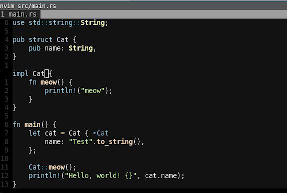</a>
</center>

<center>
    <a href="images/img3.png" target="_blank">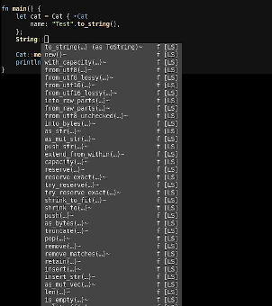</a>
</center>


As you can see, `rust.vim` provides us with nice, readable default highlighting. Also, notice the `>Cat` next to the struct initialization. This is rust-analyzer giving us a hint for our `Cat` type. Obviously, this is more useful for inferred types, but this is what it looks like.

Let’s check out some autocompletion features:

<center>
    <a href="images/img4.png" target="_blank">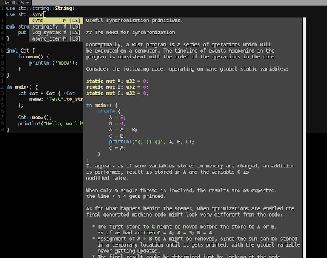</a>
</center>

<center>
    <a href="images/img5.png" target="_blank">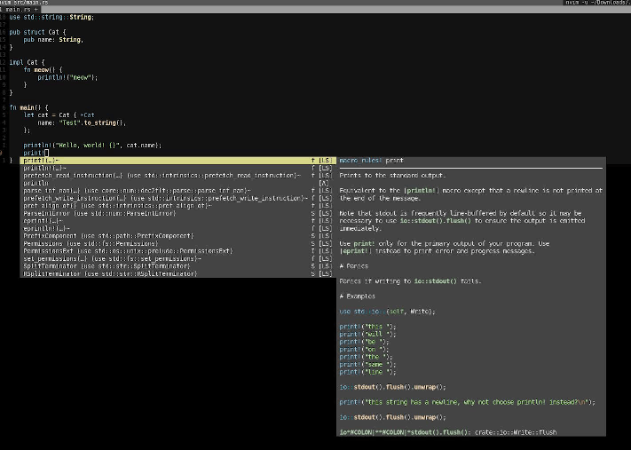</a>
</center>

<center>
    <a href="images/img6.png" target="_blank">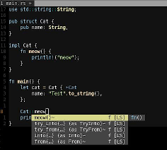</a>
</center>

<center>
    <a href="images/img7.png" target="_blank">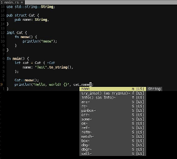</a>
</center>

<center>
    <a href="images/img8.png" target="_blank">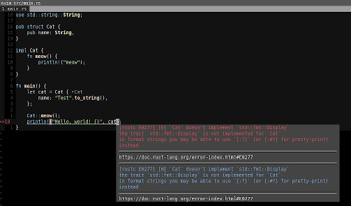</a>
</center>

Above, you can see examples for auto-completion regarding imports, macros, function names, struct members, and static functions. This overlay and the displayed info can, as mentioned above, be heavily customized to your needs. My setup is pretty much the default, though.

Let’s check out how rust-analyzer shows us errors and warnings together with ALE:

<center>
    <a href="images/img9.png" target="_blank">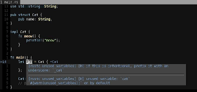</a>
</center>

<center>
    <a href="images/img10.png" target="_blank">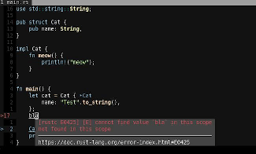</a>
</center>

<center>
    <a href="images/img11.png" target="_blank">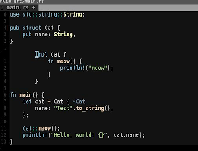</a>
</center>

And, as described above, we can check out the automatic `rust fmt` on save:

<center>
    <a href="images/img12.png" target="_blank">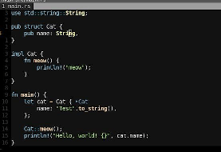</a>
</center>

<center>
    <a href="images/img13.png" target="_blank">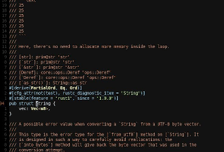</a>
</center>

Also, if our cursor is above `String` like in the screenshot above, we can use the `goto definition` binding to jump to the definition of `String` in the Rust source:

<center>
    <a href="images/img14.png" target="_blank">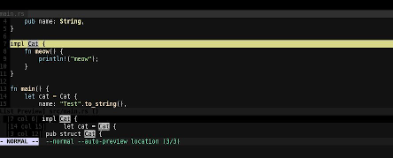</a>
</center>

This works with our own custom types as well. Another neat thing is the `Find References` function, which shows us all references of a certain type.

Pretty nice! And all with a minimal configuration and only a handful of plugins.

## Conclusion

As you can see, Vim is a lean, robust setup for efficiently editing Rust code. It allows us to enable fancy IDE features without the sluggish UI or high resource usage.

As mentioned in the article, this is but one possible way to create such a setup. Vim, with its sheer unlimited ecosystem, empowers the motivated user to customize everything to their exact preference.

Not everyone likes to spend hours tinkering with their tools, however. Fortunately, the default configuration for the tools used in this article work quite well out of the box and the same is true for many other options as well. In most cases, the relevant plugins are well-documented and there are communities you can reference if you’re trying to achieve something more complex.

