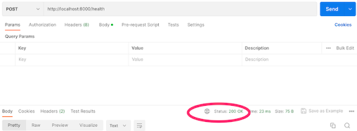

*This post was originally posted on the [LogRocket](https://blog.logrocket.com/async-crud-web-service-rust-warp/) blog on 24.04.2023 and was cross-posted here by the author.*

In a [previous post](https://blog.logrocket.com/create-a-backend-api-with-rust-and-postgres/) on this blog, we covered how to create a Rust web service using [Actix](https://actix.rs/) and [Diesel](https://diesel.rs/). This time around, we’ll create a lightweight, fully asynchronous web service using the [warp](https://github.com/seanmonstar/warp) web framework and [tokio-postgres](https://docs.rs/tokio-postgres/latest/tokio_postgres/index.html). Let’s get started.

## What is warp?

[Warp](https://blog.logrocket.com/building-rest-api-rust-warp/) is a lightweight [Rust-based web framework](https://blog.logrocket.com/top-rust-web-frameworks/) that is both fast and secure. Warp is based on the well-known and battle-tested [hyper HTTP library](https://blog.logrocket.com/a-minimal-web-service-in-rust-using-hyper/), which provides a robust and very fast basis for most Rust web frameworks.

## Why use warp in Rust?

Some of the key strengths of warp are its asynchronous request handling, powerful and flexible routing, and filtering capabilities, which allow developers to easily handle complex routing scenarios. Essentially, filters are just functions that can be composed together. In warp, they’re used for everything from routing to middleware to passing values to handlers. You can check out warp’s [release post](https://seanmonstar.com/post/176530511587/warp) for a deeper dive.

Another interesting feature of Warp is its built-in support for [WebSockets](https://blog.logrocket.com/websocket-tutorial-real-time-node-react/), which makes it easy to build real-time web applications. Even though warp is a newer framework compared to [Rocket](https://rocket.rs/) and [Actix Web](https://actix.rs/) — which are the most popular Rust web frameworks — it has an active community and has over [8,000+ stars on GitHub](https://github.com/seanmonstar/warp). Warp is easy to use, even for building large-scale applications. Let’s get our hands dirty with some practicals to better understand how warp works.

## Getting started with warp

Let’s start by setting up a warp project. To follow along, all you need is a reasonably recent Rust installation (v1.39+) and a way to run a [PostgreSQL database](https://blog.logrocket.com/interacting-databases-rust-diesel-vs-sqlx/) (e.g., Docker). First, create your test project like this:

```bash
cargo new warp-example
cd warp-example
```

Next, edit the `Cargo.toml` file and add the dependencies you’ll need, as shown below:

```toml
[dependencies]
tokio = { version = "0.2", features = ["macros"] }
warp = "0.2"
mobc-postgres = { version = "0.5", features = ["with-chrono-0_4"] }
mobc = "0.5"
serde = {version = "1.0", features = ["derive"] }
serde_derive = "1.0"
serde_json = "1.0"
thiserror = "1.0"
chrono = { version = "0.4", features = ["serde"] }
```

In case you’re wondering what all of this means, refer to this code:

```bash
tokio is our async runtime, which we need to execute futures
warp is our web framework
mobc / mobc-postgres represents an asynchronous connection pool for our database connections
serde is for serializing and deserializing objects (e.g., to/from JSON)
thiserror is a utility library we’ll use for error handling
chrono represents time and date utilities
```

To avoid just dumping everything into one file, let’s add a bit of structure to main.rs:

```rust
mod data;
mod db;
mod error;
mod handler;
```

For each of these modules, we’ll also create a file (e.g., `data.rs`). For the first step, create a web server running on port `8000` with a `/health` endpoint that returns a `200 OK`. In `main.rs`, add:

```rust
use warp::{http::StatusCode, Filter};

#[tokio::main]
async fn main() {
    let health_route = warp::path!("health")
        .map(|| StatusCode::OK);
    let routes = health_route
        .with(warp::cors().allow_any_origin());
    warp::serve(routes).run(([127, 0, 0, 1], 8000)).await;
}
```

In the above snippet, we defined our health_route, which matches on GET /health and returns 200 OK. Then, to demonstrate how to add middleware, set up this route with the warp::cors middleware, which allows the service to be called from any origin.

To finish setting up the server, use warp::serve along with the routes as parameters, and then use the .run() method to begin running the server on port 8000. Test whether it works by starting the application using cargo run and cURL, as shown below:

```bash
curl http://localhost:8000/health
```

Here is a [Postman](https://blog.logrocket.com/how-automate-api-tests-postman/) example showing that it actually worked:


<center>
    <a href="images/img1.png" target="_blank"></a>
</center>

## Connecting the web service to a database

So far, so good! The next step is to set up your Postgres database and add a check for a working database connection in the `/health` handler. To start a Postgres database, you can either use Docker or a local Postgres installation. With Docker, you can simply execute — you must have Docker all set up before running the code below:

```bash
docker run -p 7878:5432 -d postgres:15.2
```

This command starts a Postgres database on port `7878` with user `postgres`, database `postgres`, and no password. Now that you have a running database, the next step is to talk to this database from your warp application. To do so, you can use mobc, an async connection pool, to spawn multiple database connections and reuse them between requests. Setting this up only takes a couple of lines. First, define some convenience types in `main.rs`:

```rust
use mobc::{Connection, Pool};
use mobc_postgres::{tokio_postgres, PgConnectionManager};
use tokio_postgres::NoTls;

type DBCon = Connection<PgConnectionManager<NoTls>>;
type DBPool = Pool<PgConnectionManager<NoTls>>;
```

Next, create your connection pool in `db.rs`:

```rust
use crate::{DBCon, DBPool};
use mobc_postgres::{tokio_postgres, PgConnectionManager};
use tokio_postgres::{Config, Error, NoTls};
use std::fs;
use std::str::FromStr;
use std::time::Duration;

const DB_POOL_MAX_OPEN: u64 = 32;
const DB_POOL_MAX_IDLE: u64 = 8;
const DB_POOL_TIMEOUT_SECONDS: u64 = 15;

pub fn create_pool() -> std::result::Result<DBPool, mobc::Error<Error>> {
    let config = Config::from_str("postgres://postgres@127.0.0.1:7878/postgres")?;

    let manager = PgConnectionManager::new(config, NoTls);
    Ok(Pool::builder()
            .max_open(DB_POOL_MAX_OPEN)
            .max_idle(DB_POOL_MAX_IDLE)
            .get_timeout(Some(Duration::from_secs(DB_POOL_TIMEOUT_SECONDS)))
            .build(manager))
}
```

The `create_pool` function simply creates a Postgres connection string and defines some parameters for the connection pool, such as minimum and maximum open connections, as well as a connection timeout.

The next step is to simply build the pool and return it. At this point, no database connection is actually created, just the pool. Since we’re already here, let’s also create a function for initializing the database on startup:

```rust
const INIT_SQL: &str = "./db.sql";

pub async fn get_db_con(db_pool: &DBPool) -> Result<DBCon> {
    db_pool.get().await.map_err(DBPoolError)
}

pub async fn init_db(db_pool: &DBPool) -> Result<()> {
    let init_file = fs::read_to_string(INIT_SQL)?;
    let con = get_db_con(db_pool).await?;
    con
            .batch_execute(init_file.as_str())
            .await
            .map_err(DBInitError)?;
    Ok(())
}
```

With the `get_db_con` utility, we tried to get a new database connection from the pool. Don’t worry about the error right now — we’ll talk about error handling later on. To create a database table from the `db.sql` file on startup, the `init_db` function is called. This reads the file into a string and executes the query. The `init` query looks like this:

```sql
CREATE TABLE IF NOT EXISTS todo
(
    id SERIAL PRIMARY KEY NOT NULL,
    name VARCHAR(255),
    created_at timestamp with time zone DEFAULT (now() at time zone 'utc'),
    checked boolean DEFAULT false
);
```

Back in our main function, we can now call our database setup functions, like this:

```rust
let db_pool = db::create_pool().expect("database pool can be created");

db::init_db(&db_pool)
    .await
    .expect("database can be initialized");
```

If any of the database setup codes fail, we can throw our hands up and panic because it won’t make sense to continue. Assuming it doesn’t fail, it’s finally time to tackle the primary goal of this section: to add a database check to the `/health` handler.

## Adding a database check to the `/health` handler

To do this, we need a way to pass the `db_pool` to the handler. This is a perfect opportunity to write our first warp `filter`. In main.rs, add the following `with_db` filter:

```rust
use std::convert::Infallible;
use warp::{Filter, Rejection};

fn with_db(db_pool: DBPool) -> impl Filter<Extract = (DBPool,), Error = Infallible> + Clone {
    warp::any().map(move || db_pool.clone())
}
```

This is a simple extract filter. The above means that for any route (`any()`), you want to extract a `DBPool` and pass it along. If you’re interested in learning more about filters, the docs are quite helpful. The filter is then simply added to the handler definition with the `.and()` operator:

```rust
let health_route = warp::path!("health")
  .and(with_db(db_pool.clone()))
  .and_then(handler::health_handler);
```

Move the `health` handler to the `handler.rs` file and add the database check, like so:

```rust
use crate::{db, DBPool};
use warp::{http::StatusCode, reject, Reply, Rejection};

pub async fn health_handler(db_pool: DBPool) -> std::result::Result<impl Reply, Rejection> {
    let db = db::get_db_con(&db_pool)
            .await
            .map_err(|e| reject::custom(e))?;

    db.execute("SELECT 1", &[])
            .await
            .map_err(|e| reject::custom(DBQueryError(e)))?;
    Ok(StatusCode::OK)
}
```

Now, the handler receives a `DBPool`, which you can use to get a connection and initiate a sanity check query against the database. If an error occurs during the check, use `reject::custom` to return a custom error. Next, as promised, let’s take a look at [error handling](https://blog.logrocket.com/rust-axum-error-handling/) with warp.

## Handling errors with warp

Clean error handling is one of the most important and often overlooked things in any web application. The goal is to provide helpful errors to API consumers while not leaking internal details. We’ll use the [thiserror](https://github.com/dtolnay/thiserror) library to conveniently create custom errors. Start in `error.rs` and define an `Error` enum, which has a variant for all of your errors. Here’s the code:

```rust
use mobc_postgres::tokio_postgres;
use thiserror::Error;

#[derive(Error, Debug)]
pub enum Error {
    #[error("error getting connection from DB pool: {0}")]
    DBPoolError(mobc::Error<tokio_postgres::Error>),
    #[error("error executing DB query: {0}")]
    DBQueryError(#[from] tokio_postgres::Error),
    #[error("error creating table: {0}")]
    DBInitError(tokio_postgres::Error),
    #[error("error reading file: {0}")]
    ReadFileError(#[from] std::io::Error),
}
```

If we could find a way to transform these and other errors into meaningful API responses, we could simply return one of our custom errors from a handler, and the caller would automatically get the correct error message and status code.

To do this, we’ll use warp’s concept of `rejections`. First, add a convenience type to `main.rs` for fallible results:

```rust
type Result<T> = std::result::Result<T, warp::Rejection>;
```

Next, make sure your custom errors are recognized as rejections by warp by implementing the Reject trait:

```rust
impl warp::reject::Reject for Error {}
```

Define a `rejection` handler, which turns rejections into nice error responses in the following form, like so:

```rust
#[derive(Serialize)]
struct ErrorResponse {
    message: String,
}
```

Such a `rejection` handler might look like this:

```rust
pub async fn handle_rejection(err: Rejection) -> std::result::Result<impl Reply, Infallible> {
    let code;
    let message;

    if err.is_not_found() {
            code = StatusCode::NOT_FOUND;
            message = "Not Found";
    } else if let Some(_) = err.find::<warp::filters::body::BodyDeserializeError>() {
            code = StatusCode::BAD_REQUEST;
            message = "Invalid Body";
    } else if let Some(e) = err.find::<Error>() {
            match e {
                Error::DBQueryError(_) => {
                    code = StatusCode::BAD_REQUEST;
                    message = "Could not Execute request";
                }
                _ => {
                    eprintln!("unhandled application error: {:?}", err);
                    code = StatusCode::INTERNAL_SERVER_ERROR;
                    message = "Internal Server Error";
                }
            }
    } else if let Some(_) = err.find::<warp::reject::MethodNotAllowed>() {
            code = StatusCode::METHOD_NOT_ALLOWED;
            message = "Method Not Allowed";
    } else {
            eprintln!("unhandled error: {:?}", err);
            code = StatusCode::INTERNAL_SERVER_ERROR;
            message = "Internal Server Error";
    }

    let json = warp::reply::json(&ErrorResponse {
            message: message.into(),
    });

    Ok(warp::reply::with_status(json, code))
}
```

Basically, we get a `Rejection` from a handler. Then, depending on the type of error, we set the message and status code for the response. As you can see, we can handle both generic errors, such as `not found`, and specific problems, such as an error encountered while parsing the JSON body of a request.

The fallback handlers return a generic 500 error to the user and log what went wrong, so you can investigate if necessary without leaking internals. In the routing definition, simply add this error handler using the `recover` filter:

```rust
let routes = health_route
    .with(warp::cors().allow_any_origin())
    .recover(error::handle_rejection);
```

Perfect! We’ve made a lot of progress already. All that’s left is to actually implement CRUD handlers for your to-do app.

## Implementing the CRUD API

What is CRUD, you asked? CRUD is a term used to describe a group of operations that are commonly used to manage data in a database. The acronym stands for Create, Read, Update, and Delete, which pretty much sums up what these operations are all about.

When we talk about the CRUD API, we’re referring to a set of endpoints that allow users to carry out these operations on a particular resource or a group of resources. Essentially, it’s a way to define how a user can create new entries, read data that’s already been entered, edit or update existing entries, and delete entries from the database.

Now, we have a web server running and connected to a database as well as a way to handle errors gracefully. The only thing missing from our app is, well, the actual CRUD application logic. We’ll implement the endpoint to create, update, delete, and get `todos`:

```bash
GET /todo/?search={searchString} to list all todos, filtered by an optional search string
POST /todo/ to create a todo
PUT /todo/{id} to update the todo with the given ID
DELETE /todo/{id} to delete the todo with the given ID
```

## Creating `todos`

The first step is to create `todos` because without them, we won’t be able to test the other endpoints conveniently. In `db.rs`, add a function for inserting `todos` into the database:

```rust
const TABLE: &str = "todo";

pub async fn create_todo(db_pool: &DBPool, body: TodoRequest) -> Result<Todo> {
    let con = get_db_con(db_pool).await?;
    let query = format!("INSERT INTO {} (name) VALUES ($1) RETURNING *", TABLE);
    let row = con
            .query_one(query.as_str(), &[&body.name])
            .await
            .map_err(DBQueryError)?;
    Ok(row_to_todo(&row))
}

fn row_to_todo(row: &Row) -> Todo {
    let id: i32 = row.get(0);
    let name: String = row.get(1);
    let created_at: DateTime<Utc> = row.get(2);
    let checked: bool = row.get(3);
    Todo {
            id,
            name,
            created_at,
            checked,
    }
}
```

This establishes a connection from the pool, sends an `insert` query, and transforms the returned row to a `Todo`. For this to work, you’ll need some data objects, which are defined in `data.rs`:

```rust
use chrono::prelude::*;
use serde_derive::{Deserialize, Serialize};

#[derive(Deserialize)]
pub struct Todo {
    pub id: i32,
    pub name: String,
    pub created_at: DateTime<Utc>,
    pub checked: bool,
}

#[derive(Deserialize)]
pub struct TodoRequest {
    pub name: String,
}

#[derive(Deserialize)]
pub struct TodoUpdateRequest {
    pub name: String,
    pub checked: bool,
}

#[derive(Serialize)]
pub struct TodoResponse {
    pub id: i32,
    pub name: String,
    pub checked: bool,
}

impl TodoResponse {
    pub fn of(todo: Todo) -> TodoResponse {
            TodoResponse {
                id: todo.id,
                name: todo.name,
                checked: todo.checked,
            }
    }
}
```

## Building handlers

The `Todo` struct is essentially a mirror of your database table. `tokio-postgres` can use chrono’s `DateTime<Utc>` to map to and from timestamps. The other structs are the [JSON requests](https://blog.logrocket.com/json-input-validation-in-rust-web-services/) you expect for creating and updating a `todo` and the response you send back in your list, update, and create handlers. You can now create your actual create handler in `handler.rs`:

```rust
pub async fn create_todo_handler(body: TodoRequest, db_pool: DBPool) -> Result<impl Reply> {
    Ok(json(&TodoResponse::of(
        db::create_todo(&db_pool, body)
            .await
            .map_err(|e| reject::custom(e))?,
    )))
}
```

In this case, you get both the request `body` parsed to a `TodoRequest` and the `db_pool` passed into the handler. Once in there, simply call the `database` function, map it to a `TodoResponse`, and use warp’s `reply::json` helper to serialize it to JSON.

If an error happens, handle it with warp’s `reject::custom`, which enables you to create a `rejection` out of our custom error type. The only thing missing is the routing definition in `main.rs`:

```rust
let todo = warp::path("todo");
let todo_routes = todo
        .and(warp::post())
        .and(warp::body::json())
        .and(with_db(db_pool.clone()))
        .and_then(handler::create_todo_handler));

let routes = health_route
    .or(todo_routes)
    .with(warp::cors().allow_any_origin())
    .recover(error::handle_rejection);
```

You’ll use `warp::path` at `/todo/` for several routes. Then, using warp’s filters, compose your `create` handler. Add the `post` method, specify that you expect a JSON body, and use your `with_db` filter to signal that you need database access. Finally, finish it up by telling the route which handler to use. All of that is then passed to the routes with an or operator. Test it with the following command:

```bash
curl -X POST 'http://localhost:8000/todo/' -H 'Content-Type: application/json' -d '{"name": "Some Todo"}'

{"id":1,"name":"Some Todo","checked":false}
```

Great! Now that you know how it works, you can do the other three handlers all at once. Again, start by adding the database helpers:

```rust
const SELECT_FIELDS: &str = "id, name, created_at, checked";

pub async fn fetch_todos(db_pool: &DBPool, search: Option<String>) -> Result<Vec<Todo>> {
    let con = get_db_con(db_pool).await?;
    let where_clause = match search {
            Some(_) => "WHERE name like $1",
            None => "",
    };
    let query = format!(
            "SELECT {} FROM {} {} ORDER BY created_at DESC",
            SELECT_FIELDS, TABLE, where_clause
    );
    let q = match search {
            Some(v) => con.query(query.as_str(), &[&v]).await,
            None => con.query(query.as_str(), &[]).await,
    };
    let rows = q.map_err(DBQueryError)?;

    Ok(rows.iter().map(|r| row_to_todo(&r)).collect())
}

pub async fn update_todo(db_pool: &DBPool, id: i32, body: TodoUpdateRequest) -> Result<Todo> {
    let con = get_db_con(db_pool).await?;
    let query = format!(
            "UPDATE {} SET name = $1, checked = $2 WHERE id = $3 RETURNING *",
            TABLE
    );
    let row = con
            .query_one(query.as_str(), &[&body.name, &body.checked, &id])
            .await
            .map_err(DBQueryError)?;
    Ok(row_to_todo(&row))
}

pub async fn delete_todo(db_pool: &DBPool, id: i32) -> Result<u64> {
    let con = get_db_con(db_pool).await?;
    let query = format!("DELETE FROM {} WHERE id = $1", TABLE);
    con.execute(query.as_str(), &[&id])
            .await
            .map_err(DBQueryError)
}
```

These are essentially the same as in the `create` case, except for `fetch_todos`, where you’d create a different query if there is a search term. Let’s look at the handlers next:

```rust
#[derive(Deserialize)]
pub struct SearchQuery {
    search: Option<String>,
}

pub async fn list_todos_handler(query: SearchQuery, db_pool: DBPool) -> Result<impl Reply> {
    let todos = db::fetch_todos(&db_pool, query.search)
            .await
            .map_err(|e| reject::custom(e))?;
    Ok(json::<Vec<_>>(
            &todos.into_iter().map(|t| TodoResponse::of(t)).collect(),
    ))
}

pub async fn update_todo_handler(
    id: i32,
    body: TodoUpdateRequest,
    db_pool: DBPool,
) -> Result<impl Reply> {
    Ok(json(&TodoResponse::of(
        db::update_todo(&db_pool, id, body)
            .await
            .map_err(|e| reject::custom(e))?,
    )))
}

pub async fn delete_todo_handler(id: i32, db_pool: DBPool) -> Result<impl Reply> {
    db::delete_todo(&db_pool, id)
            .await
            .map_err(|e| reject::custom(e))?;
    Ok(StatusCode::OK)
}
```

Again, you’ll see some familiar things. Every handler calls the database layer, handles the error, and creates a return value for the caller if everything goes well. The one interesting exception is `list_todos_handler`, where the aforementioned query parameter is passed in, already parsed to a `SearchQuery`.

## Testing the API

This is how you deal with query parameters in warp. If you had more parameters with different types, you could simply add them to the `SearchQuery` struct, and they would be automatically parsed. Let’s wire everything up and do one final test, like this:

```rust
let todo_routes = todo
        .and(warp::get())
        .and(warp::query())
        .and(with_db(db_pool.clone()))
        .and_then(handler::list_todos_handler)
    .or(todo
            .and(warp::post())
            .and(warp::body::json())
            .and(with_db(db_pool.clone()))
            .and_then(handler::create_todo_handler))
    .or(todo
            .and(warp::put())
            .and(warp::path::param())
            .and(warp::body::json())
            .and(with_db(db_pool.clone()))
            .and_then(handler::update_todo_handler))
    .or(todo
            .and(warp::delete())
            .and(warp::path::param())
            .and(with_db(db_pool.clone()))
            .and_then(handler::delete_todo_handler));
```

There are some new things here. To get the query parameter to the `list` handler, you need to use `warp::query()`. To get the id parameter for update and delete, use `warp::path::param()`. Combine the different routes with `or` operators, and your `todo` routes are set up.

There are many different ways to create and structure routes in warp. It’s just functions being composed together, so the process is very flexible. For more examples, check out the [official docs](https://docs.rs/warp/0.1.22/warp/filters/path/).
Now, let’s test the whole thing. First, see if the error handling actually works:

```bash
curl -v -X POST 'http://localhost:8000/todo/' -H 'Content-Type: application/json' -d '{"wrong": "Some Todo"}'

HTTP/1.1 400 Bad Request
{"message":"Invalid Body"}
```

Next, add another `Todo`, check it off immediately, and try to update a nonexistent `Todo`:

```bash
curl -X POST 'http://localhost:8000/todo/' -H 'Content-Type: application/json' -d '{"name": "Done Todo"}'

{"id":2,"name":"Done Todo","checked":false}


curl -X PUT 'http://localhost:8000/todo/2' -H 'Content-Type: application/json' -d '{"name": "Done Todo", "checked": true}'

{"id":2,"name":"Done Todo","checked":true}


curl -X PUT 'http://localhost:8000/todo/2000' -H 'Content-Type: application/json' -d '{"name": "Done Todo", "checked": true}'

{"message":"Could not Execute request"}
```

So far, so good! Now, list them, filter the list, delete one of them, and list them again:

```bash
curl -X GET 'http://localhost:8000/todo/' -H 'Content-Type: application/json'

[{"id":1,"name":"Some Todo","checked":false},{"id":2,"name":"Done Todo","checked":true}]


curl -X GET 'http://localhost:8000/todo/?search=Done%20Todo' -H 'Content-Type: application/json'

[{"id":2,"name":"Done Todo","checked":true}]


curl -v -X DELETE 'http://localhost:8000/todo/2' -H 'Content-Type: application/json'

HTTP/1.1 200 OK


curl -X GET 'http://localhost:8000/todo/' -H 'Content-Type: application/json'

[{"id":1,"name":"Some Todo","checked":false}]
```

Perfect! Everything works as expected. You can find the full code for this example on [GitHub](https://github.com/zupzup/warp-postgres-example).

## Conclusion

Building a CRUD app with warp provides a good introduction to Rust web development as warp stands out as one of the top Rust web frameworks. Warp is fast, secure, and has a not-so-steep learning curve if you are familiar with Rust already.

I built the same application with [Node.js](https://blog.logrocket.com/build-api-from-scratch-using-mikroorm-node-js-express-js/) and [Express.js](https://blog.logrocket.com/build-api-from-scratch-using-mikroorm-node-js-express-js/) in less time and also plugged both applications into the same database. I also ran a performance test with ab [benchmark](https://httpd.apache.org/docs/2.4/programs/ab.html). Interestingly, the difference in performance wasn’t so much, but of course, the data wasn’t big enough to simulate real-life situations. So, the performance was fair on both sides, and the differences were usually between one to three seconds in favor of Rust.

I hope this tutorial was helpful in helping you kickstart your web development with Rust and warp. For further reading, you should consider taking a look at the [documentation](https://docs.rs/warp/latest/warp/) to search for specific help when you need it.

