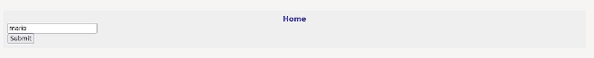
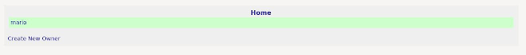
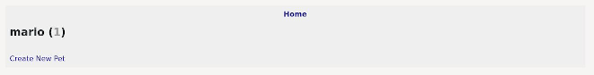
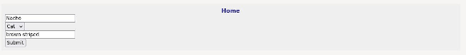
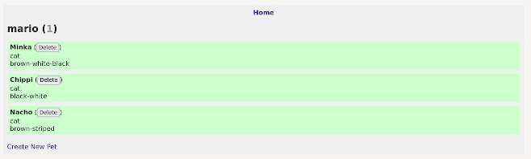
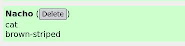

*This post was originally posted on the [LogRocket](https://blog.logrocket.com/full-stack-rust-a-complete-tutorial-with-examples/) blog on 09.09.2021 and was cross-posted here by the author.*

Previously on this blog, we covered how to create a [CRUD web service with Rust using warp](https://blog.logrocket.com/create-an-async-crud-web-service-in-rust-with-warp/) and how to [build a frontend web app with Rust using Yew](https://blog.logrocket.com/rust-webassembly-frontend-web-app-yew/).

In this tutorial, we’ll put it all together and build a simple full stack web application, featuring a database-backed REST backend and a WASM-based single-page application on the frontend, which calls this backend.

To top it all off, we’ll create a shared Rust module, which will be used by both the frontend and the backend, to demonstrate how to share code in such a setup.

We’ll build a very simple pet owner app that enables the user to add owners and their pets. Our app will feature a detailed view for owners and their list of pets, enabling them to delete and add pets as needed. 

Here’s what we’ll cover:

* Setting up a full-stack Rust app
* Common functionality
* Building the REST backend
* Frontend implementation
* Testing our Rust full-stack app

You don’t need to have read the aforementioned posts to follow along, but since this post includes both concepts, we won’t go into the same level of depth regarding the basics. If you want to dive deeper, feel free to scan over them.

Without further ado, let’s get started!

## Setting up a full-stack Rust app

To follow along, all you need is a [reasonably recent Rust installation](https://www.rust-lang.org/). [Docker](https://blog.logrocket.com/packaging-a-rust-web-service-using-docker/), or some other way of [running a Postgres database](https://blog.logrocket.com/create-a-backend-api-with-rust-and-postgres/), would also be useful.

In this case, since we’re going to write both the backend and frontend in Rust, and we’re going to share some code between them, we’ll create a multimember workspace project using [Cargo](https://blog.logrocket.com/demystifying-cargo-in-rust/).

First, create a new Rust project:

```bash
    cargo new rust-fullstack-example
    cd rust-fullstack-example
```

Then, delete the `src` folder and edit the `Cargo.toml` file as follows:

```toml
    [workspace]
    members = [
        "backend",
        "frontend",
        "common"
    ]
```

Now we can create our three separate Rust projects:

```bash
    cargo new --lib common
    cargo new backend
    cargo new --lib frontend
```

Navigate to the `common` directory and edit the `Cargo.toml` file, adding the following dependencies:

```toml
    [dependencies]
    serde = {version = "=1.0.126", features = ["derive"] }
```

Next, edit the `Cargo.toml` file in `frontend` and add these dependencies:

```toml
    [dependencies]
    yew = "0.18"
    wasm-bindgen = "0.2.67"
    serde_json = "1"
    serde = {version = "=1.0.126", features = ["derive"] }
    anyhow = "1"
    yew-router = "0.15.0"
    common = { version = "0.1.0", path = "../common" }
```

We’re using [Yew](https://yew.rs/) to build the [Wasm](https://blog.logrocket.com/webassembly-runtimes-compared/). We add some more utility libraries for routing and error and [JSON handling](https://blog.logrocket.com/json-and-rust-why-serde_json-is-the-top-choice/), as well as an internal dependency to our `common` library, which will hold the code shared between the frontend and backend.

Finally, edit the `Cargo.toml` file in `backend` and add these dependencies:

```toml
    [dependencies]
    tokio = { version = "=1.6.1", features = ["macros", "rt-multi-thread"] }
    warp = "=0.3.1"
    mobc = "=0.7.2"
    mobc-postgres = { version = "=0.7.0", features = ["with-chrono-0_4", "with-serde_json-1"] }
    serde = {version = "=1.0.126", features = ["derive"] }
    serde_json = "=1.0.64"
    thiserror = "=1.0.24"
    common = { version = "0.1.0", path = "../common" }
```

We’re using the [warp](https://github.com/seanmonstar/warp) [web framework](https://github.com/seanmonstar/warp) to build the backend. Since we’re using a Postgres database to store our data, we’ll also add the [mobc](https://github.com/importcjj/mobc) connection pool for Postgres.

Besides that, since Warp is optimized for [Tokio](https://tokio.rs/), we need to add it as our async runtime. We’ll add some utility libraries for error and JSON handling, as well as an internal dependency to our `common` project.

That’s it for the setup. Let’s start writing the shared code for both `frontend` and `backend` in our `common` project.

## Common functionality

We’ll start off by fleshing out the `common` module, where we’ll add the shared data models between the `frontend` and the `backend`. In a real application, much more could be shared — including validation, helpers, utilities etc. — but, in this case, we’ll stick to the data structs.

In `lib.rs`, we’ll add the data models for our `Owner` and `Pet` models:

```rust
    use serde::{Deserialize, Serialize};
    
    #[derive(Deserialize, Clone, PartialEq, Debug)]
    pub struct Owner {
        pub id: i32,
        pub name: String,
    }
    
    #[derive(Serialize, Deserialize, Clone, PartialEq, Debug)]
    pub struct OwnerRequest {
        pub name: String,
    }
    
    #[derive(Serialize, Deserialize, Clone, PartialEq, Debug)]
    pub struct OwnerResponse {
        pub id: i32,
        pub name: String,
    }
    
    impl OwnerResponse {
        pub fn of(owner: Owner) -> OwnerResponse {
            OwnerResponse {
                id: owner.id,
                name: owner.name,
            }
        }
    }
    
    #[derive(Deserialize, Clone, PartialEq, Debug)]
    pub struct Pet {
        pub id: i32,
        pub name: String,
        pub owner_id: i32,
        pub animal_type: String,
        pub color: Option<String>,
    }
    
    #[derive(Serialize, Deserialize, Clone, PartialEq, Debug)]
    pub struct PetRequest {
        pub name: String,
        pub animal_type: String,
        pub color: Option<String>,
    }
    
    #[derive(Serialize, Deserialize, Clone, PartialEq, Debug)]
    pub struct PetResponse {
        pub id: i32,
        pub name: String,
        pub animal_type: String,
        pub color: Option<String>,
    }
    
    impl PetResponse {
        pub fn of(pet: Pet) -> PetResponse {
            PetResponse {
                id: pet.id,
                name: pet.name,
                animal_type: pet.animal_type,
                color: pet.color,
            }
        }
    }
```

We define the database domain structs `Owner` and `Pet`, as well as the request and response data objects, we’ll use to communicate between the frontend and the backend.

Sharing this code is nice because adding or removing a field somewhere in the API will give us a compile error in the frontend if we don’t make accommodations for the change. This might save us some time chasing an error when an API is updated.

The `Owner` is very simple, with only a `name` and the database ID. The `Pet` type has a `name`, an `animal_type`, and an optional `color`.

We also define some helpers to create our data objects for the API from the database domain objects.

This is all we’ll put in the `common` project.

Let’s continue with the backend part of our app.

## Building the REST backend

We start off with the database definition for our data model:

```bash
    CREATE TABLE IF NOT EXISTS owner
    (
        id SERIAL PRIMARY KEY NOT NULL,
        name VARCHAR(255) NOT NULL
    );
    
    CREATE TABLE IF NOT EXISTS pet
    (
        id SERIAL PRIMARY KEY NOT NULL,
        owner_id INT NOT NULL,
        name VARCHAR(255) NOT NULL,
        animal_type VARCHAR(255) NOT NULL,
        color VARCHAR(255),
    
        CONSTRAINT fk_pet_owner_id FOREIGN KEY (owner_id) REFERENCES pet(id)
    );
```

This defines our two data tables with their respective fields.

We’ll build the backend from the bottom up, starting with the database layer and working our way up to the web server and routing definitions.

First, we’ll create a `db` module. In here, we’ll start with some database and connection pool initialization code in `mod.rs`:

```rust
    type Result<T> = std::result::Result<T, error::Error>;
    
    const DB_POOL_MAX_OPEN: u64 = 32;
    const DB_POOL_MAX_IDLE: u64 = 8;
    const DB_POOL_TIMEOUT_SECONDS: u64 = 15;
    const INIT_SQL: &str = "./db.sql";
    
    pub async fn init_db(db_pool: &DBPool) -> Result<()> {
        let init_file = fs::read_to_string(INIT_SQL)?;
        let con = get_db_con(db_pool).await?;
        con.batch_execute(init_file.as_str())
            .await
            .map_err(DBInitError)?;
        Ok(())
    }
    
    pub async fn get_db_con(db_pool: &DBPool) -> Result<DBCon> {
        db_pool.get().await.map_err(DBPoolError)
    }
    
    pub fn create_pool() -> std::result::Result<DBPool, mobc::Error<Error>> {
        let config = Config::from_str("postgres://postgres@127.0.0.1:7878/postgres")?;
    
        let manager = PgConnectionManager::new(config, NoTls);
        Ok(Pool::builder()
            .max_open(DB_POOL_MAX_OPEN)
            .max_idle(DB_POOL_MAX_IDLE)
            .get_timeout(Some(Duration::from_secs(DB_POOL_TIMEOUT_SECONDS)))
            .build(manager))
    }
```

In `init_db`, we read the aforementioned `db.sql` file and execute it to initialize our tables.

The `create_pool` and `get_db_con` helpers are there to initialize the database pool and to get a new connection from the pool.

With those setup details out of the way, let’s look at our first domain access object in `owner.rs`.

```rust
    pub const TABLE: &str = "owner";
    const SELECT_FIELDS: &str = "id, name";
    
    pub async fn fetch(db_pool: &DBPool) -> Result<Vec<Owner>> {
        let con = get_db_con(db_pool).await?;
        let query = format!("SELECT {} FROM {}", SELECT_FIELDS, TABLE);
        let rows = con.query(query.as_str(), &[]).await.map_err(DBQueryError)?;
    
        Ok(rows.iter().map(|r| row_to_owner(&r)).collect())
    }
    
    pub async fn fetch_one(db_pool: &DBPool, id: i32) -> Result<Owner> {
        let con = get_db_con(db_pool).await?;
        let query = format!("SELECT {} FROM {} WHERE id = $1", SELECT_FIELDS, TABLE);
    
        let row = con
            .query_one(query.as_str(), &[&id])
            .await
            .map_err(DBQueryError)?;
        Ok(row_to_owner(&row))
    }
    
    pub async fn create(db_pool: &DBPool, body: OwnerRequest) -> Result<Owner> {
        let con = get_db_con(db_pool).await?;
        let query = format!("INSERT INTO {} (name) VALUES ($1) RETURNING *", TABLE);
        let row = con
            .query_one(query.as_str(), &[&body.name])
            .await
            .map_err(DBQueryError)?;
        Ok(row_to_owner(&row))
    }
    
    fn row_to_owner(row: &Row) -> Owner {
        let id: i32 = row.get(0);
        let name: String = row.get(1);
        Owner { id, name }
    }
```

There are three database operations for owners:

1. `fetch` fetches all owners
2. `fetch_one` fetches the owner with a given ID
3. `create` creates a new owner

The implementation of these methods is rather straightforward. At first, we get a connection from the pool, then we define the Postgres query to be executed and execute it with the given values, propagating any errors.

Finally, we use the `row_to_owner` helper to convert the returned database row data to an actual `Owner` struct.

The `pet.rs` data access object is quite similar:

```rust
    pub const TABLE: &str = "pet";
    const SELECT_FIELDS: &str = "id, owner_id, name, animal_type, color";
    
    pub async fn fetch(db_pool: &DBPool, owner_id: i32) -> Result<Vec<Pet>> {
        let con = get_db_con(db_pool).await?;
        let query = format!(
            "SELECT {} FROM {} WHERE owner_id = $1",
            SELECT_FIELDS, TABLE
        );
        let rows = con
            .query(query.as_str(), &[&owner_id])
            .await
            .map_err(DBQueryError)?;
    
        Ok(rows.iter().map(|r| row_to_pet(&r)).collect())
    }
    
    pub async fn create(db_pool: &DBPool, owner_id: i32, body: PetRequest) -> Result<Pet> {
        let con = get_db_con(db_pool).await?;
        let query = format!(
            "INSERT INTO {} (name, owner_id, animal_type, color) VALUES ($1, $2, $3, $4) RETURNING *",
            TABLE
        );
        let row = con
            .query_one(
                query.as_str(),
                &[&body.name, &owner_id, &body.animal_type, &body.color],
            )
            .await
            .map_err(DBQueryError)?;
        Ok(row_to_pet(&row))
    }
    
    pub async fn delete(db_pool: &DBPool, owner_id: i32, id: i32) -> Result<u64> {
        let con = get_db_con(db_pool).await?;
        let query = format!("DELETE FROM {} WHERE id = $1 AND owner_id = $2", TABLE);
        con.execute(query.as_str(), &[&id, &owner_id])
            .await
            .map_err(DBQueryError)
    }
    
    fn row_to_pet(row: &Row) -> Pet {
        let id: i32 = row.get(0);
        let owner_id: i32 = row.get(1);
        let name: String = row.get(2);
        let animal_type: String = row.get(3);
        let color: Option<String> = row.get(4);
        Pet {
            id,
            name,
            owner_id,
            animal_type,
            color,
        }
    }
```

Here we have the following three methods:

1. `fetch` fetches all pets belonging to a given `owner_id`
2. `create` creates a new pet for the given `owner_id`
3. `delete` deletes the pet with the given `id` and `owner_id`

In terms of implementation, it follows the exact same concept as `owner.rs` above.

This concludes the database layer. Let’s move one step up and implement `handler.rs` in `src`.

```rust
    pub async fn list_pets_handler(owner_id: i32, db_pool: DBPool) -> Result<impl Reply> {
        let pets = db::pet::fetch(&db_pool, owner_id)
            .await
            .map_err(reject::custom)?;
        Ok(json::<Vec<_>>(
            &pets.into_iter().map(PetResponse::of).collect(),
        ))
    }
    
    pub async fn create_pet_handler(
        owner_id: i32,
        body: PetRequest,
        db_pool: DBPool,
    ) -> Result<impl Reply> {
        Ok(json(&PetResponse::of(
            db::pet::create(&db_pool, owner_id, body)
                .await
                .map_err(reject::custom)?,
        )))
    }
    
    pub async fn delete_pet_handler(owner_id: i32, id: i32, db_pool: DBPool) -> Result<impl Reply> {
        db::pet::delete(&db_pool, owner_id, id)
            .await
            .map_err(reject::custom)?;
        Ok(StatusCode::OK)
    }
    
    pub async fn list_owners_handler(db_pool: DBPool) -> Result<impl Reply> {
        let owners = db::owner::fetch(&db_pool).await.map_err(reject::custom)?;
        Ok(json::<Vec<_>>(
            &owners.into_iter().map(OwnerResponse::of).collect(),
        ))
    }
    
    pub async fn fetch_owner_handler(id: i32, db_pool: DBPool) -> Result<impl Reply> {
        let owner = db::owner::fetch_one(&db_pool, id)
            .await
            .map_err(reject::custom)?;
        Ok(json(&OwnerResponse::of(owner)))
    }
    
    pub async fn create_owner_handler(body: OwnerRequest, db_pool: DBPool) -> Result<impl Reply> {
        Ok(json(&OwnerResponse::of(
            db::owner::create(&db_pool, body)
                .await
                .map_err(reject::custom)?,
        )))
    }
```

The API-surface consists of six operations:

1. List owners
2. Fetch owner for a given ID
3. Create owner
4. Create pet
5. Delete pet
6. List pets for a given owner

In each case, we simply call the corresponding operation in our database layer and convert the returned `Owner`, or `Pet`  into an `OwnerResponse` or `PetResponse`, respectively, returning any errors directly to the caller.

Finally, moving yet another step up, we implement the actual web server pointing to these handlers in `main.rs`.

```rust
    mod db;
    mod error;
    mod handler;
    
    type Result<T> = std::result::Result<T, Rejection>;
    type DBCon = Connection<PgConnectionManager<NoTls>>;
    type DBPool = Pool<PgConnectionManager<NoTls>>;
    
    #[tokio::main]
    async fn main() {
        let db_pool = db::create_pool().expect("database pool can be created");
    
        db::init_db(&db_pool)
            .await
            .expect("database can be initialized");
    
        let pet = warp::path!("owner" / i32 / "pet");
        let pet_param = warp::path!("owner" / i32 / "pet" / i32);
        let owner = warp::path("owner");
    
        let pet_routes = pet
            .and(warp::get())
            .and(with_db(db_pool.clone()))
            .and_then(handler::list_pets_handler)
            .or(pet
                .and(warp::post())
                .and(warp::body::json())
                .and(with_db(db_pool.clone()))
                .and_then(handler::create_pet_handler))
            .or(pet_param
                .and(warp::delete())
                .and(with_db(db_pool.clone()))
                .and_then(handler::delete_pet_handler));
    
        let owner_routes = owner
            .and(warp::get())
            .and(warp::path::param())
            .and(with_db(db_pool.clone()))
            .and_then(handler::fetch_owner_handler)
            .or(owner
                .and(warp::get())
                .and(with_db(db_pool.clone()))
                .and_then(handler::list_owners_handler))
            .or(owner
                .and(warp::post())
                .and(warp::body::json())
                .and(with_db(db_pool.clone()))
                .and_then(handler::create_owner_handler));
    
        let routes = pet_routes
            .or(owner_routes)
            .recover(error::handle_rejection)
            .with(
                warp::cors()
                    .allow_credentials(true)
                    .allow_methods(&[
                        Method::OPTIONS,
                        Method::GET,
                        Method::POST,
                        Method::DELETE,
                        Method::PUT,
                    ])
                    .allow_headers(vec![header::CONTENT_TYPE, header::ACCEPT])
                    .expose_headers(vec![header::LINK])
                    .max_age(300)
                    .allow_any_origin(),
            );
    
        warp::serve(routes).run(([127, 0, 0, 1], 8000)).await;
    }
    
    fn with_db(db_pool: DBPool) -> impl Filter<Extract = (DBPool,), Error = Infallible> + Clone {
        warp::any().map(move || db_pool.clone())
    }
```

There’s quite a bit to unpack, so let’s go through it.

Initially, we define the modules and some types to save time typing. Then, in the `main` function (or `tokio::main`, the asynchronous entry point of our application), we first initialize the database pool and database.

At the bottom, there is a `with_db` filter, which is the preferred way in warp to pass data to a handler — in this case, the connection pool.

Then we define several routing bases for `pet`, which has the form of `/owner/$ownerId/pet`; `pet_param`, which adds a `/$petId` at the end; and `owner`, which simply contains `/owner`.

With these bases, we can define our routes, leading to the different handlers:

* `GET /owner` lists all owners
* `GET /owner/$ownerId` returns owner with the given ID
* `POST /owner` creates an owner
* `GET /owner/$ownerid/pet` lists all pets of the given owner
* `POST /owner/$ownerId/pet` creates a pet for the given owner
* `DELETE /owner/$ownerId/pet/$petId` deletes the pet with the given ID and owner ID

Then we wire everything together with a [CORS config](https://blog.logrocket.com/the-ultimate-guide-to-enabling-cross-origin-resource-sharing-cors/) and run the server on port `8000`.

This concludes the `backend`. You can run it by simply running `cargo run` and, provided you have a Postgres database running at port `7878` (for example, using Docker), you’ll have the REST API running on http://localhost:8000.

You can test it using cURL by running commands such as this:

```bash
    curl -X POST http://localhost:8000/owner -d '{"name": "mario"}' -H 'content-type: application/json'
    curl -v -X POST http://localhost:8000/owner/1/pet -d '{"name": "minka", "animal_type": "cat", "color": "black-brown-white"}' -H 'content-type: application/json'
```

## The frontend implementation

Now that we have a fully functional backend, we need a way to interact with it.

In the case of the `frontend`, we’ll start from the top in `lib.rs` and work our way down through the components because it’s more natural to go through the component tree step by step.

We’ll use `yew_router` for routing. Otherwise, we’ll use the same setup as the [official Yew docs](https://yew.rs/getting-started/build-a-sample-app) suggest, using [trunk](https://github.com/thedodd/trunk) to build and serve the web app.

Within our app, there are two modules, `pet` and `owner`. However, before we start writing any Rust code, we need to create our `index.html` file in our `frontend` project root, including the styles we’ll use:

```html
    <html>
      <head>
        <title>Rust Fullstack Example</title>
        <style>
            body {
                font-size: 14px;
                font-family: sans-serif;
            }
            a {
                text-decoration: none;
                color: #339;
            }
            a:hover {
                text-decoration: none;
                color: #33f;
            }
            .app {
                background-color: #efefef;
                margin: 100px 25% 25% 25%;
                width: 50%;
                padding: 10px;
            }
            .app .nav {
                text-align: center;
                font-size: 16px;
                font-weight: bold;
            }
            .app .refresh {
                text-align: center;
                margin: 10px 0 10px 0;
            }
            .list-item {
                margin: 2px;
                padding: 5px;
                background-color: #cfc;
            }
            .pet {
                margin-top: 10px;
            }
            .completed {
                text-decoration: line-through;
                background-color: #dedede;
            }
            .detail {
                font-size: 16px;
            }
            .detail h1 {
                font-size: 24px;
            }
            .detail .id {
                color: #999;
            }
            .detail .completed {
                color: #3f3;
            }
            .detail .not-completed {
                color: #f33;
            }
        </style>
      </head>
    </html>
```

This HTML file will be used as a starting point and `trunk` will add the corresponding snippets to make our app work with it in the `dist` folder when we build the app.

**Start at the root**

Let’s start at the top with `lib.rs`.

We first define some modules and a struct for containing our root component, as well as some routes.

```rust
    mod owner;
    mod pet;
    
    pub type Anchor = RouterAnchor<AppRoute>;
    
    struct FullStackApp {}
    
    pub enum Msg {}
    
    #[derive(Switch, Clone, Debug)]
    pub enum AppRoute {
        #[to = "/app/create-owner"]
        CreateOwner,
        #[to = "/app/create-pet/{id}"]
        CreatePet(i32),
        #[to = "/app/{id}"]
        Detail(i32),
        #[to = "/"]
        Home,
    }
```

Our app has routes for `Home` (e.g., list owners), for looking at an owner detail page and for creating owners and pets.

Then, we implement the `Component` trait for our `FullStackApp` so we can use it as an entry point.

```rust
    impl Component for FullStackApp {
        type Message = Msg;
        type Properties = ();
        fn create(_: Self::Properties, _link: ComponentLink<Self>) -> Self {
            Self {}
        }
    
        fn update(&mut self, _msg: Self::Message) -> ShouldRender {
            true
        }
    
        fn change(&mut self, _props: Self::Properties) -> ShouldRender {
            true
        }
    
        fn view(&self) -> Html {
            html! {
                <div class=classes!("app")>
                    <div class=classes!("nav")>
                        <Anchor route=AppRoute::Home>{"Home"}</Anchor>
                    </div>
                    <div class=classes!("content")>
                        <Router<AppRoute, ()>
                            render = Router::render(move |switch: AppRoute| {
                                match switch {
                                    AppRoute::CreateOwner => {
                                        html! {
                                            <div>
                                                <owner::create::CreateForm />
                                            </div>}
                                    }
                                    AppRoute::CreatePet(owner_id) => {
                                        html! {
                                            <div>
                                                <pet::create::CreateForm owner_id=owner_id/>
                                            </div>}
                                    }
                                    AppRoute::Detail(owner_id) => {
                                        html! {
                                            <div>
                                                <owner::detail::Detail owner_id=owner_id/>
                                            </div>}
                                    }
                                    AppRoute::Home => {
                                        html! {
                                            <div>
                                                <owner::list::List />
                                                <br />
                                                <Anchor route=AppRoute::CreateOwner>
                                                    { "Create New Owner" }
                                                </Anchor>
                                            </div>
                                        }
                                    }
                                }
                            })
                        />
                    </div>
                </div>
            }
        }
    }
```

Our root component doesn’t really do much; it just contains a simple menu with a `Home` link, which is always visible, and then includes the router, which, for each of our routes, configures which component should be shown and what is just extra markup.

For example, for `AppRoute::Home`, our default `Home` route, we show a list of owners and a link to the `Create New Owner` form.

Finally, we need the following snippet to make the Wasm-magic work and so we get an actual web app out of `trunk`:

```rust
    #[wasm_bindgen(start)]
    pub fn run_app() {
        App::<FullStackApp>::new().mount_to_body();
    }
```

**List of owners**

Let’s start with the owner list shown on `Home` because it’s the simplest component.

In the `owner` module, we create a `mod.rs` file, a `create.rs` , a `detail.rs` and a `list.rs` file.

In `mod.rs`, we simply export these modules:

```rust
    pub mod create;
    pub mod detail;
    pub mod list;
```

Then, we start implementing `list.rs`.

The goal is to fetch the list of owners from the backend and to display each owner linking to its detail page.

We first define the `List` struct, which is the base of our component:

```rust
    pub struct List {
        fetch_task: Option<FetchTask>,
        owners: Option<Vec<OwnerResponse>>,
        link: ComponentLink<Self>,
    }
```

The `ComponentLink` is Yew’s method of sending messages inside the component to, for example, trigger side effects such as a web request.

Because we’re using Yew’s `FetchService`, we also need to save the `fetch_task` we’re going to use to fetch the owners from the backend.

The list of `owners` is `None` at first and will be filled once the request to the backend (hopefully) returns a list of owners.

Then, we define our `Msg` enum, defining the messages that are handled by the component.

```rust
    pub enum Msg {
        MakeReq,
        Resp(Result<Vec<OwnerResponse>, anyhow::Error>),
    }
```

We simply create one action to make the request and one to receive the result from the backend.

With that, we can implement the `Component` as follows:

```rust
    impl Component for List {
        type Properties = ();
        type Message = Msg;
    
        fn create(_props: Self::Properties, link: ComponentLink<Self>) -> Self {
            link.send_message(Msg::MakeReq);
            Self {
                fetch_task: None,
                link,
                owners: None,
            }
        }
    
        fn view(&self) -> Html {
            html! {
                <div>
                    { self.render_list() }
                </div>
            }
        }
    
        fn update(&mut self, msg: Self::Message) -> ShouldRender {
            match msg {
                Msg::MakeReq => {
                    self.owners = None;
                    let req = Request::get("http://localhost:8000/owner")
                        .body(Nothing)
                        .expect("can make req to backend");
    
                    let cb = self.link.callback(
                        |response: Response<Json<Result<Vec<OwnerResponse>, anyhow::Error>>>| {
                            let Json(data) = response.into_body();
                            Msg::Resp(data)
                        },
                    );
    
                    let task = FetchService::fetch(req, cb).expect("can create task");
                    self.fetch_task = Some(task);
                    ()
                }
                Msg::Resp(resp) => {
                    if let Ok(data) = resp {
                        self.owners = Some(data);
                    }
                }
            }
            true
        }
    
        fn change(&mut self, _props: Self::Properties) -> ShouldRender {
            true
        }
    }
```

When the component is created, we use the component link to trigger `MakeReq`, sending a request for the owners to the backend. Then we initialize the component.

In `update`, we handle the request and response messages, using the `FetchService` to send a request to `http://localhost:8000/owner`, where our backend serves us the list of owners.

Then we parse the response in the callback and call `Msg::Resp(data)`, which, if no error occurred, will set the data into our component.

In the `render` function, we simply call `render_list`, which we implement on `List` itself as follows:

```rust
    impl List {
        fn render_list(&self) -> Html {
            if let Some(t) = &self.owners {
                html! {
                    <div class=classes!("list")>
                        { t.iter().map(|name| self.view_owner(name)).collect::<Html>() }
                    </div>
                }
            } else {
                html! {
                    <div class=classes!("loading")>{"loading..."}</div>
                }
            }
        }
    
        fn view_owner(&self, owner: &OwnerResponse) -> Html {
            html! {
                <div class=classes!("list-item")>
                    <Anchor route=AppRoute::Detail(owner.id as i32)>
                        { &owner.name }
                    </Anchor>
                </div>
            }
        }
    }
```

Basically, if we have `self.owners` set, we iterate over the list and render `view_owner` for each of them. This creates a link to `AppRoute::Detail` with the owner’s ID, which is a link to the detail page.

If we don’t have data, we show a `loading…` message.

That’s it for listing owners. Let’s continue with the detail page in `detail.rs`.

## Creating a detail page for owners

The owner detail page is a bit tricker. Here, we need to make two requests: one to fetch the owner with the given owner ID (so we can also refresh the page and use the route directly), as well as the list of pets for the owner. Also, we have to implement the functionality for deleting pets here.

The general idea is the same:

```rust
    #[derive(Properties, Clone, PartialEq)]
    pub struct Props {
        pub owner_id: i32,
    }
    
    pub struct Detail {
        props: Props,
        link: ComponentLink<Self>,
        pets: Option<Vec<PetResponse>>,
        owner: Option<OwnerResponse>,
        fetch_pets_task: Option<FetchTask>,
        fetch_owner_task: Option<FetchTask>,
        delete_pet_task: Option<FetchTask>,
    }
    
    pub enum Msg {
        MakePetsReq(i32),
        MakeOwnerReq(i32),
        MakeDeletePetReq(i32, i32),
        RespPets(Result<Vec<PetResponse>, anyhow::Error>),
        RespOwner(Result<OwnerResponse, anyhow::Error>),
        RespDeletePet(Response<Json<Result<(), anyhow::Error>>>, i32),
    }
```

We define the props for the component with which it’s called — in this case, the `owner id` from the route path.

Then, we define the `Detail` struct, which holds our component’s data, icluding the `pets` and `owner` we’re going to fetch, as well as the component link and the props and `FetchTasks` for fetching pets, fetching an owner, and deleting a pet.

Let’s take a look at the component implementation:

```rust
    impl Component for Detail {
        type Properties = Props;
        type Message = Msg;
    
        fn create(props: Self::Properties, link: ComponentLink<Self>) -> Self {
            link.send_message(Msg::MakePetsReq(props.owner_id));
            link.send_message(Msg::MakeOwnerReq(props.owner_id));
            Self {
                props,
                link,
                owner: None,
                pets: None,
                fetch_pets_task: None,
                fetch_owner_task: None,
                delete_pet_task: None,
            }
        }
    
        fn view(&self) -> Html {
            html! {
                <div>
                    { self.render_detail(&self.owner, &self.pets)}
                </div>
            }
        }
    
        fn update(&mut self, msg: Self::Message) -> ShouldRender {
            match msg {
                Msg::MakePetsReq(id) => {
                    let req = Request::get(&format!("http://localhost:8000/owner/{}/pet", id))
                        .body(Nothing)
                        .expect("can make req to backend");
    
                    let cb = self.link.callback(
                        |response: Response<Json<Result<Vec<PetResponse>, anyhow::Error>>>| {
                            let Json(data) = response.into_body();
                            Msg::RespPets(data)
                        },
                    );
    
                    let task = FetchService::fetch(req, cb).expect("can create task");
                    self.fetch_pets_task = Some(task);
                    ()
                }
                Msg::MakeOwnerReq(id) => {
                    let req = Request::get(&format!("http://localhost:8000/owner/{}", id))
                        .body(Nothing)
                        .expect("can make req to backend");
    
                    let cb = self.link.callback(
                        |response: Response<Json<Result<OwnerResponse, anyhow::Error>>>| {
                            let Json(data) = response.into_body();
                            Msg::RespOwner(data)
                        },
                    );
    
                    let task = FetchService::fetch(req, cb).expect("can create task");
                    self.fetch_owner_task = Some(task);
                    ()
                }
                Msg::MakeDeletePetReq(owner_id, pet_id) => {
                    let req = Request::delete(&format!(
                        "http://localhost:8000/owner/{}/pet/{}",
                        owner_id, pet_id
                    ))
                    .body(Nothing)
                    .expect("can make req to backend");
    
                    let cb = self.link.callback(
                        move |response: Response<Json<Result<(), anyhow::Error>>>| {
                            Msg::RespDeletePet(response, pet_id)
                        },
                    );
    
                    let task = FetchService::fetch(req, cb).expect("can create task");
                    self.delete_pet_task = Some(task);
                    ()
                }
                Msg::RespPets(resp) => {
                    if let Ok(data) = resp {
                        self.pets = Some(data);
                    }
                }
                Msg::RespOwner(resp) => {
                    if let Ok(data) = resp {
                        self.owner = Some(data);
                    }
                }
                Msg::RespDeletePet(resp, id) => {
                    if resp.status().is_success() {
                        self.pets = self
                            .pets
                            .as_ref()
                            .map(|pets| pets.into_iter().filter(|p| p.id != id).cloned().collect());
                    }
                }
            }
            true
        }
    
        fn change(&mut self, props: Self::Properties) -> ShouldRender {
            self.props = props;
            true
        }
    }
```

The basics are the same, our `view` calls a `render_detail` function, which we’ll look at in a bit and in `create`, we also initialize our component and trigger the fetching of pets and the owner by sending the corresponding messages and the given `owner_id`.

In `update`, we need to implement the request and response handlers for fetching pets and the owner. These are almost exactly the same as in the `List` component, just with different URLs and different return types.

In the handler of `MakeDeletePetReq`, we send the `DELETE` request using the `owner_id` and `pet_id` given. If it works, we trigger the `Msg::RespDeletePet` message.

There, if the request succeeds, we simply remove the pet with the given ID from our list of pets. This is nice because it means we don’t need to refetch the whole list of pets.

Let’s look at the rendering code for the owner detail:

```rust
    impl Detail {
        fn render_detail(
            &self,
            owner: &Option<OwnerResponse>,
            pets: &Option<Vec<PetResponse>>,
        ) -> Html {
            match owner {
                Some(o) => {
                    html! {
                        <div class=classes!("detail")>
                            <h1>{&o.name}{" ("}<span class=classes!("id")>{o.id}</span>{")"}</h1>
                            {
                                self.view_pet_list(pets)
                            }
    
                        <br />
                        <Anchor route=AppRoute::CreatePet(o.id as i32)>
                            { "Create New Pet" }
                        </Anchor>
                        </div>
                    }
                }
                None => {
                    html! {
                        <div class=classes!("loading")>{"loading..."}</div>
                    }
                }
            }
        }
    
        fn view_pet_list(&self, pets: &Option<Vec<PetResponse>>) -> Html {
            match pets {
                Some(p) => {
                    html! {
                        p.iter().map(|pet| self.view_pet(pet)).collect::<Html>()
                    }
                }
                None => {
                    html! {
                        <div class=classes!("loading")>{"loading..."}</div>
                    }
                }
            }
        }
    
        fn view_pet(&self, pet: &PetResponse) -> Html {
            let id = pet.id;
            let owner_id = self.props.owner_id;
            html! {
                <div class=classes!("list-item", "pet")>
                    <div><b>{ &pet.name }</b> { " (" } <button onclick=self.link.callback(move |_| Msg::MakeDeletePetReq(owner_id, id))>{"Delete"}</button> {")"}</div>
                    <div>{ &pet.animal_type }</div>
                    <div>{ &pet.color.as_ref().unwrap_or(&String::new()) }</div>
                </div>
            }
        }
    }
```

Again, if we have data, we render it. Otherwise, we show a `loading…` indicator. Once we have our `owner`, we render it’s name with it’s ID next to it.

Below, we render the list of pets, with the actual rendering of the pets in `view_pet`. We also create the button for deleting pets, which has an `onclick` handler triggering the `MsgMakeDeletePetReq` message.

Below the pet list, we show a link to the **Create Pet** route.

We’re almost done. Now we just have to look at the components for creating owners and pets. Let’s start with owners in `create.rs`:

```rust
    pub struct CreateForm {
        link: ComponentLink<Self>,
        fetch_task: Option<FetchTask>,
        state_name: String,
    }
    
    pub enum Msg {
        MakeReq,
        Resp(Result<OwnerResponse, anyhow::Error>),
        EditName(String),
    }
```

Again, we start with the `Component` struct and the `Msg` enum.

In this case, we need the data infrastructure to make a request to create an owner, but we also need a way to create and edit a form.

For this purpose, we create the `state_name` field on our component and the `EditName(String)` in `Msg`.

Let’s look at the `Component` implementation next:

```rust
    impl Component for CreateForm {
        type Properties = ();
        type Message = Msg;
    
        fn create(_props: Self::Properties, link: ComponentLink<Self>) -> Self {
            Self {
                link,
                state_name: String::new(),
                fetch_task: None,
            }
        }
    
        fn view(&self) -> Html {
            html! {
                <div>
                    { self.render_form() }
                </div>
            }
        }
    
        fn update(&mut self, msg: Self::Message) -> ShouldRender {
            match msg {
                Msg::MakeReq => {
                    let body = OwnerRequest {
                        name: self.state_name.clone(),
                    };
                    let req = Request::post("http://localhost:8000/owner")
                        .header("Content-Type", "application/json")
                        .body(Json(&body))
                        .expect("can make req to backend");
    
                    let cb = self.link.callback(
                        |response: Response<Json<Result<OwnerResponse, anyhow::Error>>>| {
                            let Json(data) = response.into_body();
                            Msg::Resp(data)
                        },
                    );
    
                    let task = FetchService::fetch(req, cb).expect("can create task");
                    self.fetch_task = Some(task);
                    ()
                }
                Msg::Resp(resp) => {
                    ConsoleService::info(&format!("owner created: {:?}", resp));
                    if let Ok(_) = resp {
                        RouteAgent::dispatcher().send(RouteRequest::ChangeRoute(Route {
                            route: "/".to_string(),
                            state: (),
                        }));
                    }
                }
                Msg::EditName(input) => {
                    self.state_name = input;
                }
            }
            true
        }
    
        fn change(&mut self, _props: Self::Properties) -> ShouldRender {
            true
        }
    }
    
    impl CreateForm {
        fn render_form(&self) -> Html {
            let edit_name = self
                .link
                .callback(move |e: InputData| Msg::EditName(e.value));
    
            html! {
                <div class=classes!("pet-form")>
                    <div>
                        <input type="text" value={self.state_name.clone()} oninput={edit_name} />
                    </div>
                    <div>
                        <button onclick=self.link.callback(move |_| Msg::MakeReq)>{"Submit"}</button>
                    </div>
                </div>
            }
        }
    }
```

As you can see, in `render_form` inside the `CreateForm` implementation, we create a simple form input field, which takes `self.state_name` as a value. This means it’s directly connected to our state.

We use the `oninput` event handler to, each time someone writes text into the input field, call the `Msg::EditName` message with the value of the input field.

When you look at the `update` function in the `Component` implementation, the handler for `Msg::EditName` simply sets `self.state_name` to the given value in the input. This ensures that we always have the value that’s in the form field inside our component.

This is important once we click on the `Submit` button, which triggers `Msg::MakeReq`. There, we create a JSON payload for creating an owner using `self.state_name` as the value for the `name`.

Then we send this payload to the backend endpoint for creating an owner and, if everything is successful, use `yew_router`'s `RouteAgent` and dispatcher to manually change the route back to ```"``/``"`, our Home route.

## Detail page for pets

That’s how easy form handling is with Yew! Lets look at the final part of the puzzle by creating a `pet` module with a `mod.rs` and `create.rs` inside.

In the `mod.rs`, we again just export `create`:

```rust
    pub mod create;
```

In `create.rs`, we implement the component for adding new pets, which will be very similar to the owner’s `CreateForm` we just implemented.

```rust
    #[derive(Properties, Clone, PartialEq)]
    pub struct Props {
        pub owner_id: i32,
    }
    
    pub struct CreateForm {
        props: Props,
        link: ComponentLink<Self>,
        fetch_task: Option<FetchTask>,
        state_pet_name: String,
        state_animal_type: String,
        state_color: Option<String>,
    }
    
    pub enum Msg {
        MakeReq(i32),
        Resp(Result<PetResponse, anyhow::Error>),
        EditName(String),
        EditAnimalType(String),
        EditColor(String),
    }
```

The `CreatePet` form takes as a prop the `owner_id` of the owner for whom we we want to create a pet.

Then, we define `state_pet_name`, `state_animal_type`, and `state_color` to keep the state of our three form fields, same as we did for the owner.

For `Msg`, it’s the same: we need handlers for each of our form fields, as well as for making the `create pet` request and handling its response.

Let’s look at the implementation of `Component` and the rendering logic:

```rust
    impl Component for CreateForm {
        type Properties = Props;
        type Message = Msg;
    
        fn create(props: Self::Properties, link: ComponentLink<Self>) -> Self {
            Self {
                props,
                link,
                state_pet_name: String::new(),
                state_animal_type: String::from("cat"),
                state_color: Some(String::from("black")),
                fetch_task: None,
            }
        }
    
        fn view(&self) -> Html {
            html! {
                <div>
                    { self.render_form(self.props.owner_id) }
                </div>
            }
        }
    
        fn update(&mut self, msg: Self::Message) -> ShouldRender {
            match msg {
                Msg::MakeReq(id) => {
                    let body = PetRequest {
                        name: self.state_pet_name.clone(),
                        animal_type: self.state_animal_type.clone(),
                        color: self.state_color.clone(),
                    };
                    let req = Request::post(&format!("http://localhost:8000/owner/{}/pet", id))
                        .header("Content-Type", "application/json")
                        .body(Json(&body))
                        .expect("can make req to backend");
    
                    let cb = self.link.callback(
                        |response: Response<Json<Result<PetResponse, anyhow::Error>>>| {
                            let Json(data) = response.into_body();
                            Msg::Resp(data)
                        },
                    );
    
                    let task = FetchService::fetch(req, cb).expect("can create task");
                    self.fetch_task = Some(task);
                    ()
                }
                Msg::Resp(resp) => {
                    ConsoleService::info(&format!("pet created: {:?}", resp));
                    if let Ok(_) = resp {
                        RouteAgent::dispatcher().send(RouteRequest::ChangeRoute(Route {
                            route: format!("/app/{}", self.props.owner_id),
                            state: (),
                        }));
                    }
                }
                Msg::EditName(input) => {
                    self.state_pet_name = input;
                }
                Msg::EditAnimalType(input) => {
                    ConsoleService::info(&format!("input: {:?}", input));
                    self.state_animal_type = input;
                }
                Msg::EditColor(input) => {
                    self.state_color = Some(input);
                }
            }
            true
        }
    
        fn change(&mut self, props: Self::Properties) -> ShouldRender {
            self.props = props;
            true
        }
    }
    
    impl CreateForm {
        fn render_form(&self, owner_id: i32) -> Html {
            let edit_name = self
                .link
                .callback(move |e: InputData| Msg::EditName(e.value));
            let edit_animal_type = self.link.callback(move |e: ChangeData| match e {
                ChangeData::Select(elem) => Msg::EditAnimalType(elem.value()),
                _ => unreachable!("only used on select field"),
            });
            let edit_color = self
                .link
                .callback(move |e: InputData| Msg::EditColor(e.value));
    
            html! {
                <div class=classes!("pet-form")>
                    <div>
                        <input type="text" value={self.state_pet_name.clone()} oninput={edit_name} />
                    </div>
                    <div>
                        <select onchange={edit_animal_type}>
                            <option value="cat" selected=true>{ "Cat" }</option>
                            <option value="dog">{ "Dog" }</option>
                        </select>
                    </div>
                    <div>
                        <input type="text" value={self.state_color.clone()} oninput={edit_color} />
                    </div>
                    <div>
                        <button onclick=self.link.callback(move |_| Msg::MakeReq(owner_id))>{"Submit"}</button>
                    </div>
                </div>
            }
        }
    }
```

Let’s start with the `render_form` function in `CreateForm`. Here, we again create input fields for all the pet’s fields. However, this time with a twist: we use a `select` field for the animal type, since we want to limit it to cats and dogs.

That means, for the callback handler of `edit_animal_type`, we get a `ChangeData` instead of an `InputData`. Inside it, we need to match on the type of change. We only want to react on `ChangeData::Select(elem)` and take the element’s value, sending it over to be set in our component state.

For the other two fields, the process is the same as in our `Create Owner` component.

In terms of the `Component` implementation, there isn’t really anything new here, either. We implement the handler for calling the `create pet` endpoint on our backend and the handlers for passing the form input field values to our state, so we can create the payload for this endpoint.

With this last component out of the way, our Rust full-stack web app implementation is complete! The only thing left is to test that it actually works.

## Testing our Rust full-stack app

We can run both the `frontend` and the `backend` with a Postgres database running on port 7878 (navigate to http://localhost:8080).

There, we’re greeted by an empty `Home` screen. We can click **Create New Owner**, which shows us the form:

<center>
    <a href="images/img1.png" target="_blank"></a>
</center>

Submitting will create the owner, which we’ll see in the list back at `Home`:

<center>
    <a href="images/img2.png" target="_blank"></a>
</center>

Next, let’s click on the new owner to see the owner detail page:

<center>
    <a href="images/img3.png" target="_blank"></a>
</center>

Now we can start adding some pets using `Create New Pet`:

<center>
    <a href="images/img4.png" target="_blank"></a>
</center>

Once we’re done, we’re redirected back to the **Owner Detail page**, which shows us our newly added list of pets:

<center>
    <a href="images/img5.png" target="_blank"></a>
</center>

Finally, we can try to delete a pet by clicking the **Delete** button next to it:

<center>
    <a href="images/img6.png" target="_blank"></a>
</center>

Fantastic; it works! And all of it written in Rust.

You can find the full code for this example on [GitHub](https://github.com/zupzup/rust-fullstack-example).

## Conclusion

In this tutorial, we demonstrated how to build a simple full-stack web application fully in Rust. We covered how to create a multimodule workspace using Cargo and how to share code between the frontend and backend parts of the application.

Thus Rust web ecosystem is still maturing, so it’s quite impressive that you can already build modern full-stack web apps with too much fuzz.

I’m excited to see how the Wasm journey continues and I’m very much looking forward to seeing the [Rust](https://blog.logrocket.com/a-practical-guide-to-async-in-rust/) [async web ecosystem](https://blog.logrocket.com/a-practical-guide-to-async-in-rust/) develop even further, with improved stability, compatibility, and richness in libraries.

In any case, the future of web development in Rust looks promising!

