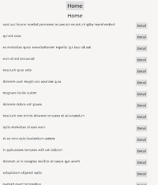
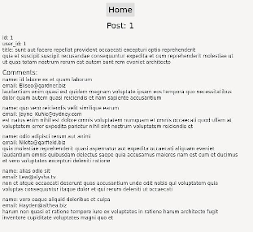

*This post was originally posted on the [LogRocket](https://blog.logrocket.com/iced-rs-tutorial-rust-frontend-web-app/) blog on 12.10.2021 and was cross-posted here by the author.*

Previously, we looked at [how to create a basic Wasm-based frontend application in Rust using the Yew web framework](https://blog.logrocket.com/rust-webassembly-frontend-web-app-yew/) web framework. In this tutorial, we’ll show you how to do a similar thing with the [Iced.rs](https://iced.rs/) GUI library.

To show Iced.rs in action, we’ll build a very basic frontend application using Iced and Rust, which uses [JSONPlaceholder](https://jsonplaceholder.typicode.com/) for fetching data. We’ll fetch posts and display them in a list, each with a detail-link guiding the user to the full post with comments.

## Iced.rs vs. Yew

The biggest difference between Iced.rs and Yew is that while Yew is purely for building web apps, Iced’s focus is actually on cross-platform applications; the web is only one of several platforms you can build an application for.

In terms of style, while Yew will feel familiar to anyone who knows React and JSX, Iced.rs is inspired by the fantastic [Elm](https://elm-lang.org/) in terms of architecture.

Another thing to note is that Iced.rs is very much in early and active development. While it’s absolutely possible to build basic apps with it, the ecosystem isn’t particularly mature yet. Besides the [docs](https://docs.rs/iced/latest/iced/) and [examples](https://github.com/iced-rs/iced/tree/master/examples), at this early stage, it’s a bit rocky to get started, especially if you’re trying to build something complex.

That said, it seems like the project is managed well and progresses quickly through its roadmap.

## Setting up Iced.rs

To follow along with this tutorial, all you need is a recent Rust installation ([Rust 1.55](https://blog.rust-lang.org/2021/09/09/Rust-1.55.0.html)) is the most recent version at the time of writing).

First, create a new Rust project:

```bash
    cargo new rust-frontend-example-iced
    cd rust-frontend-example-iced
```

Next, edit the `Cargo.toml` file and add the dependencies you'll need:

```bash
    [dependencies]
    iced_web = "0.4"
    iced = { version = "0.3", features = ["tokio"] }
    serde = { version = "1.0", features = ["derive"] }
    serde_json = "1.0"
    wasm-bindgen = "0.2.69"
    reqwest = { version = "0.11", features = ["json"] }
```

In this tutorial, we’ll use Iced.rs as our frontend framework. Since Iced.rs is a cross-platform GUI library, we also need to add `iced_web`, which enables us to create a Wasm-based single-page web application from our Iced.rs application.

For fetching data as JSON, we’ll also add `reqwest` and `serde`. We’ll pin the `wasm-bindgen` version so we don’t run into any compatibility issues when building. This is useful because the Wasm ecosystem is still very much in flux and using specific versions for your projects ensures you don’t wake up someday to a broken project.

## Starting with `index.html`

We’re using [Trunk](https://github.com/thedodd/trunk) to abstract away the nitty-gritty of building a Wasm application. Trunk expects an `index.html` file in the project root, which we’ll provide:

```html
    <!DOCTYPE html>
    <html>
      <head>
        <meta http-equiv="Content-type" content="text/html; charset=utf-8"/>
        <meta name="viewport" content="width=device-width, initial-scale=1">
        <title>Tour - Iced</title>
      </head>
      <body>
        <script type="module">
          import init from "./iced/iced.js";
          init('./iced/iced_bg.wasm');
        </script>
      </body>
    </html>
```

Here, we simply created an HTML skeleton and added the snippets for including our compiled Iced.rs source.

We don’t add any CSS here; with Iced.rs, we build our own custom widgets and style them inside the code. It’s possible to add CSS, of course, but in many cases, the styles are overridden within the widgets by the inline styling Iced.rs adds to the output HTML.

With all of this setup out of the way, we can start to write some Rust code.

## Data access

We’ll start by building our data access layer. For this purpose, we’ll create a `data.rs` file next to `main.rs` in the `src` folder and we’ll add this `data` module to our `main.rs` using `mod data;`.

Since our plan is to fetch a list of posts and then the details of a post with its comments, we’ll need structs for `Post` and `Comment`.

```rust
    use serde::Deserialize;
    
    #[derive(Debug, Clone, Deserialize)]
    #[serde(rename_all = "camelCase")]
    pub struct Post {
        pub id: i32,
        pub user_id: i32,
        pub title: String,
        pub body: String,
    }
    
    #[derive(Debug, Clone, Deserialize)]
    #[serde(rename_all = "camelCase")]
    pub struct Comment {
        pub post_id: i32,
        pub id: i32,
        pub name: String,
        pub email: String,
        pub body: String,
    }
```

Next, we’ll implement some data fetching routines to get the actual JSON data from JSONPlaceholder.

```rust
    impl Post {
        pub async fn fetch_all() -> Result<Vec<Post>, String> {
            let url = String::from("https://jsonplaceholder.typicode.com/posts/");
            reqwest::get(&url)
                .await
                .map_err(|_| String::new())?
                .json()
                .await
                .map_err(|_| String::new())
        }
    
        pub async fn fetch(id: i32) -> Result<Post, String> {
            let url = format!("https://jsonplaceholder.typicode.com/posts/{}", id);
            reqwest::get(&url)
                .await
                .map_err(|_| String::new())?
                .json()
                .await
                .map_err(|_| String::new())
        }
    }
```

In this simple example, we won’t handle connection errors, so we’ll just return empty strings here. You could easily extend this, however, by either returning error messages or creating a custom error enum to handle different error cases in the app.

We have one function for fetching all posts. To execute HTTP requests, we use the [Reqwest](https://github.com/seanmonstar/reqwest) HTTP client, which also supports Wasm as a build target.

For fetching a post’s details, we created a second function, which takes the post’s ID as an argument, passes it to JSONPlaceholder, and returns a Result of type `Post`.

Now we need to do the same for comments.

```rust
    impl Comment {
        pub async fn fetch_for_post(id: i32) -> Result<Vec<Comment>, String> {
            let url = format!(
                "https://jsonplaceholder.typicode.com/posts/{}/comments/",
                id
            );
            reqwest::get(&url)
                .await
                .map_err(|_| String::new())?
                .json()
                .await
                .map_err(|_| String::new())
        }
    }
```

This data access function also takes a post ID and fetches all comments for the given post, [deserializing the JSON](https://blog.logrocket.com/rust-serialization-whats-ready-for-production-today/) to a vector of `Comment` structs.

With our `data` module, we’re now able to fetch posts and comments and we have nice structs containing our data.

## Building the UI with Iced.rs

Now it’s time to start building the UI.

An Iced.rs application, similar to ELM, consists of four central concepts:

* State
* Messages
* Update
* View

The `State` is the state of your application. In our case, for example, this is the data we fetch and display from JSONPlaceholder. 

`Messages` are used to trigger flow inside the application. they can be user interaction, timed events, or any other event, which might change something within the application.

The `Update` logic is used to react to these `Messages`. For example, in our application, there might be a `Message` for navigating to the Detail page. In our `Update` logic for this message, we will set the route and fetch the data, so we can update the application state from `List` to `Detail`.

Finally, the `View` logic describes how to render a certain piece of the application. It displays the `State` and might produce `Messages` on user interaction.

We’ll build our very simple widgets for posts and comments first, which will include the rendering logic for those, and then use them to wire everything together with basic routing and our data access.

## Post and comment widgets

We’ll start with the `Comment` widget because it’s very minimalistic and simple.

```rust
    struct Comment {
        comment: data::Comment,
    }
    
    impl Comment {
        fn view(&self) -> Element<Message> {
            Column::new()
                .push(Text::new(format!("name: {}", self.comment.name)).size(12))
                .push(Text::new(format!("email: {}", self.comment.email)).size(12))
                .push(Text::new(self.comment.body.to_owned()).size(12))
                .into()
        }
    }
```

Basically, our `Comment` widget simply has a `data::Comment` as its state, so once we get comment data from our data layer, we can start creating these widgets.

The `view` , in this case, describes how to render a `Comment`. In this case, we create a `Column`, which, in HTML, will just be a `div`. However, there’s also a `Row` and other preexisting `Container` widgets, which we can use to structure our UI in a responsive, coherent way.

Within this column, we simply add some `iced::Text` widgets, which basically compile down to `p` (text paragraphs). We give it a string and then set the size manually. 

At the end, we use `.into()` because `view` returns an `Element<Message>`, where `Element` is just Iced’s generic widget and `Message` is our messages abstraction we’ll look at later.

Now let’s look at the implementation of the `Post` widget:

```rust
    struct Post {
        detail_button: button::State,
        post: data::Post,
    }
    
    impl Post {
        fn view(&mut self) -> Element<Message> {
            Column::new()
                .push(Text::new(format!("id: {}", self.post.id)).size(12))
                .push(Text::new(format!("user_id: {}", self.post.user_id)).size(12))
                .push(Text::new(format!("title: {}", self.post.title)).size(12))
                .push(Text::new(self.post.body.to_owned()).size(12))
                .into()
        }
    
        fn view_in_list(&mut self) -> Element<Message> {
            let r = Row::new().padding(5).spacing(5);
            r.push(
                Column::new().spacing(5).push(
                    Text::new(self.post.title.to_owned())
                        .size(12)
                        .vertical_alignment(VerticalAlignment::Center),
                ),
            )
            .push(
                Button::new(&mut self.detail_button, Text::new("Detail").size(12))
                    .on_press(Message::GoToDetail(self.post.id)),
            )
            .into()
        }
    }
```

The fundamental difference is that a `Post` in our case also contains a `detail_button`. This enables us to create the detail buttons for our post list.

We also have two different rendering functions for a Post: the detail view, which is similar to our `view` function in `Comment`, and a `view_in_list` function, which creates a list element using some `padding` and `spacing` (padding and margin in web-speak) to make everything align and, importantly, adds the `Detail` view button at the end of the row.

If you check out the [docs](https://docs.rs/iced/latest/iced/widget/button/struct.Style.html) for some of the styling options, you’ll recognize many options from the web, so styling your components is pretty straightforward.

To create a button, we need a `button::State`. We can add an action upon clicking it, such as `Message::GoToDetail(self.post.id)` if the button is pressed.

With these two basic widgets out of the way, let’s build our `App` widget and start building a runnable application.

## Putting it all together

In our `main.rs`, we can start with imports and our `main` function.

```rust
    use iced::{
        button, executor, Align, Application, Button, Clipboard, Column, Command, Element, Row,
        Settings, Text, VerticalAlignment,
    };
    
    mod data;
    
    pub fn main() -> iced::Result {
        App::run(Settings::default())
    }
```

Running an Iced.rs application is straightforward. We need something that implements the `Application` trait — in our case, `App` — and then we can just call `run()` on it with default settings.

With these settings, we could set some basic application settings, such as the default font, window settings (for native applications), and things of that nature.

Next, let’s look at our `App` struct and our application state within it.

```rust
    #[derive(Clone, Debug)]
    enum Route {
        List,
        Detail(i32),
    }
    
    struct App {
        list_button: button::State,
        route: Route,
        posts: Option<Vec<Post>>,
        post: Option<Post>,
        comments: Option<Vec<Comment>>,
    }
```

In our `App`, we have the button state for our `list_button`, which is the button back to the homepage, our root.

Then we keep the `route` state with our two routes `List` and `Detail`. I wasn’t able to find any mature routing libraries for `iced_web`, so we’re going to build our own very simplistic routing, without changing URLs, history, or back handling in the browser.

In case you’re interested in building a more fleshed out routing, you could add `web-sys` to your dependencies:

```toml
    [dependencies.web-sys]
    version = "0.3.32"
    features = [
        "Document",
        "Window",
    ]
```

And then you can set the URLs for example using:

```rust
    let win = web_sys::window().unwrap_throw();
    win.location()
      .set_hash(&format!("/detail/{}", id))
      .unwrap_throw();
```

But we won’t go down that rabbit hole in this tutorial.

Further, we keep state for `posts`, `post`, and `comments`. These are just options associated with our widgets for `Post` and `Comment` and vectors filled with them, respectively.

Next up, let’s define our `Message` struct, which defines our data flow in the app.

```rust
    #[derive(Debug, Clone)]
    enum Message {
        PostsFound(Result<Vec<data::Post>, String>),
        PostFound(Result<data::Post, String>),
        CommentsFound(Result<Vec<data::Comment>, String>),
        GoToList,
        GoToDetail(i32),
    }
```

There are five messages in our application.

The most basic ones are `GoToList` and `GoToDetail`, which are essentially our routing messages. These are triggered if someone clicks on `Home` or on a `Detail` link.

Then, `PostsFound`, `PostFound`, and `CommentsFound` are triggered when data comes back from our data access layer. We’ll look at the handling of these messages in a bit.

Let’s start implementing the `Application` trait for `App`.

```rust
    impl Application for App {
        type Executor = executor::Default;
        type Flags = ();
        type Message = Message;
    
        fn new(_flags: ()) -> (App, Command<Message>) {
            (
                App {
                    list_button: button::State::new(),
                    route: Route::List,
                    posts: None,
                    post: None,
                    comments: None,
                },
                Command::perform(data::Post::fetch_all(), Message::PostsFound),
            )
        }
    
        fn title(&self) -> String {
            String::from("App - Iced")
        }
```

The `Executor` is actually an async executor, which can run futures, such as async-io or Tokio. We just use the default. We also don’t use any flags and set our `Message` struct to be used for messages.

In the `new` function, we just set default values for all properties, return `App`, and, importantly, return a new `Command`. This mechanism of returning `Command<Message>` is the way to trigger messages in Iced.rs.

In this case, upon creating `App`, we perform the `Post::fetch_all` future from our data access layer and provide a `Message`, which will be called with the result of the future — in this case, `Message::PostsFound`.

This means when the app is opened, we immediately fetch all posts so we can display them.

Using `title()`, we can also set the title, but that’s not particularly interesting.

Let’s look at how we manage `Messages` next in `update`:

```rust
        fn update(&mut self, message: Message, _c: &mut Clipboard) -> Command<Message> {
            match message {
                Message::GoToList => {
                    self.post = None;
                    self.comments = None;
                    self.route = Route::List;
                    Command::perform(data::Post::fetch_all(), Message::PostsFound)
                }
                Message::GoToDetail(id) => {
                    self.route = Route::Detail(id);
                    self.posts = None;
                    Command::batch(vec![
                        Command::perform(data::Post::fetch(id), Message::PostFound),
                        Command::perform(data::Comment::fetch_for_post(id), Message::CommentsFound),
                    ])
                }
                Message::PostsFound(posts) => {
                    match posts {
                        Err(_) => (),
                        Ok(data) => {
                            self.posts = Some(
                                data.into_iter()
                                    .map(|post| Post {
                                        detail_button: button::State::new(),
                                        post,
                                    })
                                    .collect(),
                            );
                        }
                    };
                    Command::none()
                }
                Message::PostFound(post) => {
                    match post {
                        Err(_) => (),
                        Ok(data) => {
                            self.post = Some(Post {
                                detail_button: button::State::new(),
                                post: data,
                            });
                        }
                    }
                    Command::none()
                }
                Message::CommentsFound(comments) => {
                    match comments {
                        Err(_) => (),
                        Ok(data) => {
                            self.comments = Some(
                                data.into_iter()
                                    .map(|comment| Comment { comment })
                                    .collect(),
                            );
                        }
                    };
                    Command::none()
                }
            }
        }
```

That’s quite a lot of code, but it’s also the heartpiece in terms of logic when it comes to our app, so let’s go through it step by step.

First, we handle `GoToList`. which is triggered when clicking on `Home`. If this happens, we reset the saved data for `post` and `comment`, set the `route` to `List`, and, finally, trigger a request for fetching all posts.

In `GoToDetail`, we essentially do the same, but this time we clear `posts` and issue a `batch` of commands — namely, fetching the post and comments for the given post ID.

Now it gets interesting. Handling `Message::PostsFound(posts)` happens any time `fetch_all` succeeds. Since we’re ignoring errors, we don’t do anything if we get an error, but if we get data, we actually create a vector of `Post` widgets with the returned data and set `self.posts` to that list of widgets.

This means that when the data comes back, we actually update our application state. In this case, we return `Command::none()`, which means the command chain ends here.

For `PostFound` and `CommentsFound`, the handling is essentially the same: we update the application state with the widgets based on the returned data.

Finally, let’s look at the `view` function to see how we render our complete application.

```rust
        fn view(&mut self) -> Element<Message> {
            let col = Column::new()
                .max_width(600)
                .spacing(10)
                .padding(10)
                .align_items(Align::Center)
                .push(
                    Button::new(&mut self.list_button, Text::new("Home")).on_press(Message::GoToList),
                );
            match self.route {
                Route::List => {
                    let posts: Element<_> = match self.posts {
                        None => Column::new()
                            .push(Text::new("loading...".to_owned()).size(15))
                            .into(),
                        Some(ref mut p) => App::render_posts(p),
                    };
                    col.push(Text::new("Home".to_owned()).size(20))
                        .push(posts)
                        .into()
                }
                Route::Detail(id) => {
                    let post: Element<_> = match self.post {
                        None => Column::new()
                            .push(Text::new("loading...".to_owned()).size(15))
                            .into(),
                        Some(ref mut p) => p.view(),
                    };
                    let comments: Element<_> = match self.comments {
                        None => Column::new()
                            .push(Text::new("loading...".to_owned()).size(15))
                            .into(),
                        Some(ref mut c) => App::render_comments(c),
                    };
    
                    col.push(Text::new(format!("Post: {}", id)).size(20))
                        .push(post)
                        .push(comments)
                        .into()
                }
            }
        }
```

First, we create another `Column`, this time with a max width, aligning everything in the center. This is our outermost container.

Inside this container, we add the `Home` button, which, upon clicking, triggers the `GoToList` message, navigating us back to the Home page.

Then we match on `self.route`, our route state within the application.

If we’re on the `List` route, we check if we have `self.posts` set already; remember, when this is set, a request to fetch posts has already been triggered. If not, we show a `loading..` message.

Once the data is there, we call `App::render_posts`, a helper for actually rendering a list of posts.

```rust
    impl App {
        fn render_posts(posts: &mut Vec<Post>) -> Element<Message> {
            let c = Column::new();
            let posts: Element<_> = posts
                .iter_mut()
                .fold(Column::new().spacing(10), |col, p| {
                    col.push(p.view_in_list())
                })
                .into();
            c.push(posts).into()
        }
    
        fn render_comments(comments: &Vec<Comment>) -> Element<Message> {
            let c = Column::new();
            let comments: Element<_> = comments
                .iter()
                .fold(Column::new().spacing(10), |col, c| col.push(c.view()))
                .into();
            c.push(Text::new(String::from("Comments:")).size(15))
                .push(comments)
                .into()
        }
    }
```

There’s also a corresponding helper for rendering a list of comments. In both cases, we simply iterate the data and create a Column with all the singular Post and Comment widgets within it.

Finally, we push the word `Home` and the returned `posts` widget list to a column, adding it to the root column.

For the `Detail` route, we similarly check the `loading` case and, once the data is there, assemble everything together, returning it in a new column.

## Testing our Iced.rs app

Now that we’re done with our simplistic list/detail application, let’s test and see if it actually works.

Let’s run `trunk serve`, which will build and run our app on http://localhost:8080.

Initially, we see the `Home` page with a list of posts and their `Detail` links:

<center>
    <a href="images/img1.png" target="_blank"></a>
</center>

Upon clicking on one of these links, we’re directed to the post’s detail page, showing it’s body and all the comments on this post, which are all fetched in parallel from JSONPlaceholder.

<center>
    <a href="images/img2.png" target="_blank"></a>
</center>

It works!

You can find the full code for this example on [GitHub](https://github.com/zupzup/rust-frontend-example-iced).

## Conclusion

Having played around with Elm in the past and being comfortable in Rust, building this small app with Iced.rs was actually a pretty straightforward experience.

The one thing that’s immediately noticeable, when it comes to using Iced.rs for web, is the lack of some basics, such as a mature routing library. It looks like Iced’s focus is less on the web and more on cross-platform GUI applications, generally.

Besides that, the examples and docs were helpful. There is an active community working on and with Iced.rs already. For use cases where cross-platform development is a focus, I can definitely see Iced.rs being a strong contender in the future.

