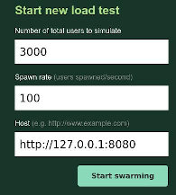
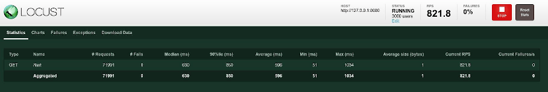
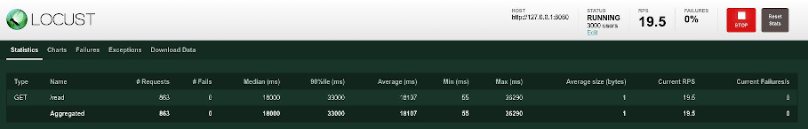
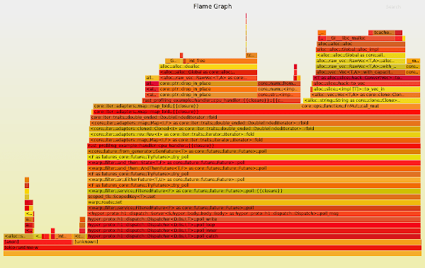
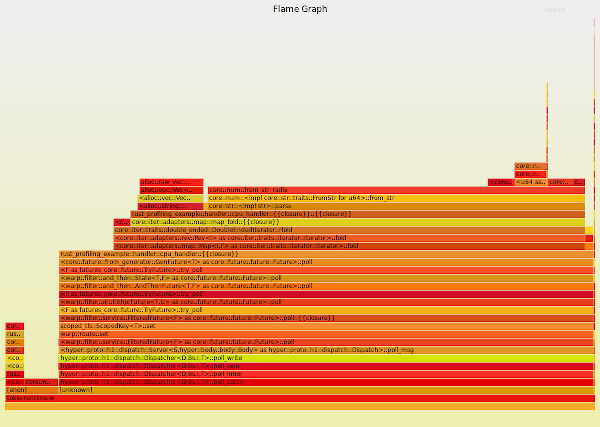

*This post was originally posted on the [LogRocket](https://blog.logrocket.com/an-introduction-to-profiling-a-rust-web-application/) blog on 23.04.2021 and was cross-posted here by the author.*

In this article, we’re going to have a look at some techniques to analyze and improve the performance of Rust web applications.

The field of performance optimization in Rust is vast, and this tutorial can only hope to scratch the surface. For a great overview of the tooling and technique landscape within Rust when it comes to performance, I would very much recommend [The Rust Performance Book](https://nnethercote.github.io/perf-book/) by Nicholas Nethercote.

In this tutorial, we will look at a way to measure web application performance and explore a tool to analyze and improve your Rust code in general.

If this post reaches its goal, you should walk away with some useful knowledge to improve the performance of your Rust web applications along with some good resources to dive deeper into the topic.

Let’s get started!

## Setup

To follow along, all you need is a recent Rust installation (1.45+) and a Python3 installation with the ability to run [Locust](https://locust.io/).

First, create a new Rust project:

```bash
    cargo new rust-web-profiling-example
    cd rust-web-profiling-example
```

Next, edit the Cargo.toml file and add the dependencies you'll need:

```toml
    [dependencies]
    tokio = { version = "1.1", features = ["macros", "time", "rt-multi-thread", "sync"] }
    warp = "0.3"
    
    [profile.release]
    debug = true
```

All we need for this tutorial is a small web service, so we’ll use Warp and Tokio to create it. The techniques discussed in this article will work with any other web frameworks and libraries, however.

Note that we set `debug=true` for the release profile, which means that we will have debug information even in the release build. The reason for this is that we always want to do performance optimization in `release` mode with all compiler optimizations. However, we also would like to have as much information as possible about the running code, which makes profiling a lot easier.

## A minimal web service

First, we create a very basic Warp web service with a shared resource and a couple of endpoints to test.

We start by defining some types:

```rust
    type WebResult<T> = std::result::Result<T, Rejection>;
    
    #[derive(Debug, Clone)]
    pub struct Client {
        pub user_id: usize,
        pub subscribed_topics: Vec<String>,
    }
    
    pub type Clients = Arc<Mutex<HashMap<String, Client>>>;
```

The `WebResult` is simply a helper type for the result of our web handlers. The `Clients` type is our shared resource - a map of user ids to clients. A Client has a `user_id` and a list of subscribed topics, but that’s not particularly relevant for our example.

What is relevant is that this resource will be shared across our whole application and multiple endpoints will access it simultaneously. For that purpose, we wrap it in `Mutex`, to guard access and put it into an `Arc` smart pointer, so we can pass it around safely.

Next, we define some helpers to initialize and propagate our `Clients`:

```rust
    fn with_clients(clients: Clients) -> impl Filter<Extract = (Clients,), Error = Infallible> + Clone {
        warp::any().map(move || clients.clone())
    }
    
    async fn initialize_clients(clients: &Clients) {
        let mut clients_lock = clients.lock().await;
        clients_lock.insert(
            String::from("87-89-34"),
            Client {
                user_id: 1,
                subscribed_topics: vec![String::from("cats"), String::from("dogs")],
            },
        );
        clients_lock.insert(
            String::from("22-38-21"),
            Client {
                user_id: 2,
                subscribed_topics: vec![String::from("cats"), String::from("reptiles")],
            },
        );
        clients_lock.insert(
            String::from("12-67-22"),
            Client {
                user_id: 3,
                subscribed_topics: vec![
                    String::from("mice"),
                    String::from("birds"),
                    String::from("snakes"),
                ],
            },
        );
    }
``` 

The `with_clients` Warp Filter is simply a way we can make resources available to routes in the Warp web framework. In `initialize_clients`, we add some hard-coded values to our shared `Clients` map, but the actual values aren’t particularly relevant for the example.

Then, we add a `handler` module, which will use the shared `Clients`:

```rust
    use crate::{Clients, FasterClients, WebResult};
    use std::time::Duration;
    use warp::{reply, Reply};
    
    pub async fn read_handler(clients: Clients) -> WebResult<impl Reply> {
        let clients_lock = clients.lock().await;
        let user_ids: Vec<String> = clients_lock
            .iter()
            .map(|(_, client)| client.user_id.to_string())
            .collect();
        tokio::time::sleep(Duration::from_millis(50)).await;
        let result = user_ids
            .iter()
            .rev()
            .map(|user_id| user_id.parse::<usize>().expect("can be parsed to usize"))
            .fold(0, |acc, x| acc + x);
        Ok(reply::html(result.to_string()))
    }
```

This async web handler function receives a cloned, shared reference to `Clients`, accesses it, and gets a list of `user_ids` from the map. 

Then, we use `tokio::time::sleep` to pause execution here asynchronously. This is just to simulate some time passing in this request - this might, for example, be a database call, or an HTTP call to another service in a real world application.

After the handler comes back from sleep, we do another operation on the `user_ids`, parsing them to numbers, reversing them, adding them up, and returning them to the user.

This is just so none of the code gets optimized out - this should simulate some CPU-bound work in this case.

Now, let’s wire everything up in `main`:

```rust
    #[tokio::main]
    async fn main() {
        let clients: Clients = Clients::default();
        initialize_clients(&clients).await;
    
        let read_route = warp::path!("read")
            .and(with_clients(clients.clone()))
            .and_then(handler::read_handler);
    
        println!("Started server at localhost:8080");
        warp::serve(read_route)
            .run(([0, 0, 0, 0], 8080))
            .await;
    }
```

We simply create the `Clients`, initialize them, define the `read` route and start the server with this route on port `8080`.

When we run this using `cargo run`, we can go to http://localhost:8080/read and we’ll get a response.

So far, so good. Let’s see how well this performs.

## Load testing

To test the performance of our web service and the `read` handler in particular, we will use [Locust](https://locust.io/) in this tutorial. However, any other load-testing application (such as [Gatling](https://gatling.io/)) or your own tool to send and measure lots of requests to a web server, will suffice.

[Installing Locust](https://docs.locust.io/en/stable/installation.html) is rather simple - you can either install it directly, or within a `virtualenv`.

Now, with Locust installed, let’s create `locust` folder in our project, where we can add some load testing definitions:

```python
    from locust import HttpUser, task, between
    
    class Basic(HttpUser):
        wait_time = between(0.5, 0.5)
    
        @task
        def read(self):
            self.client.get("/read")
```

Writing a locustfile is relatively straightforward, but if you want to dive deeper, the Locust [documentation](https://docs.locust.io/en/stable/writing-a-locustfile.html) is fantastic.

In the above `read.py` example, we create a class called `Basic` based on `HttpUser`, which will give us all the Locust helpers within the class.

Then we define a `@task` called `read`, and this client simply makes a `GET` request to `/read` using the HTTP client Locust provides. We also define the `wait_time` property, which controls how long to wait in between requests. This is useful, if the goal is to simulate real user behavior, but in our case, we’ll just set it to 0.5 seconds.

Let’s run this using the following command:

```bash
    locust -f read.py --host=http://127.0.0.1:8080
```

Now we can navigate to http://localhost:8089 and we’ll be greeted by the Locust web interface.

There, we can set the amount of users we want to simulate and how fast they should spawn (per second).

<center>
    <a href="images/img1.png" target="_blank"></a>
</center>

In this case, we want to spawn 3000 users with 100/s. These users will then make one `/read` request every 0.5 seconds until we stop.

This way, we can create some load onto the web service, which will help us find performance bottlenecks and hot paths in the code, as we’ll see later.

One important thing to note when optimizing performance in Rust, is to always compile in `release` mode. Don’t profile your `debug` binary, as the compiler didn’t do any optimizations there and you might just end up optimizing part of your code the compiler will improve, or throw away entirely.

So we run `cargo build` `--``release` and then start the app using `./target/release/rust-web-profiling-example`. Now our locusts can start to swarm!

You may have to increase the number of open files allowed for the `locust` process using a command such as `ulimit -n 200000` in the terminal where you run Locust.

If we run the load test for a while, at least until all users were spawned and the response times stabilize, we might see something like this, upon stopping it:

<center>
    <a href="images/img2.png" target="_blank"></a>
</center>

We see that we managed to get a measly 19.5 requests per second and the requests took an average of 18+ seconds. There is clearly something wrong with our code - but we didn’t do anything fancy, and Rust, Warp and Tokio are all super fast. What happened?

## Improving locking performance

If we review the code in our `read_handler`, we might notice that we’re doing something very inefficient when it comes to the Mutex lock:

```rust
    pub async fn read_handler(clients: Clients) -> WebResult<impl Reply> {
        let clients_lock = clients.lock().await;
        let user_ids: Vec<String> = clients_lock
            .iter()
            .map(|(_, client)| client.user_id.to_string())
            .collect();
        tokio::time::sleep(Duration::from_millis(50)).await;
        let result = user_ids
            .iter()
            .rev()
            .map(|user_id| user_id.parse::<usize>().expect("can be parsed to usize"))
            .fold(0, |acc, x| acc + x);
        Ok(reply::html(result.to_string()))
    }
```

We acquire the lock, access the data, and at that point, we’re actually donehttps://github.com/zupzup/rust-crossbeam-example with `clients` and don’t need it anymore. However, since the `clients_lock` stays in the scope, especially for the whole duration of our fake DB call (sleep), that means we lock the resource for the whole duration of this handler!

Also, in this application, except for the initialization, we only ever `read` from the shared resource, but a Mutex doesn’t distinguish between read and write access, it simply always locks.

So there are two simple optimizations we can make here:

1. We drop the lock after we’re done using it
2. We use an `RwLock` instead of a `Mutex`, since that doesn’t lock if there are only reads, but only if there is a write

So in `main` we implement a `FasterClients` type using an `RwLock`:

```rust
    pub type FasterClients = Arc<RwLock<HashMap<String, Client>>>;
    
    #[tokio::main]
    async fn main() {
        ...
        let faster_clients: FasterClients = FasterClients::default();
        initialize_faster_clients(&faster_clients).await;
        ...
        let fast_route = warp::path!("fast")
            .and(with_faster_clients(faster_clients.clone()))
            .and_then(handler::fast_read_handler);
        ...
        warp::serve(read_route.or(fast_route).or(cpu_route).or(cpu_route_alloc))
            .run(([0, 0, 0, 0], 8080))
            .await;
    }
    
    fn with_faster_clients(
        clients: FasterClients,
    ) -> impl Filter<Extract = (FasterClients,), Error = Infallible> + Clone {
        warp::any().map(move || clients.clone())
    }
    
    async fn initialize_faster_clients(clients: &FasterClients) {
        let mut clients_lock = clients.write().await;
        clients_lock.insert(
            String::from("87-89-34"),
            Client {
                user_id: 1,
                subscribed_topics: vec![String::from("cats"), String::from("dogs")],
            },
        );
        clients_lock.insert(
            String::from("22-38-21"),
            Client {
                user_id: 2,
                subscribed_topics: vec![String::from("cats"), String::from("reptiles")],
            },
        );
        clients_lock.insert(
            String::from("12-67-22"),
            Client {
                user_id: 3,
                subscribed_topics: vec![
                    String::from("mice"),
                    String::from("birds"),
                    String::from("snakes"),
                ],
            },
        );
    }
```

We initialize the `FasterClients` in the same way and pass it the same way as `Clients` with a filter. We also define a route to `/fast` with the following handler:

```rust
    pub async fn fast_read_handler(clients: FasterClients) -> WebResult<impl Reply> {
        let clients_lock = clients.read().await;
        let user_ids: Vec<String> = clients_lock
            .iter()
            .map(|(_, client)| client.user_id.to_string())
            .collect();
        drop(clients_lock);
        tokio::time::sleep(Duration::from_millis(50)).await;
        let result = user_ids
            .iter()
            .rev()
            .map(|user_id| user_id.parse::<usize>().expect("can be parsed to usize"))
            .fold(0, |acc, x| acc + x);
        Ok(reply::html(result.to_string()))
    }
```

As you can see, we get past the `FasterClients` now and we `drop` the lock immediately after we’re done using it. This should give us quite a speed boost - let’s check.

In the `read.py` Locust file, you can comment out the previous `/read` endpoint and add the following instead:

```python
        @task
        def read(self):
            self.client.get("/fast")
```

Let’s re-compile and run Locust again.

<center>
    <a href="images/img3.png" target="_blank"></a>
</center>

It’s faster, alright! We get about 820 requests per second, a 40x improvement, just by changing a type and dropping a lock earlier.

Now, at this point you might roll your eyes a bit at this contrived example, and I do agree that this probably isn’t an issue you will run into a lot in real systems. However, this post is about a workflow and tools we can use to find performance issues and the approach outlined so far is a good starting point for poking your application for inefficiencies.

Next, armed with a great way to load test our web application, we’ll do some actual profiling to get a deeper look into what happens under the hood of our web handlers.

## Flamegraph

Next, we’ll look at an actual profiling technique using the convenient [cargo-flamegraph](https://github.com/flamegraph-rs/flamegraph) tool, which wraps and automates the technique outlined in Brendan Gregg’s [Flamegraph](http://www.brendangregg.com/flamegraphs.html) article.

The basic idea is, to collect performance data using tools such as `perf`, or `dtrace`, in particular which functions take how much CPU time during the sampling and to then visualize the results in a way which can be interpreted nicely.

Flamegraphs can also be used to do, among other analyses, [Off-CPU Analysis](http://www.brendangregg.com/offcpuanalysis.html), which can help find issues where threads are waiting for I/O a lot, for example.

In this example, we will only do CPU time analysis, which is supported by cargo-flamegraph.

First, let’s build a handler so we get a nice visualization:

```rust
    pub async fn cpu_handler_alloc(clients: FasterClients) -> WebResult<impl Reply> {
        let clients_lock = clients.read().await;
        let user_ids: Vec<String> = clients_lock
            .iter()
            .map(|(_, client)| client.user_id.to_string())
            .collect();
        drop(clients_lock);
    
        let mut result = 0;
        for i in 0..1000000 {
            result += user_ids
                .iter()
                .cloned()
                .rev()
                .map(|user_id| user_id.parse::<usize>().expect("can be parsed to usize"))
                .fold(i, |acc, x| acc + x);
        }
        Ok(reply::html(result.to_string()))
    }
```

In this (also rather contrived) example, we re-use the base of the `/fast` handler, but we extend the calculation to run inside a long loop. Also notice how we use `.cloned()` on the iterator, cloning the whole list for each iteration. This is a rather obvious performance issue, but when you’re juggling references and fighting with the borrow checker, it’s possible the odd superfluous `.clone()` makes it in your code, which inside of hot loops might lead to performance issues.

We also add the handler in main:

```rust
    ...
        let cpu_route_alloc = warp::path!("cpualloc")
            .and(with_faster_clients(faster_clients.clone()))
            .and_then(handler::cpu_handler_alloc);
    ...
```

Let’s run cargo flamegraph to collect profiling stats with the following command:

```bash
    cargo flamegraph --bin rust-profiling-example
```

Also, we add another Locust file in `/locust` called `cpu.py`:

```python
    from locust import HttpUser, task, between
    
    class Basic(HttpUser):
        wait_time = between(0.5, 0.5)
    
        @task
        def cpu(self):
            self.client.get("/cpualloc")
```

This is essentially the same as before, just calling the `/cpualloc` endpoint.

After running this load-test on our profiled application and stopping the running Rust web server using CTRL+C,  we get a flamegraph like this:

<center>
    <a href="images/img4.png" target="_blank"></a>
</center>

You can see the benefit of this visualization. We see, stacked up, where we spend most of the time during the load test. We can trace from the Tokio runtime up to our `cpu_handler` and the calculation. One thing to note is that we spend a lot of time doing allocations.

This is not very surprising as we added `.cloned()` to the iterator, which, for each loop iteration, clones the contents of the list before processing the data. We can see in between the allocation blocks that we also spend some time parsing the strings to numbers.

Let’s try to get rid of these unnecessary allocations. Again, this is a bit of a simplified example, and in real code you’ll likely have to dig a bit deeper to find underlying issues, but this demonstration shows you the tools and a workflow in order to approach performance issues in your code.

If you’re looking for memory-related performance issues specifically, you might want to take a look at the tools mentioned within the [Profiling](https://nnethercote.github.io/perf-book/profiling.html) section of The Rust Performance Book, namely heaptrack, DHAT, or cachegrind.

Fixing this is pretty easy, we simply remove the `.cloned()` as we don’t need it here anyway, but as you might have noticed, unnecessary cloning can lead to big performance impacts, especially within hot code. Often, people who are not yet familiar with Rust’s ownership system use `.clone()` to get the compiler to leave them alone.

```rust
    pub async fn cpu_handler(clients: FasterClients) -> WebResult<impl Reply> {
        let clients_lock = clients.read().await;
        let user_ids: Vec<String> = clients_lock
            .iter()
            .map(|(_, client)| client.user_id.to_string())
            .collect();
        drop(clients_lock);
    
        let mut result = 0;
        for i in 0..1000000 {
            result += user_ids
                .iter()
                .rev()
                .map(|user_id| user_id.parse::<usize>().expect("can be parsed to usize"))
                .fold(i, |acc, x| acc + x);
        }
        Ok(reply::html(result.to_string()))
    }
```

And in main:

```rust
    ...
        let cpu_route = warp::path!("cpu")
            .and(with_faster_clients(faster_clients.clone()))
            .and_then(handler::cpu_handler);
    ...
```

Let’s run the sampling again. We’ll get a flamegraph like this:

<center>
    <a href="images/img5.png" target="_blank"></a>
</center>

That’s quite a difference! As you can see, we spend a lot less time allocating memory and spend most of our time parsing the strings to numbers and calculating our result.

You can also use a tool such as [Hotspot](https://github.com/KDAB/hotspot) to create and analyze flamegraphs. The nice thing about using these more high-level tools is that you not only get a static .svg file, which hides some of the details, but you can zoom around in your profile!

That’s it! The full example code can be found on [GitHub](https://github.com/zupzup/rust-profiling-example).

## Conclusion

In this post, we took a bit of a dive into performance measurement and improvement for Rust web applications.

The possibilities in this area are almost as endless are the different ways to write code. In this tutorial, I attempted to provide you with some techniques, which have helped me find slow code and performance regressions in the past.

If you’re interested in this type of thing and want to dive deeper, there is a huge rabbit hole waiting for you and you can use the resources mentioned in [The Rust Performance Book](https://nnethercote.github.io/perf-book/) as a starting point on your journey towards lightning fast Rust code.

