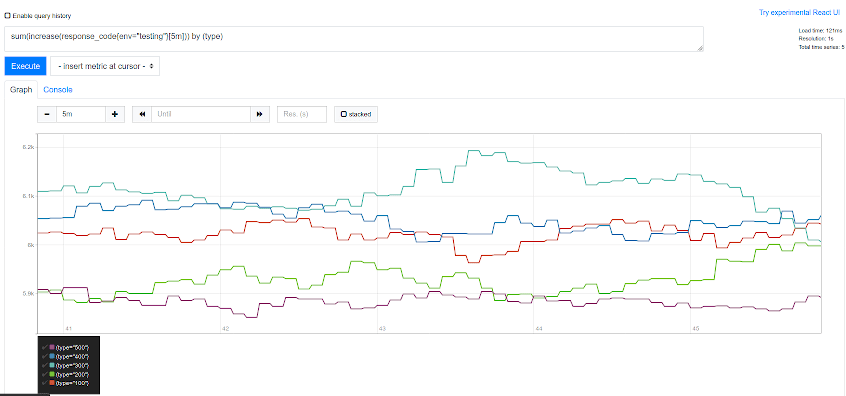

*This post was originally posted on the [LogRocket](https://blog.logrocket.com/using-prometheus-metrics-in-a-rust-web-service/) blog on 20.08.2020 and was cross-posted here by the author.*

Prometheus is an open-source tool for collecting, analyzing, and alerting on time series data. It’s widely used and highly regarded in the DevOps community.

In this tutorial, we’ll build a [warp](https://github.com/seanmonstar/warp) web service in Rust, which collects some interesting metrics using [Prometheus](https://prometheus.io/).

We’ll show you how to add this metrics collection capability to a Rust web service and then how to get those metrics into Prometheus.

## Setup

To follow along, all you need is a reasonably recent Rust installation (1.39+) and a way to start a local Prometheus instance — for example, with [Docker](https://www.docker.com/).

First, create a new Rust project:

```bash
cargo new rust-web-prometheus-example
cd rust-web-prometheus-example
```

Next, edit the `Cargo.toml` file and add the dependencies you’ll need.

```toml
[dependencies]
tokio = { version = "0.2", features = ["macros", "rt-threaded", "time"] }
warp = "0.2"
prometheus = { version = "0.9", features = ["process"] }
lazy_static = "1.4"
futures = { version = "0.3", default-features = false }
rand = "0.7"
```

Besides the `prometheus` crate, which we’ll use to record metrics, we have the `warp` web framework, the `tokio` async runtime, and rand for generating some random metrics data.

Since we’re also going to implement a small `websockets` server here with `warp`, we’ll need the `futures` crate as well. The `lazy_static` crate will be used to initialize the metrics collectors and to make them globally available.


## Metrics definitions

The first step when collecting metrics from a web service is to define them.

```rust
use prometheus::{
    HistogramOpts, HistogramVec, IntCounter, IntCounterVec, IntGauge, Opts, Registry,
};

lazy_static! {
    pub static ref REGISTRY: Registry = Registry::new();

    pub static ref INCOMING_REQUESTS: IntCounter =
        IntCounter::new("incoming_requests", "Incoming Requests").expect("metric can be created");

    pub static ref CONNECTED_CLIENTS: IntGauge =
        IntGauge::new("connected_clients", "Connected Clients").expect("metric can be created");

    pub static ref RESPONSE_CODE_COLLECTOR: IntCounterVec = IntCounterVec::new(
        Opts::new("response_code", "Response Codes"),
        &["env", "statuscode", "type"]
    )
    .expect("metric can be created");

    pub static ref RESPONSE_TIME_COLLECTOR: HistogramVec = HistogramVec::new(
        HistogramOpts::new("response_time", "Response Times"),
        &["env"]
    )
    .expect("metric can be created");
}
```

The first thing we define here is the `REGISTRY`, a `prometheus` registry used for recording metrics throughout the run of the program. There can be multiple registries, but we only need one.

Next, define the things you want to collect.

* `INCOMING_REQUESTS` - count the incoming requests to the /some route
* `CONNECTED_CLIENTS` - count the clients currently connected via websockets
* `RESPONSE_CODE_COLLECTOR` - count different response codes of a series of randomly generated requests
* `RESPONSE_TIME_COLLECTOR` - collect the response times of a series of randomly generated requests

The most important aspect of these metrics is their data types. The `INCOMING_REQUESTS` metric is a simple `IntCounter`, which means it can only be incremented and in integer form.

The `IntGauge`, on the other hand, which is used for `CONNECTED_CLIENTS`, can be incremented and decremented, which will be necessary in the event that a client disconnects.

`IntCounterVec` bundles a set of `Counters`, making it possible to label them differently even though they belong to the same metric. We will use this to differentiate between the different response types (e.g., 400 client errors versus 500 server errors).

Lastly, `HistogramVec` bundles a set of histograms. This can be used to count the same thing partitioned in different dimensions. A popular example we’re using here is response time percentiles - e.g., if we want to know the 90th percentile response time for a system.

With the metrics defined, the next step is to register them with the `REGISTRY`.

```rust
fn register_custom_metrics() {
    REGISTRY
        .register(Box::new(INCOMING_REQUESTS.clone()))
        .expect("collector can be registered");

    REGISTRY
        .register(Box::new(CONNECTED_CLIENTS.clone()))
        .expect("collector can be registered");

    REGISTRY
        .register(Box::new(RESPONSE_CODE_COLLECTOR.clone()))
        .expect("collector can be registered");

    REGISTRY
        .register(Box::new(RESPONSE_TIME_COLLECTOR.clone()))
        .expect("collector can be registered");
}
```

As you might have noticed, we’re not bothering with error-handling here. If our metrics collection setup fails, we don’t even want the service to start, so it’s fine if it panics.

In this registration function, we simply call the `register` method of `REGISTRY` with boxed versions of our metrics.

This setup enables us to collect metrics from anywhere in the application but still have everything collected in the `REGISTRY`, which we’ll use later to publish the collected metrics at an endpoint so Prometheus can collect them from the service.

## Tracking metrics

Let’s start collecting some metrics.

First we need to implement the warp web service.

Define main:

```rust
#[tokio::main]
async fn main() {
    register_custom_metrics();

    let metrics_route = warp::path!("metrics").and_then(metrics_handler);
    let some_route = warp::path!("some").and_then(some_handler);
    let ws_route = warp::path("ws")
        .and(warp::ws())
        .and(warp::path::param())
        .and_then(ws_handler);

    tokio::task::spawn(data_collector());

    println!("Started on port 8080");
    warp::serve(metrics_route.or(some_route).or(ws_route))
        .run(([0, 0, 0, 0], 8080))
        .await;
}
```

After calling the metrics registration helper, define three routes, spawn a `data_collector` function, which runs in the background, and start the web server.

The `data_collector` will simulate this service collecting request data from another service. In practice, this could be an ElasticSearch instance used for collecting logs, for example. In any case, we’ll just create random response data in this routine at an interval.

Define the `some_handler` to see how to track a very simple `Counter` metric.

```rust
async fn some_handler() -> Result<impl Reply, Rejection> {
    INCOMING_REQUESTS.inc();
    Ok("hello!")
}
```

As you can see, that was quite simple. Since we have access to the metrics anywhere, we can simply call `inc()`, which increments the counter, from the endpoint. The `prometheus` crate handles all concurrency implications internally, so this is safe to do.

Let’s move on to the next one: `CONNECTED_CLIENTS`. This is a bit more involved, since we want to count websocket clients that are currently connected.

```rust
async fn ws_handler(ws: warp::ws::Ws, id: String) -> Result<impl Reply, Rejection> {
    Ok(ws.on_upgrade(move |socket| client_connection(socket, id)))
}

async fn client_connection(ws: WebSocket, id: String) {
    let (_client_ws_sender, mut client_ws_rcv) = ws.split();

    CONNECTED_CLIENTS.inc();
    println!("{} connected", id);

    while let Some(result) = client_ws_rcv.next().await {
        match result {
            Ok(msg) => println!("received message: {:?}", msg),
            Err(e) => {
                eprintln!("error receiving ws message for id: {}): {}", id.clone(), e);
                break;
            }
        };
    }

    println!("{} disconnected", id);
    CONNECTED_CLIENTS.dec();
}
```

The above snippet is essentially the minimal websocket implementation from the `warp` docs, where the incoming connection is upgraded to a WebSocket. As you can see in the `client_connection` function, we increment the `CONNECTED_CLIENTS` gauge once the client is successfully connected.

Now we can start waiting for messages from the client. If anything goes wrong there or the client simply disconnects, the WebSocket connection and channel are dropped, closing the connection. On the disconnect call `.dec()` to decrement the counter.

So far, so good. Next, we’ll look at the `data_collector` routine.

```rust
const ENVS: &'static [&'static str] = &["testing", "production"];
async fn data_collector() {
    let mut collect_interval = tokio::time::interval(Duration::from_millis(10));
    loop {
        collect_interval.tick().await;
        let mut rng = thread_rng();
        let response_time: f64 = rng.gen_range(0.001, 10.0);
        let response_code: usize = rng.gen_range(100, 599);
        let env_index: usize = rng.gen_range(0, 2);

        track_status_code(response_code, ENVS.get(env_index).expect("exists"));
        track_request_time(response_time, ENVS.get(env_index).expect("exists"))
    }
}
```

We start an async timer, which triggers every 10ms to generate new data. The next step is to generate some random `response_times` and `response codes` and determine a random `env`, which you can think of as a cluster environment — for example, if you collect data from a `testing` and `production` cluster.

These generated values are tracked using two helpers.

```rust
fn track_request_time(response_time: f64, env: &str) {
    RESPONSE_TIME_COLLECTOR
        .with_label_values(&[env])
        .observe(response_time);
}

fn track_status_code(status_code: usize, env: &str) {
    match status_code {
        500..=599 => RESPONSE_CODE_COLLECTOR
            .with_label_values(&[env, &status_code.to_string(), "500"])
            .inc(),
        400..=499 => RESPONSE_CODE_COLLECTOR
            .with_label_values(&[env, &status_code.to_string(), "400"])
            .inc(),
        300..=399 => RESPONSE_CODE_COLLECTOR
            .with_label_values(&[env, &status_code.to_string(), "300"])
            .inc(),
        200..=299 => RESPONSE_CODE_COLLECTOR
            .with_label_values(&[env, &status_code.to_string(), "200"])
            .inc(),
        100..=199 => RESPONSE_CODE_COLLECTOR
            .with_label_values(&[env, &status_code.to_string(), "100"])
            .inc(),
        _ => (),
    };
}
```

The `track_request_time` helper simply calls `.observe()` with the response time, labeling this metric with the environment it was tracked in. This internally generates the histogram we can use later.

For the status codes, we match on the response code and, based on the type of HTTP response we get, label it with a different type. It’s important to verify that the amount of labels used in `.with_label_values` match the labels we defined when creating the metrics in their options.

Last, but not least, we need to implement the `metrics_handler` so Prometheus can collect our metrics.

```rust
async fn metrics_handler() -> Result<impl Reply, Rejection> {
    use prometheus::Encoder;
    let encoder = prometheus::TextEncoder::new();

    let mut buffer = Vec::new();
    if let Err(e) = encoder.encode(&REGISTRY.gather(), &mut buffer) {
        eprintln!("could not encode custom metrics: {}", e);
    };
    let mut res = match String::from_utf8(buffer.clone()) {
        Ok(v) => v,
        Err(e) => {
            eprintln!("custom metrics could not be from_utf8'd: {}", e);
            String::default()
        }
    };
    buffer.clear();

    let mut buffer = Vec::new();
    if let Err(e) = encoder.encode(&prometheus::gather(), &mut buffer) {
        eprintln!("could not encode prometheus metrics: {}", e);
    };
    let res_custom = match String::from_utf8(buffer.clone()) {
        Ok(v) => v,
        Err(e) => {
            eprintln!("prometheus metrics could not be from_utf8'd: {}", e);
            String::default()
        }
    };
    buffer.clear();

    res.push_str(&res_custom);
    Ok(res)
}
```

We’re doing the same thing twice here. That’s because we want to collect the custom metrics from the `REGISTRY`, as well as system metrics using `prometheus::gather`, from the crate’s `DEFAULT_REGISTRY`. This will give us insight into memory and CPU consumption, open file descriptors of the running Rust process, etc.

The method is the same in both cases. Create a new buffer, encode the metrics into that buffer, stringify it, and return that string to the caller - which, in most, cases will be a Prometheus instance asking the service for data.

Now let’s see if any of this actually works and walk through using Prometheus to work with these collected metrics.

## Testing with Prometheus

To start a Prometheus instance locally, add the `prom` folder in the project and the following `Dockerfile` and `prometheus.yml` inside that folder.

```bash
FROM prom/prometheus:v2.16.0
ADD prometheus.yml /etc/prometheus/prometheus.yml


global:
  scrape_interval:     5s
  evaluation_interval: 5s

scrape_configs:
  - job_name: 'prometheus'
    static_configs:
      - targets: ['localhost:9090']

  - job_name: 'service-collector'
    static_configs:
      - targets: ['localhost:8080']
```

The Dockerfile simply gets prometheus and adds the config. The config itself is very minimal; it simply defines a `service-collector` with the web application’s host and port. This instance will poll every five seconds for new data on the `/metrics` endpoint of the service.

Now let’s build a runnable container.

```bash
cd prom
docker build -t prometheus .
```

To run it:

```bash
docker run -p 9090:9090 --network=host prometheus
```

Navigating to `http://localhost:9090/graph` should bring you to the locally running Prometheus instance.

Now, start the Rust web service using `cargo run`.

If you enter something in the query field, such as `incoming_requests`, you’ll see a result below.

After waiting for a couple of seconds to let the service generate some random data, you can try some more advanced queries. To view the 90th percentile of response times, for example:

```bash
histogram_quantile(0.90, sum(rate(response_time_bucket{env="testing"}[2m])) by (le))
```

This query might turn up a result like the following.


<center>
    <a href="images/img1.png" target="_blank"></a>
</center>

You can also query something related to status codes — for example, the sum of increase over time by response type.

```bash
sum(increase(response_code{env="testing"}[5m])) by (type)
```

The above might result in something like this:

<center>
    <a href="images/img2.png" target="_blank"></a>
</center>

Great - it works! In a real-world application with real data, these graphs would, of course, look much different. But with the random test data, we’re at least able to ensure that our setup works.

You can also check out the raw metrics using a tool such as cURL.

```bash
curl http://localhost:8080/metrics
```

You can find the full code for this example on [GitHub](https://github.com/zupzup/rust-web-prometheus-example).

## Conclusion

Prometheus is a powerful tool and has rightfully become an industry standard for collecting metrics.

In this guide, we covered how to collect system and custom Prometheus metrics in a Rust web service. The prometheus crate works well and has a straightforward API, especially if you’ve previously worked with Prometheus in another language.

These metrics can be very useful for analytics, triggering alerts, or really anything you can imagine. The sky is the limit.

