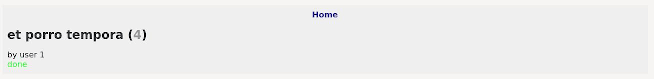
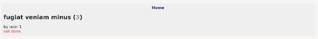
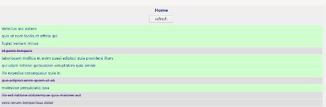

*This post was originally posted on the [LogRocket](https://blog.logrocket.com/rust-webassembly-frontend-web-app-yew/) blog on 15.06.2021 and was cross-posted here by the author.*

While Rust is known for its backend web development capabilities, the advent of WebAssembly (Wasm) made it possible to build rich frontend apps in Rust. 

For those hankering to explore the frontend of Rust development, we’ll learn how to build a very basic frontend web app using the Yew web framework. 

If you’re familiar with React or other JavaScript frontend frameworks, you’ll feel right at home with Yew; it uses a similar syntax and application structure to JSX.

To demonstrate Rust’s and Yew’s interoperability, our frontend app will contain a simple to-do list (original, I know!) that uses JSONPlaceholder as a backend for fetching data. The list will provide a list view, a detailed view for each to-do option, and an option to refresh the data.

It’s important to note, however, that the Wasm ecosystem and Yew are still early in their development, so while this tutorial is accurate today, some Wasm and Yew functionalities are subject to change in the future. This may slightly impact the setup and library ecosystem, but we can still build real Rust applications using this stack.

Now, let’s dive right in!

## Setting up the web application

Ensure both [Rust](https://blog.logrocket.com/why-is-rust-popular/) 1.50 or higher and [Trunk](https://github.com/thedodd/trunk#install) are installed. [Trunk](https://blog.logrocket.com/why-is-rust-popular/) is a build and pipeline tool for Rust-based [Wasm](https://webassembly.org/) applications that provides a local development server, automatic file watching, and simplifies sending Rust code to Wasm.

To understand how using the [Yew framework](https://blog.logrocket.com/the-current-state-of-rust-web-frameworks/) to develop applications works, consult the [Yew docs](https://yew.rs/).

## Creating a Rust project

Let’s begin by creating a new Rust project with the following:

```bash
    cargo new --lib rust-frontend-example-yew
    cd rust-frontend-example-yew
```

Add the needed dependencies to edit the `Cargo.toml` file with the code below:

```toml
    [dependencies]
    yew = "0.18"
    wasm-bindgen = "0.2.67"
    serde = "1"
    serde_derive = "1"
    serde_json = "1"
    anyhow = "1"
    yew-router = "0.15.0"
```

By adding `Yew` and the `Yew-Router`, we can begin working within the Yew framework. We also added `anyhow` for basic error handling, `serde` for working with JSON, and `[wasm-bindgen](https://github.com/rustwasm/wasm-bindgen)` to use JavaScript from Rust.

With the setup out of the way, let’s start building.

## HTML setup with Trunk

Since we’re building a frontend web application, we need an HTML base. Using `Trunk`, we can create a minimal `index.html` in our project root by using the following:

```html
    <html>
      <head>
        <title>Rust Frontend Example with Yew</title>
        <style>
            body {
                font-size: 14px;
                font-family: sans-serif;
            }
            a {
                text-decoration: none;
                color: #339;
            }
            a:hover {
                text-decoration: none;
                color: #33f;
            }
            .todo {
                background-color: #efefef;
                margin: 100px 25% 25% 25%;
                width: 50%;
                padding: 10px;
            }
            .todo .nav {
                text-align: center;
                font-size: 16px;
                font-weight: bold;
            }
            .todo .refresh {
                text-align: center;
                margin: 10px 0 10px 0;
            }
            .todo .list .list-item {
                margin: 2px;
                padding: 5px;
                background-color: #cfc;
            }
            .todo .list .completed {
                text-decoration: line-through;
                background-color: #dedede;
            }
            .detail {
                font-size: 16px;
            }
            .detail h1 {
                font-size: 24px;
            }
            .detail .id {
                color: #999;
            }
            .detail .completed {
                color: #3f3;
            }
            .detail .not-completed {
                color: #f33;
            }
        </style>
      </head>
    </html>
```

With a minimal HTML skeleton and some very basic CSS, Trunk creates `dist/index.html` with a `body` injected, holding the entry point for our Wasm application.

Opening the `src/lib.rs` file, we can now create the basics for our [Yew](https://github.com/yewstack/yew) web app. 

## Setting up `TodoApp` with basic routing

By implementing basic routing, we can work our way from the high-level route definitions down to the actual route implementations.

First, let’s create a type for `TodoApp`:

```rust
    struct TodoApp {
        link: ComponentLink<Self>,
        todos: Option<Vec<Todo>>,
        fetch_task: Option<FetchTask>,
    }
    
    #[derive(Deserialize, Clone, PartialEq, Debug)]
    #[serde(rename_all = "camelCase")]
    pub struct Todo {
        pub user_id: u64,
        pub id: u64,
        pub title: String,
        pub completed: bool,
    }
```

This struct includes the `link` that registers callbacks inside this component. We’ll also define an optional to-do list with `Option<Vec<Todo>>` and a `fetch_task` to fetch data.

To create a root component as an entry point, we must implement the `Component` trait:

```rust
    enum Msg {
        MakeReq,
        Resp(Result<Vec<Todo>, anyhow::Error>),
    }
    
    impl Component for TodoApp {
        type Message = Msg;
        type Properties = ();
        fn create(_: Self::Properties, link: ComponentLink<Self>) -> Self {
            Self {
                link,
                todos: None,
                fetch_task: None,
            }
        }
    
        fn update(&mut self, msg: Self::Message) -> ShouldRender {
            true
        }
    
        fn change(&mut self, _props: Self::Properties) -> ShouldRender {
            false
        }
    
        fn view(&self) -> Html {
            html! {
                <div class=classes!("todo")>
                    ...
                </div>
            }
        }
    }
```

By defining the `Msg` struct, the type for the component’s `Message`, we can orchestrate message passing inside the component. In our case, we’ll define the `MakeReq` message and the `Resp` message to make an HTTP request and receive the response.

Later, we will use these states to build a state machine that tells our application how to react when we trigger a request and the response arrives.

The `Component` trait defines six lifecycle functions:


* `create` is a constructor that takes props and the `ComponentLink`
* `view` renders the component
* `update` is called when a `Message` is sent to the component, implementing the message-passing logic
* `change` re-renders changes, optimizing rendering speed
* `rendered` is called once after `view` but before the browser updates, differentiating between the first and consecutive renders
* `destroy` is called when a component is dismounted and cleanup operations are needed

Since our root components don’t have any props, we can let `change` return false.

We won’t implement anything in `update` yet, so we’ll define that the component must re-render anytime a `Message` comes in.

In `view`, we’ll use the `html!` macro to build a basic outer `div` and the `classes!` macro to create HTML classes for it, which we will implement later.

To render this component, we need the following code snippet:

```rust
    #[wasm_bindgen(start)]
    pub fn run_app() {
        App::<TodoApp>::new().mount_to_body();
    }
```

This snippet uses `wasm-bindgen` and defines this function as our entry point, mounting the `TodoApp` component as the root inside the body.

## Fetching data

Great, now that the basics are in place, let’s see how we can fetch some data.

We’ll begin by changing the `create` lifecycle method to send a `MakeReq` message when the component is created to fetch data immediately:

```rust
        fn create(_: Self::Properties, link: ComponentLink<Self>) -> Self {
            link.send_message(Msg::MakeReq);
            Self {
                link,
                todos: None,
                fetch_task: None,
            }
        }
```

Then, we implement `update`:

```rust
        fn update(&mut self, msg: Self::Message) -> ShouldRender {
            match msg {
                Msg::MakeReq => {
                    self.todos = None;
                    let req = Request::get("https://jsonplaceholder.typicode.com/todos")
                        .body(Nothing)
                        .expect("can make req to jsonplaceholder");
    
                    let cb = self.link.callback(
                        |response: Response<Json<Result<Vec<Todo>, anyhow::Error>>>| {
                            let Json(data) = response.into_body();
                            Msg::Resp(data)
                        },
                    );
    
                    let task = FetchService::fetch(req, cb).expect("can create task");
                    self.fetch_task = Some(task);
                    ()
                }
                Msg::Resp(resp) => {
                    if let Ok(data) = resp {
                        self.todos = Some(data);
                    }
                }
            }
            true
        }
```

That’s quite a bit of code, so let’s step through it together to understand it. 

Yew provides [services](https://docs.rs/yew/0.2.0/yew/services/index.html) that are pre-built abstractions for things like logging or using HTTP `fe``tch()` (the JavaScript `fetch``()`). 

In our code, we can set `self.todos` to `None`, and the data always resets when we’re fetching. By adding the `FetchService`, we create an HTTP `GET` request to [JSONPlaceholder](http://jsonplaceholder.typicode.com/). 

Defining a callback parses the response to JSONPlaceholder and sends a `Msg::Resp` message with the returned data.

As we set off the prepared `fetch()` call with the request and callback, we also set the component’s `fetch_task` to the returned `FetchService::fetch` task to keep `fetch-task` alive.

Handling the response is simple: if a `Msg::Resp` comes in, we can check whether there is data or not. If there is data, we can set `self.todos` to that data. 

This is also where we could do some error handling and set an error message to display if a request fails or if the data is invalid.

Finally, we must display our newly fetched data using the `view` method:

```rust
        fn view(&self) -> Html {
            let todos = self.todos.clone();
            let cb = self.link.callback(|_| Msg::MakeReq);
            ConsoleService::info(&format!("render TodoApp: {:?}", todos));
            html! {
                <div class=classes!("todo")>
                  <div>
                      <div class=classes!("refresh")>
                          <button onclick=cb.clone()>
                              { "refresh" }
                          </button>
                      </div>
                      <todo::list::List todos=todos.clone()/>
                  </div>
                </div>
            }
        }
```

By getting the to-dos and using the `ConsoleService`, we can log them every time we render this component, which is useful for debugging.

Creating a simple `refresh` button with an `onclick` handler lets us call our data-fetching pipeline, allowing us to call actions from within the `html!` markup.

Passing the to-dos to the `todo::list::List` component, we can display the to-dos in the web app.

## Adding the `List` component

To begin constructing our `List` component, we must create a `todo` folder with a `mod.rs` containing `pub mod list` and a `list.rs` file.

In `list.rs`, we must implement our `List` component the same way we implemented `TodoApp`:

```rust
    #[derive(Properties, Clone, PartialEq)]
    pub struct Props {
        pub todos: Option<Vec<Todo>>,
    }
    
    pub struct List {
        props: Props,
    }
    
    pub enum Msg {}
    
    impl Component for List {
        type Properties = Props;
        type Message = Msg;
    
        fn create(props: Self::Properties, _link: ComponentLink<Self>) -> Self {
            Self { props }
        }
    
        fn view(&self) -> Html {
            html! {
                <div>
                    { self.render_list(&self.props.todos)}
                </div>
            }
        }
    
        fn update(&mut self, _msg: Self::Message) -> ShouldRender {
            true
        }
    
        fn change(&mut self, props: Self::Properties) -> ShouldRender {
            self.props = props;
            true
        }
    }
```

By defining the `List` struct for the `list` component’s props, we can include the list of to-dos. Then, we implement the `Component` trait. 

Whenever a change in props comes in, we must set the props and re-render. Since we don’t have any message passing, we can ignore the `Msg` struct and the `update` function.

In `view`, let’s create a `div` to call `self.render_list`.

We can implement this rendering in `List` itself:

```rust
    impl List {
        fn render_list(&self, todos: &Option<Vec<Todo>>) -> Html {
            if let Some(t) = todos {
                html! {
                    <div class=classes!("list")>
                        { t.iter().map(|todo| self.view_todo(todo)).collect::<Html>() }
                    </div>
                }
            } else {
                html! {
                    <div class=classes!("loading")>{"loading..."}</div>
                }
            }
        }
    
        fn view_todo(&self, todo: &Todo) -> Html {
            let completed = if todo.completed {
                Some("completed")
            } else {
                None
            };
            html! {
                <div class=classes!("list-item", completed)>
                    { &todo.title }
                </div>
            }
        }
    }
```

If we don’t have any to-dos in `render_list`, we can show **loading…** rendered in the browser to indicate the data is being fetched.

If the data is already there, we can use Yew’s expression syntax inside `html!` to iterate the list of to-dos. Call `view_todo` for each of them and collect it to `Html` to be rendered inside `html!`.

We also added conditional styling to our application by setting the to-dos as `completed` in `view_todo` when they are marked completed in the browser; if they are not marked complete, no CSS styling is applied. 

To create titles for each to-do, we simply create a `div` in the markup for each to-do to contain the corresponding title.

The next step is to make this title a link so we can switch from the list view to the detailed view. But for that, we must first set up navigation, also known as routing, in our app.

## Basic app routing with Yew

To create basic routing for our application, we’ll be using `Yew-router`.

In the `Switch` trait and `pub` enum, we can define our routes in `AppRoute`:

```rust
    #[derive(Switch, Clone, Debug)]
    pub enum AppRoute {
        #[to = "/todo/{id}"]
        Detail(i32),
        #[to = "/"]
        Home,
    }
```

Defining the `Detail` route in this enum takes a to-do’s ID at `/todo/$id` and the `Home` route, which is our list view.

Now, we must adapt our `view` method to include the following routing mechanism:

```rust
        fn view(&self) -> Html {
            let todos = self.todos.clone();
            let cb = self.link.callback(|_| Msg::MakeReq);
            ConsoleService::info(&format!("render TodoApp: {:?}", todos));
            html! {
                <div class=classes!("todo")>
                    <div class=classes!("nav")>
                        <Anchor route=AppRoute::Home>{"Home"}</Anchor>
                    </div>
                    <div class=classes!("content")>
                        <Router<AppRoute, ()>
                            render = Router::render(move |switch: AppRoute| {
                                match switch {
                                    AppRoute::Detail(todo_id) => {
                                        html! {
                                            <div>
                                                <todo::detail::Detail todo_id=todo_id/>
                                            </div>}
                                    }
                                    AppRoute::Home => {
                                        html! {
                                            <div>
                                                <div class=classes!("refresh")>
                                                    <button onclick=cb.clone()>
                                                        { "refresh" }
                                                    </button>
                                                </div>
                                                <todo::list::List todos=todos.clone()/>
                                            </div>
                                        }
                                    }
                                }
                            })
                        />
                    </div>
                </div>
            }
        }
```

Above our list, we can create a navigation `div` that includes a link back to `Home` so we can navigate back at any time.

Below that, we can define a content `div` that includes a `Router<AppRoute,()>`. In this router, we can define a `render` function that tells the router what to render based on the current route.

Inside the `render` method, we can switch on the given `AppRoute` to show the to-do list on `Home` and `Detail` and a `refresh` button on `Home`.

Finally, we must adapt the `view_todo` function in `list.rs` to include a link to the to-dos’ detailed pages:

```rust
        fn view_todo(&self, todo: &Todo) -> Html {
            let completed = if todo.completed {
                Some("completed")
            } else {
                None
            };
            html! {
                <div class=classes!("list-item", completed)>
                    <Anchor route=AppRoute::Detail(todo.id as i32)>
                        { &todo.title }
                    </Anchor>
                </div>
            }
        }
```

For this purpose, we’ll use `Yew-router`'s `Anchor` component. This convenient mechanism lets us route inside the application using our `AppRoute` enum, eliminating the possibility of type errors. This means we have compiler-level type checks for our routes. Very cool!

To finish our app, let’s implement the detailed view for a single to-do.

## Implementing the detailed view

To begin implementing the to-do detailed view for our app, open the `todo` folder, add `pub mod detail;` to `mod.rs`, and add a `detail.rs` file.

And now we can implement another component. However, to make it more interesting, we will (unnecessarily in this case), implement some data fetching. Since we only pass the to-do’s ID to the detailed view, we will have to refetch the to-do’s data in the detailed view.

While using this feature in our example doesn’t provide much value, web stores with multiple data sources, large product lists, and rich detail pages can benefit from data fetching’s efficiency. 

Again, starting with the basics, we’ll add the following:

```rust
    #[derive(Properties, Clone, PartialEq)]
    pub struct Props {
        pub todo_id: i32,
    }
    
    pub struct Detail {
        props: Props,
        link: ComponentLink<Self>,
        todo: Option<Todo>,
        fetch_task: Option<FetchTask>,
    }
    
    pub enum Msg {
        MakeReq(i32),
        Resp(Result<Todo, anyhow::Error>),
    }
```

The `Detail` struct for our component includes the `link` and `fetch_task` to fetch data and the props that hold the to-do’s ID.

The implementation of the `Component` trait is similar to the one in our `TodoApp` component:

```rust
    impl Component for Detail {
        type Properties = Props;
        type Message = Msg;
    
        fn create(props: Self::Properties, link: ComponentLink<Self>) -> Self {
            link.send_message(Msg::MakeReq(props.todo_id));
            Self {
                props,
                link,
                todo: None,
                fetch_task: None,
            }
        }
    
        fn view(&self) -> Html {
            html! {
                <div>
                    { self.render_detail(&self.todo)}
                </div>
            }
        }
    
        fn update(&mut self, msg: Self::Message) -> ShouldRender {
            match msg {
                Msg::MakeReq(id) => {
                    let req = Request::get(&format!(
                        "https://jsonplaceholder.typicode.com/todos/{}",
                        id
                    ))
                    .body(Nothing)
                    .expect("can make req to jsonplaceholder");
    
                    let cb =
                        self.link
                            .callback(|response: Response<Json<Result<Todo, anyhow::Error>>>| {
                                let Json(data) = response.into_body();
                                Msg::Resp(data)
                            });
    
                    let task = FetchService::fetch(req, cb).expect("can create task");
                    self.fetch_task = Some(task);
                    ()
                }
                Msg::Resp(resp) => {
                    if let Ok(data) = resp {
                        self.todo = Some(data);
                    }
                }
            }
            true
        }
    
        fn change(&mut self, props: Self::Properties) -> ShouldRender {
            self.props = props;
            true
        }
    }
```

Again, using `FetchService` to fetch data from `/todos/$todo_id`, we can set the returned data in our component.

Let’s implement the `render_detail` method directly on `Detail` in this case as well:

```rust
    impl Detail {
        fn render_detail(&self, todo: &Option<Todo>) -> Html {
            match todo {
                Some(t) => {
                    let completed = if t.completed {
                        Some("completed")
                    } else {
                        Some("not-completed")
                    };
                    html! {
                        <div class=classes!("detail")>
                            <h1>{&t.title}{" ("}<span class=classes!("id")>{t.id}</span>{")"}</h1>
                            <div>{"by user "}{t.user_id}</div>
                            <div class=classes!(completed)>{if t.completed { "done" } else { "not done" }}</div>
                        </div>
                    }
                }
                None => {
                    html! {
                        <div class=classes!("loading")>{"loading..."}</div>
                    }
                }
            }
        }
    }
```

Again, we show a simple **loading…** message if we don’t have data yet. Based on the `completed` status in the to-do we’re working with, we can set a different class to color the text green if complete or red if incomplete, as seen rendered in the browser.

<center>
    <a href="images/img1.png" target="_blank"></a>
</center>

<center>
    <a href="images/img2.png" target="_blank"></a>
</center>

## Running the final Rust project

When we run our project using `trunk serve` locally, a server starts on http://localhost:8080; we now how a beautiful, Rust-based frontend web application.

<center>
    <a href="images/img3.png" target="_blank"></a>
</center>

Clicking a to-do item directs us to its details page, and clicking **Home** brings us back to the list view.

With the to-do app complete, you can find the full code for this example on [GitHub](https://github.com/zupzup/rust-frontend-example-yew).

## Conclusion

The advent of WebAssembly made it possible to build frontend web apps with Rust like the one we just built, expanding development opportunities for developers. 

And while all the libraries, frameworks, and technologies in this post are still very early in development, the features and capabilities available are already maturing and stable, opening up the possibility for larger projects in the future.

