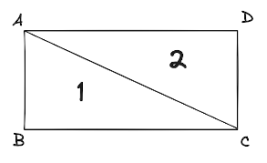
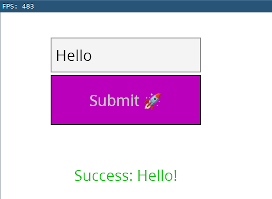
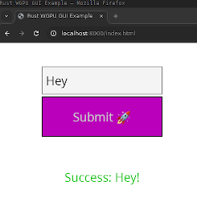

*This post was originally posted on the [LogRocket](https://blog.logrocket.com/rust-wgpu-cross-platform-graphics/) blog on 28.05.2024 and was cross-posted here by the author.*

Understanding how to work directly with the new WebGPU standard requires more knowledge than higher-level graphics libraries that abstract complex development concepts for easier usage. However, this knowledge also comes with benefits like a higher level of control, better cross-platform performance, and more efficient bug-solving.

This article will showcase how to use [the](https://wgpu.rs/) [w](https://wgpu.rs/)[gpu crate](https://wgpu.rs/) to set up a GPU-based rendering pipeline and how to construct a basic user interface with it. Whether your project has intensive graphics processing needs or not, this step-by-step tutorial can offer useful and interesting knowledge to help you develop more effectively.

## What is wgpu? 

wpgu is a portable graphics library written in Rust. It’s based on the new [WebGPU](https://blog.logrocket.com/webgpu-accelerate-ml-workloads-browser/) [s](https://blog.logrocket.com/webgpu-accelerate-ml-workloads-browser/)[tandard](https://blog.logrocket.com/webgpu-accelerate-ml-workloads-browser/) for the web. This new standard, which is currently still being worked on, is essentially for exposing an API to interact with GPUs for both graphics and computation on the web.

However, besides the possibility to target WebGPU — and WebGL, for compatibility reasons — the wgpu crate has several so-called backends for native graphics APIs such as Vulkan, DirectX 12, or Metal.

But why would we want to dip so far down the abstraction stack, directly to the GPU? Isn’t that too low-level to be practically useful? Shouldn’t we use a higher level library to abstract these details away?

Well, this is a widely held sentiment, but I disagree. In my experience, having an understanding of how things work on a fundamental level can inform and guide how to properly use the higher level abstractions. 

Sure, you won’t necessarily build a high-fidelity Web GUI in a way where you write the code for each single triangle on the screen. However, knowing how whichever abstraction you use translates into the things that pop up on the screen can help you solve problems, find bugs, and come up with a coherent architecture for the system you’re building.

Also, for some use cases, you might be forced to dip down to the lower levels in hot code paths for performance reasons. If you already have a mental model for what these lower levels look like and how they work, this increased comfort can help tremendously, because you simply won’t be afraid to dip down and touch some of the lower level parts.

So, let’s dip our feet into the world of GPU programming. In this post, we’ll leverage wgpu to build a very simple GUI application. Our GUI app will run natively on the mainstream platforms, as well as on the web, compiled to WebAssembly (Wasm).

The wgpu setup and structure in this tutorial is based on the fantastic [Learn Wgpu](https://sotrh.github.io/learn-wgpu/) beginner tutorials. If you’re interested to learn the absolute basics and to dive deeper into wgpu, I would recommend you go through the whole tutorial and to also check out [this collection of resources on wgpu](https://github.com/rofrol/awesome-wgpu).

Let’s get started!

## Setting up Rust to work with wgpu

To follow along, all you need is a recent Rust installation. The latest version at the time of writing is 1.77.0.

First, create a new Rust project:

```bash
    cargo new rust-wgpu-gui-example
    cd rust-wgpu-gui-example
```

Next, edit the `Cargo.toml` file and add the dependencies you'll need:

```toml
    [lib]
    crate-type = ["cdylib", "rlib"]
    
    [dependencies]
    winit = "0.29.15"
    wgpu = "0.19.3"
    env_logger = "0.11.0"
    log = "0.4.20"
    pollster = "0.3.0"
    bytemuck = { version = "1.14.3", features = ["derive"] }
    glyphon = "0.5.0"
    cfg-if = "1"
    
    [target.'cfg(target_arch = "wasm32")'.dependencies]
    console_error_panic_hook = "0.1.6"
    console_log = "1.0"
    wgpu = { version = "0.19.3", features = ["webgl"]}
    wasm-bindgen = "0.2"
    wasm-bindgen-futures = "0.4.30"
    web-time = "1.1.0"
    web-sys = { version = "0.3", features = [
        "Document",
        "Window",
        "Element",
        "HtmlCanvasElement",
    ]}
```

The most important libraries we use:

- wgpu for graphics
- [Winit for window handling](https://blog.logrocket.com/create-manage-windows-rust-app-with-winit/), which in this case includes creating a new window as well as handling mouse, keyboard, and other inputs
- [glyphon](https://github.com/grovesNL/glyphon) to help us render text
- [bytemuck](https://github.com/Lokathor/bytemuck) for byte-level casts and conversions so we have the correct data layout to send towards the GPU

We also add some libraries for logging and the [Pollster](https://github.com/zesterer/pollster) async runtime, which we’ll go into a bit later.

Below the normal dependencies, we add some dependencies specifically for the `wasm32` target, so for compiling for the web. For this, we need a different logging stack, as well as a different library for handling time.

We’ll also add the `webgl` feature for wgpu, since we’ll use that as a graphics backend. Why aren’t we using WebGPU, you ask? Well, that’s because [browser implementations](https://caniuse.com/?search=webgpu) are simply not stable yet.

Besides that, we need `wasm-bindgen` and `web-sys` to be able to conveniently build a version of our app that will work on the web.

Next, let’s look at the file structure of the app we’re going to build.

### File structure of our simple GUI Rust app

Since we’re going to build a simple GUI app, we’ll create several components. These components will make up the GUI and contain the logic for wiring the whole thing together in one central place — the `lib.rs` file:

- src/
  - fonts/ // custom font
     - emoji.ttf
     - font.ttf
  - main.rs // entry point for the native application
  - lib.rs // wgpu setup and GUI logic
  - button.rs // Button component
  - rectangle.rs // Rectangle primitive
  - shader.wgsl // Shader code
  - text.rs // Text primitive
  - text_field.rs // TextField component
- Cargo.toml
- index.html

We add the custom font and emoji font we’re going to use for the GUI so we can use the same font on every platform, including the web. Then, we create a file for each GUI component and primitive we’re going to build, a shader file (more on this later), and an `index.html` file to contain the web version of the app.

Now that we have a high-level overview of the components of the app, let’s look at the fundamental data types we’ll need.

### The Rust types used in our wgpu project

We’ll go through the most important types we’ll use in this app one by one. This will add another layer of understanding and overview after the file layout.

First, let’s look at some simple types, which represent our GUI components:

```rust
    pub struct Id(usize);
    
    pub enum Component {
        Button(Id, button::Button),
        TextField(Id, text_field::TextField),
        Text(Id, text::Text),
    }
```

We create an `enum`, with different types of components for the three different GUI components we’ll build:


- `Button`: a clickable button, with text inside it, that changes its color on hover and click
- `TextField`: an interactive (but limited) text field where we can add and then remove text, which changes its color on hover
- `Text`: a simple, immutable text field

Each of these components gets an `Id`, so we can reference a component by its `Id` when we get relevant input.

Fundamentally, these components rely on the `glyphon` text rendering library and on our `Rectangle` primitive in the `src/rectangle.rs` file:


```rust
    #[derive(Copy, Clone, Debug)]
    pub struct RectPos {
        pub top: u32,
        pub left: u32,
        pub bottom: u32,
        pub right: u32,
    }
    
    #[derive(Debug, Clone)]
    pub struct Rectangle {
        pub position: RectPos,
        color: [f32; 3],
        color_active: [f32; 3],
        border_color: [f32; 3],
        border_color_active: [f32; 3],
    }
```

Here, we define:

- A `RectPos` type, which holds the outer pixel coordinates of a rectangle
- A `Rectangle` type, which holds this position as well as color values for its passive and active states

Now, let’s look in more detail at the component types.

In the `src/text.rs` file, we have the `text::Text` type for our `Text` component:


```rust
    #[derive(Debug)]
    pub struct TextWidth {
        pub width: f32,
        pub buffer_width: f32,
    }
    
    #[derive(Debug)]
    pub struct Text {
        buffer: Buffer,
        rect_pos: RectPos,
        color: Color,
        color_active: Color,
    }
```

This component contains a `glyphon::Buffer`, which holds the current text, a previously mentioned `RectPos` that indicates the outer coordinates of the text area, and a color value.

We also create a `TextWidth` helper type, since we’ll later have to calculate how wide a piece of text within a `TextField` is. This will allow us to scroll to the right if the text is larger than the containing text field.

Let’s look at this `TextField` next in the `src/text_field.rs` file: 


```rust
    #[derive(Debug)]
    pub struct TextField {
        pub text: Text,
        pub rectangle: Rectangle,
        pub content: String,
        pub active: bool,
        pub last_cursor_blink: Option<SystemTime>,
    }
```

Here, we simply have a text field component composed of a `Text` component and our `Rectangle` primitive. We also add fields for the internal component state:


- The entered text as `content`
- The `active` state of the component
- The `last_cursor_blink` timestamp, which we’ll use later to implement a blinking cursor

Finally, let’s check out the `Button` component in the `src/button.rs` file:


```rust
    pub struct Button {
        pub text: Text,
        pub rectangle: Rectangle,
        on_click: Box<dyn Fn()>,
    }
```

Again, this component consists of a `Text` and `Rectangle`, but it also has an `on_click` handler attached to it. This is implemented as a `Box<dyn Fn()>` so we can attach an arbitrary function to be called when a button is clicked.

That’s it for the data types of the components we’ll build. Next, let’s look at our application `State`:


```rust
    enum GUIEvent {
        SuccessEvent(Id),
    }
    
    struct InputState {
        clicked: bool,
        mouse_coords: PhysicalPosition<f64>,
    }
    
    struct State<'window> {
        surface: wgpu::Surface<'window>,
        device: wgpu::Device,
        queue: wgpu::Queue,
        config: wgpu::SurfaceConfiguration,
        size: winit::dpi::PhysicalSize<u32>,
        window: Window,
        render_pipeline: wgpu::RenderPipeline,
        text_renderer: TextRenderer,
        text_atlas: TextAtlas,
        text_cache: SwashCache,
        font_system: FontSystem,
        components: Vec<Component>,
        input_state: InputState,
    }
```

First, we define a `GUIEvent` enum with a `SuccessEvent` variant. This is our custom user event, which we’ll use within `Winit` to send and react to custom events using Winit’s own event loop.

Then we define our `InputState`, which holds the current mouse position, as well as if the mouse is currently being clicked. We’ll see why this is relevant later when we implement input handling.

We also define the heart of our application: the application `State`. It uses the `'window` [lifetime](https://blog.logrocket.com/understanding-lifetimes-in-rust/), which means it lives exactly as long as the application window lives for. We need this behavior because the `wgpu::Surface` also has this lifetime constraint.

The `State` type has several `wgpu` types such as `Surface`, `Device` etc., which we’ll talk about later on, when we define the rendering pipeline, since these are all part of this pipeline. We also save the window `config` and `size` in `State`, since these things might change while the application runs — e.g., because of a resize.

For text rendering, we keep some `glyphon` types, such as `TextRenderer`, `TextAtlas`, and the `FontSystem` in `State`. We’ll need them for the text rendering pipeline. Also, to be able to react to input properly, we keep the above defined `InputState` and a lift of the active components to be rendered inside the app `State`. 

Confused yet? Don’t worry, the `State` and its fields will become more clear as we progress through implementing the app and reference the different fields we defined here.

Finally, let’s look at the `Vertex` type, which represents a point in 3D space that we want to render:


```rust
    #[repr(C)]
    #[derive(Clone, Debug, Copy, bytemuck::Pod, bytemuck::Zeroable)]
    pub struct Vertex {
        position: [f32; 3],
        color: [f32; 3],
        rect: [f32; 4],
        border_color: [f32; 3],
    }
```

Since we’re going to render our little GUI app using the GPU, we’ll need to implement shader programs to tell the GPU which operations to execute on the set of vertices we send to it to make them appear on the screen as we would like them to. In our case, we specifically need:


- A vertex shader indicating where to render a pixel
- A fragment shader indicating the color in which to render a pixel

We’ll explore more on those later. For now, let’s get back to our `Vertex` type.

A `Vertex` has a position, which are its x, y and z coordinates. However, since we’re building a 2D application, the z coordinate will always be zero (`0.0`).

For each vertex, we also define a color and a border color, which informs the fragment shader, which color to set for the pixels we want to render based on our vertices.

We also add a `rect` field with four points in it to each vertex. We’ll use this to help detect where the border of a rectangle is located so we can color it differently — in our case, using the `border``_``color` value. 

When we look at the fragment shader later, we’ll see how this is implemented. Note that this is not necessarily the most efficient method or best practice to implement this behavior, but rather a very simple one. Since we’re not going to go into significant depth regarding shader implementations in this tutorial, it’ll suffice for our simple example.

As you can see, we use `repr(C)` as well as two `bytemuck` traits called `Pod` and `Zeroable`. What does that mean? Well, we’ll send this `Vertex` type directly to the shader programs, so we need to uphold some guarantees regarding its layout in memory:


- `Pod` means it can be interpreted as a `&[u8]` 
- `Zeroable` means the memory can be zeroed
- `repr(C)` means the order and size of the fields should be kept exactly as they would be in C, without the compiler interfering. This is important for compatibility and something you’ll often see when interfacing with C libraries, for example

There’s one more thing we need to define for `Vertex` — the `wgpu::VertexBufferLayout`. Since we’re going to send a bunch of these vertices over to the GPU to be manipulated using our vertex and fragment shaders, we need to tell our rendering pipeline how to interpret this data on a memory level:

```rust
    impl Vertex {
        fn desc() -> wgpu::VertexBufferLayout<'static> {
            wgpu::VertexBufferLayout {
                array_stride: std::mem::size_of::<Vertex>() as wgpu::BufferAddress,
                step_mode: wgpu::VertexStepMode::Vertex,
                attributes: &[
                    wgpu::VertexAttribute {
                        offset: 0,
                        shader_location: 0,
                        format: wgpu::VertexFormat::Float32x3,
                    },
                    wgpu::VertexAttribute {
                        offset: std::mem::size_of::<[f32; 3]>() as wgpu::BufferAddress,
                        shader_location: 1,
                        format: wgpu::VertexFormat::Float32x3,
                    },
                    wgpu::VertexAttribute {
                        offset: std::mem::size_of::<[f32; 6]>() as wgpu::BufferAddress,
                        shader_location: 2,
                        format: wgpu::VertexFormat::Float32x4,
                    },
                    wgpu::VertexAttribute {
                        offset: std::mem::size_of::<[f32; 10]>() as wgpu::BufferAddress,
                        shader_location: 3,
                        format: wgpu::VertexFormat::Float32x3,
                    },
                ],
            }
        }
    }
```

That looks complicated, but it’s really not — just read through it slowly, line by line. We’re basically just telling our rendering pipeline how big the fields are on our `Vertex` struct and at what offset in memory they start. 

For example, our `position` was three `f23` values, starting at the beginning — that is, `offset: 0`. The `shader_location` is how we can reference this value in the shader program later on. You’ll see this line of code:

```bash
    @location(0) position: vec3<f32>
```

And we simply do that for all four fields on `Vertex` as well as for every field we add that we want to access in our shaders.

If the `Vertex` type and its layout description look scary to you, don’t worry — that’s normal. They’re taken from the official [examples](https://github.com/gfx-rs/wgpu/tree/trunk/examples) and [tutorial](https://sotrh.github.io/learn-wgpu/beginner/tutorial4-buffer/#the-vertex-buffer), which you can use to gain a better understanding.

With the fundamental data types out of the way, let’s move on to setting up our wgpu rendering pipeline.

## Setting up the wgpu rendering pipeline

A rendering pipeline defines all the components and steps needed to render something using the GPU. That’s a bit abstract, so let’s create the pipeline and then hopefully, it’ll become more clear.

Because some of the wgpu setup is asynchronous, we need an async runtime to run it. We’ll use [pollster](https://crates.io/crates/pollster) for this purpose. In `main.rs`, the only thing we’ll do is call `run()` within the `lib.rs` file:


```rust
    use rust_wgpu_gui_example::run;
    
    fn main() {
        pollster::block_on(run());
    }
```

In this `run()` function, we do some initial setup, including initializing the logger and the `winit` event loop as well as spawning an `winit` window to render our GUI into. 

We create the `event_loop` with our custom `GUIEvent` we defined above, which means we can use this event to send custom `UserEvent`s. Then, we call `run_app`:


```rust
    pub async fn run() {
        env_logger::init();
    
        let event_loop = EventLoopBuilder::<GUIEvent>::with_user_event()
            .build()
            .unwrap();
            
        let window = WindowBuilder::new().build(&event_loop).unwrap();
        run_app(event_loop, window).await;
    }
```

In the `run_app()` function, the first thing we do is to initialize our application `State`:


```rust
    async fn run_app(event_loop: EventLoop<GUIEvent>, window: Window) {
        let mut state = State::new(window, event_loop.create_proxy()).await;
```

This is also where we set up the whole wgpu rendering pipeline. The `State::new()` function is rather long, so we’ll go through it step-by-step:


```rust
    impl<'window> State<'window> {
        async fn new(window: Window, event_loop_proxy: EventLoopProxy<GUIEvent>) -> State<'window> {
            let size = window.inner_size();
            let instance = wgpu::Instance::default();
            let limits = wgpu::Limits::default();
    
            let mouse_coords = PhysicalPosition { x: 0.0, y: 0.0 };
            let input_state = InputState {
                clicked: false,
                mouse_coords,
            };
            ...
```

First, we get the window’s `inner_size`, which we need to tell wgpu how big the space it can draw on is. 

We use the default wgpu configuration limits (e.g. texture, size, etc.) and create a default wgpu `Instance`, which is a handle to the underlying GPU. The GPU will automatically select a fitting `Backend` based on the existing hardware on the system, such as `metal` for mac OS or `webgl/webgpu` for Wasm.

Then, we initialize the mouse coordinates and some initial input state so we can track mouse movements and clicks while the app runs.

Next, we create our `wgpu::Surface`, the screen surface to render into:

```rust
    let surface = unsafe {
        instance.create_surface_unsafe(wgpu::SurfaceTargetUnsafe::from_window(&window).unwrap())
    }
    .expect("can create surface");
```

In the current version of wgpu, this is an `unsafe` operation if we want to have [a raw window handle](https://docs.rs/wgpu/latest/wgpu/enum.SurfaceTargetUnsafe.html), which we do in this case.

Next, we create a `wgpu::adapter`, which is a handle for the actual graphics card. We’ll just select the default from the GPU `instance` we created above and our created `surface`:

```rust
    let adapter = instance
        .request_adapter(&wgpu::RequestAdapterOptionsBase {
            power_preference: wgpu::PowerPreference::default(),
            force_fallback_adapter: false,
            compatible_surface: Some(&surface),
        })
        .await
        .expect("can create adapter");
```

Then, we define a rendering device and a rendering queue for our adapter. Here, we can specify some limits and features. This will become relevant later when we make some changes for the web version of the application:

```rust
    let (device, queue) = adapter
        .request_device(
            &wgpu::DeviceDescriptor {
                label: None,
                required_features: wgpu::Features::empty(),
                required_limits: limits,
            },
            None,
        )
        .await
        .expect("can create a new device");
```

Finally, we define a configuration for our surface, supplying the adapter and the size of the window. There’s a lot more we could specify here, but we’ll stick to defaults for this example:

```rust
    let config = surface
        .get_default_config(&adapter, size.width, size.height)
        .unwrap();

    surface.configure(&device, &config);
```

Before we come to our shader setup, we’ll set up what we need in terms of text rendering using the `glyphon` crate:

```rust
    let mut font_system =
        FontSystem::new_with_locale_and_db("en-US".into(), glyphon::fontdb::Database::new());
    let font = include_bytes!("./fonts/font.ttf");
    let emoji = include_bytes!("./fonts/emoji.ttf");
    font_system.db_mut().load_font_data(font.to_vec());
    font_system.db_mut().load_font_data(emoji.to_vec());

    let text_cache = SwashCache::new();
    let mut text_atlas = TextAtlas::new(&device, &queue, config.format);
    let text_renderer = TextRenderer::new(
        &mut text_atlas,
        &device,
        wgpu::MultisampleState::default(),
        None,
    );
```

We start by instantiating a `font_system` with the two fonts we added to the project. We initialize the `text_cache`, `text_atlas`, and `text_renderer` with the wgpu rendering pipeline parts we just created. This ensures that we use the same rendering pipeline to render the text as we do for the rest of the application.

Now, let’s create the rendering pipeline using wgpu, starting with our shader programs:

```rust
    let shader = device.create_shader_module(wgpu::ShaderModuleDescriptor {
        label: None,
        source: wgpu::ShaderSource::Wgsl(include_str!("shader.wgsl").into()),
    });
```

We create a shader module for our `device` and specify the `shader.wgsl` file to be used here. Within `shader.wgsl`, we implement both our vertex shader and our fragment shader.

Let’s look at the vertex shader first. It’s responsible for where the pixels should be drawn, corresponding to the vertices we send over:

```bash
    struct VertexInput {
        @location(0) position: vec3<f32>,
        @location(1) color: vec3<f32>,
        @location(2) rect: vec4<f32>,
        @location(3) border_color: vec3<f32>,
    }
    
    struct VertexOutput {
        @builtin(position) clip_position: vec4<f32>,
        @location(0) color: vec3<f32>,
        @location(1) rect: vec4<f32>,
        @location(2) border_color: vec3<f32>,
    }
    
    @vertex
    fn vertex(
        model: VertexInput,
    ) -> VertexOutput {
        var out: VertexOutput;
    
        out.color = model.color;
        out.clip_position = vec4<f32>(model.position, 1.0);
        out.rect = model.rect;
        out.border_color = model.border_color;
    
        return out;
    }
```

If you look at `VertexInput`, you might recognize the `VertexBufferLayout` we defined above in terms of structure. We needed it to be able to get our `Vertex` from our application through the pipeline into these shaders.

We also define `VertexOutput`, which is the data that will be returned from the vertex shader and passed on to the fragment shader. It’s quite similar, since it just passes on the `color`, `border_color`, and `rect` fields. However, it also transforms the input `position` to clip coordinates, which the GPU needs to calculate which vertices to render or not.

The fragment shader, which we use to figure out the color of each pixel, has some more interesting logic in our case. Let’s look at it:

```bash
    @fragment
    fn fragment(in: VertexOutput) -> @location(0) vec4<f32> {
        var border_width: f32 = 2.0;
        var top: f32 = in.rect[0];
        var left: f32 = in.rect[1];
        var bottom: f32 = in.rect[2];
        var right: f32 = in.rect[3];
    
        if (
        ((in.clip_position.x > left && in.clip_position.x < (left + border_width))
        || (in.clip_position.x > (right - border_width) && in.clip_position.x < right))
        || ((in.clip_position.y > top && in.clip_position.y < (top + border_width))
        || (in.clip_position.y > (bottom - border_width) && in.clip_position.y < bottom )))  {
            return vec4<f32>(in.border_color, 1.0);
        }
        return vec4<f32>(in.color, 1.0);
    }
```

The fragment shader takes the `VertexOutput` as input and simply returns a color value for each pixel. For our purposes, we calculate this color value using our `color` and `border_color` value as well as the `rect` field, which represents the outer points of the rectangle these vertices are describing.

We basically check, if the current pixel is within the `border_width` of `2` pixels from the outer edges of the rectangle. If so, we color it using the `border_color`; otherwise, we color it using `color`.

Of course, for other shapes and other coloring algorithms, you might need another shader. A real application usually consists of several such shaders for each different effect you want to create in terms of position and color.

Let’s continue with our rendering pipeline:

```rust
    let render_pipeline_layout =
        device.create_pipeline_layout(&wgpu::PipelineLayoutDescriptor {
            label: None,
            bind_group_layouts: &[],
            push_constant_ranges: &[],
        });

    let render_pipeline = device.create_render_pipeline(&wgpu::RenderPipelineDescriptor {
        label: None,
        layout: Some(&render_pipeline_layout),
        vertex: wgpu::VertexState {
            module: &shader,
            entry_point: "vertex",
            buffers: &[Vertex::desc()],
        },
        fragment: Some(wgpu::FragmentState {
            module: &shader,
            entry_point: "fragment",
            targets: &[Some(wgpu::ColorTargetState {
                format: config.format,
                blend: Some(wgpu::BlendState::REPLACE),
                write_mask: wgpu::ColorWrites::ALL,
            })],
        }),
        primitive: wgpu::PrimitiveState {
            topology: wgpu::PrimitiveTopology::TriangleList,
            strip_index_format: None,
            front_face: wgpu::FrontFace::Ccw,
            cull_mode: Some(wgpu::Face::Back),
            unclipped_depth: false,
            polygon_mode: wgpu::PolygonMode::Fill,
            conservative: false,
        },
        multisample: wgpu::MultisampleState:default(),
        depth_stencil: None,
        multiview: None,
    });
```

Here, we configure both our vertex and fragment shaders, as well as the layout of the rendering pipeline. We also see our `VertexBufferLayout` being configured to tell the rendering pipeline the layout of our vertices using `Vertex::desc()`.

There are quite a few configuration options, most of which we just set to default values for rendering colored triangles. We won’t go into much detail, since our focus is what to do with such a render pipeline. If you’re interested in diving a bit deeper here, feel free to check the [configuration options in the docs](https://docs.rs/wgpu/latest/wgpu/struct.RenderPipelineDescriptor.html) or in the [Learn Wgpu Tutorial](https://sotrh.github.io/learn-wgpu/beginner/tutorial3-pipeline/#how-do-we-use-the-shaders).

The final part of the `State::new()` function is to initialize an empty `components` list (later, we’ll create some components here) and return our newly created `State`:

```rust
    let components = vec![];

    Self {
        window,
        surface,
        device,
        queue,
        config,
        size,
        render_pipeline,
        text_atlas,
        text_cache,
        text_renderer,
        font_system,
        components,
        input_state,
    }
}
```

With our wgpu rendering pipeline and application state set up, let’s see how we can render things to the screen.

## Rendering graphics to the screen

We’ll implement the `render()` function as part of `State` as well:

```rust
    fn render(&mut self) -> Result<(), wgpu::SurfaceError> {
        let mut text_areas: Vec<TextArea> = Vec::new();
        let mut vertices: Vec<Vertex> = Vec::new();
        let mut indices: Vec<u16> = Vec::new();

        let mut num_vertices = 0;
        let mut num_indices = 0;
        
        ...collect vertices, indices and text areas of components...
```

First, we define some vectors to collect all text areas, vertices and indices within the components we want to render. We’ll add the code that does the collection once we implement our GUI components. But what does that mean exactly — to “collect” these things?

Well, a `TextArea` is actually a `glyphon` type, which the `TextRenderer` uses to render text to the screen. So, for each component we’ll render, we need to collect the component’s `TextArea` and pass it to the `TextRenderer`.

For the vertices and indices, each primitive we want to render to the screen consists of triangles, which consist of points in 3D space. So, we could have three vertices at three points in space with x, y, and z coordinates. Then, we tell `wgpu` that this is a triangle by providing a list of indices.

Let’s say we have the following three conceptual vertices in an array:

```rust
    vertices = [
      Vertex { x: 0.0, y: 0.0, z: 0.0 },
      Vertex { x: 1.0, y: 0.0, z: 0.0 },
      Vertex { x: 1.0, y: -1.0, z: 0.0 },
    ]
```

These will form a triangle, if connected. But we need to provide the information regarding how to connect them. This is what the `indices` array is for:

```rust
    indices = [0, 1, 2]
```

This `indices` array creates a triangle from the three given points. So, by collecting all vertices and indices from the primitives making up our GUI components, we’ll be able to render all triangles they’re consisting of. We’ll see what this looks like in more detail later, when we implement the `Rectangle` primitive.

Next, once we collected all the information we need to pass into the rendering pipeline, we set up a `vertex_buffer` and an `index_buffer` into which we can shove our data:

```rust
    let vertex_buffer = self
        .device
        .create_buffer_init(&wgpu::util::BufferInitDescriptor {
            label: None,
            contents: bytemuck::cast_slice(vertices.as_slice()),
            usage: wgpu::BufferUsages::VERTEX,
        });

    let index_buffer = self
        .device
        .create_buffer_init(&wgpu::util::BufferInitDescriptor {
            label: None,
            contents: bytemuck::cast_slice(&indices),
            usage: wgpu::BufferUsages::INDEX,
        });
```

Again, we use `bytemuck` to convert these `Vec` types to the correct data type so that our pipeline can work with them. Also, we need to pass our list of collected `text_areas` to our `text_renderer`:

```rust
    self.text_renderer
        .prepare(
            &self.device,
            &self.queue,
            &mut self.font_system,
            &mut self.text_atlas,
            Resolution {
                width: self.size.width,
                height: self.size.height,
            },
            text_areas,
            &mut self.text_cache,
        )
        .unwrap();
```

Since text rendering is a part of our rendering pipeline, we pass in all the parts of our pipeline our `text_renderer` needs, tell it the size of the window, and provide the `text_areas` to it.

Finally, we need to create an `output` and a `view` based on the `text_renderer`. The `output` and `view` are essentially what we’re rendering into. You could say this makes up one rendered frame of our program:

```rust
    let output = self.surface.get_current_texture()?;
    let view = output
        .texture
        .create_view(&wgpu::TextureViewDescriptor::default());
```

Then, to be able to connect all parts of our rendering pipeline configuration — the shaders, our vertex and index buffers, the just created frame to render into, etc. — we need to create a wgpu command encoder. 

This command encoder will generate the actual commands to send to the GPU to render our scene. Within this command encoder, we can define several render passes, but in our case, we only need one:

```rust
    let mut encoder = self
        .device
        .create_command_encoder(&wgpu::CommandEncoderDescriptor { label: None });

    {
        let mut render_pass = encoder.begin_render_pass(&wgpu::RenderPassDescriptor {
            label: None,
            color_attachments: &[Some(wgpu::RenderPassColorAttachment {
                view: &view,
                resolve_target: None,
                ops: wgpu::Operations {
                    load: wgpu::LoadOp::Clear(wgpu::Color {
                        r: 1.0,
                        g: 1.0,
                        b: 1.0,
                        a: 1.0,
                    }),
                    store: wgpu::StoreOp::Store,
                },
            })],
            depth_stencil_attachment: None,
            timestamp_writes: None,
            occlusion_query_set: None,
        });

        render_pass.set_pipeline(&self.render_pipeline);
        render_pass.set_vertex_buffer(0, vertex_buffer.slice(..));
        render_pass.set_index_buffer(index_buffer.slice(..), wgpu::IndexFormat::Uint16);
        render_pass.draw_indexed(0..num_indices, 0, 0..1);

        self.text_renderer
            .render(&self.text_atlas, &mut render_pass)
            .unwrap();
    }
```

We configure our render pass to take some defaults and to use white (a value of `1.0` for `r`, `g`, `b`, and `a`, respectively) as a clean background color.

Then, we set the `render_pass` to use our configured pipeline as well as our vertex and index buffers. Importantly, we also use `draw_indexed` with the number of indices we collected so the `render``_``pass` knows how many of them to render.

We also call the rendering function of the `text_renderer` from `glyphon`, passing the `render_pass` to it to accomplish everything in one efficient rendering pass.

Finally, we send these encoded GPU commands to the GPU queue and schedule the rendered texture to be shown as the surface’s texture (`output`), concluding the rendering process:

```rust
        self.queue.submit(std::iter::once(encoder.finish()));

        output.present();
        self.text_atlas.trim();

        Ok(())
    }
}
```

Nice. We have a rendering pipeline, an application state, and a way to render to a screen. Next, let’s look at how we handle some input using the Winit event loop.

## The event loop

Back in the `run_app` function in `lib.rs`, we run our created Winit `event_loop` as the next step:

```rust
    event_loop
        .run(move |event, elwt| match event {
            UserEvent(ev) => handle_success_event(&mut state, &ev),
            Event::WindowEvent { window_id, event }
                if window_id == state.window().id() && !state.input(&event, elwt) =>
            {
                match event {
                    WindowEvent::CloseRequested => elwt.exit(),
                    WindowEvent::Resized(physical_size) => {
                        state.resize(physical_size);
                    }
                    WindowEvent::RedrawRequested => {
                        match state.render() {
                            Ok(_) => {}
                            Err(wgpu::SurfaceError::OutOfMemory) => elwt.exit(),
                            Err(e) => log::error!("render error: {e:?}"),
                        }
                    }
                    _ => (),
                };
            }
            Event::AboutToWait => {
                state.window.request_redraw();
            }
            _ => (),
        })
        .expect("event loop runs");
```

We start out by running the event loop and matching on incoming events. If the event is our custom event — in our case, a `GUIEvent` called `UserEvent` — then we call a custom handler. We’ll look at the implementation of the `handle_success_event` function later on when we implement our GUI components.

If the event is a `WindowEvent` and it concerns the current window, we call the `input()` method on our application `State` to handle the input event. If, and only if, the `input()` method doesn’t know what to do with the event, we get into the second match on the `event`. During this second match, we implement basic `WindowEvent`s such as resizing and closing the window.

On closing the window, we simply quit the app. On a request redraw, we call `render()`. Finally, on a resize event, we call our `resize()` function, which sets the new size and reconfigures our `Surface` accordingly:

```rust
    fn resize(&mut self, new_size: winit::dpi::PhysicalSize<u32>) {
        if new_size.width > 0 && new_size.height > 0 {
            self.size = new_size;
            self.config.width = new_size.width;
            self.config.height = new_size.height;
            self.surface.configure(&self.device, &self.config);
        }
    }
```

Next, let’s look at `State's input()` function, where we handle keyboard and mouse input events:

```rust
    fn input(&mut self, event: &WindowEvent, elwt: &EventLoopWindowTarget<GUIEvent>) -> bool {
        match event {
            WindowEvent::CursorMoved { position, .. } => {
                self.input_state.mouse_coords = position.to_owned();
                true
            }
            WindowEvent::MouseInput { state, button, .. } => match state {
                ElementState::Pressed => {
                    if button == &winit::event::MouseButton::Left && !self.input_state.clicked {
                        self.input_state.clicked = true;
                        self.handle_click();
                    }
                    true
                }
                ElementState::Released => {
                    if button == &winit::event::MouseButton::Left && self.input_state.clicked {
                        self.input_state.clicked = false;
                    }
                    true
                }
            },
            WindowEvent::KeyboardInput { event, .. } => {
                if let Key::Named(NamedKey::Escape) = event.logical_key {
                    elwt.exit()
                }
                true
            }
            _ => false,
        }
    }
```

If the mouse cursor moves, we update our mouse position in `State`. 

If the mouse is clicked, we set the `clicked` flag on our input state and call the `handle_click` function, which detects if one of our components was clicked on. We’ll look at this function later, after we implement the components. Once the mouse button has been released, we reset the `clicked` state. 

Finally, if the user uses the `Escape` key, we exit the program.

We’ll check out the rest of the code handling keyboard inputs — especially when it comes to inputting text into our `TextField` component — once we look at the `TextField` implementation later.

This concludes our basic event loop and input handling. Let’s implement our GUI components next to pull it all together into a working application.

## Implementing GUI components in Rust with wgpu

In this section we’ll look at how to implement `Rectangle`, `Text`, `TextField`, and `Button` components. We’ll go through one step at a time to create the component and implement the input and rendering logic we hinted at earlier.

### Rectangle component

Let’s start with the `Rectangle` primitive in the `rectangle.rs` file:

```rust
    pub const NUM_INDICES: u32 = 6;
    
    impl Rectangle {
        pub fn new(
            position: RectPos,
            color: [f32; 3],
            color_active: [f32; 3],
            border_color: [f32; 3],
            border_color_active: [f32; 3],
        ) -> Self {
            Self {
                color,
                color_active,
                border_color,
                border_color_active,
                position,
            }
        }
```

We can create a rectangle by drawing two triangles put together, which means it has six indices. We need to take the above-mentioned `RectPos` and the outer points of the rectangle, then connect them together.

Imagine that are four points — A, B, C and D — that make up the edges of the rectangle. The first triangle connects A, B, and C. The second triangle connects A, C, and D. This way, we get a rectangle from two triangles:

<center>
    <a href="images/img1.png" target="_blank"></a>
</center>

To render the rectangle, we need its `vertices` and `indices`. Let’s create methods to get them:

```rust
    pub fn indices(&self, base: u16) -> [u16; 6] {
        [base, 1 + base, 2 + base, base, 2 + base, 3 + base]
    }
```

Getting the `indices` is pretty straightforward. We count up from the `base`, which is simply `num_indices`, during the collection of all component indices. Then, based on this number, we connect our vertices together — e.g., `[0, 1, 2]` and `[0, 2, 3]` — to create a rectangle.

For the `vertices`, we need to do a bit more work. We pass in whether the current rectangle is active (e.g. hovered over) as well as the size of the window. We need the size so we can calculate the vertex coordinates based on the pixel coordinates of the given `RectPos`:

```rust
    pub fn vertices(
        &mut self,
        is_active: bool,
        size: winit::dpi::PhysicalSize<u32>,
    ) -> [Vertex; 4] {
        let top = 1.0 - (self.position.top as f32 / (size.height as f32 / 2.0));
        let left = (self.position.left as f32 / (size.width as f32 / 2.0)) - 1.0;
        let bottom = 1.0 - (self.position.bottom as f32 / (size.height as f32 / 2.0));
        let right = (self.position.right as f32 / (size.width as f32 / 2.0)) - 1.0;

        let rect = [
            self.position.top as f32,
            self.position.left as f32,
            self.position.bottom as f32,
            self.position.right as f32,
        ];

        let mut color = self.color;
        let mut border_color = self.border_color;
        if is_active {
            color = self.color_active;
            border_color = self.border_color_active;
        }

        //  -1, 1    1,1
        //  A--------D
        //  |        |
        //  |        |
        //  |        |
        //  B--------C
        //  -1, -1   1, -1
        [
            Vertex {
                // A
                position: [left, top, 0.0],
                color,
                rect,
                border_color,
            },
            Vertex {
                // B
                position: [left, bottom, 0.0],
                color,
                rect,
                border_color,
            },
            Vertex {
                // C
                position: [right, bottom, 0.0],
                color,
                rect,
                border_color,
            },
            Vertex {
                // D
                position: [right, top, 0.0],
                color,
                rect,
                border_color,
            },
        ]
    }
```

As mentioned above, we need a `position`, `rect`, `color`, and `border_color` for each `Vertex`. The color values are easy, since we have them in our `Rectangle` already. The `rect` is also easy, since it’s essentially just our `RectPos` — the outer pixels of the rectangle.

However, the `position` is a little more involved. We need to calculate the `position` based on the outer pixel values and the size of the window, since they need to be normalized to values between `1` and `-1` — in other words, the left (`-1`) or right (`1`) of the screen for `x`, or the bottom (`-1`) or top (`1`) of the screen for `y`.

This leads to the following normalization formulas for our vertices:

```rust
    let top = 1.0 - (self.position.top as f32 / (size.height as f32 / 2.0));
    let left = (self.position.left as f32 / (size.width as f32 / 2.0)) - 1.0;
    let bottom = 1.0 - (self.position.bottom as f32 / (size.height as f32 / 2.0));
    let right = (self.position.right as f32 / (size.width as f32 / 2.0)) - 1.0;
```

With that, we can set our vertices to the four points of the rectangle:


- A — top left
- B — bottom left
- C — bottom right
- D — top right

Now we can also see how our `indices` connect `A-B-C` and `A-C-D` to form two triangles, which together form a rectangle.

Finally, we need a way to find out whether the current rectangle is being hovered over:

```rust
    pub fn is_hovered(&self, mouse_coords: PhysicalPosition<f64>) -> bool {
        let rect_pos = self.position;
        mouse_coords.x > rect_pos.left as f64
            && mouse_coords.x < rect_pos.right as f64
            && mouse_coords.y > rect_pos.top as f64
            && mouse_coords.y < rect_pos.bottom as f64
    }
```

Here, we simply check if the mouse coordinates are inside of the rectangle. 

That’s it for the `Rectangle` implementation. Let’s move on to the `Text` component.

### Text component

To create a new `Text` component, we need to instantiate a `glyphon::Buffer` and configure it for our needs, saving it inside the component:

```rust
    const FONT_SIZE: f32 = 30.0;
    const LINE_HEIGHT: f32 = 42.0;
    
    impl Text {
        pub fn new(
            font_system: &mut FontSystem,
            rect_pos: RectPos,
            text: &str,
            color: Color,
            color_active: Color,
        ) -> Self {
            let mut buffer = Buffer::new(font_system, Metrics::new(FONT_SIZE, LINE_HEIGHT));
    
            buffer.set_size(
                font_system,
                (rect_pos.right - rect_pos.left) as f32,
                (rect_pos.bottom - rect_pos.top) as f32,
            );
    
            buffer.set_text(
                font_system,
                text,
                Attrs::new().family(Family::SansSerif),
                Shaping::Advanced,
            );
    
            buffer.lines.iter_mut().for_each(|line| {
                line.set_align(Some(glyphon::cosmic_text::Align::Center));
            });
    
            buffer.set_wrap(font_system, glyphon::Wrap::None);
    
            buffer.shape_until_scroll(font_system);
    
            Self {
                buffer,
                rect_pos,
                color,
                color_active,
            }
        }
```

We set the `size`, `text`, `alignment`, `wrapping`, and `scrolling` behavior of our text buffer. What’s important here is that we have to set the alignment for each line and calculate the width and height using the rectangle around the text.

Now, in order to render the `Text`, we need to get to the `glyphon::TextArea`. As we saw above, we can then pass the `TextArea` to the `TextRenderer`:

```rust
    pub fn text_area(&self, is_active: bool) -> TextArea {
        let text_width = self.get_text_width();
        let TextWidth {
            width,
            buffer_width,
        } = text_width;

        let text_overlap = if width > buffer_width {
            width - buffer_width
        } else {
            0.0
        };

        TextArea {
            buffer: &self.buffer,
            left: self.rect_pos.left as f32 - text_overlap,
            top: self.top(),
            scale: 1.0,
            bounds: self.bounds(),
            default_color: if is_active {
                self.color_active
            } else {
                self.color
            },
        }
    }
}
```

We do this by first calculating the width of the text using a helper, which goes through all layout runs and calculates the maximum width of the rendered text:

```rust
    pub fn get_text_width(&self) -> TextWidth {
        TextWidth {
            width: self
                .buffer
                .layout_runs()
                .fold(0.0, |width, run| run.line_w.max(width)),
            buffer_width: self.buffer.size().0,
        }
    }
```

Then, we calculate the `text_overlap`. This is important because if the text overlaps our text bounds, it will be clipped — i.e., not rendered. So, if we want to see what’s being written beyond the end of the `Text`, we need to calculate how much offset to add to the left side of the bounding box.

Finally, we create the `TextArea`:

```rust
    fn bounds(&self) -> TextBounds {
        TextBounds {
            left: self.rect_pos.left as i32,
            top: self.rect_pos.top as i32,
            right: self.rect_pos.right as i32,
            bottom: self.rect_pos.bottom as i32,
        }
    }
    
    fn top(&self) -> f32 {
        (self.rect_pos.bottom - (self.rect_pos.bottom - self.rect_pos.top) / 2) as f32
            - (self.buffer.metrics().line_height / 2.0)
    }
```

we calculate the text bounds based on the `RectPos` provided to `Text`, set the text color based on the `active` state, and calculate the `left` and `top` of the text area using the previously calculated `text_overlap`. We also vertically align the text by calculating the vertical center of the text box using the `top()` function.

The only thing left for the `Text` component is a way to actually set the text content”

```rust
    pub fn set_text(&mut self, font_system: &mut FontSystem, text: &str) {
        self.buffer.set_text(
            font_system,
            text,
            Attrs::new().family(Family::SansSerif),
            Shaping::Advanced,
        );
    }
```

The `set_text` function simply pushes the given text into the `buffer`. This means that for the `TextField` component in which we want to be able to type, we’ll need to update the text based on the previous content before calling `set_text`. That’s what we’re going to look at next.

### TextField component

To create a `TextField`, we use a `TextFieldConfig` struct as well as some constants for padding and the cursor styling:

```rust
    #[derive(Debug)]
    pub struct TextFieldConfig {
        pub rect_pos: RectPos,
        pub fill_color: [f32; 3],
        pub fill_color_active: [f32; 3],
        pub border_color: [f32; 3],
        pub border_color_active: [f32; 3],
        pub text_color: glyphon::Color,
    }
    
    pub const CURSOR_BLINK_TIMEOUT_MS: u128 = 500;
    const PADDING: u32 = 10;
    const CURSOR_WIDTH: u32 = 2;
    
    impl TextField {
        pub fn new(cfg: TextFieldConfig, font_system: &mut glyphon::FontSystem) -> Self {
            let padded_rect = RectPos {
                top: cfg.rect_pos.top + PADDING,
                left: cfg.rect_pos.left + PADDING,
                right: cfg.rect_pos.right - PADDING,
                bottom: cfg.rect_pos.bottom - PADDING,
            };
            Self {
                rectangle: Rectangle::new(
                    cfg.rect_pos,
                    cfg.fill_color,
                    cfg.fill_color_active,
                    cfg.border_color,
                    cfg.border_color_active,
                ),
                text: Text::new(font_system, padded_rect, "", cfg.text_color, cfg.text_color),
                content: String::new(),
                active: false,
                last_cursor_blink: None,
            }
        }
```

We instantiate a `Text` component as well as a `Rectangle` based on the values given in `TextFieldConfig`. We then initialize the `content` of the text field to an empty `S``tring`, the `active` value to `false`, and `last_cursor_blink` to `None` so that no blinking cursor will show.

As mentioned above, we need a way to add and remove text from the `TextField`. This will ensure users can type in the fiels and remove typed characters using their `b``ackspace` key:

```rust
    pub fn add_text(&mut self, font_system: &mut FontSystem, text: &str) {
        if self.active {
            self.content.push_str(text);
            self.text.set_text(font_system, &self.content);
        }
    }

    pub fn remove_character(&mut self, font_system: &mut FontSystem) {
        if self.active {
            self.content.pop();
            self.text.set_text(font_system, &self.content);
        }
    }
```

Also, we need a way to set the text field to `active` when a user clicks on it:

```rust
    pub fn set_active(&mut self) {
        self.active = true;
        if self.last_cursor_blink.is_none() {
            self.last_cursor_blink = Some(SystemTime::now());
        }
    }

    pub fn set_inactive(&mut self) {
        self.active = false;
        self.last_cursor_blink = None;
    }
```

Every time we click outside the text field and back in, we want to reset the blinking cursor. So, we have to set that behavior as well, together with the `active` state. We also need a way to calculate the cursor position to be able to render it:

```rust
    pub fn get_cursor(&self) -> Rectangle {
        let text_width = self.text.get_text_width();
        let rect_pos = self.rectangle.position;
        let left = if text_width.width > text_width.buffer_width {
            rect_pos.right - PADDING
        } else {
            rect_pos.left + text_width.width as u32 + PADDING
        };
        Rectangle::new(
            RectPos {
                top: rect_pos.top + PADDING,
                left,
                right: left + CURSOR_WIDTH,
                bottom: rect_pos.bottom - PADDING,
            },
            [0.0, 0.0, 0.0],
            [0.0, 0.0, 0.0],
            [0.0, 0.0, 0.0],
            [0.0, 0.0, 0.0],
        )
    }
```

We calculate the text width of the contained `Text` component. With some small `PADDING`, we add a small rectangle to the end of the text. This is our blinking cursor, which we create using our `Rectangle` primitive with all colors set to black.

That’s it for the `TextField`. Let’s look at the final component, `Button`.

### Button component

The `Button` is the simplest of our components, since it’s just a composition of a `Rectangle` and a `Text`. Here’s the full implementation of our `Button` component:

```rust
    pub struct ButtonConfig {
        pub rect_pos: RectPos,
        pub fill_color: [f32; 3],
        pub fill_color_active: [f32; 3],
        pub border_color: [f32; 3],
        pub border_color_active: [f32; 3],
        pub text: &'static str,
        pub text_color: glyphon::Color,
        pub text_color_active: glyphon::Color,
        pub on_click: Box<dyn Fn()>,
    }
    
    impl Button {
        pub fn new(cfg: ButtonConfig, font_system: &mut glyphon::FontSystem) -> Self {
            Self {
                rectangle: Rectangle::new(
                    cfg.rect_pos,
                    cfg.fill_color,
                    cfg.fill_color_active,
                    cfg.border_color,
                    cfg.border_color_active,
                ),
                text: Text::new(
                    font_system,
                    cfg.rect_pos,
                    cfg.text,
                    cfg.text_color,
                    cfg.text_color_active,
                ),
                on_click: cfg.on_click,
            }
        }
    
        pub fn click(&mut self) {
            (self.on_click)()
        }
    
        pub fn is_hovered(&self, mouse_coords: PhysicalPosition<f64>) -> bool {
            self.rectangle.is_hovered(mouse_coords)
        }
    }
```

We create a new button using `ButtonConfig`, which we use in `new()` to instantiate a `Text` and `Rectangle`. The only other thing we need are helpers for when the button is hovered over and to call the `on_click` handler if the button is clicked.

We don’t need to implement functions for rendering, since we can simply get the `text_areas` and `vertices/indices` from the `Text` and `Rectangle` inside of `Button`, as with `TextField`.

## Putting our Rust app together

Now that our components are done, let’s look at the changes we need to make to input handling, application state creation, and rendering.

### Component creation

With the GUI component implementations in place, we can now instantiate them in the `State::new()` function:

```rust
    let events_proxy_clone = event_loop_proxy.clone();
    let button = button::Button::new(
        button::ButtonConfig {
            rect_pos: RectPos {
                top: 125,
                left: 100,
                bottom: 225,
                right: 400,
            },
            fill_color: [0.5, 0.0, 0.5],
            fill_color_active: [1.0, 0.0, 1.0],
            border_color: [0.0, 0.0, 0.0],
            border_color_active: [0.5, 0.5, 0.5],
            text: "Submit 🚀",
            text_color: Color::rgb(200, 200, 200),
            text_color_active: Color::rgb(255, 255, 255),
            on_click: Box::new(move || {
                let _ = events_proxy_clone.send_event(GUIEvent::SuccessEvent(Id(1)));
            }),
        },
        &mut font_system,
    );

    let text_field = text_field::TextField::new(
        text_field::TextFieldConfig {
            rect_pos: RectPos {
                top: 50,
                left: 100,
                bottom: 120,
                right: 400,
            },
            fill_color: [0.9, 0.9, 0.9],
            fill_color_active: [1.0, 1.0, 1.0],
            border_color: [0.3, 0.3, 0.3],
            border_color_active: [0.1, 0.1, 0.1],
            text_color: Color::rgb(10, 10, 10),
        },
        &mut font_system,
    );

    let components = vec![
        Component::Button(Id(0), button),
        Component::TextField(Id(1), text_field),
    ];
```

First, we create the submit `Button` by setting its position, colors, and text. Also, we use a clone of the `event_loop_proxy` within Winit to create our `on_click` handler, which simply sends a new `GUIEvent::SuccessEvent()` to the event loop.

Then, we create the interactive text field by setting its position and color values, adding both components to our `components` vector within `State`, and giving them static `Id` labels.

### Input handling

Alright, now that we implemented and created all of our GUI components, let’s look at the input handling for them. First of all, the `handle_click()` function, which is called whenever the mouse is clicked:

```rust
    fn handle_click(&mut self) {
        self.components
            .iter_mut()
            .for_each(|component| match component {
                Component::Button(_id, button) => {
                    if button.rectangle.is_hovered(self.input_state.mouse_coords) {
                        button.click();
                    }
                }
                Component::TextField(_id, text_field) => {
                    if text_field
                        .rectangle
                        .is_hovered(self.input_state.mouse_coords)
                    {
                        text_field.set_active();
                    } else {
                        text_field.set_inactive();
                    }
                }
                _ => (),
            });
    }
```

On every click, we iterate our components. If it’s a button that’s clicked, we trigger its `on_click` function. If it’s a `TextField`, we simply set it to `active`. If the click is outside the `T``ext``F``ield`, we set it to `inactive` again. This works for every currently rendered component.

Next, let’s look at the keyboard input handling for the `TextField` component. 

If a text field is `active`, we want to display typed characters or remove them if the user presses the `backspace` key. In a real app’s text field, we might want additional functionalities like selecting text and moving the cursor. For our simple example, we’ll just implement these two modes of adding and removing text:

```rust
    self.components // within WindowEvent::KeyboardInput { event, .. }
        .iter_mut()
        .filter_map(|component| match component {
            Component::TextField(_id, text_field) => {
                if text_field.active {
                    Some(text_field)
                } else {
                    None
                }
            }
            _ => None,
        })
        .for_each(|text_field| {
            if event.state == ElementState::Pressed {
                match event.logical_key.as_ref() {
                    Key::Named(NamedKey::Backspace) => {
                        text_field.remove_character(&mut self.font_system);
                    }
                    Key::Named(NamedKey::Enter) => (),
                    _ => {
                        if let Some(ref txt) = event.text {
                            text_field.add_text(&mut self.font_system, txt.as_str());
                        }
                    }
                }
            }
        });
```

Again, we iterate all components in `State`, filtering for `active` text fields. Then, for each of those, if a text-based key is pressed, we add that character to the text field or remove it upon backspace. We disable the `Enter` button, but in theory, we could implement some automatic submit logic here.

Finally, we implement the above mentioned `handle_success_event` function. This function is triggered when the user clicks on the `Submit` button, as defined earlier in our `on_click` event handler for the `Button`.

Whenever the user clicks on the button, we want a new `Text` component to appear. This component writes `Success: {the text that was entered}!` on the screen in a green color below the `B``utton` and `T``ext``F``ield`:

```rust
    fn handle_success_event(state: &mut State, ev: &GUIEvent) {
        if let Some(idx) = state
            .components
            .iter()
            .position(|c| matches!(c, Component::Text(Id(id), _) if *id == 2))
        {
            state.components.swap_remove(idx);
        }
    
        let comp = match ev {
            GUIEvent::SuccessEvent(Id(target_id)) => state
                .components
                .iter()
                .filter_map(|component| match component {
                    Component::TextField(Id(id), text_field)
                        if id == target_id && !text_field.content.is_empty() =>
                    {
                        Some(text_field)
                    }
                    _ => None,
                })
                .next(),
        };
    
        if let Some(text_field) = comp {
            state.components.push(Component::Text(
                Id(2),
                text::Text::new(
                    &mut state.font_system,
                    RectPos {
                        top: 250,
                        left: 100,
                        bottom: 400,
                        right: 400,
                    },
                    &format!("Success: {}!", text_field.content),
                    Color::rgb(0, 200, 0),
                    Color::rgb(0, 200, 0),
                ),
            ));
        }
    }
```

First, we check if a component with id `2` exists. If so, we remove it, since this is the component we’re going to add on click; if we didn’t remove it, we would just add more and more components on every click.

Then, we check if there is a text field with the target `I``d` set within the `on_click` handler — in this case, `1`, the `Id` of our `TextField`. If so, we add a new `Text` component with the above-mentioned text in a green color right below our button.

Alright, that’s it for the component input events. Let’s implement the rendering logic for each different component next.

### Component rendering

To render each of the components, as mentioned before, we must collect their respective `vertices`, `indices`, and `text_areas`. First, we iterate over all components:

```rust
    self.components
        .iter_mut()
        .for_each(|component| match component {
```

If it’s a `Button`, we see if it’s currently hovered on, get its rectangle’s `vertices`, and add them to the `vertices` list. We do the same for the `indices`, then increment the number of vertices and indices so we can correctly calculate the indices for subsequent components. Finally, we add the `text_area` from the `Text` component contained in the `Button` to the `text_areas` vector:

```rust
    Component::Button(_id, button) => {
        let button_active = button.is_hovered(self.input_state.mouse_coords);
        let button_vertices = button.rectangle.vertices(button_active, self.size);

        vertices.extend_from_slice(&button_vertices);
        indices.extend_from_slice(&button.rectangle.indices(num_vertices));

        num_vertices += button_vertices.len() as u16;
        num_indices += rectangle::NUM_INDICES;

        text_areas.push(
            button
                .text
                .text_area(button_active && self.input_state.clicked),
        );
    }
```

For the `Text` component, the logic limits itself to just the last part we just saw, adding the inner text area to the list of text areas:

```rust
    Component::Text(_id, text) => text_areas.push(text.text_area(false)),
```

Finally, for the `TextField` component, we must get the vertices and indices from the inner rectangle and the text area from the inner text component. Besides this, there are a few more things we need to do since we have to also render the blinking cursor:

```rust
    Component::TextField(_id, text_field) => {
        let text_field_active = text_field.active;
        let text_field_vertices =
            text_field.rectangle.vertices(text_field_active, self.size);

        vertices.extend_from_slice(&text_field_vertices);
        indices.extend_from_slice(&text_field.rectangle.indices(num_vertices));

        num_vertices += text_field_vertices.len() as u16;
        num_indices += rectangle::NUM_INDICES;

        let now = SystemTime::now();
        if text_field_active
            && text_field.last_cursor_blink.is_some_and(|dur| {
                now.duration_since(dur).is_ok_and(|duration| {
                    duration.as_millis() > text_field::CURSOR_BLINK_TIMEOUT_MS
                })
            })
        {
            let mut cursor = text_field.get_cursor();
            let cursor_vertices = cursor.vertices(false, self.size);

            vertices.extend_from_slice(&cursor_vertices);
            indices.extend_from_slice(&text_field.get_cursor().indices(num_vertices));

            num_vertices += cursor_vertices.len() as u16;
            num_indices += rectangle::NUM_INDICES;

            if text_field.last_cursor_blink.is_some_and(|dur| {
                now.duration_since(dur).is_ok_and(|duration| {
                    duration.as_millis() > text_field::CURSOR_BLINK_TIMEOUT_MS * 2
                })
            }) {
                text_field.last_cursor_blink = Some(SystemTime::now());
            }
        }

        text_areas.push(
            text_field
                .text
                .text_area(text_field_active && self.input_state.clicked),
        );
    }
```

The first and last part is the same as for `Button`, but in the middle we see the logic for the cursor. If the text field is `active`, we have to calculate when the cursor last blinked. If that was more than `500 ms` ago, we render it. Otherwise, we let it disappear to create a continuous blinking effect.

Rendering the cursor simply consists of getting the cursor rectangle’s vertices and indices. As before, we then add them to their respective lists and increment the amount of vertices and indices to render.

That concludes the implementation of our components and, with that, our app! Before we test it, let’s make sure it also works on the web.

## Make our app work for the web

To compile our app to WebAssembly and render it using a WebGL or WebGPU backend, we need to make a few small changes for the `wasm32` target — or rather, a few additions throughout the application.

In the `lib.rs` and `text.rs` files, we use a different `SystemTime` implementation for WASM that works on the web, since `std::time::SystemTime` panics in the browser:

```rust
    cfg_if::cfg_if! {
        if #[cfg(target_arch = "wasm32")] {
            use web_time::SystemTime;
            use wasm_bindgen::prelude::*;
        } else {
            use std::time::SystemTime;
        }
    }
```

In `State::new()` within the `lib.rs` file, we’ll change the size to use fixed values since we have a `Canvas` of a fixed size. We also set the backend to `GL`, since we’ll be using the `WebGL` backend to render to. This will allow us to look at the result in all available modern browsers:

```rust
    cfg_if::cfg_if! {
        if #[cfg(target_arch = "wasm32")] {
            let size = winit::dpi::PhysicalSize::new(500, 500);
            let instance = wgpu::Instance::new(wgpu::InstanceDescriptor {
                backends: wgpu::Backends::GL,
                ..Default::default()
            });
            let limits = wgpu::Limits::downlevel_webgl2_defaults();
        } else {
            let size = window.inner_size();
            let instance = wgpu::Instance::default();
            let limits = wgpu::Limits::default();
        }
    }
```

In the `run()` function within the `lib.rs` file, we’ll configure a different logger, so the browser’s `console.log` is used for logging. We’ll also set up the `Canvas` element for the web version to render into:

```rust
    #[cfg_attr(target_arch = "wasm32", wasm_bindgen(start))]
    pub async fn run() {
        cfg_if::cfg_if! {
            if #[cfg(target_arch = "wasm32")] {
                std::panic::set_hook(Box::new(console_error_panic_hook::hook));
                console_log::init_with_level(log::Level::Warn).expect("Couldn't initialize logger");
            } else {
              ...
            }
        }
        ...
        #[cfg(target_arch = "wasm32")]
        {
            use winit::platform::web::WindowExtWebSys;
            web_sys::window()
                .and_then(|win| win.document())
                .and_then(|doc| {
                    let canvas = web_sys::Element::from(window.canvas().unwrap());
                    doc.get_element_by_id("app")?.append_child(&canvas).ok()?;
                    Some(())
                })
                .unwrap();
        }
        ...
    }
```

Finally, we have to create an `index.html` file, which imports and runs our compiled WASM file from the `./static` folder, where we’ll compile it to using `wasm-pack`:

```html
    <!DOCTYPE html>
    <html lang="en">
    
    <head>
        <meta charset="UTF-8">
        <meta http-equiv="X-UA-Compatible" content="IE=edge">
        <meta name="viewport" content="width=device-width, initial-scale=1.0">
        <title>Rust WGPU GUI Example</title>
        <style>
            canvas {
                width: 500px;
                height: 500px;
            }
        </style>
    </head>
    
    <body id="app">
      <script type="module">
          import init from "./static/wasm.js";
          init().then(() => {
              console.log("WASM Loaded");
          });
      </script>
    </body>
    
    </html>
```

Great. Now that the web-based setup is done, let’s see if this thing we built actually works.

## Testing our Rust app and cross-platform wgpu graphics

First, let’s test the native version, simply by running the following command:

```bash
    RUST_LOG=info cargo run
```

We should see the following:

<center>
    <a href="images/img2.png" target="_blank"></a>
</center>

Awesome, it works! We can type and delete text, and if we hover over or click on the button, it highlights. On click of the button, we get the expected success message below. Very cool!

Next, let’s try if the cross-platform promise holds up as well by compiling the whole thing to Wasm and running it in a browser. For this purpose, we’ll use the [wasm-pack](https://rustwasm.github.io/wasm-pack/) tool:

```bash
    wasm-pack build --dev --target web --out-name wasm --out-dir ./static
```

This will build the WebAssembly version of our app into the `./static` folder with a file called `wasm.js`, which we can include in our `index.html` file.

Now the only thing we need to do is run a local HTTP server to serve our `index.html` file. We can do this using the following Python command:

```bash
    python3 -m http.server
```

We can check out our app at http://localhost:8000/index.html. It should look like this:

<center>
    <a href="images/img3.png" target="_blank"></a>
</center>

Nice, it works on the web as well. As mentioned above, this uses the `WebGL` backend of wgpu for compatibility reasons, but in a browser that fully supports wgpu, it will work just as well.

That’s it for this tutorial. We’ve come a long way! You can find the [full project code on GitHub](https://github.com/zupzup/rust-wgpu-gui-example).

## Conclusion

In this article, we used the wgpu library and Rust to build a very simple GUI application by interfacing with some of the low-level components that underlie every modern graphical user interface.

During this process, we went from creating a rendering pipeline to building graphical primitives based on triangles and composing them together to create actual interactive GUI components — albeit limited in functionality — such as a text field and a button.

The goal of this post was to show that these lower-level parts, while being a bit more convoluted and verbose to use, can be understood and mastered like any other piece of software. Knowing how things work under the hood will make you better at using higher abstraction concepts as well, but gives you the tools to dip into the lower-level weeds if you need to.

