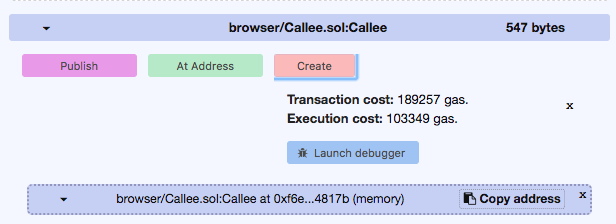
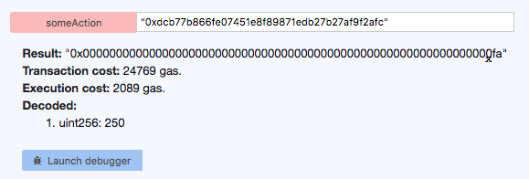

On the Ethereum blockchain, smart contracts are first-class citizens and because of their importance, [Solidity](https://solidity.readthedocs.io), which is the standard language for writing Ethereum smart contracts at the moment, provides several ways of enabling contracts to interact with other contracts.

Smart contracts can call functions of other contracts and are even able create and deploy other contracts (e.g. issuing coins). There are several use-cases for this behaviour.

One of the most interesting use-cases are upgradeable contracts. Due to the immutable nature of the blockchain, it's not possible to change the code of a deployed smart contract once it has been deployed. But by using a mechanism for delegating calls, a proxy can be deployed pointing (delegating function calls) to another contract, which holds the actual business logic.
This mechanism then makes it possible to upgrade the functionality of the contract, by providing a different target address to the proxy contract, for example a newly deployed version of the target contract with some bug fixes.

The same principle can be leveraged to use other contracts as libraries, thus reducing deployment costs, as the contract using the library doesn't need to include all the code itself.

Another use-case is to simply use contracts as data stores of sort. For example, one can strive to separate logic and data into different smart contracts. Now the logic-contract could be updated or swapped out via proxy, while retaining all the relevant state in the data-contract.

Being able to call and create contracts from smart contracts is a powerful concept and this post provides a simple example of how to implement and test such behaviour using Solidity.

## The Contracts

First, we need two smart contracts to be able to test our interaction.

In this small example, we will create one `Callee` contract, which holds some state and gets called by the `Caller` contract.

There are several ways to delegate calls between contracts in Solidity. A deployed contract always resides at an `address` and this `address`-object in Solidity provides three methods to call other contracts:

* `call` - Execute code of another contract
* `delegatecall` - Execute code of another contract, but with the state(storage) of the *calling* contract.
* `callcode` - (deprecated)

It's also possible to provide gas and ether for a `call` invocation like this:

```javascript
someAddress.call.gas(1000000).value(1 ether)("register", "MyName");
```

The `delegatecall` method was a bug fix for `callcode`, which did not preserve `msg.sender` and `msg.value`, so `callcode` is deprecated and will be removed in the future.

It is important to note, that `delegatecall` involves a security-risk for the calling contract, as the called contract can access/manipulate the calling contracts storage. With both `call` and `delegatecall` it's not possible to receive return values from the delegated call due to EVM limitations. 

There are, of course, inherent security risks with calling a function on a contract from a given address and this way of calling contracts breaks type-safety in Solidity. Therefore, `call`, `callcode` and `delegatecall` are supposed to be used only as a last resort.

Another way to call contracts from a smart contract is to use a mechanism like dependency-injection. With this method, the caller can instantiate the contract it wants to call and knows the type signature of the function, which also has the nice side-effect, that return-values can be received. 

In the following example, we will use both `call` and the `dependency-injection` method.

First up, we define the `Callee` contract:

```javascript
pragma solidity ^0.4.6;

contract Callee {
    uint[] public values;

    function getValue(uint initial) returns(uint) {
        return initial + 150;
    }
    function storeValue(uint value) {
        values.push(value);
    }
    function getValues() returns(uint) {
        return values.length;
    }
}
```

This simple contract holds an array of integers, provides a way to add a value and to retrieve the amount of stored values. It also has the `getValue` method, which takes an input and returns a changed output, to showcase how return-values and parameters work.

The `Caller` contract does nothing more than call the `Callee` contract using the interface-method described above, as well as with the `call` method:

```javascript
pragma solidity ^0.4.6;

contract Caller {
    function someAction(address addr) returns(uint) {
        Callee c = Callee(addr);
        return c.getValue(100);
    }
    
    function storeAction(address addr) returns(uint) {
        Callee c = Callee(addr);
        c.storeValue(100);
        return c.getValues();
    }
    
    function someUnsafeAction(address addr) {
        addr.call(bytes4(keccak256("storeValue(uint256)")), 100);
    }
}

contract Callee {
    function getValue(uint initialValue) returns(uint);
    function storeValue(uint value);
    function getValues() returns(uint);
}
```

At the bottom, you can see the `Callee` interface, mirroring the function signatures of the contract behind it. This interface could also be defined in another `.sol` file and imported, to keep things more cleanly separated.

Other than that, the contract just provides 3 functions, which are all called with an `address`. This is the address of the deployed `Callee` contract. It would also be possible to initialize a contract with a certain address and to change this address after some time, for example to use a newer version of the target contract.

## Testing the Interaction

Interactions like this can be tested in multiple ways. We could, for example, use [web3 and testrpc](https://zupzup.org/smart-contract-solidity/), [Go](https://zupzup.org/eth-smart-contracts-go/) or, as I did in this case, the [Remix Browser IDE](https://remix.ethereum.org).

Remix is a great tool for experimenting with smart-contracts - it comes with a nice editor and options to simulate deploying contracts and calling functions on them.

After copy/pasting the contracts into two files within Remix, we can start by creating (deploying) the `Callee` contract:

<center>
    <a href="images/create_callee.png" target="_blank"></a>
</center>

Then, we can use the `Copy address` button on the bottom right to get the contract's deployed address. In this example, this address is `0xdcb77b866fe07451e8f89871edb27b27af9f2afc`.

Then, we create the `Caller` contract and, using the panel on the right, call the `someAction` method with the address of the `Callee` contract as a parameter (in quotes, as a string):

<center>
    <a href="images/call_some_action.png" target="_blank"></a>
</center>

This returns the value `250`, as expected.

Now we can experiment some more and use the `someUnsafeAction` and `storeAction` calls in the same way as `someAction`. Calls to `storeAction` return the current amount of values stored in the `Callee` contract (13 in this case):

<center>
    <a href="images/call_store_action.png" target="_blank"></a>
</center>

That's it. You can experiment some more with this example in Remix, for example by proxying a transaction or by using the `delegatecall` method instead of `call`.


## Conclusion

The interactions outlined in this post are a nifty way to get around some of the limitations of smart contract development. Although, it should be noted that these mechanisms are all susceptible to attacks, so they should be used with care.

I believe that in regards to smart contract development, quality levels in terms of security and robustness will need to increase by quite a bit before technology such as Ethereum and others can safely be used for critical applications.

But there is a lot of research and experimenting going on now, so I'm sure we're in for some very interesting discoveries and breakthroughs over the next years. :)

#### Resources

* [Official Solidity Docs](http://solidity.readthedocs.io/en/develop/index.html)
* [remix](https://remix.ethereum.org)
* [ethereum](https://ethereum.org/)
* [block42](http://block42.org/)
