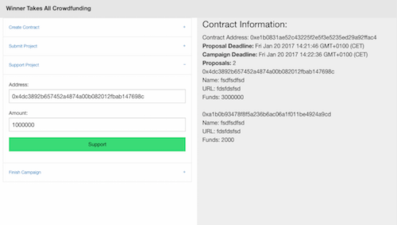

I came in contact with Blockchain technology only quite recently (mid 2016) and have been an interested, but rather passive member of the local [Blockchain community](https://blockchainhub.net/graz/). However, when I was asked if I would be interested in organizing a Coding Dojo on a Blockchain topic, I was motivated to dive a little deeper. For this purpose, I wrote my first **Smart Contract** for the **Ethereum Blockchain** using **Solidity**.

In this post, I won't explain what a Blockchain is or what Ethereum and Smart Contracts are, I rather want to share the example I built for the Coding Dojo to give the reader an idea of what building a DApp (decentralized application) looks like purely from the technological ecosystem and the code required to get something running.

Let's get started!

*The whole code for this example can be found [here](https://github.com/zupzup/solidity-example-crowdfunding)*

## The Contract

First of all, I want to outline the application we're going to build. If I think about blockchain technology, I always have things in mind which deal with **money** and with **trust** as well as the words **hype** and **buzzword**, so it seems only natural to build a crazy crowdfunding system for reckless startups! ;) 

I present the **Winner Takes All Crowdfunding Contract**:

* Create contract with
  * Minimum Entry Fee for project proposals (to avoid spam)
  * Project proposal deadline
  * Campaign deadline
* Before the Project proposal deadline, people can enter their projects providing a *name*, a *url* and the *entry fee*
* When the Project proposal deadline is over, people can *vote* with *ether* (money) for the projects they want to support
* When the campaign deadline is over, ALL the pledged money (incl. entry fees) goes to the project with the highest votes (most *ether* received)
  * And the contract is closed thereafter

Maybe a bit crazy and not very practical, but definitely an interesting example :)

## Setup

First up, as with every other software project, we'll need some initial setup to get going. There are already some frameworks (of course there are...) for building DApps, which are mentioned in the resources below. However, in our example we will stay with a very simple setup.

We will use [Solidity](http://solidity.readthedocs.io/en/develop/index.html) as the language for building the contract and [web3.js](https://github.com/ethereum/web3.js) for creating our frontend for interacting with the contract.

Because installing dependencies is bothersome, we will also use [Docker](https://www.docker.com/) for running our local blockchain and for building our contract. We will use [testrpc](https://github.com/ethereumjs/testrpc) as our local blockchain, which is convenient, as Smart Contract run on Gas (money) and with testRPC it at least won't cost us any real money and all blocks are mined instantly.

We won't deploy the contract to any *real* blockchain in this example, but you can find lots of documentation in the official docs of Ethereum and Solidity on that topic.

Now, for compiling our smart contract, there are several options. We can use [browser-solidity](https://ethereum.github.io/browser-solidity/) as a Web-IDE and copy/paste the generated `web3` code from there every time we change something. However, I prefer to work locally.

In order to do that, we need `solc` to compile our contract, then `one-lineify` (remove line breaks) the contract and somehow get it into our JavaScript application with `web3`.
For this purpose, I created a [docker container](https://hub.docker.com/r/mzupzup/soliditybuilder/) which mounts the given folder, runs `solc` on the `contract.sol` file in that folder, then `one-lineify`'s the code and writes it into a `contract.js` file in the same folder.

Now, this works for the purpose of this example, but doesn't generalize well (e.g.: multiple contracts), but the frameworks mentioned below all have mechanisms to avoid having to do this manually.

We could also go a different route and automatically paste the binary output of `solc` into the JavaScript file, or really any other way of getting our compiled contract into our application and on the blockchain. But for this very simple example, this simplistic container-based approach will suffice.

To run testRPC locally, execute

```
docker pull harshjv/testrpc
docker run -d -p 8545:8545 harshjv/testrpc
```

To run the solidity build container, execute

```
docker pull mzupzup/soliditybuilder
docker run -v /path/to/this/folder:/sol mzupzup/soliditybuilder
```

Or, if you want automatic file-watching as well (not on Windows), you may also use:

```
docker pull mzupzup/soliditywatcher
docker run -v /path/to/this/folder:/sol mzupzup/soliditywatcher
```

If it all works, we can start working on our contract!

## Implementation

// TODO: go over contract step-by-step
// TODO: explain tradeOffs, redundancies (can't return structs / mappings, arrays weird to return)

## Testing

// TODO: some web3 calls, how to call it, how the verify, maybe link some testing framework 

I also quickly threw together a simple Web-UI in order to test the application in a nicer way. The code (very ugly and unfinished) for the UI is also on GitHub.

This is what it looks like::

<center>
    <a href="images/simpleui.png" target="_blank"></a>
</center>

## Conclusion

// TODO: Conclusion

#### Resources

* [Full Example on Github](https://github.com/zupzup/solidity-example-crowdfunding)
* [Official Solidity Docs](http://solidity.readthedocs.io/en/develop/index.html)
* [BlockchainHub Graz](https://blockchainhub.net/graz/)
* [testrpc](https://github.com/ethereumjs/testrpc)
* [browser-solidity](https://ethereum.github.io/browser-solidity/)
* [web3.js](https://github.com/ethereum/web3.js)
* [populus](http://populus.readthedocs.io/en/latest/)
* [truffle](truffle.readthedocs.io)
* [embark](https://github.com/iurimatias/embark-framework)
* [ethereum](https://ethereum.org/)
