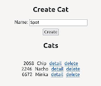
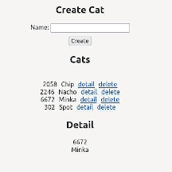
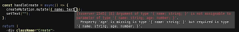
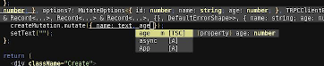

*This post was originally posted on the [LogRocket](https://blog.logrocket.com/build-full-stack-typescript-app-trpc-react/) blog on 26.05.2023 and was cross-posted here by the author.*

In this article, we’ll build a simple, full-stack TypeScript app using [tRPC](https://trpc.io/), which means that the app will not only be type-safe when it comes to the code, but also across the API boundary.

You may already be familiar with the remote procedure call framework [gRPC](https://grpc.io/). Given the similarity in the naming, you might be inclined to believe that tRPC is somehow related to it, or does the same or a similar thing. However, this is not the case. While tRPC is indeed also a remote procedure call framework, its goals and basis differ fundamentally from gRPC. The main goal of tRPC is to provide a simple, type-safe way to build APIs for TypeScript and JavaScript-based projects with a minimal footprint. 

In the following example, we’ll build a small, cat-themed application to showcase how to set up tRPC on the backend and how to consume the created API within a React frontend. Let’s get started! You can find the full code for this example on [GitHub](https://github.com/zupzup/trpc-example).

## Exploring tRPC

If you have an application that uses TypeScript on both the backend and the frontend, tRPC helps you set up your API in a way that incurs the absolute minimum overhead in terms of dependencies and runtime complexity. However, tRPC still provides type safety , as well as all the features that come with it, like auto-completion for the whole API and errors if the API is used in an invalid way.

In practical terms, you can think of tRPC it as a very lightweight alternative to GraphQL. However, tRPC is not without its limitations.  For one, it’s limited to TypeScript and JavaScript. Additionally, the API you are building will follow the tRPC model, which means it won’t be a REST API. For example, you can’t simply convert a REST-API to tRPC and have the same API as before but with types. 

Essentially, tRPC is a batteries-included solution for all your API needs, but it will also be a tRPC-API. That’s where the “RPC” in the name comes from, fundamentally changing how your remote calls work.

With the widespread use of TypeScript and JavaScript, especially on the client side for the web, mobile, and native, tRPC could be a great solution for you as long as you’re comfortable using TypeScript on your API gateway. 

## Setting up tRPC

We’ll start by creating two folders in our project root called `server`. Within the `server` folder, we create a `package.json` file as follows:

```json
    {
      "name": "server",
      "version": "1.0.0",
      "description": "",
      "main": "index.js",
      "scripts": {
        "test": "echo \"Error: no test specified\" && exit 1"
      },
      "author": "",
      "license": "ISC",
      "devDependencies": {
        "@tsconfig/node14": "^1.0.1",
        "typescript": "^4.5"
      },
      "dependencies": {
        "@trpc/server": "^9.21.0",
        "@types/cors": "^2.8.12",
        "@types/express": "^4.17.13",
        "cors": "^2.8.5",
        "express": "^4.17.2",
        "zod": "^3.14.2"
      }
    }
```

We’ll also create a `tsconfig.json` file:

```json
    {
      "extends": "@tsconfig/node14/tsconfig.json",
      "compilerOptions": {
          "outDir": "build"
      }
    }
```

Finally, create an executable `run.sh` file:

```bash
    #!/bin/bash -e
    
    ./node_modules/.bin/tsc && node build/index.js
```

Next, we create a folder called `src` and include an `index.ts` file within it. Finally, we execute `npm install` in the `server` folder, and we’re done with the setup for the backend.

For the frontend, we’ll use [Create React App](https://blog.logrocket.com/getting-started-with-create-react-app-d93147444a27/) with TypeScript support using the following command within the project root:

```bash
    npx create-react-app client --template typescript
```

We can also run `npm install` in the `client` folder and run the app with `npm start` to see that everything works and is set up properly. Next, we’ll implement the backend of our application.

## Setting up our Express backend

### Install dependencies

As you can see above in the `package.json` of the `server` part of our application, we use [Express.js](https://expressjs.com/) as our HTTP server. Additionally, we add TypeScript as well as the `trpc-server` dependency.

Beyond that, we use the `cors` library for adding CORS to our API, which isn’t really necessary for this example, but why not. We also add [Zod](https://github.com/colinhacks/zod), a schema validation library with TypeScript support, which is often used in combination with tRPC. However, you can use other libraries like [Yup](https://github.com/jquense/yup) or [Superstruct](https://github.com/ianstormtaylor/superstruct) with tRPC. Later on, we’ll see exactly what this is for.

With the dependencies out of the way, let’s set up our basic Express backend with tRPC support.

### Backend with Express

We’ll start by defining the tRPC router, which is a very important part of this whole infrastructure, allowing us to wire together our backend and frontend in terms of type safety and autocompletion. This router should be in its own file, for example `router.ts`, since we’ll import it into our React app later on as well.

Within `router.ts`, we start by defining the data structure for our domain object, `Cat`:

```typescript
    let cats: Cat[] = [];
    
    const Cat = z.object({
        id: z.number(),
        name: z.string(),
    });
    const Cats = z.array(Cat);
    
    ...
    
    export type Cat = z.infer<typeof Cat>;
    export type Cats = z.infer<typeof Cats>;
```

You might be wondering why we’re not building simple JavaScript or TypeScript types and objects. Since we use Zod for schema validation with tRPC, we also need to build these domain objects with it.

In addition, we can actually add validation rules using Zod, like a maximum amount of characters for a string, email validation, and more, combining type checking with actual validation.

We also get automatically created error messages in case an input is not valid. However, these errors can be entirely customized. If you’re interested in validation and error handling, [check out the docs](https://trpc.io/docs/error-formatting) for more information.

After implementing our type using Zod, we can actually infer a TypeScript type from it using `z.infer`. Once we have that, we export the type for use in other parts of the app like the frontend, and then move on to creating the heart of the application, the router:

```typescript
    const trpcRouter = trpc.router()
        .query('get', {
            input: z.number(),
            output: Cat,
            async resolve(req) {
                const foundCat = cats.find((cat => cat.id === req.input));
                if (!foundCat) {
                    throw new trpc.TRPCError({
                        code: 'BAD_REQUEST',
                        message: `could not find cat with id ${req.input}`,
                    });
                }
                return foundCat;
            },
        })
        .query('list', {
            output: Cats,
            async resolve() {
                return cats;
            },
        })
```

We can create a tRPC router by calling the `router()` method and chaining our different endpoints on to it. It’s also possible to create multiple routers and combine them. In tRPC, there are two types of procedures:

* Query: Used for fetching data. Think `GET`
* Mutation: Used for changing data. Think `POST`, `PUT`, `PATCH`, `DELETE`

In the snippet above, we create our `query` endpoints, one for fetching a singular cat by ID and one for fetching all cats. tRPC also supports the concept of `infiniteQuery`, which takes a cursor and can return a paged response of potentially infinite data, if needed.

For out `GET` endpoint, we define an `input`. This endpoint will essentially be a `GET /get?input=123` endpoint, returning the JSON of our `Cat` based on the definition above.

Of course, we can define multiple inputs if we need them. In the `resolve` async function, we implement our actual business logic.

In a real world application, we might call a service here, or a database layer, but since we’re just saving our cats in-memory, or in an array, we check if we have a cat with the given ID and if not, we throw an error. If we find a cat, we return it. And that’s it for fetching a cat by ID!

The `list` endpoint is even simpler than that since it takes no input and returns only our current list of cats. Let’s look at how we can implement creation and deletion with tRPC:

```typescript
        .mutation('create', {
            input: z.object({ name: z.string().max(50) }),
            async resolve(req) {
                const newCat: Cat = { id: newId(), name: req.input.name };
                cats.push(newCat)
                return newCat
            }
        })
        .mutation('delete', {
            input: z.object({ id: z.number() }),
            output: z.string(),
            async resolve(req) {
                cats = cats.filter(cat => cat.id !== req.input.id);
                return "success"
            }
        });
        
    function newId(): number {
        return Math.floor(Math.random() * 10000)
    }
    
    export type TRPCRouter = typeof trpcRouter;
    export default trpcRouter;
```

As you can see, we use the `.mutation` method to create a new mutation. Within it, we can, again, define `input`, which in this case will be a JSON object. Be sure to note the validation option we provided here for the `name`.

In `resolve`, we create a new `Cat` from the given name with a random ID. Check the `newId` function at the bottom and add it to our list of cats, returning the new cat to the caller. This will turn out to something like a `POST /create` expecting some kind of body. If we use the `application/json content-type`, it will return JSON to us and expect JSON.

In the `delete` mutation, we expect a cat’s ID, filter the list of cats for that ID, and update the list, returning a success message to the user. The responses don’t actually look like what we define here. Rather, they are wrapped inside of a tRPC response like the one below: 

```json
    {"id":null,"result":{"type":"data","data":"success"}}
```

And that’s it for our router. We have all the endpoints we need. Now, we’ll have to wire it up with an Express.js web app: 

```typescript
    import express, { Application } from 'express';
    import cors from 'cors';
    import * as trpcExpress from '@trpc/server/adapters/express';
    import trpcRouter from './router';
    
    const app: Application = express();
    
    const createContext = ({}: trpcExpress.CreateExpressContextOptions) => ({})
    
    app.use(express.json());
    app.use(cors());
    app.use(
        '/cat',
        trpcExpress.createExpressMiddleware({
            router: trpcRouter,
            createContext,
        }),
    );
    
    app.listen(8080, () => {
        console.log("Server running on port 8080");
    });
```

tRPC comes with an adapter for Express, so we simply create our Express application and then use the provided tRPC middleware inside of this app.

We can define a sub-route where this configuration should be used, a router, and a context. The context function is called for each incoming request and passes its result to the handlers, so this would be where you could add the context data you want for each request, like an authentication token or a `userId` of a user who is logged in.

If you want to learn more about authorization with tRPC, there’s a section about it in the [docs](https://trpc.io/docs/authorization).

## Testing our Express backend

That’s it for the app! Let’s test it quickly so we know everything is working correctly We can start the appby executing the `./run.sh` file and send off some HTTP requests using cURL.

First, let’s create a new cat:

```bash
    curl -X POST "http://localhost:8080/cat/create" -d '{"name": "Minka" }' -H 'content-type: application/json'
    
    {"id":null,"result":{"type":"data","data":{"id":7216,"name":"Minka"}}}
```

Then, we can list the existing cats:

```bash
    curl "http://localhost:8080/cat/list"
    
    {"id":null,"result":{"type":"data","data":[{"id":7216,"name":"Minka"}]}}
```

We can also fetch the cat by it’s ID:

```bash
    curl "http://localhost:8080/cat/get?input=7216"
    
    {"id":null,"result":{"type":"data","data":{"id":7216,"name":"Minka"}}}
```

And finally, delete it:

```bash
    curl -X POST  "http://localhost:8080/cat/delete" -d '{"id": 7216}' -H 'content-type: application/json'
    
    {"id":null,"result":{"type":"data","data":"success"}}
    
    curl "http://localhost:8080/cat/list"
    
    {"id":null,"result":{"type":"data","data":[]}}
```

Everything seems to work as expected. Now, with the backend in place, let’s build our React app.

## Creating our React frontend

First, within the `src` folder, let’s create a `cats` folder to have some structure in our application. Then, we add some additional dependencies we’ll need:

```bash
    npm install --save @trpc/client @trpc/server @trpc/react react-query zod
```

These are the tRPC dependencies we’ll need, the `server` for type safety, the `client` for the minimal logic needed to make calls to an API, `zod`, as mentioned before, for schema validation, `trpc/react` for [easier integration with React Query](https://blog.logrocket.com/pagination-infinite-scroll-react-query-v3/), and finally React Query.

However, it’s also possible to use `trpc/client` on its own, or completely vanilla, which is also covered in the [docs](https://trpc.io/docs/vanilla).

In this example, just like in the official ones, we’ll use React Query, which adds API-interaction to React apps. This, also, is completely optional, and it’s possible to just use a vanilla client with the frontend framework of your choice, including React, and integrate it exactly the way you want to. Let’s start by building the basic structure of our app in `App.tsx`:

```typescript
    import { useState } from 'react';
    import './App.css';
    import type { TRPCRouter } from '../../server/src/router';
    import { createReactQueryHooks } from '@trpc/react';
    import { QueryClient, QueryClientProvider } from 'react-query';
    import Create from './cats/Create';
    import Detail from './cats/Detail';
    import List from './cats/List';
    
    const BACKEND_URL: string = "http://localhost:8080/cat";
    
    export const trpc = createReactQueryHooks<TRPCRouter>();
    
    function App() {
      const [queryClient] = useState(() => new QueryClient());
      const [trpcClient] = useState(() => trpc.createClient({ url: BACKEND_URL }));
    
      const [detailId, setDetailId] = useState(-1);
    
      const setDetail = (id: number) => {
        setDetailId(id);
      }
    
      return (
        <trpc.Provider client={trpcClient} queryClient={queryClient}>
          <QueryClientProvider client={queryClient}>
            <div className="App">
              <Create />
              <List setDetail={setDetail}/>
              { detailId > 0 ? <Detail id={detailId} /> : null }
            </div>
          </QueryClientProvider>
        </trpc.Provider>
      );
    }
    
    export default App;
```

There’s quite a bit to unpack, so let’s start from the top. We instantiate `trpc` using the `createReactQueryHooks` helper from `trpc/react`, giving it the `TRPCRouter` that we import from our backend app. We also export for use in the rest of our app.

Essentially, this creates all the bindings towards our API underneath. Next, we create a React Query client and a tRPC-client to provide the URL for our backend. This is the client we’ll use to make requests to the API, or rather the client React Query will use underneath.

In addition to all of this setup, we also define a state variable for `detailId` so we know which cat-detail to show if the user selects any. 

If you check out what we return from `App`, you can see that our actual markup, the `div` with the `App` class is nested within two layers. These layers are on the outer side, the tRPC provider and inside that, the React Query provider.

These two components make the necessary moving parts available to our whole application, so we can use `trpc` throughout our application, and our query calls get integrated with our React app seamlessly.

Next, we add components for `Create`, `List`, and `Detail` to our markup, which will include all of our business logic. 

Let’s start with the `Create` component by creating a `Create.css` and `Create.tsx` file inside the `src/cats` folder. In this component, we’ll simply create a form and connect the form to the `create` mutation we implemented on the backend. Once a new cat has been created, we want to re-fetch the list of cats so that it’s always up to date.

Let’s look at how we could implement this:

```typescript
    import './Create.css';
    import { ChangeEvent, useState } from 'react';
    import { trpc } from '../App';
    
    function Create() {
      const [text, setText] = useState("");
      const [error, setError] = useState("");
    
      const cats = trpc.useQuery(['list']);
      const createMutation = trpc.useMutation(['create'], {
        onSuccess: () => {
          cats.refetch();
        },
        onError: (data) => {
          setError(data.message);
        }
      });
    
      const updateText = (event: ChangeEvent<HTMLInputElement>) => {
        setText(event.target.value);
      };
    
      const handleCreate = async() => {
        createMutation.mutate({ name: text });
        setText("");
      };
    
      return (
        <div className="Create">
          {error && error}
          <h2>Create Cat</h2>
          <div>Name: <input type="text" onChange={updateText} value={text} /></div>
          <div><button onClick={handleCreate}>Create</button></div>
        </div>
      );
    }
    
    export default Create;
```

We start off with some very basic, vanilla React logic. We create some internal component state for our form field and potential errors, we might want to show and return a simple form, featuring a text field connected to our state and a button to submit it. So far, so good.

Now, let’s look at the `handleCreate` function. Here, we call `.mutate` on the `createMutation`, which we define above it and reset the `text` field afterwards.

The `createMutation` is created using `trpc.useMutation` with our `create` endpoint. In your IDE or editor, note that when typing `create` within the `useMutation` call, you will get autocomplete suggestions.

This is tRPC in action. We also get suggestions in the payload for the `.mutate` call, suggesting that we use the `name` field.

Inside the `.useMutation` call, we define what should happen on success and on error. If we encounter an error, we simply want to display it using our component-internal state.

If we successfully create a cat, we want to re-fetch the data for our list of cats. For this purpose, we define a call to this endpoint using `trpc.useQuery` with our `list` endpoint and call it inside the `onSuccess` handler.

We can already see how easy it is to integrate our app with the tRPC API, as well as how tRPC helps us during development. Let’s look at the detail view next, creating `Detail.tsx` and `Detail.css` within the `cats` folder:

```typescript
    import './Detail.css';
    import { trpc } from '../App';
    
    function Detail(props: {
      id: number,
    }) {
      const cat = trpc.useQuery(['get', props.id]);
    
      return (
        cat.data ? 
          <div className="Detail">
            <h2>Detail</h2>
            <div>{cat.data.id}</div>
            <div>{cat.data.name}</div>
          </div> : <div className="Detail"></div>
      );
    }
    
    export default Detail;
```

This is a very simple component. We basically just use `.useQuery` again to define our `getCatById` endpoint, providing the ID we get from our root component via props.

We render the details of the cat, if we actually get data. Notice that we could also use effects for the data fetching here, essentially any way you would integrate an API with your React app will work fine with tRPC and React Query.

Finally, let’s implement our `List` component by creating `List.css` and `List.tsx` in `cats`. In our list of cats, we’ll display the ID and name of a cat, as well as a link to display it in detail and a link to delete it:

```typescript
    import './List.css';
    import { trpc } from '../App';
    import type { Cat } from '../../../server/src/router';
    import { useState } from 'react';
    
    function List(props: {
      setDetail: (id: number) => void,
    }) {
      const [error, setError] = useState("");
      const cats = trpc.useQuery(['list']);
      const deleteMutation = trpc.useMutation(['delete'], {
        onSuccess: () => {
          cats.refetch();
        },
        onError: (data) => {
          setError(data.message);
        }
      });
    
      const handleDelete = async(id: number) => {
        deleteMutation.mutate({ id })
      };
    
      const catRow = (cat: Cat) => {
        return (
          <div key={cat.id}>
            <span>{cat.id}</span>
            <span>{cat.name}</span>
            <span><a href="#" onClick={props.setDetail.bind(null, cat.id)}>detail</a></span>
            <span><a href="#" onClick={handleDelete.bind(null, cat.id)}>delete</a></span>
          </div>
        );
      };
    
      return (
        <div className="List">
          <h2>Cats</h2>
          <span>{error}</span>
          { cats.data && cats.data.map((cat) => {
            return catRow(cat);
          })}
        </div>
      );
    }
    
    export default List;
```

This component basically combines the functionality we used in the two previous ones. For one, we fetch the list of cats using `useQuery` on our `list` endpoint and also implement the deletion of cats with a subsequent re-fetch using `deleteMutation`, pointing to our `delete` mutation on the backend.

Besides that, everything is quite similar. We pass in the `setDetailId` function from `App` via props, so we can set the cat to show details on in `Detail` and create a handler for deleting a cat, which executes our mutation. 

Again, if you write this code, notice all the nice autocompletion we’re provided by tRPC. Also, if you mistype something, for example the name of an endpoint, you will get an error and our frontend will actually not build/start, until the error is corrected.

That’s it for the frontend, let’s test it and see tRPC in action! 

## Testing and tRPC features

First, let’s start the app with `npm start` and see how it works. Once the app is up, we can create new cats, delete them, and watch their detail page while observing the changes directly in the list.  It’s not particularly pretty, but it works!


<center>
    <a href="images/img1.png" target="_blank"></a>
</center>

<center>
    <a href="images/img2.png" target="_blank"></a>
</center>

Let’s take a look at how tRPC can help us during our development process. Let’s say we want to add an `age` field for our cats:

```typescript
    const Cat = z.object({
        id: z.number(),
        name: z.string(),
        age: z.number(),
    });
    
    ...
        .mutation('create', {
            input: z.object({ name: z.string().max(50), age: z.number().min(1).max(30) }),
            async resolve(req) {
                const newCat: Cat = { id: newId(), name: req.input.name, age: req.input.age };
                cats.push(newCat)
                return newCat
            }
        })
    ...
```

We add the field to our domain object, and we also need to add it to our `create` endpoint. Once you hit save on your backend code, navigate back to your frontend code in `./client/src/cats/Create.tsx`.

We can see that our editor shows us an error. The propery `age` is missing in our call to `createMutation`:

<center>
    <a href="images/img3.png" target="_blank"></a>
</center>

If we want to add the `age` field to our mutation now, our editor will provide us with autocomplete, together with full type-information, directly from our changed `router.ts`:

<center>
    <a href="images/img4.png" target="_blank"></a>
</center>

From my perspective, this is the true power of tRPC. While it’s nice to have a simple way to create an API both on the frontend and the backend, the real selling point is the fact that the code actually won’t build if I make a breaking change on one side and not the other, as well as the fantastic support in terms of development tools.

For example, imagine a huge codebase with multiple teams working on API endpoints and UI elements. Having this kind of safety in terms of API compatibility with almost no overhead to the application is quite remarkable.

## Conclusion

I can see, how tRPC could be quite useful in situations where one uses TypeScript both on the frontend and backend anyway. I love the low-footprint approach with minimal, or no extra dependencies, focusing on compile-time correctness, rather than runtime-checking.

Obviously, if you create an API that might be used by a myriad of different clients based on different technologies, the TypeScript limitation might be too much to bear. The principle behind tRPC is great in terms of developer experience and it’s an exciting project I will certainly keep my eye on in the future.

