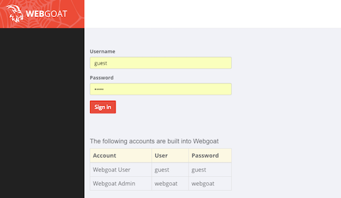
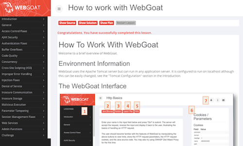
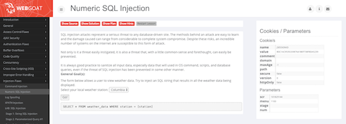
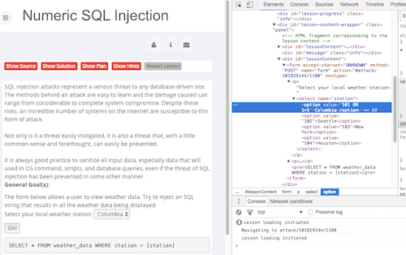
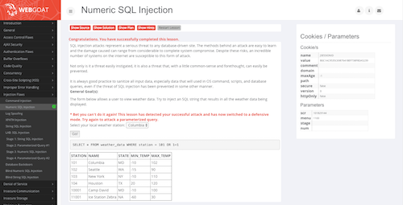

Over the last few years working as a web developer as well as teaching web technologies, I found Web Security to be a topic where many people struggle.

Most developers I meet believe they need to secure their applications. And some even know a few threats to look out for and how to defend against some of the more common risks to their applications out there. But most web developers I interacted with, struggle when it comes down to the nitty-gritty of web security. 

Usual questions include: 

* Which are the biggest threats?
* How can I learn to defend my application from attacks?
* Should I even do this myself, or hire a security expert?
* How secure is secure enough?

Unfortunately however, web security is not an exact science, so some of the answers will vary greatly depending on who you ask. I believe questions 3 and 4 to be highly dependent on the context of the application, the development team and many other variables, hence I will focus on the first two questions in this post and present resources and tools I have found to be very helpful in my own quest for securing the software I write as well as for getting a better understanding of the implications and trade-offs inherent in this area of software development.


## Which are the biggest threats?

The Open Web Application Security Project, or short [OWASP](https://www.owasp.org), which is in my opinion an, if not *the* authority on web security, frequently publishes the [OWASP Top 10](https://www.owasp.org/index.php/Category:OWASP_Top_Ten_Project) - an awareness document representing the most critical web application security risks.

The OWASP Top 10 are based on heaps of statistical data provided from companies all over the world. The current version as of writing this post was published in 2013 with a new version most likely coming in 2017.

Funnily (or sadly) enough, 3-4 years seems like an eternity in any software-related field, but if you check out the 2013 version and the version published before that in 2010, most of the list remained almost unchanged.

Injection attacks, although prevented by default in basically all major web frameworks in existence, remains the top security risk on the web to this day. The OWASP Top 10 are, however, not only a ranking of relevant security risks, but also an immensely useful resource for understanding and preventing them.

The OWASP Top 10 and the vast amount of free documentation related to it is, in my opinion, the single greatest source of knowledge to get started in web security.

## How can I learn to defend my application from attacks?

Great, so now we have an idea what the biggest risks are and a place where we can learn and understand these risks and some best practices on how to defend against them. However, and this is true for many highly complex fields, knowing the basics and some best practices won't be enough in the long run. Especially in the field of web security, with it's equilibrium between attackers and defenders, it's often enough for an attacker to find **one hole in the fence** and everything can end in tears.

So in order to stand a chance of securing our applications in the long run, we really want to *understand* what's going on. That's where it's often useful to switch roles and become the attacker. That way we get an entirely different perspective and are able to see possible attack vectors and weaknesses we were blind to before. One problem with this approach, especially in web security, is that *learning to hack* in the open might be destructive if not borderline illegal in some cases, which is not very practical.

That's where **[WebGoat](https://github.com/WebGoat/WebGoat)** comes in.

## WebGoat

The WebGoat, as described on its [wiki](https://github.com/WebGoat/WebGoat/wiki), is a deliberately insecure web application, which is aimed at helping developers learn about security vulnerabilities first hand by hacking the WebGoat. 

It includes numerous exercises for topics ranging from **Injection Flaws**, over **Cross-Site Scripting (XSS)** to **Denial of Service** and many others. The exercises vary in difficulty, but each exercise provides access to the whole Source Code as well as optional Hints and a Solution, if you run into walls.

Interested yet? Let's get started!

### Download and Start the WebGoat

The first step is to [download WebGoat 7.1](https://github.com/WebGoat/WebGoat/releases/download/7.1/webgoat-container-7.1-exec.jar), which is the latest stable version as of now. You can always get the latest release at the [Release Page](https://github.com/WebGoat/WebGoat/releases/).

Then, in the command-line of your liking, navigate to the location of the `webgoat-container-7.1-exec.jar` and start it:

```
java -jar webgoat-container-7.1-exec.jar
```

This will start a Webserver on port `8080`. You can access it via [http://localhost:8080/WebGoat/](http://localhost:8080/WebGoat/) 

*With WebGoat 8.0, which is currently under development, there will be Docker and Vagrant builds as well as many other nice improvements.*

Alright, so let's get hackin'!

### Login

First, we log in using the *guest* account.

<center>
    <a href="images/login.png" target="_blank"></a>
</center>

### Get comfortable with the UI 

Then, we can have a look at the Tutorial with lots of helpful tips on how to get started with the WebGoat.

<center>
    <a href="images/getting_started.png" target="_blank"></a>
</center>

### Your first challenge 

Alright, it's time for our first challenge! We will navigate to **Injection Flaws** and select the second entry **Numeric SQL Injection** from the slideout menu.

This is a nice exercise to get started. Our goal is to send a malicious query to the server, which will get it to return all the results instead of just one.

<center>
    <a href="images/challenge.png" target="_blank"></a>
</center>

### The Solution 

One possible solution to the **Numeric SQL Injection** exercise is to just open your browser dev-tools and change the value of the first `option` within the `select` field to `101 OR 1=1`.

<center>
    <a href="images/solution.png" target="_blank"></a>
</center>

This will send the query `SELECT * FROM weather_data WHERE station = 101 OR 1=1` to the server, which is always true, hence returning all the stations. **Success!**

<center>
    <a href="images/success.png" target="_blank"></a>
</center>

## Conclusion 

Learning the basic techniques necessary to secure web applications is absolutely essential for professional web developers. The **OWASP** project and especially the **WebGoat** are great resources for doing exactly that. Especially in the field of web security, learning how to hack can be greatly beneficial for anyone aspiring to improve their skills in web security.

But you don't have to take my word for it, [Michael Coates](https://twitter.com/_mwc), Chief Information Security Officer at Twitter, in his great talk [Applications Through an Attacker’s Lens at InfoQ](https://www.infoq.com/presentations/security-attacker-mind), mentioned [WebGoat](https://github.com/WebGoat/WebGoat) and OWASP's [Security Shepherd](https://github.com/OWASP/SecurityShepherd) as some of the best ways to learn how to hack in a safe environment.

So if you're interested in improving your web security skills, I encourage you to start out by hacking the WebGoat! ~:) 

#### Resources

* [WebGoat](https://github.com/WebGoat/WebGoat)
* [Security Shepherd](https://github.com/OWASP/SecurityShepherd)
* [WebGoat at OWASP](https://www.owasp.org/index.php/Category:OWASP_WebGoat_Project)
* [OWASP Top 10](https://www.owasp.org/index.php/Category:OWASP_Top_Ten_Project)
* [OWASP](https://www.owasp.org)
* [Applications Through an Attacker’s Lens at InfoQ](https://www.infoq.com/presentations/security-attacker-mind)
